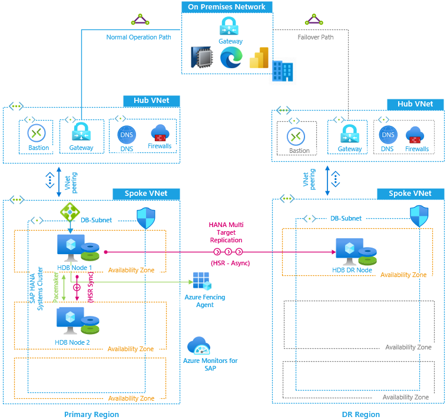

This reference architecture shows a set of proven practices for running SAP HANA in a high-availability, scale-up environment that supports disaster recovery on Azure. This implementation focuses on the database layer and is designed to support various SAP applications, such as S/4HANA and SAP BW/4HANA.

## Architecture

This reference architecture describes a common production system. You can choose the virtual machine sizes to accommodate your organization's needs. This configuration can also be reduced to one virtual machine.

> [!NOTE]
> Deploying this reference architecture requires appropriate licensing of SAP products and other non-Microsoft technologies.

## Workflow

The architecture includes the following components:

**Azure Virtual Network (VNet).** The [VNet](/azure/virtual-network/virtual-networks-overview) service securely connects Azure resources to each other. In this architecture, a VNet connects to an on-premises environment through a gateway, which is deployed in the hub of a [hub-spoke topology](../hybrid-networking/hub-spoke.yml). The spoke is the VNet used for the SAP applications and the database tiers.

**SAP HANA.** For high availability, SAP HANA runs on two or more Linux virtual machines. SAP HANA System Replication (HSR) is used to replicate data between the primary and secondary (replica) SAP HANA systems. HSR is also used for cross-region or cross-zone disaster recovery.

**Availability zones.** Virtual machines that provide the same service are deployed into two different [Availability Zones](/azure/virtual-machines/workloads/sap/sap-ha-availability-zones) within an Azure region for a higher [service-level agreement](https://azure.microsoft.com/support/legal/sla/virtual-machines) (SLA). Two or more virtual machines providing the same service can also be grouped into a highly available [availability set](/azure/virtual-machines/windows/tutorial-availability-sets).

**Load balancers.** To direct traffic to virtual machines in the database tier, [Azure Standard Load Balancer](/azure/load-balancer/load-balancer-overview) is used. This option supports [Availability Zones](/azure/load-balancer/load-balancer-standard-availability-zones) for scenarios that need higher application availability. The Standard Load Balancer is secure by default, and no virtual machines behind the Standard Load Balancer will have outbound internet connectivity. To enable outbound internet in the virtual machines, you must consider your [Standard Load Balancer](/azure/virtual-machines/workloads/sap/high-availability-guide-standard-load-balancer-outbound-connections) configuration.

**Network security groups.** To restrict incoming, outgoing, and intra-subnet traffic in the virtual network, define [network security groups](/azure/virtual-network/security-overview) (NSGs) for subnets or individual virtual machines.

**Storage.** Azure Premium managed disks and Azure NetApp Files provide the recommend storage for the SAP executables and the SAP HANA data and logs. Other [storage configurations](/azure/virtual-machines/workloads/sap/hana-vm-operations-storage) are available, such as Ultra disk.

## Recommendations

This architecture describes a small, production-level deployment that can scale up in the number and size of virtual machines, based on your business requirements. These recommendations are intended as a starting point.

### SAP HANA

SAP HANA is deployed on virtual machines in this reference architecture. Azure offers single-node scale up to 11.5 terabytes (TB) on virtual machines and single-node scale up to 24 TB on [Azure Large Instances](./hana-large-instances.yml). The [SAP Certified and Supported SAP HANA Hardware Directory](https://www.sap.com/dmc/exp/2014-09-02-hana-hardware/enEN/iaas.html#categories=Microsoft%20Azure) lists the virtual machines that are certified for the SAP HANA database. For details about SAP support for virtual machine types and throughput metrics (SAPS), see [SAP Note 1928533](https://launchpad.support.sap.com/#/notes/1928533). (To access this and other SAP notes, an SAP Service Marketplace account is required.)

Microsoft and SAP jointly certify a range of virtual machine sizes for SAP HANA workloads. For example, smaller deployments can run on an M-series virtual machine with 192 GB of RAM. To support the largest SAP HANA memory sizes on virtual machines—up to 11.5 TB—you can use the [Azure M-series v2](/azure/virtual-machines/mv2-series) (Mv2) virtual machines. The M208 virtual machine types achieve approximately 260,000 SAPS, and the M416 virtual machine types achieve approximately 488,000 SAPS.

The physical distance between the application and database tiers can impact performance, especially for SAP applications that require frequent communication with the database. We recommend using Azure [proximity placement groups](/azure/virtual-machines/workloads/sap/sap-proximity-placement-scenarios) for virtual machines deployed in availability sets. Proximity placement groups ensure that the virtual machines stay in the same datacenter to minimize application latency. (Azure Site Recovery doesn't support the replication of virtual machines in proximity placement groups.) [Scripts and utilities](https://github.com/msftphleiten/proximity-placement-groups) are available on GitHub.

### Load balancer

We recommend using the Standard Load Balancer and enabling [high availability ports](/azure/load-balancer/load-balancer-ha-ports-overview). This setup avoids the need to configure load-balancing rules for many SAP ports. With [Standard Load Balancer](/azure/load-balancer/load-balancer-overview#why-use-azure-load-balancer), you can also create a high availability solution across [Azure Availability Zones](/azure/availability-zones/az-overview). The Standard Load Balancer is secure by default, and no virtual machines behind the Standard Load Balancer will have outbound internet connectivity. To enable outbound internet in the virtual machines, you must consider your [Standard Load Balancer](/azure/virtual-machines/workloads/sap/high-availability-guide-standard-load-balancer-outbound-connections) configuration. Instead, you can use Azure Basic Load Balancer. It's offered at no charge but doesn't support zones and has no SLA.

For SAP HANA database clusters, you must enable Direct Server Return (DSR), also known as Floating IP. This feature allows the server to respond to the IP address of the load balancer front end. This direct connection keeps the load balancer from becoming the bottleneck in the path of data transmission. If virtual machines in the back-end pool require public outbound connectivity, extra [configuration](/azure/virtual-machines/workloads/sap/high-availability-guide-standard-load-balancer-outbound-connections) is required.

### Networking

We recommend using a [hub-spoke topology](../hybrid-networking/hub-spoke.yml), where the hub VNet acts as a central point of connectivity to an on-premises network. The spokes are VNets that peer with the hub, and they can be used to isolate workloads. Traffic flows between the on-premises datacenter and the hub through a gateway connection.

#### Availability Zones

As mentioned, you can increase application availability by using [Availability Zones](/azure/virtual-machines/workloads/sap/sap-ha-availability-zones).

#### Subnets and NSGs

The database subnet includes an NSG that defines access policies for all the virtual machines within this subnet. To control the flow of traffic between the servers in a subnet, set up NSGs using either the [Azure portal](/azure/virtual-network/tutorial-filter-network-traffic), [PowerShell](/azure/virtual-network/tutorial-filter-network-traffic-powershell), or [Azure CLI](/azure/virtual-network/tutorial-filter-network-traffic-cli). For added control, you can also associate the SAP HANA subnet with [application security groups](/azure/virtual-network/application-security-groups).

## Considerations

### Performance

This implementation uses Azure managed disks or Azure NetApp Files. To achieve high input/output operations per second (IOPS) and disk bandwidth throughput, the common practices in storage volume [performance optimization](/azure/virtual-machines/linux/premium-storage-performance) also apply to Azure storage layout. For example, combining multiple disks together to create a striped disk volume improves IO performance. However, if you later resize the virtual machines, you may need a corresponding change to the disk configuration. Azure NetApp Files cost optimization leverages dynamic tuning, which is built into the service to provide the required performance.

Enabling the read cache on storage content that changes infrequently enhances the speed of data retrieval. See also recommendations about [storage configurations](/azure/virtual-machines/workloads/sap/hana-vm-operations-storage) for various virtual machine sizes when running SAP HANA.

To meet the intensive IOPS and transfer bandwidth demands of SAP HANA, [ultra disk storage](/azure/virtual-machines/linux/disks-enable-ultra-ssd) and Azure NetAPp Files provide the best IO performance. You can dynamically change the performance of ultra disks and independently configure metrics like IOPS and MB/s without rebooting your virtual machine. Ultra disk capabilities continue to evolve. To see if these disks meet your requirements, review the latest information about the service scope of [ultra disks](/azure/virtual-machines/linux/disks-enable-ultra-ssd), especially if your implementation includes Azure resiliency features such as availability sets, Availability Zones, and cross-region replication.

For details about SAP HANA performance requirements, see [SAP Note 1943937](https://launchpad.support.sap.com/#/notes/1943937), "Hardware Configuration Check Tool."

Azure NetApp Files leverages cross-region replication and delivers [four nines availability](https://azure.microsoft.com/support/legal/sla/netapp/).

> [!NOTE]
> As specified in [SAP Note 2731110](https://launchpad.support.sap.com/#/notes/2731110), do not place any network virtual appliance (NVA) in between the application and the database layers for any SAP application stack. Doing so introduces significant data packets processing time and unacceptably slows application performance.

### Scalability

This architecture runs SAP HANA on virtual machines that can scale up to 11.5 TB in one instance.

If your workload exceeds the maximum virtual machine size, Microsoft offers [Azure Large Instances](/azure/virtual-machines/workloads/sap/hana-overview-architecture) for SAP HANA. Rev. 4 of these physical servers is located in an Azure datacenter. Currently, it provides up to 24 TB of memory capacity for a single instance.

A multi-node configuration is also possible. For online transaction processing (OLTP) applications, it has a total memory capacity of up to 48 TB. With online analytical processing (OLAP) applications, the memory capacity is 96 TB. For example, you can deploy SAP HANA in a scale-out configuration with standby on virtual machines—running either [Red Hat Enterprise Linux](/azure/virtual-machines/workloads/sap/sap-hana-scale-out-standby-netapp-files-rhel) or [SUSE Linux Enterprise Server](/azure/virtual-machines/workloads/sap/sap-hana-scale-out-standby-netapp-files-suse)—using [Azure NetApp Files](/azure/azure-netapp-files/azure-netapp-files-introduction/) for the shared storage volumes.

### Availability

This reference architecture shows a highly available SAP HANA database system consisting of two virtual machines. With the database tier's SAP HANA native system replication feature, there's either manual or automatic failover between replicated nodes:

- For manual failover, deploy more than one SAP HANA instance and use SAP HSR.

- For automatic failover, use both HSR and Linux High Availability Extension (HAE) for your Linux distribution. Linux HAE provides the Pacemaker cluster services to the SAP HANA resources, detecting failure events and orchestrating the failover of errant services to the healthy node.

For SAP HANA high availability on Linux, create a [Pacemaker cluster](/azure/virtual-machines/workloads/sap/sap-hana-high-availability-rhel#create-a-pacemaker-cluster). This option is available for both [SUSE Linux Enterprise Server](/azure/virtual-machines/workloads/sap/high-availability-guide-suse-pacemaker) and [Red Hat Enterprise Linux](/azure/virtual-machines/workloads/sap/high-availability-guide-rhel-pacemaker).

This architecture uses Linux clustering to detect system failures and make automatic failover easier. With a storage-based or cloud-based fencing mechanism, a failed system is isolated or shut down to prevent a cluster split-brain condition.

### Disaster recovery

In this architecture, HSR is used for database replication to a database instance in the secondary region. It's optional to use a cluster in the secondary region, but doing so can improve SAP HANA availability after a disaster recovery failover.

In addition to a local, two-node high availability implementation, HSR supports multi-tier and [multitarget](https://help.sap.com/viewer/6b94445c94ae495c83a19646e7c3fd56/2.0.03/ba457510958241889a459e606bbcf3d3.html) replication. HSR thus allows for inter-zone and inter-region replication. Multitarget replication is available for SAP HANA 2.0 SPS 03 and later.

Disaster recovery failover is a manual process.

#### Virtual network peering

To support disaster recovery in this architecture, virtual networks in the secondary region have their traffic directed over ExpressRoute to the on-premises gateway. The traffic is then routed back to Azure, where it's destined for services in the primary region.

You can also use [virtual network peering](../hybrid-networking/hub-spoke.yml). Many virtual networks are [peered together](/azure/virtual-network/virtual-network-peering-overview) to provide network segmentation and isolation for the services that Azure deploys. Through network peering, services in disparate networks in one region can connect with each other. Global network peering bridges virtual networks in remote regions.

#### Azure NetApp Files

As an option, [Azure NetApp Files](/azure/virtual-machines/workloads/sap/hana-vm-operations-storage) can be used to provide a scalable and high-performance storage solution for SAP HANA data and log files. It's also a good solution for Linux cluster shared storage—for example, when building Pacemaker clusters for (A)SCS. With Azure NetApp Files, it's easy to provision file shares for Linux workloads without deploying an NFS file server. This provisioning helps simplify the SAP landscape.

Azure NetApp Files supports snapshots for fast backup, recovery, and local replication. For cross-region content replication, you can use the [NetApp Cloud Sync Service](https://azuremarketplace.microsoft.com/marketplace/apps/netapp.cloud-sync-service?tab=Overview), rsync, or another copy function.

#### Azure Site Recovery

You can use [Azure Site Recovery](/azure/site-recovery/site-recovery-sap) to automatically replicate your production configuration in a secondary location. Then, to extend your recovery plans, you can use customized [deployment scripts](/azure/site-recovery/site-recovery-runbook-automation). An example of the custom Site Recovery Automation Runbooks script is available on [GitHub](https://github.com/Azure/azure-quickstart-templates/tree/master/demos/asr-automation-recovery).

> [!NOTE]
> As of this writing, Site Recovery does not support the replication of virtual machines in proximity placement groups. Make sure to verify your target region's [resource capacity](/azure/site-recovery/azure-to-azure-common-questions#capacity). Like all Azure services, Site Recovery continues to add features and capabilities. For the latest information about Azure-to-Azure replication, see the [support matrix](/azure/site-recovery/azure-to-azure-support-matrix).

### Management and operations

#### Backup

SAP HANA data can be backed up in many ways. After migrating to Azure, you can continue to use any existing partner backup solutions you already have. Azure provides two native approaches: [SAP HANA file-level backup](/azure/virtual-machines/workloads/sap/sap-hana-backup-file-level) and Azure Backup for SAP HANA over the Backint interface.

For SAP HANA file-level backup, you can use your tool of choice, such as hdbsql or SAP HANA Studio, and store the backup files on a local disk volume. A common mount point for this backup volume is /hana/backup. Your backup policies will define the data retention period on the volume. As soon as the backup is taken, a scheduled task should copy the backup files to Azure Blob storage for safekeeping. The local backup files are kept for expedient recovery.

Azure Backup offers a simple, enterprise-grade solution for workloads running on virtual machines. [Azure Backup for SAP HANA](/azure/virtual-machines/workloads/sap/sap-hana-backup-guide) provides full integration with the SAP HANA backup catalog and guarantees database-consistent, full, or point-in-time recoveries. Azure Backup is [BackInt-certified](https://www.sap.com/dmc/exp/2013_09_adpd/enEN/#/solutions) by SAP. See also the [Azure Backup FAQ](/azure/backup/backup-azure-backup-faq).

#### Monitoring

To monitor your workloads on Azure, [Azure Monitor](/azure/azure-monitor/overview) lets you comprehensively collect, analyze, and act on telemetry from your cloud and on-premises environments.

To provide SAP-based monitoring of supported Azure infrastructure and databases, Azure Monitor for SAP Solutions (preview) is being used. [Azure Monitor for SAP Solutions](/azure/virtual-machines/workloads/sap/azure-monitor-overview) provides a simple setup experience. The customer can collect telemetry data from Azure resources. They can then correlate data to various monitoring KPIs and use data to help with troubleshooting.

To provide SAP-based monitoring of resources and service performance of the SAP infrastructure, the [Azure SAP Enhanced Monitoring](/azure/virtual-machines/workloads/sap/deployment-guide#d98edcd3-f2a1-49f7-b26a-07448ceb60ca) Extension is used. This extension feeds Azure monitoring statistics into the SAP application for operating system monitoring and DBA Cockpit functions. SAP enhanced monitoring is a mandatory prerequisite for running SAP on Azure. For details, see [SAP Note 2191498](https://launchpad.support.sap.com/#/notes/2191498), "SAP on Linux with Azure: Enhanced Monitoring."

To monitor SAP application and associated infrastructures, Azure Monitor for SAP Solutions (preview) can be used. [Azure Monitor for SAP Solutions](/azure/virtual-machines/workloads/sap/azure-monitor-overview) provides a simple setup experience. The customer can collect telemetry data from Azure resources. They can then correlate data to various monitoring KPIs and use data to help with troubleshooting.

### Security

Many security measures are used to protect the confidentiality, integrity, and availability of an SAP landscape. To secure user access, for example, SAP has its own User Management Engine (UME) to control role-based access and authorization within the SAP application and databases. For more information, see [SAP HANA Security—An Overview](https://archive.sap.com/documents/docs/DOC-62943).

For data at rest, different encryption functionalities provide security as follows:

- Along with the SAP HANA native encryption technology, consider using an encryption solution from a partner that supports customer-managed keys.

- To encrypt virtual machine disks, you can use functionalities described in [Disk Encryption Overview](/azure/virtual-machines/disk-encryption-overview). 
- SAP Database servers: Use Transparent Data Encryption offered by the DBMS provider (for example, *SAP HANA native encryption technology*) to secure your data and log files and to ensure the backups are also encrypted.
- Data in Azure physical storage is automatically encrypted at rest with an Azure managed key. You also can choose a customer managed key (CMK) instad of the Azure managed key.
- For support of Azure Disk Encryption on particular Linux distros/version/images check [Azure Disk Encryption for Linux VMs](/azure/virtual-machines/linux/disk-encryption-overview).

> [!NOTE]
> Do not use the SAP HANA data-at-rest encryption with Azure Disk Encryption or Host Based Encryption on the same storage volume. Also, operating system boot disks for Linux virtual machines do not support Azure Disk Encryption, nor does Site Recovery yet support Azure Disk Encryption-attached data disks on Linux. Be aware that the usage of customer managed keys might impact storage throughput.

For network security, use network security groups (NSGs) and Azure Firewall or a network virtual appliance as follows:

- Use [NSGs](/azure/virtual-network/network-security-groups-overview) to protect and control traffic between subnets and application/database layers.

- Use [Azure Firewall](/azure/firewall/overview) or Azure network virtual appliance to inspect and control the routing of traffic from the hub virtual network to the spoke virtual network where your SAP applications are, and also to control your outbound internet connectivity.

For User and Authorization, implement role-based access control (RBAC) and resource locks as follows:

- Follow the least privilege principle, using [RBAC](/azure/role-based-access-control/overview) for assigning administrative privileges at IaaS-level resources that host your SAP solution on Azure. Basically, the main purpose of RBAC is segregation and control of duties for your users/group. RBAC is designed to grant only the amount of access to resources that's needed for users to do their jobs.

- Use [resource locks](/azure/azure-resource-manager/management/lock-resources) to avoid risk that's accidental or which might be caused by malicious intention. Resource locks prevent scenarios in which an administrator may delete or modify critical Azure resources where your SAP solution is.

More security recommendations can be found at theses [Microsoft](https://azure.microsoft.com/blog/sap-on-azure-architecture-designing-for-security/) and [SAP](https://blogs.sap.com/2019/07/21/sap-security-operations-on-azure/) articles.

## Communities

Communities can answer questions and help you set up a successful deployment. Consider the following communities:

- [Azure Community Support](https://azure.microsoft.com/support/forums/)

- [SAP Community](https://www.sap.com/community.html)

- [Stack Overflow SAP](http://stackoverflow.com/tags/sap/info)

## Next steps

Learn more about the component technologies:

- [What is Azure ExpressRoute?](/azure/expressroute/expressroute-introduction)
- [What is Azure Bastion?](/azure/bastion/bastion-overview)
- [What is Power BI?](/power-bi/fundamentals/power-bi-overview)
- [Use the SAP Business Warehouse connector in Power BI Desktop](/power-bi/connect-data/desktop-sap-bw-connector)
- [SAP workload configurations with Azure Availability Zones](/azure/virtual-machines/workloads/sap/sap-ha-availability-zones)
- [What is the Azure Backup service?](/azure/backup/backup-overview)
- [About Site Recovery](/azure/site-recovery/site-recovery-overview)
- [What is Azure Load Balancer?](/azure/load-balancer/load-balancer-overview)
- [Connect to SAP HANA databases in Power BI](/power-bi/connect-data/desktop-sap-hana)
- [What is Azure NetApp Files](/azure/azure-netapp-files/azure-netapp-files-introduction)
- [Introduction to Azure managed disks](/azure/virtual-machines/managed-disks-overview)
- [Linux virtual machines in Azure](/azure/virtual-machines/linux/overview)
- [Installation of SAP HANA on Azure virtual machines](/azure/virtual-machines/workloads/sap/hana-get-started)
- [What is Azure Virtual Network?](/azure/virtual-network/virtual-networks-overview)
- [Network security groups](/azure/virtual-network/network-security-groups-overview)

## Related resources

Explore related architectures:

- [Run a Linux VM on Azure](../n-tier/linux-vm.yml)
- [Run SAP BW/4HANA with Linux virtual machines on Azure](./run-sap-bw4hana-with-linux-virtual-machines.yml)
- [Run SAP HANA on Azure (large instances)](./hana-large-instances.yml)
- [SAP S/4HANA in Linux on Azure](./sap-s4hana.yml)
- [SAP S/4 HANA for large instances](../../solution-ideas/articles/sap-s4-hana-on-hli-with-ha-and-dr.yml)
- [SAP on Azure Architecture Guide](./sap-overview.yml)
