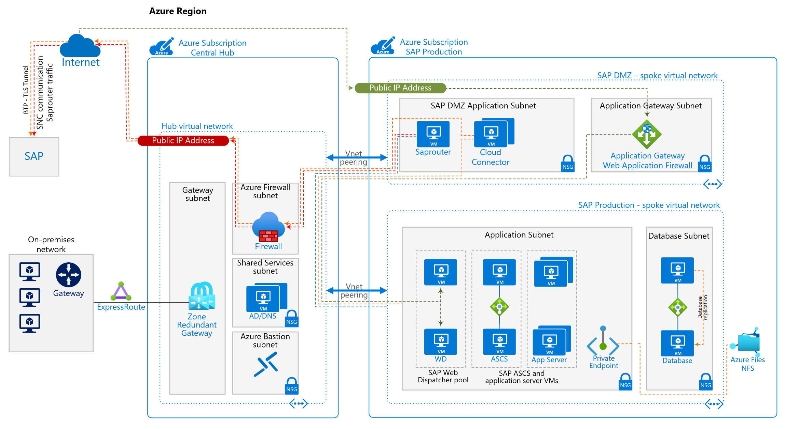
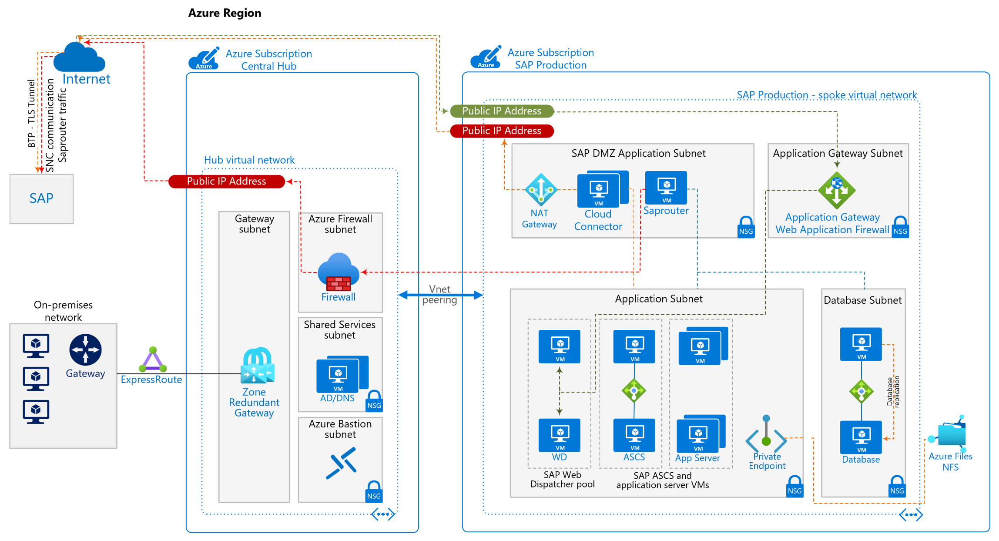

<!-- cSpell:ignore saprouter linky -->

This article provides a set of proven practices for enabling improved-security inbound and outbound internet connections for your SAP on Azure infrastructure.

## Architecture

_Download a [Visio file](https://arch-center.azureedge.net/sap-internet-communication-architecture.vsdx) of the architectures in this article._

This reference architecture illustrates a common production environment. You can reduce the size and scope of the configuration, per your requirements. This reduction might apply to the SAP landscape: fewer virtual machines (VMs), no high availability, or embedded SAP Web Dispatchers instead of discrete VMs. It can also apply to alternatives on the network side, as described later in this article.

Customer requirements, driven by business or company policies, will necessitate adaptations to the architecture, particularly on the network side. When possible, we've included alternatives. Many solutions are viable. Choose an approach that's right for your business. It needs to help you secure your Azure resources but still provide a performant solution.

Disaster recovery (DR) isn't covered in this architecture. On a network level, the same principles and design that are valid for primary production regions apply. For the network, you should consider enabling disaster recovery in another Azure region, depending on the applications being protected for DR.

### Components

Introducing the components used in the architecture.

**Subscriptions** Following the Azure [landing zone](/azure/cloud-adoption-framework/ready/landing-zone/) concept, Azure subscriptions for each workload are used. One or more subscriptions for central IT services containing the network hub and central, shared services such as firewalls or Active Directory and DNS. Further subscription(s) are used for individual workloads, in this architecture the SAP production workload. Utilize the [decision guide](/azure/cloud-adoption-framework/decision-guides/subscriptions/) in the Azure Cloud Adoption Framework to decide on the optimal subscription strategy for your company.

**Virtual networks (vnet)** The [Azure Virtual Network](/azure/virtual-network/virtual-networks-overview) service connects Azure resources to each other with enhanced security. In this architecture, the virtual network connects to an on-premises environment via an ExpressRoute or virtual private network (VPN) gateway deployed in the hub of a [hub-spoke topology](../../reference-architectures/hybrid-networking/hub-spoke.yml). SAP production landscape uses own spoke virtual networks. Two distinct spoke virtual networks used for different purposes, with several subnets for network segregation.

Separating into subnets by workload allows easier enablement of network security groups (NSG) to set security rules applicable to application VMs or Azure service deployed therein.

**Zone-redundant gateway** A gateway connects distinct networks, extending your on-premises network to the Azure virtual network. We recommend that you use [ExpressRoute](../../reference-architectures/hybrid-networking/expressroute.yml) to create private connections that don't go over the public internet. You can also use a [site-to-site](../../reference-architectures/hybrid-networking/expressroute.yml) connection. Azure ExpressRoute or VPN gateways can be deployed across zones to guard against zone failures. See [Zone-redundant virtual network gateways](/azure/vpn-gateway/about-zone-redundant-vnet-gateways) to understand the differences between a zonal deployment and a zone-redundant deployment.  The IP addresses used need to be of Standard SKU for a zone deployment of the gateways.

**Network security groups (NSG)**  To restrict incoming and outgoing network traffic of the virtual network, create [network security groups](/azure/virtual-network/tutorial-filter-network-traffic-cli), which are in turn assigned to specific subnets. Individual subnets are secured with workload specific NSGs.

**Application security groups (ASG)** To define fine-grained network security policies inside your NSGs based on workloads that are centered on applications, use [application security groups](/azure/virtual-network/security-overview) instead of explicit IP addresses. They let you group VMs by purpose, for example SAP SID, and help you secure applications by filtering traffic from trusted segments of your network.

**Private Endpoint** Many Azure services operate as public services, by design accessible through the Internet. In order to allow private access via customer's private network range, some services can use private endpoints. [Private endpoints](/azure/private-link/private-endpoint-overview) are a network interface in your virtual network, bringing the service effectively into your private network space. 

**Application Gateway** Azure [Application Gateway](/azure/application-gateway/overview) (AppGw) is a web traffic load balancer. Together with its web application firewall functionality, it's the ideal service to expose web applications to the Internet, securely. Application Gateway can service both or either public (Internet) or private clients, depending on configuration.

In the architecture AppGw, with a public IP address, allows inbound connections to the SAP landscape over https. Its backend pool is two or more SAP Web Dispatcher VMs, accessed round-robin providing high-availability. While the AppGw is a reverse proxy and web traffic load balancer, it doesn't replace the SAP Web Dispatcher. SAP Web Dispatcher has application integration with your SAP systems and provided features not possible with AppGw alone. Client authentication once it reaches the SAP systems, is performed by the SAP application layer natively or through Single Sign-On.

For optimal performance, ensure [HTTP/2 support](/azure/application-gateway/configuration-listeners#http2-support) is enabled for the AppGw and also with [SAP Web Dispatcher](https://help.sap.com/docs/SAP_NETWEAVER_AS_ABAP_751_IP/683d6a1797a34730a6e005d1e8de6f22/c7b46000a76445f489e86f4c5814c7e8.html) and SAP NetWeaver.

**Load Balancer** Azure [Standard Load Balancer](/azure/load-balancer/load-balancer-overview) (SLB) provides networking element for the highly available design of your SAP systems. For clustered systems, SLB provides the virtual IP address for the cluster service such as (A)SCS and database running on VMs. SLB can be used to provide IP for virtual SAP hostname of non-clustered systems as well, if [secondary IPs on Azure network cards](https://techcommunity.microsoft.com/t5/running-sap-applications-on-the/use-sap-virtual-host-names-with-linux-in-azure/ba-p/3251593) shouldn't be used. Later in this document we document use of SLB instead of the AppGw and addressing outbound internet access.

## Network design

The architecture uses two discrete virtual networks, both as spoke vnets peered to the central hub vnet. There's no spoke to spoke peering, following the star principle topology of communication through the hub. The separation of networks acts to protect the applications from possible breach.

An application specific [perimeter network](/azure/cloud-adoption-framework/ready/azure-best-practices/perimeter-networks) contains the Internet facing applications such as saprouter, SAP cloud connector, SAP analytics cloud agent, or application gateway. In the architecture diagram, the perimeter network is named SAP DMZ spoke vnet. Due to dependencies on the SAP systems the deployment, configuration and management of these services is typically performed by the SAP team. Because of it, these SAP DMZ services are often not located in a central hub subscription and network where they'd need to be managed by the central IT team, often causing organizational challenges. Application Gateway always requires own designated subnet, which is best placed in the SAP DMZ vnet. The AppGw uses a public IP addresses for frontend and https listener.

Benefits of a separate SAP DMZ virtual network are:

- Quick and immediate isolation of compromised services, if a breach is detected. Removing vnet peering from SAP DMZ to hub immediately isolates both the SAP DMZ workloads, but also SAP application vnet applications from Internet. Changing or removing an NSG rule permitting access only affects new connections and doesn't cut existing connections.
- More stringent controls on the vnet and subnet, with a tight lockdown on communication partners in and out of both SAP DMZ network and SAP application networks. Can be extended to authorized users and access methods on SAP DMZ applications, with different authorization backends, privileged access or logon credentials for SAP DMZ applications.

Drawbacks are increased complexity, extra vnet peering cost for Internet bound SAP traffic since communication needs to pass through vnet peering twice. Latency impact on the spoke - hub - spoke peering traffic are dependent on any firewall and need to be measured.

### Simplified architecture

In order to address the recommendations in this document but limit the drawbacks, a single spoke vnet for both the DMZ, and SAP applications is possible. The architecture shown below contains all subnets in one single SAP production virtual network. The benefit of immediate isolation through terminating vnet peering to SAP DMZ if it was compromised isn't available. NSG changes in such scenario will affect new connections only.

This simplified architecture uses NAT Gateway in the SAP DMZ subnet, providing outbound connectivity for SAP Cloud Connector and SAP Analytics Cloud Agent and OS updates for the deployed VMs. Due to saprouter requirement for both incoming and outbound connections, this communication path is through the firewall instead of using the NAT gateway.

*Figure - Simplified architecture for Internet facing communication for SAP on Azure.*

_Download a [Visio file](https://arch-center.azureedge.net/sap-internet-communication-architecture.vsdx) of this architecture, containing all drawings shown here._

For deployments smaller in size and scope the simplified architecture can be more suitable, while adhering to principles of the main architecture. In this document the reference architecture shown at start will be referred to in the text below, unless noted otherwise.

One addition in the simplified architecture is the addition of Azure NAT Gateway, to provide Internet outbound connectivity for SAP workloads.

**NAT Gateway** Azure virtual network [NAT gateway](/azure/virtual-network/nat-gateway/nat-overview) is a service providing static public IP(s) for outbound connectivity. NAT gateway assigned to a subnet, all outbound communications use the NAT Gateway's IP(s) for Internet access. Inbound connections aren't using the NAT gateway, outbound connection only. Applications such as SAP Cloud Connector or VM's OS update services accessing repositories on Internet can use NAT Gateway, instead of the routing all outbound traffic through the central firewall. Often [user defined rules](/azure/virtual-network/ip-services/default-outbound-access) are in place on all subnets, forcing all Internet bound traffic off all vnets through the central firewall. Depending on customer requirements, NAT Gateway can act as alternative for such central firewall, on outbound connections only. Benefits are offloading load from the central firewall, while talking to NSG-allowed public endpoints. Additionally outbound IP control, as destination firewall rules can be configured on set IP list of the NAT gateway. Examples are reaching Azure public endpoints used by public services, OS patch repositories or 3rd party interfaces.

For high-availability setup, keep in mind NAT gateway is deployed in a [specific zone only](/azure/virtual-network/nat-gateway/faq#how-does-virtual-network-nat-gateway-work-with-availability-zones) and is currently not cross-zone redundant. It's thus not ideal for SAP deployments using zone-redundant (cross-zone) deployment for virtual machines.

### (Re)Use of network components across SAP landscape

An architecture document typically depicts one SAP system or landscape only, for ease of understanding. Often unaddressed is the overall bigger picture of how such architecture fits to a larger SAP landscape with several system tracks and tiers.

Central networking services, such as firewall, NAT gateway, proxy servers if deployed are best used across entire SAP landscape of all tiers - production, pre-production, development and sandbox. Depending on your requirements, organization size and company policy you can consider separate implementation per tier or one production and one sandbox/testing environment.

Services typically serving an SAP system are best separated as follows

- **Load Balancers** dedicated to individual service. Degree of separation best per company policy on naming and grouping. Recommended deployment is one load balancer for (A)SCS and ERS and another for DB, for each SAP SID separated. This ensures troubleshooting doesn't get complex with multiple front- and backend pools and load balancing rules all on same single load balancer. Single load balancer per SAP SID also ensures placement in resource groups matches the other infrastructure components.
- **Application Gateway**, similarly to load balancer, allows multiple back- and frontends, HTTP settings and rules. The decision to use one AppGw for multiple uses - different web dispatchers ports for same SAP S/4HANA system or different SAP environments is here more common, as not all SAP systems in the environment require public access. Recommended approach is thus to use one AppGw at least per tier (production, non-production, sandbox) unless the complexity and amount of connected systems gets too high.
- **SAP services** like saprouter or cloud connector, analytics cloud agent are deployed based on application requirements either centrally or split up. Often production and non-production separation is desired.

### Subnet sizing and design

When designing subnets for your SAP landscape, ensure correct sizing and design principles are adhered to.

- Several Azure PaaS services require own, designated subnets.
- Application Gateway requires at least /29 subnet, although /27 or larger is [recommended](/azure/vpn-gateway/vpn-gateway-about-vpn-gateway-settings#gwsub). AppGw version 1 and 2 can't be part of the same subnet.
- If using Azure NetApp Files for your NFS/SMB shares or database storage, again own designated subnet is required. /24 subnet is default and [proper sizing](/azure/azure-netapp-files/azure-netapp-files-delegate-subnet) should be chosen based on requirements.
- If using SAP virtual hostnames, more address space is needed in your SAP subnets, including SAP DMZ.
- Central services like Azure Bastion or Azure Firewall, typically managed by central IT team, require their own dedicated subnets with sufficient sizing.

Dedicated subnets for SAP database and application allow NSGs to be set more strict, protecting both application types with own set of rules. Access to database can be then much more simply limited to SAP applications only, without having to resort to ASGs for granular control. Separating your SAP application and database subnets also allows easier manageability of your security rules within NSGs.

## SAP Services

### Saprouter

Enabling access to your SAP system to third parties such as SAP support or partners can be done with saprouter. Saprouter software runs on one VM in Azure. Routing permissions to use saprouter are stored in a flat file called saproutab. The saproutab entries allow connection to any TCP/IP port to a network destination behind saprouter, typically your SAP system VMs. SAP support remote access relies on the use of saprouter, same for download of SAP notes into your SAP NetWeaver system utilizes the saprouter to connect to SAP. The above architecture uses the earlier described network design, with a saprouter VM running within the designated SAP-DMZ vnet. Through the vnet peering, saprouter then communicates with your SAP servers running in own spoke virtual network and subnets.

Saprouter acts as a tunnel to SAP or partners, the communication path to Internet is protected through:

- Azure Firewall or third party NVA provides the public IP entry point into your Azure networks. Firewall rules in place to limit communication to authorized IPs only. For SAP suppport connection, [SAP note 48243 - Integrating the SAProuter software into a firewall environment](https://launchpad.support.sap.com/#/notes/48243) documents the IP address of SAP's routers.
- Similarly to firewall rules, network security rules allow communication on saprouter's port, typically 3299 with the designated destination.
- The saproutab file, where saprouter allow/deny rules are maintained, specifying who can contact saprouter and which SAP system can be accessed.
- Further NSG rules in place on the respective subnets within the SAP production subnet, containing the SAP systems.

The following blog post [SAP on Azure Tech Community | Saprouter configuration with Azure Firewall](https://techcommunity.microsoft.com/t5/running-sap-applications-on-the/saprouter-configuration-with-azure-firewall/ba-p/3293496) contains steps to configure saprouter with Azure Firewall.

#### Security considerations

As saprouter operates in different application subnet from your SAP systems, logon mechanisms for the OS might be different. Depending on customer's policy, a separate logon domain or entirely host-only user credentials can be used for the saprouter. Benefit if there's any security breach, no cascading access to the internal SAP systems is possible due to different credential base. Network separation in such case, as described earlier, can decouple further access from compromised saprouter into your application subnets by disconnecting the SAP DMZ vnet peering.

#### Saprouter high availability considerations

As saprouter is a simple executable with a file-based route permission table, it can be easily (re)-started. The application has no built-in high-availability natively. If there's VM or application failure, the service needs to start on another VM. Using a virtual hostname for the saprouter service is ideal. This virtual hostname is bound to an IP, which is assigned as secondary IP config with the VM’s NIC or to an internal load balancer connected to the VM(s). This way, if the saprouter service needs to be moved to another VM, the service virtual hostname's IP config can be removed. The virtual hostname is then added on another VM without having to change the route tables or firewall configuration since they're all configured to use the virtual IP address. The following blog post [SAP on Azure Tech Community | Use SAP Virtual Host Names with Linux in Azure](https://techcommunity.microsoft.com/t5/running-sap-applications-on-the/use-sap-virtual-host-names-with-linux-in-azure/ba-p/3251593) has more information about usage of virtual hostnames with SAP in Azure.

#### Cascading saprouter

Up to two saprouters can be defined for SAP's support connections and thus a concept of a cascading saprouter can be implemented. First saprouter, running in the SAP DMZ application subnet provide access from the central firewall and from SAP's or partners saprouters. Only allowed destinations are further saprouters, running with specific workload. Cascading saprouters could be a per-tier, per-region or per-SID separation, depending on your enterprise architecture. The second saprouter accepts only internal connections from the first saprouter and provides access to individual SAP systems and VMs. Allowing you separating access and management between different teams as needed. An example of a cascading saprouter is given in the above linked blog post.

### SAP Fiori and WebGui

SAP Fiori and other https frontends by SAP applications are often consumed by customer user base outside the internal corporate network. The need to be available on the Internet requires a secure solution protecting the SAP application. Azure Application Gateway with [web application firewall](/azure/web-application-firewall/ag/ag-overview) is the ideal service for this purpose. 

Users accessing the public hostname of the public IP tied to AppGw have the https session terminated on the AppGw. Backend pool of two or more SAP Web Dispatcher VMs get round-robin sessions from the AppGw. This internal traffic AppGw to Web Dispatcher can be either http or https depending on requirements. The web application firewall protects the SAP Web Dispatcher from attacks coming through the Internet with the [OWASP core rule set](/azure/web-application-firewall/ag/application-gateway-crs-rulegroups-rules). User authentication is performed by SAP Netweaver, often tied to Azure Active Directory through [Single Sign-On](/azure/active-directory/saas-apps/sap-fiori-tutorial) (SSO). Following [blog post](https://blogs.sap.com/2020/12/10/sap-on-azure-single-sign-on-configuration-using-saml-and-azure-active-directory-for-public-and-internal-urls/) describes in great detail the steps needed to configure SSO with SAML for Fiori using AppGw.

Keep in mind that securing the SAP Web Dispatcher needs to be performed in any situation. Even if open internally only, open towards application gateway with public IP or accessible through any other network means. See SAP for further information about [securing the application](https://help.sap.com/docs/ABAP_PLATFORM/683d6a1797a34730a6e005d1e8de6f22/489ab29948c673e8e10000000a42189b.html?version=1709.008) layer of SAP Web Dispatcher.

#### Firewall and AppGw

All web traffic provided by the application gateway is https based and encrypted with the provided TLS certificate. Using a Firewall as entry point into the corporate network, with its public IP, and SAP Fiori traffic flowing from firewall to AppGw next through internal IP is possible and a [documented use case](/azure/architecture/example-scenario/gateway/firewall-application-gateway#application-gateway-after-firewall). Since the TCP/IP layer 7 encryption is already in place through TLS, there's limited benefit of using firewall in such scenario, and thus can't perform any packet inspection. One aspect is Fiori communicating through same external IP for both inbound and outbound traffic, which is typically not required for SAP Fiori deployments.

Benefits of a tandem AppGw and layer 4 firewall deployment is possible integration with enterprise-wide security policy management and already discarding network traffic violating [security rules](/azure/firewall/threat-intel) not requiring content inspection. Such a combined deployment is a good architecture and it depends on your overall enterprise architecture how inbound Internet traffic must be handled. Consider also how such overall network architecture fits with access from internal IP address space such as on-premise clients, covered in next section.

#### AppGw for internal IP (optional)

The architecture focuses on Internet facing applications. Clients accessing SAP Fiori, WebUI of a SAP Netweaver system or other SAP https interface through an internal, private IP have different options available. One scenario is treating all accesses to Fiori as public accesses, through the public IP. Another option is using direct network access through private network to the SAP Web Dispatchers, bypassing the AppGw entirely. Last option is to use [both private and public IP](/azure/application-gateway/configuration-front-end-ip#public-and-private-ip-address-support) address on the AppGw, providing access to both Internet and private network.

Similar configuration with private IP on AppGw can be used for private only network access to the SAP landscape. The public IP in such case only is used for management purposes and doesn't have a listener associated to it.

As an alternative when deciding to not use application gateway is to use a load balancer internally. A standard internal load balancer (SLB) with Web Dispatcher VMs configured as round-robin backend. The SLB placed would be placed with the Web Dispatcher VMs in the SAP production application subnet and provide [active/active](https://help.sap.com/docs/SAP_S4HANA_ON-PREMISE/683d6a1797a34730a6e005d1e8de6f22/489a9a6b48c673e8e10000000a42189b.html) load balancing between Web Dispatcher VMs.

For any Internet facing deployments, AppGw with web application firewall is the recommended use case instead of using a load balancer with public IP.

### SAP Business Technology Platform (BTP)

SAP BTP is a large set of SAP's application - Software as a Service or Platform as a Service - most typically accessed through a public endpoint via the Internet. To provide communication for applications running in private networks, like an SAP S/4HANA system running in Azure, often [SAP Cloud Connector](https://help.sap.com/docs/CP_CONNECTIVITY/cca91383641e40ffbe03bdc78f00f681/e6c7616abb5710148cfcf3e75d96d596.html) is used. SAP Cloud Connector runs as application inside a virtual machine, requiring outbound Internet access to establish a TLS encrypted https tunnel with SAP BTP service. It acts as a reverse invoke proxy between the private IP range in your vnet and SAP BTP applications. Due to this reverse invoke support, there's no need for open firewall ports or other access for inbound connections, as the connection from view of your vnet is outbound.

By default, VMs have [outbound Internet](/azure/virtual-network/ip-services/default-outbound-access) access natively in Azure. The used public IP address, without a dedicated public IP associated to the virtual machine, is for outbound traffic flows randomly chosen from the pool of public IPs in the specific Azure region, beyond any customer control. Using a NAT gateway associated to the subnet or load balancer and its public IP, customer operated http proxy servers or by using [user defined route](/azure/virtual-network/ip-services/default-outbound-access) forcing the network traffic to a network appliance such as firewall, are all ways to ensure the outbound connections are made through a controlled and identifiable service and IP address.

The reference architecture shows the most common scenario of routing Internet bound traffic to the hub vnet and through the central firewall. [Further settings](https://help.sap.com/docs/CLOUD_INTEGRATION/368c481cd6954bdfa5d0435479fd4eaf/642e87f1492146998a8eb0779cd07289.html) are required in the SAP cloud connector to connect to your SAP BTP account.

#### High-availability for SAP Cloud Connector

SAP Cloud Connector provides high-availability built into the application. Cloud Connector is installed on two virtual machines. A main instance is active, with the shadow instance connected to the main, both share configuration and are kept in sync natively. Should main not be available, the secondary VM attempts to take over the main role and re-establish the TLS tunnel to SAP BTP. In the architecture, a high-available cloud connector environment is shown. No further Azure technologies such as load balancer or cluster software is required for such setup. See SAP documentation for [details on setup and operation](https://help.sap.com/docs/CP_CONNECTIVITY/cca91383641e40ffbe03bdc78f00f681/2f9250b0e6ac488286266461a82518e8.html).

#### SAP Analytics Cloud Agent

For some application scenarios, SAP Analytics Cloud (SAC) Agent is an application installed inside a virtual machine, which uses SAP cloud connector for SAP BTP connectivity. For this architecture, the SAC Agent VM should run in the SAP DMZ application subnet, alongside the SAP Cloud Connector VM(s). See SAP's documentation [showing the traffic flow](https://help.sap.com/docs/SAP_ANALYTICS_CLOUD/00f68c2e08b941f081002fd3691d86a7/5339a2395ccd4befb047c625a15f8481.html) from private networks such as Azure vnet to SAP BTP using SAC agent. 

#### SAP Private Link service in Azure

SAP has a [private link service](https://blogs.sap.com/2022/06/22/sap-private-link-service-on-azure-is-now-generally-available-ga/) available for SAP BTP, enabling private connection between selected SAP BTP services and selected services in your Azure subscription and vnet. By using the private link service, the communication isn't routed through the public Internet and remains on Azure backbone network, secure, with communication to Azure services through private address space. Data exfiltration protection is built in when using private link service, since the private endpoint maps the specific Azure service to an IP address. Access is only limited to the mapped Azure service.

Some SAP BTP integration scenarios will favor the private link service approach, while other might prefer SAP Cloud Connector. An excellent blog post exists to help you decide which is more suitable and compare both. [SAP Blogs | BTP private linky swear with Azure – running Cloud Connector and SAP Private Link side-by-side](https://blogs.sap.com/2022/07/07/btp-private-linky-swear-with-azure-running-cloud-connector-and-sap-private-link-side-by-side/)

### SAP RISE/ECS

For customers where SAP operates their SAP system under SAP RISE/ECS contract, SAP acts as the managed service partner. The SAP environment is deployed by SAP and under SAP's architecture, the architecture shown here doesn't apply to your systems running in RISE with SAP/ECS. See our Azure documentation about [integrating such SAP landscape with Azure](/azure/virtual-machines/workloads/sap/sap-rise-integration) services and your network.

### Other SAP communication needs

SAP landscape operating in Azure might require further considerations for Internet bound communication. Traffic flow in this architecture uses central Azure Firewall for such outbound traffic. User defined rules in the spoke vnets route the Internet bound traffic requests to the firewall. Alternatives are to use NAT gateways on specific subnets, [default Azure outbound](/azure/virtual-network/ip-services/default-outbound-access) communication, public IP on VM (not recommended) or public load balancer with outbound rules.

For virtual machines behind a standard internal load balancer, such as clustered environments, be aware the SLB modifies the behavior for public connectivity in following article. [Public endpoint connectivity for Virtual Machines using Azure Standard Load Balancer in SAP high-availability scenarios](/azure/virtual-machines/workloads/sap/high-availability-guide-standard-load-balancer-outbound-connections)

#### Operating system  Updates

Operating systems (OS) updates are often located behind a public endpoint through the Internet. If no enterprise repository and update management are in place, mirroring OS updates from vendors on private IP/VMs, your SAP workload will need to access the update repositories of respective vendor.

For Linux operating systems, below repositories are accessible if you obtain the OS license from Azure. Contact the OS vendor if you purchase licenses directly and bring them to Azure (BYOS) about ways to connect to OS repositories and respective IP ranges.

- For SuSE Enterprise Linux, [SuSE maintains](https://pint.suse.com/?resource=servers&csp=microsoft) a list of servers in each Azure region.
- For RedHat Enterprise Linux, RedHat Update Infrastructure is [documented here](/azure/virtual-machines/workloads/redhat/redhat-rhui#the-ips-for-the-rhui-content-delivery-servers).
- For Windows, Windows Update is available as [FQDN tag](/azure/firewall/fqdn-tags#current-fqdn-tags) for Azure Firewall.

#### High-Availability cluster management

Highly available systems such as clustered SAP (A)SCS or databases might use a cluster manager with Azure fence agent as its STONITH device. Such systems are dependent on reaching Azure resource manager (ARM). ARM is used for both status queries about state of Azure resources and also operations to stop/start virtual machines. Since ARM is a public endpoint, reachable under management.azure.com, VM outbound communication need to be able to reach it. This architecture again here relies on central firewall with user defined rules routing traffic from SAP vnets. Alternatives to central firewall exist as explained previous sections.

## Communities

Communities can answer questions and help you set up a successful deployment. Consider the following communities:

- [Azure Community Support](https://azure.microsoft.com/support/forums/)
- [SAP Community](https://www.sap.com/community.html)
- [Stack Overflow SAP](http://stackoverflow.com/tags/sap/info)

## Related resources

- [SAP Blogs | SAP on Azure: Azure Application Gateway Web Application Firewall (WAF) v2 Setup for Internet facing SAP Fiori Apps](https://blogs.sap.com/2020/12/03/sap-on-azure-application-gateway-web-application-firewall-waf-v2-setup-for-internet-facing-sap-fiori-apps/)
- [SAP Blogs | Getting Started with BTP Private Link Service for Azure](https://blogs.sap.com/2021/12/29/getting-started-with-btp-private-link-service-for-azure/)
- [SAP Blogs | BTP private linky swear with Azure – running Cloud Connector and SAP Private Link side-by-side](https://blogs.sap.com/2022/07/07/btp-private-linky-swear-with-azure-running-cloud-connector-and-sap-private-link-side-by-side/)
- [SAP on Azure Tech Community | Saprouter configuration with Azure Firewall](https://techcommunity.microsoft.com/t5/running-sap-applications-on-the/saprouter-configuration-with-azure-firewall/ba-p/3293496)
- [SAP on Azure Tech Community | Use SAP Virtual Host Names with Linux in Azure](https://techcommunity.microsoft.com/t5/running-sap-applications-on-the/use-sap-virtual-host-names-with-linux-in-azure/ba-p/3251593)
- [SAP Documentation | What is Cloud Connector](https://help.sap.com/docs/CP_CONNECTIVITY/cca91383641e40ffbe03bdc78f00f681/e6c7616abb5710148cfcf3e75d96d596.html)
- [SAP Documentation | What is SAP Analytics Cloud Agent](https://help.sap.com/docs/SAP_ANALYTICS_CLOUD/00f68c2e08b941f081002fd3691d86a7/7cb6ffb38c294a5c871d6cc6ad5b1b36.html)
- [MS Docs | Default outbound access in Azure](/azure/virtual-network/ip-services/default-outbound-access)
- [MS Docs | Public endpoint connectivity for Virtual Machines using Azure Standard Load Balancer in SAP high-availability scenarios](/azure/virtual-machines/workloads/sap/high-availability-guide-standard-load-balancer-outbound-connections)
- [MS Docs | Subscription decision guide](/azure/cloud-adoption-framework/decision-guides/subscriptions/)
- [SAP Blogs | SAP Fiori using Azure CDN for SAPUI5 libraries](https://blogs.sap.com/2021/03/22/sap-fiori-using-azure-cdn-for-sapui5-libraries/)
- [Youtube | [SOT113] Deploying Fiori at Scale](https://www.youtube.com/watch?v=IJQlSjxb8pE)
