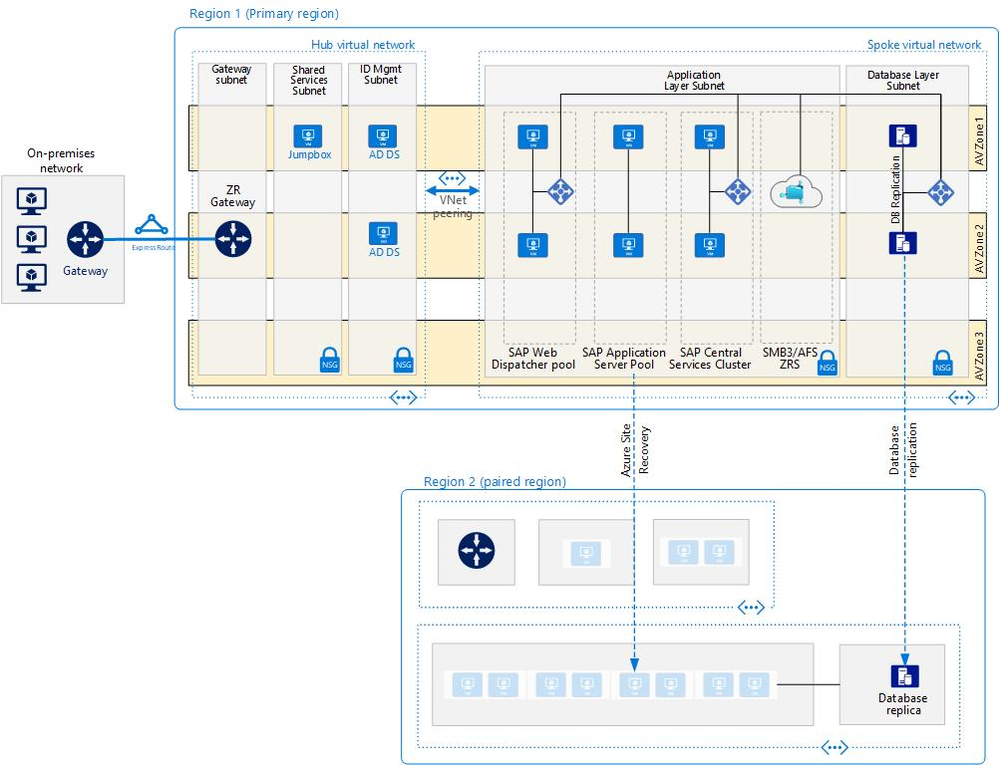

<!-- cSpell:ignore lbrader netweaver jump-box jump-boxes ACLs HANA SOFS SWDs SMLG ABAP SAPGUI SAPGUIs SPOF WSFC ASCS MSEE Iperf SIOS sapmnt -->

# SAP Netweaver on Windows

This reference architecture shows a set of proven practices for running SAP NetWeaver in a Windows environment on Azure with high availability. The database is AnyDB, the SAP term for any supported database management system (DBMS) besides SAP HANA.

The first diagram describes SAP Netweaver in a Windows environment in an Availability Set model using Azure NetApp files for the Shared Files layer and Proximity Placement Group for improved performance:

_Download a [Visio file](https://arch-center.azureedge.net/sap-netweaver-AVSet-Netapp-PPG.vsdx) of this architecture._

The second diagram describes SAP Netweaver in a Windows environment in an Availability Zone model for improved resilience:

_Download a [Visio file](https://arch-center.azureedge.net/sap-netweaver-AVZones.vsdx) of this architecture._

> [!NOTE]
> Deploying this reference architecture requires appropriate licensing of SAP products and other non-Microsoft technologies.

## Architecture

This reference architecture describes a production system. It is deployed with specific virtual machine (VM) sizes that can be changed to accommodate your organization's needs and can be reduced to a single VM. The network layout is greatly simplified to demonstrate the architectural principals and is not intended to describe a full enterprise network.

The following components are required.

**Virtual network.** The [Azure Virtual Network](/azure/virtual-network/virtual-networks-overview)(VNet) service securely connects Azure resources to each other. In this architecture, the virtual network connects to an on-premises environment through a virtual private network (VPN) gateway deployed in the hub of a [hub-spoke topology](../../reference-architectures/hybrid-networking/hub-spoke.yml). The spoke is the VNet used for the SAP applications and the database tiers.

**Virtual network peering.** This architecture uses a hub-and-spoke networking topology with multiple VNets that are [peered together](/azure/virtual-network/virtual-network-peering-overview). This topology offers network segmentation and isolation for services deployed on Azure. Peering enables transparent connectivity between peered VNets through the Microsoft backbone network and does not incur a performance penalty if deployed within a single region. The VNet is subdivided into separate subnets for each tier-application (SAP NetWeaver), database, and shared services (such as a jump-box and Active Directory).

**Virtual machines.** This architecture uses virtual machines for the application tier and database tier, grouped as follows:

- **SAP NetWeaver.** The application tier uses Windows virtual machines to run SAP Central Services and SAP application servers. The VMs that run Central Services are configured as a Windows Server Failover Cluster for high availability, supported by Windows Scale Out File Server (SOFS) with Storage Space Direct (S2D) or Azure Shared Disks.

- **AnyDB.** The database tier runs AnyDB as the database, such as Microsoft SQL Server, Oracle, or IBM DB2.

- **Jump-box.** Also called a bastion host. This secure virtual machine on the network is used by administrators to connect to the other virtual machines and is typically a part of shared services, such as domain controllers and backup services. If Secure Shell (SSH) and Remote Desktop Protocol (RDP) are the only services used for server administration, an [Azure Bastion](/azure/bastion/bastion-overview) host is an alternative, but if other management tools are used, such as SQL Server Management Studio or SAP Front End, use a traditional, self-deployed jump-box.

- **Windows Server Active Directory domain controllers.** The domain controllers are used on all virtual machines and users in the domain for identity management.

**Load balancers.** These are used to distribute traffic to virtual machines in the application-tier subnet. For high availability, use the built-in SAP Web Dispatcher, [Azure Load Balancer](/azure/load-balancer/load-balancer-overview), or network appliances, depending on the traffic type (such as HTTP or SAPGUI) or the required network services, such as Secure Sockets Layer (SSL) termination.

**Availability sets.** Virtual machines for all pools and clusters (Web Dispatcher, SAP application servers, Central Services, and database) are grouped into separate [availability sets](/azure/virtual-machines/windows/tutorial-availability-sets), and at least two virtual machines are provisioned per role. Availability sets increase the availability of the applications and VMs through management of hosts system faults or maintenance events by distributing role instances onto multiple hosts. An alternative is to use [Availability Zones](/azure/virtual-machines/workloads/sap/sap-ha-availability-zones) to improve workload availability as described later in this article.

**Zone redundant gateway.** Azure ExpressRoute or VPN gateways can be deployed across zones to guard against zone failures. See [Zone-redundant virtual network gateways](/azure/vpn-gateway/about-zone-redundant-vnet-gateways) to understand the differences between a zonal and zone redundant deployment.

**Proximity placement group.** This logical group places a constraint on VMs deployed in an availability set or a Virtual Machine Scale Set. A [proximity placement group](https://azure.microsoft.com/blog/introducing-proximity-placement-groups) favors colocation, meaning that virtual machines reside in the same datacenter to minimize application latency.

**Network security groups.** To restrict incoming, outgoing, and intra-subnet traffic in the VNet, create [network security groups](/azure/virtual-network/tutorial-filter-network-traffic-cli).

**Application security groups.** To define fine-grained network security policies based on workloads that are centered on applications, use [application security groups](/azure/virtual-network/security-overview) instead of explicit IP addresses. They let you group VMs by name and secure applications by filtering traffic from trusted segments of your network.

**Gateway.** A gateway connects distinct networks, extending your on-premises network to the Azure VNet. [ExpressRoute](../../reference-architectures/hybrid-networking/expressroute.yml) is the recommended Azure service for creating private connections that do not go over the public internet, but a [site-to-site](../../reference-architectures/hybrid-networking/expressroute.yml) connection can also be used. To reduce latency or increase throughput, consider [ExpressRoute Global Reach](/azure/expressroute/expressroute-global-reach) and [ExpressRoute FastPath](/azure/expressroute/about-fastpath) as discussed later in this article.

**Azure Storage.** To provide data persistence for a virtual machine in the form of a virtual hard disk (VHD). [Azure managed disks](/azure/virtual-machines/windows/managed-disks-overview) are recommended.

## Recommendations

This architecture describes a small, production-level deployment. Your
deployment will differ based on your business requirements, so consider these recommendations as a starting point.

### Virtual machines

In application server pools and clusters, adjust the number of virtual machines based on your requirements. The [Azure Virtual Machines planning and implementation guide](/azure/virtual-machines/workloads/sap/planning-guide) includes details about running SAP NetWeaver on virtual machines.

For details about SAP support for Azure virtual machine types and throughput metrics (SAPS), see [SAP note 1928533](https://launchpad.support.sap.com/#/notes/1928533). (To access the SAP notes, you must have an SAP Service Marketplace account.)

### SAP Web Dispatcher (SWD)

The Web Dispatcher component is used as a load balancer for SAP traffic among the SAP application servers. To achieve high availability for the Web Dispatcher component, Azure Load Balancer is used to implement either the failover cluster of SWDs or the parallel SWD setup. See [High Availability of the SAP Web Dispatcher](https://help.sap.com/doc/saphelp_nw73ehp1/7.31.19/48/9a9a6b48c673e8e10000000a42189b/frameset.htm) for a detailed description of the solution.

### Application servers pool

The SAP SMLG transaction is commonly used to manage logon groups for ABAP application servers and to load-balance logon users. Other transactions, such as SM61 for batch server groups, RZ12 for RFC groups, and so on, load-balance logon users. These transactions use the load-balancing capability within the message server of the SAP Central Services to distribute incoming sessions or workloads among SAP application servers pool for SAPGUIs and RFC traffic.

### SAP Central Services cluster

This reference architecture runs Central Services on VMs in the application tier. Central Services is a potential single point of failure (SPOF) when deployed to a single VM. To implement a highly available solution, use either a file-share cluster or a shared-disk cluster.

For file-share clusters, there are several different options. The recommendation is to utilize [Azure Files](/azure/storage/files/storage-files-introduction) as fully-managed, cloud native SMB or NFS shares. An alternative to Azure Files is [Azure NetApp Files](/azure/azure-netapp-files/azure-netapp-files-introduction), which offers high-performance, enterprise-class NFS and SMB shares.

It is also possible to implement the high availability file share on the Central Service instances by using WSFC with [Scale Out File Server](https://techcommunity.microsoft.com/t5/Running-SAP-Applications-on-the/File-Server-with-SOFS-and-S2D-as-an-Alternative-to-Cluster/ba-p/368111) (SOFS) and the [Storage Spaces Direct](https://blogs.sap.com/2018/03/07/your-sap-on-azure-part-5-ascs-high-availability-with-storage-spaces-direct) (S2D) feature in Windows Server 2016 and later. This solution also supports [Windows clusters](/azure/virtual-machines/workloads/sap/sap-high-availability-guide-wsfc-file-share) using a file share served up by SOFS as the Cluster Shared Volume (CSV).

If you prefer to utilize shared disks, it's recommended to use [Azure Shared Disk](/azure/virtual-machines/disks-shared#linux) to set up a [Windows Server Failover Cluster for SAP Central Services Cluster](/azure/virtual-machines/workloads/sap/sap-high-availability-infrastructure-wsfc-shared-disk).

There are also third-party offerings such as [SIOS DataKeeper Cluster Edition](https://azuremarketplace.microsoft.com/marketplace/apps/sios_datakeeper.sios-datakeeper-8) from SIOS Technology Corp., which replicates contents from independent disks attached to the ASCS cluster nodes, and then presents the disks as a CSV to the cluster software.

To lower infrastructure costs, Microsoft supports multiple ASCS instances with different [system IDs](/azure/virtual-machines/workloads/sap/sap-high-availability-multi-sid) (SID) deployed on one Windows cluster over multiple file shares served up by the same [SOFS cluster](https://techcommunity.microsoft.com/t5/Running-SAP-Applications-on-the/File-Server-with-SOFS-and-S2D-as-an-Alternative-to-Cluster/ba-p/368111).

In the case of cluster network partitioning, the cluster software uses votes to decide which segment of the network and its associated services will serve as the brain of the now fragmented cluster. Windows offers a number of quorum models. This solution uses Azure [Cloud Witness](/windows-server/failover-clustering/deploy-cloud-witness) for its simplicity and availability, which is better than a compute node witness. The [Azure file share witness](/windows-server/failover-clustering/file-share-witness) is another alternative to provide a cluster quorum vote.

On an Azure deployment, the application servers connect to the highly available Central Services through the virtual host names of the ASCS or ERS services. These host names are assigned to the cluster frontend IP configuration of the load balancer. Azure Load Balancer supports multiple frontend IPs, so both the ASCS and ERS virtual IPs (VIPs) can be bounded to one load balancer.

### Availability sets

Availability sets distribute servers to different physical infrastructures and update groups to improve service availability. To meet service-level agreements ([SLAs](https://azure.microsoft.com/support/legal/sla/virtual-machines)), put virtual machines that perform the same role into an availability set to help guard against planned and unplanned downtime imposed by Azure infrastructure maintenance or caused by hardware faults. For the higher SLA, you must have two or more virtual machines per availability set.

All virtual machines in a set must perform the same role. Do not mix servers of different roles in the same availability set. For example, don't place an ASCS node in the same availability set with the application servers.

You can deploy Azure availability sets within [Azure Availability Zones](/azure/virtual-machines/workloads/sap/sap-ha-availability-zones) when you use a [proximity placement group](/azure/virtual-machines/linux/co-location).

### Networking

This architecture uses a hub-spoke topology, where the hub VNet acts as a central point of connectivity to an on-premises network. The spokes are VNets that peer with the hub and isolate the SAP workloads. Traffic flows between the on-premises datacenter and the hub through a gateway connection.

#### Network interface cards (NICs)

Enable all communication of virtual machines on a virtual network. Traditional on-premises SAP deployments implement multiple NICs per machine to segregate administrative traffic from business traffic. On Azure, the virtual network is a software-defined network that sends all traffic through the same network fabric. Therefore, the use of multiple NICs is unnecessary for performance considerations. However, if your organization needs to segregate traffic, you can deploy multiple NICs per VM, connect each NIC to a different subnet, and then use network security groups to enforce different access control policies.

Azure NICs support multiple IPs, which follows the SAP recommended practices in using virtual host names for installations. For a complete outline, see [SAP note 962955](https://launchpad.support.sap.com/#/notes/962955) (SAP logon required).

#### Subnets and network security groups

This architecture subdivides the VNet address space into subnets. Each subnet can be associated with a network security group (NSG) that defines the access policies for the subnet. Place application servers on a separate subnet so you can secure them more easily by managing the subnet security policies, rather than the individual servers.

When associated with a subnet, an NSG applies to all the servers within the subnet and offers fine-grained control over the servers. Set them up using the [portal](/azure/virtual-network/tutorial-filter-network-traffic), [PowerShell](/azure/virtual-network/tutorial-filter-network-traffic-powershell), or [Azure CLI](/azure/virtual-network/tutorial-filter-network-traffic-cli).

#### ExpressRoute Global Reach

If your network environment includes two or more ExpressRoute connections, an option to reduce network hops and lower latency is to use [ExpressRoute Global Reach](/azure/expressroute/expressroute-global-reach). This refers to a BGP route peering setup between two or more ExpressRoute connections for bridging two ExpressRoute routing domains. Global Reach lowers latency when network traffic traverses more than one ExpressRoute connection and is currently available only for private peering on ExpressRoute circuits.

At this time, there are no network access control lists (ACLs) or other attributes that can be changed in Global Reach, which means that all routes learned by a given ExpressRoute circuit (from on-premises and Azure) are advertised across the circuit peering to the other ExpressRoute circuit. It is recommended to establish network traffic filtering on-premises to restrict access to resources.

#### ExpressRoute FastPath

Also known as Microsoft Edge Exchange (MSEE) v2, [FastPath](/azure/expressroute/about-fastpath) implements MSEE at the entry point of the Azure network. It reduces network hops for most data packets.

For all new ExpressRoute connections to Azure, FastPath is the default configuration. For existing ExpressRoute circuits, activate FastPath with Azure support.

FastPath does not support VNet peering. If other VNets are peered with the one that is connected to ExpressRoute, the network traffic from your on-premises network to the other spoke VNets will continue to be sent to the VNet gateway. The workaround is to connect all the VNets to the ExpressRoute circuit directly.

### Load balancers

The [SAP Web Dispatcher](https://help.sap.com/doc/saphelp_nw73ehp1/7.31.19/48/8fe37933114e6fe10000000a421937/frameset.htm) handles load balancing of HTTP(S) traffic to a pool of SAP application servers. This software load balancer offers application layer services (referred to as layer 7 in the ISO networking model) that are capable of SSL termination and other offloading functions.

[Azure Load Balancer](https://azure.microsoft.com/blog/azure-load-balancer-new-distribution-mode) is a network transmission layer service (layer 4), which balances traffic by a 5-tuple hash from the data streams (based on source IP, source port, destination IP, destination port, and protocol type). In SAP deployments on Azure, it's used in cluster setups to direct traffic to the primary service instance or the healthy node in case of a fault.

We recommend using [Azure Standard Load Balancer](/azure/load-balancer/load-balancer-standard-overview) for all SAP scenarios. If virtual machines in the backend pool require public outbound connectivity, or if they are used in an Azure zone deployment, the standard load balancers require [additional configurations](/azure/virtual-machines/workloads/sap/high-availability-guide-standard-load-balancer-outbound-connections) once it's secure by default and won't allow outbound connectivity unless you explicitly configure it.

For traffic from SAP GUI clients connecting to an SAP server via DIAG protocol or Remote Function Calls (RFC), the Central Services message server balances the load through SAP application server [logon groups](https://wiki.scn.sap.com/wiki/display/SI/ABAP+Logon+Group+based+Load+Balancing). No additional load balancer is needed.

### Azure Storage

Some customers use standard storage for their application servers. Because standard managed disks are not supported ([SAP Note 1928533](http://service.sap.com/sap/support/notes/1928533) *SAP logon required*), we recommend using Premium [Azure Managed Disks](/azure/storage/storage-managed-disks-overview) in all cases. Note that a recent update to [SAP note 2015553](https://launchpad.support.sap.com/#/notes/2015553) excludes the use of Standard HDD Storage and Standard SSD Storage for a few specific use cases.

Because application servers do not host any business data, you can also use the smaller P4 and P6 Premium disks to help minimize cost and benefit from the [single instance VM SLA](https://azure.microsoft.com/support/legal/sla/virtual-machines/v1_6) in case of a central SAP stack installation.

For High-Availability scenarios [Azure Shared Disks](https://docs.microsoft.com/azure/virtual-machines/disks-shared) are available on Premium SSD and Ultra SSD [Azure Managed
Disks](/azure/storage/storage-managed-disks-overview). Azure Shared Disks can be used with Windows Server, SUSE Enterprise Linux 15 SP 1 and above, or SUSE Enterprise Linux For SAP.

Azure Storage is also used by [Cloud Witness](/windows-server/failover-clustering/deploy-cloud-witness) to maintain quorum with a device in a remote Azure region, away from the primary region where the cluster resides.

For the backup data store, we recommend using Azure [cool and archive access tiers](/azure/storage/blobs/storage-blob-storage-tiers). These storage tiers are cost-effective ways to store long-lived data that is infrequently accessed.

[Ultra disks](/azure/virtual-machines/linux/disks-enable-ultra-ssd)
greatly reduce disk latency and benefit performance-critical applications, such as the SAP database servers. Compare [block storage](/azure/virtual-machines/windows/disks-types) options in Azure.

For a highly-available, high-performance shared data store, utilize [Azure NetApp Files](/azure/azure-netapp-files/azure-netapp-files-introduction). This is particularly relevant for the database tier when using [Oracle](/azure/azure-netapp-files/performance-oracle-single-volumes), and also for [hosting application data](/azure/virtual-machines/workloads/sap/high-availability-guide-windows-netapp-files-smb).

## Performance considerations

SAP application servers carry on constant communications with the database servers. For performance-critical applications running on any database platforms, enable [Write Accelerator](/azure/virtual-machines/windows/how-to-enable-write-accelerator) (WA), for the log volume, to improve log write latency. WA is available for M-series VMs. To optimize inter-server communications, use [Accelerated Networking](https://azure.microsoft.com/blog/linux-and-windows-networking-performance-enhancements-accelerated-networking)(AN). Note that AN is available only for supported VM series, including D/DSv2, D/DSv3, E/ESv3, F/FS, FSv2, and Ms/Mms. For more information, see [Maximize VM performance with accelerated networking](https://azure.microsoft.com/blog/maximize-your-vm-s-performance-with-accelerated-networking-now-generally-available-for-both-windows-and-linux).

To achieve high IOPS and disk bandwidth throughput, the common practices in storage volume [performance optimization](/azure/virtual-machines/linux/premium-storage-performance) apply to Azure storage layout. For example, combining multiple disks together to create a striped disk volume improves I/O performance. Enabling the read cache on storage content that changes infrequently enhances the speed of data retrieval.

[Ultra disks](/azure/virtual-machines/linux/disks-enable-ultra-ssd) are now available for I/O-demanding applications. When available, it is recommended in place of [Write Accelerator](/azure/virtual-machines/windows/how-to-enable-write-accelerator) premium storage. Performance metrics, such as IOPS and MB/s, can be individually increased or decreased without the need to reboot.

For SAP on Azure, the [Azure Virtual Machines planning and implementation for SAP NetWeaver](/azure/virtual-machines/workloads/sap/planning-guide) blog offers excellent advice on optimizing Azure storage for SAP workloads on SQL Server.

We advise against the placement of any network virtual appliance (NVA) in between the application and the database layers for any SAP application stack. This practice introduces significant data packets processing time, which leads to unacceptable application performance.

### Proximity placement groups

Some SAP applications require frequent communication with the database. The physical proximity of the application and database layers affects network latency, which can adversely impact application performance. To optimize network latency, you can use [proximity placement groups](/azure/virtual-machines/workloads/sap/sap-proximity-placement-scenarios), which set a logical constraint on the virtual machines deployed in availability sets. Proximity placement groups favor colocation and performance over scalability, availability, or cost, and can greatly improve the user experience over most SAP applications. Scripts are available on [GitHub](https://github.com/Azure/SAP-on-Azure-Scripts-and-Utilities).

### Availability Zones

[Availability Zones](/azure/availability-zones/az-overview) give you the option to deploy virtual machines across zones-that is, physically separated locations within a specific Azure region. Their purpose is to enhance service availability, but consider performance when deploying resources with zones. Administrators need a clear network latency profile between all zones of a target region before they can decide on the resource placement with minimum inter-zone latency. To create this profile, deploy small virtual machines in each zone for testing. Recommended tools for the test include [PsPing](/sysinternals/downloads/psping) and [Iperf](https://sourceforge.net/projects/iperf). Afterwards, remove the virtual machines used for testing.

## Scalability considerations

At the SAP application layer, Azure offers a wide range of virtual machine sizes for scaling up and scaling out. For an inclusive list, see [SAP note 1928533](https://launchpad.support.sap.com/#/notes/1928533)-SAP Applications on Azure: Supported Products and Azure VM Types. (To access the SAP notes, you must have an SAP Service Marketplace account.)

SAP application servers and the Central Services clusters can scale up and down or scale out by adding more instances. The AnyDB database can scale up and down but does not scale out. The SAP database container for AnyDB does not support sharding.

## Availability considerations

Resource redundancy is the general theme in highly available infrastructure solutions. For enterprises that have a less stringent SLA, single-instance Azure virtual machines with premium disks offer an [uptime SLA](https://azure.microsoft.com/support/legal/sla/virtual-machines/v1_8). When redundant resources are deployed in an availability set or across availability zones, the service availability is elevated.

In this distributed installation of the SAP application, the base installation is replicated to achieve high availability. For each layer of the architecture, the high availability design varies.

### Web Dispatcher in the application servers tier

The Web Dispatcher component is used as a load balancer for SAP traffic among the SAP application servers. To achieve [high availability of the SAP Web Dispatcher](https://help.sap.com/doc/saphelp_nw73ehp1/7.31.19/en-US/48/9a9a6b48c673e8e10000000a42189b/frameset.htm), Azure Load Balancer implements either the failover cluster or the parallel Web Dispatcher setup.

For internet facing communications a stand-alone solution in DMZ would be the recommended architecture to satisfy security concerns.

[Embedded Web Dispatcher](https://help.sap.com/viewer/00b4e4853ef3494da20ebcaceb181d5e/LATEST/en-US/2e708e2d42134b4baabdfeae953b24c5.html) on ASCS is a special option, and proper sizing due to additional workload on ASCS should be taken into account.

### Central Services in the application servers tier

High availability of the Central Services is implemented with Windows Server Failover Cluster (WSFC). When deployed on Azure, the cluster storage for the failover cluster can be configured using two approaches: either a clustered shared volume or a file share.

The recommendation is to utilize [Azure Files](/azure/storage/files/storage-files-introduction) as fully-managed, cloud native SMB or NFS shares. An alternative to Azure Files is [Azure NetApp Files](/azure/azure-netapp-files/azure-netapp-files-introduction), which offers high-performance, enterprise-class NFS and SMB shares.

WSFC supports the use of file shares served up by the [Scale Out File Server](https://techcommunity.microsoft.com/t5/Running-SAP-Applications-on-the/High-Available-ASCS-for-Windows-on-File-Share-8211-Shared-Disk/ba-p/368087?advanced=false&collapse_discussion=true&q=ascs%20sofs&search_type=thread) (SOFS) as cluster storage. SOFS offers resilient file shares you can use as a cluster shared volume (CSV) for the Windows cluster. A SOFS cluster can be shared among multiple SAP Central Services. As of this writing, SOFS is used only for high availability design within one Azure zone (it's not supported when deployed across zones). For disaster recovery (DR) purposes, Azure Site Recovery supports the replication of the entire SOFS cluster to a remote region.

There are two ways to set up  cluster with Shared disks on Azure. First, it's recommended to use [Azure Shared Disk](/azure/virtual-machines/disks-shared) to set up a [Windows Server Failover Cluster for SAP Central Services Cluster](/azure/virtual-machines/workloads/sap/sap-high-availability-infrastructure-wsfc-shared-disk). Alternatively, SIOS DataKeeper can be used to replicate the content of independent disks attached to the cluster nodes and to abstract the drives as a CSV for the cluster manager. For implementation details, see [Clustering SAP ASCS on Azure](https://techcommunity.microsoft.com/t5/Running-SAP-Applications-on-the/Clustering-SAP-ASCS-Instance-using-Windows-Server-Failover/ba-p/367898)..

With the introduction of the Standard Azure Load Balancer SKU, you can now simply enable the [high availability port](/azure/load-balancer/load-balancer-ha-ports-overview) and avoid the need to configure load balancing rules for many SAP ports. Also, in setting up load balancers in general, whether on-premises or on Azure, enable the Direct Server Return (also called Floating IP or DSR) feature to allow for server responses to bypass the load balancer. This direct connection keeps the load balancer from becoming a bottleneck in the path of data transmission. For the SAP ASCS and database clusters, we recommend enabling DSR.

### Application services in the application servers tier

High availability for the SAP application servers is achieved by load balancing traffic within a pool of application servers.

### Database tier

This reference architecture assumes the source database is running on AnyDB&mdash;that is, a DBMS such as SQL Server, SAP ASE, IBM DB2, or Oracle. The database tier's native replication feature provides either manual or automatic failover between replicated nodes.

For implementation details about specific database systems, see [Azure Virtual Machines DBMS deployment for SAP NetWeaver](/azure/virtual-machines/workloads/sap/dbms_guide_general).

### Deploy virtual machines across Availability Zones

Availability Zones are a logical construct designed to improve workload availability and protect application services and virtual machines against datacenter outages. Virtual machines in a single zone are treated as if they were in a single update or fault domain. When zonal deployment is selected, virtual machines in the same zone are distributed to fault and upgrade domains on a best-effort basis.

In [Azure regions](https://azure.microsoft.com/global-infrastructure/regions) that support this feature, at least three zones are available. However, the maximum distance between datacenters in these zones is not guaranteed. To deploy a multi-tier SAP system across zones, you must know the network latency within a zone and across targeted zones, and how sensitive your deployed applications are to network latency.

Several [considerations](/azure/virtual-machines/workloads/sap/sap-ha-availability-zones) apply when deciding to deploy resources across Availability Zones, including:

- Latency between virtual machines within one zone.

- Latency between virtual machines across chosen zones.

- Availability of the same Azure services (virtual machine types) in the chosen zones.

> [!NOTE]
> Availability Zones support high availability but are not an effective DR strategy. The distance between zones is too short. Typical DR regions should be at least 100 miles away from the primary region.

**Active/inactive deployment example:**

In this example deployment, the [active/passive](/azure/virtual-machines/workloads/sap/sap-ha-availability-zones#activepassive-deployment) status refers to the application service state within the zones. In the application layer, all four active application servers of the SAP system are in zone 1. Another set of four passive application servers are built in zone 2 yet shutdown, only to be activated when needed.

The two-node clusters for Central Services and the database services are stretched across two zones. In the event zone 1 fails, the Central Services and database services will run in zone 2. The passive application servers in zone 2 get activated. With all components of this SAP system now collocated in the same zone, network latency is minimized.

**Active/active deployment example:**

In an [active/active](/azure/virtual-machines/workloads/sap/sap-ha-availability-zones#activeactive-deployment) deployment, two sets of application servers are built across two zones. Within each zone, two in each set of application servers are inactive (shut down). As a result, there are active application servers in both zones in normal operations.

The Central Services and database services run in zone 1. The application servers in zone 2 may have longer network latency when connecting to the Central Services and database services due to the physical distance between zones.

If zone 1 goes offline, the Central Services and database services will fail over to zone 2. The dormant application servers can be brought online to provide full capacity for application processing.

## Disaster recovery considerations

Every tier in the SAP application stack uses a different DR strategy.

### Application servers tier

SAP application servers do not contain business data. On Azure, a simple DR strategy is to create SAP application servers in the secondary region, then shut them down. Upon any configuration changes or kernel updates on the primary application server, the same changes must be applied to the virtual machines in the secondary region. For example, copy the SAP kernel executables to the DR virtual machines.

For automatic replication of application servers to a secondary region, [Azure Site Recovery](/azure/site-recovery/site-recovery-overview) is the recommended solution. Azure Site Recovery can also be used to set up DR for a [multi-tier SAP NetWeaver application](/azure/site-recovery/site-recovery-sap) deployment.

### Central Services

This component of the SAP application stack does not persist business data. For DR protection, either replicate the /sapmnt content onto a standby virtual machine in the DR region, or use Azure Site Recovery to replicate both the Central Services cluster and the SOFS cluster. Alternatively, use Site Recovery to replicate the Central Services cluster with SIOS DataKeeper disks.

A virtual machine can be built in the DR region to replicate the Central Services role and content. The only content from the primary Central Services node to synchronize is the /sapmnt share. If the configuration changes, or kernel updates take place on the primary Central Services servers, the changes must also be repeated on the virtual machine in the DR region. For details about this replication method's build, copy, and test failover process, download [SAP NetWeaver: Building a Hyper-V and Microsoft Azure–based Disaster Recovery Solution](https://download.microsoft.com/download/9/5/6/956FEDC3-702D-4EFB-A7D3-2DB7505566B6/SAP%20NetWeaver%20-%20Building%20an%20Azure%20based%20Disaster%20Recovery%20Solution%20V1_5%20.docx), and refer to "4.3. SAP SPOF layer (ASCS)."

When implementing high availability for Central Services using SOFS or SIOS, Site Recovery supports the replication and recovery of both the Central Services and SOFS/S2D clusters. Alternatively, replicate and recover the Central Services cluster using SIOS DataKeeper disks.

<!--markdownlint-disable MD024 -->

### Database tier

DR is best implemented with a database's integrated replication technology. For example, with SQL Server, we recommend using the Always On availability groups feature to establish a replica in a remote region and replicating transactions asynchronously with manual failover. Asynchronous replication avoids an impact to the performance of interactive workloads at the primary site. With a manual failover, someone can then evaluate the DR impact and decide if operating from the DR site is justified.

If you are utilizing Azure NetApp Files for your database storage, it may be possible to use [Cross-Region Replication](/azure/azure-netapp-files/cross-region-replication-introduction) to replicate data to a secondary region. Note that this feature is in Preview at the time of writing, so evaluate if this meets your requirements for Production workloads.

### DR for shared services

Many IT services are shared by all your deployed cloud assets, such as administrative jump-boxes, cloud-based directory services, backup, and monitoring services. Replicate your shared services into the DR region using whatever means the services provide.

### Automated DR with Azure Site Recovery

To use Azure Site Recovery to automatically build a fully replicated production site of your original configuration, you must run customized [deployment scripts](/azure/site-recovery/site-recovery-runbook-automation). For example, Site Recovery first deploys the virtual machines in availability sets, then runs your custom scripts to attach the existing (pre-built) load balancer, in which the backend pool is already defined, to the NIC of the failover virtual machines. An example of the custom Site Recovery Automation Runbooks script is available on [GitHub](https://github.com/Azure/azure-quickstart-templates/tree/master/asr-automation-recovery).

> [!NOTE]
> In case of a regional disaster that causes a mass failover event for many Azure customers in one region, the target regions resource [capacity](/azure/site-recovery/azure-to-azure-common-questions#capacity) is **not** guaranteed. Like all Azure services, Site Recovery continues to improve its features and capabilities. Please see the latest [support matrix](/azure/site-recovery/azure-to-azure-support-matrix) for disaster recovery of Azure virtual machines from one Azure region to another.

## Management and operations considerations

### Backup

Databases are critical workloads that require a low recovery point objective
(RPO) and long-term retention.

- For SAP on SQL Server, one approach is to use [Azure Backup](/azure/backup/backup-azure-sql-database) to back up SQL Server databases running on virtual machines. Another option is to use [Azure File Snapshots](https://azure.microsoft.com/mediahandler/files/resourcefiles/sql-server-data-files-in-microsoft-azure/SQL_Server_Data_Files_in_Microsoft_Azure.pdf) to back up SQL Server database files.

- For SAP on Oracle/Windows, see the "Backup/restore" section in [Azure VM DBMS Deployment for SAP](/azure/virtual-machines/workloads/sap/dbms_guide_oracle).

- For other databases, please see the backup recommendations for your database provider. If the database supports the Windows Volume Shadow Copy Service (VSS) then application-consistent backups using VSS snapshots

### Identity management

Use a centralized identity management system to control access to resources at
all levels:

- Provide access to Azure resources through [Azure role-based access control (Azure RBAC)](/azure/role-based-access-control/overview).

- Grant access to Azure virtual machines through Lightweight Directory Access Protocol (LDAP), Azure Active Directory, Kerberos, or another system.

Support access within the applications themselves through the services that SAP provides, or use [OAuth 2.0 and Azure Active Directory](/azure/active-directory/develop/active-directory-protocols-oauth-code).

### Monitoring

[Azure Monitor](/azure/azure-monitor/overview), which now includes Azure Log Analytics and Azure Application Insights, provides sophisticated tools for collecting and analyzing telemetry so you can maximize the performance and availability of your cloud and on-premises resources and applications. Azure Monitor can be used to monitor and alert administrators of infrastructure and application anomalies and to automate reactions to predefined conditions.

To provide SAP-based monitoring of resources and service performance of the SAP infrastructure, use the [Azure SAP Enhanced Monitoring](/azure/virtual-machines/workloads/sap/deployment-guide) extension. This extension feeds Azure monitoring statistics into the SAP application for operating system monitoring and DBA Cockpit functions. SAP enhanced monitoring is a mandatory prerequisite to run SAP on Azure. For details, see [SAP note 2191498](https://launchpad.support.sap.com/#/notes/2191498) – "SAP on Linux with Azure: Enhanced Monitoring." (To access the SAP notes, you must have an SA Service Marketplace account.)

The future direction for an Azure-native, end-to-end monitoring solution for SAP Netweaver is [Azure Monitor for SAP](/azure/virtual-machines/workloads/sap/azure-monitor-overview). Note that this is currently in Public Preview and is only available in a limited set of regions, so you should carefully evaluate if it meets your requirements.

Azure Monitor for SAP provides a comprehensive initial set of metrics and telemetry for monitoring, and the metric definitions are stored as SQL queries in JSON and can be modified to meet your requirements. The starting set of metrics is available on GitHub [here](https://github.com/Azure/AzureMonitorForSAPSolutions/blob/master/sapmon/content/SapNetweaver.json).

## Security considerations

SAP has its own Users Management Engine (UME) to control role-based access and authorization within the SAP application and databases. For detailed application security guidance, refer to the [SAP NetWeaver Security Guide](https://help.sap.com/doc/saphelp_nw73ehp1/7.31.19/4a/af6fd65e233893e10000000a42189c/frameset.htm).

For additional network security, consider implementing a [network DMZ](../../reference-architectures/dmz/secure-vnet-dmz.yml), which uses a network virtual appliance (NVA) to create a firewall in front of the subnet for Web Dispatcher.

You can deploy an NVA to filter traffic between VNets, but do not place it in between the SAP application and the database. Also, check the routing rules configured on the subnet and avoid directing traffic to a single-instance NVA, which can lead to maintenance downtime and network or clustered node failures.

For infrastructure security, data is encrypted in transit and at rest. The **Security recommendations** section of the [SAP NetWeaver on Azure Virtual Machines (VMs) – Planning and Implementation Guide](/azure/virtual-machines/workloads/sap/planning-guide#security-recommendations) begins to address network security. The guide also specifies the network ports you must open on the firewalls to allow application communication.

To encrypt Windows virtual machine disks, you can use [Azure Disk Encryption](/azure/security/azure-security-disk-encryption-overview). It uses the BitLocker feature of Windows to provide volume encryption for the operating system and the data disks. The solution also works with Azure Key Vault to help you control and manage the disk-encryption keys and secrets in your key vault subscription. Data on the virtual machine disks are encrypted at rest in your Azure storage.

For data at rest encryption, SQL Server Transparent Data Encryption (TDE) encrypts SQL Server, Azure SQL Database, and Azure SQL Data Warehouse data files. For more information, see [SQL Server Azure Virtual Machines DBMS deployment for SAP NetWeaver](/azure/virtual-machines/workloads/sap/dbms_guide_sqlserver).

As always, make sure to manage security updates and patches, a necessary and ongoing effort to safeguard your information assets. Consider an end-to-end [automation approach](/azure/automation/update-management/manage-updates-for-vm) for the task.

## Cost considerations

Use the [Azure pricing calculator][azure-pricing-calculator] to estimate costs.

For more information, see the cost section in [Microsoft Azure Well-Architected Framework][aaf-cost].

If your workload requires additional memory and fewer CPUs, consider using one of the [constrained vCPU Virtual Machine](/azure/virtual-machines/constrained-vcpu) sizes to reduce software licensing costs that are per-vCPU.

### Virtual machines

This architecture uses virtual machines for the application tier and database tier. SAP NetWeaver tier uses Windows virtual machines to run SAP services and applications. The database tier runs AnyDB as the database, such as Microsoft SQL Server, Oracle, or IBM DB2. Virtual machines are also used as jump-boxes for management.

There are several payment options for virtual machines in general:

- For workloads with no predictable time of completion or resource consumption, consider the Pay-as-you-go option.

- Consider using [Azure Reservations](/azure/cost-management-billing/reservations/save-compute-costs-reservations) if you can commit to using a virtual machine over a one-year or three-year term. VM reservations can reduce costs up to 72% when compared to pay-as-you-go prices.

Use [Azure Spot VMs][az-spot-vms] to run workloads that can be interrupted and do not require completion within a predetermined time frame or an SLA. Azure deploys Spot VMs if there is available capacity and evicts when it needs the capacity back. Costs associated with Spot virtual machines are lower. Consider Spot VMs for these workloads:

- High-performance computing scenarios, batch processing jobs, or visual rendering applications.
- Test environments, including continuous integration and continuous delivery workloads.
- Large-scale stateless applications.

If you require additional control over maintenance events or hardware isolation, for either performance or compliance reasons, consider deploying your Virtual Machines on [Dedicated Hosts](/azure/virtual-machines/dedicated-hosts).

### Virtual machines and availability sets

For all pools and clusters (Web Dispatcher, SAP application servers, Central Services, and database) the virtual machines are grouped into separate availability sets. There is no cost for the availability set. You only pay for each VM instance that you create.

If you are deploying the workload across Availability Zones, then Availability Sets are not required.

### Azure Load Balancer

In this scenario, Azure Load Balancers are used to distribute traffic to virtual machines in the application-tier subnet.

You are charged only for the number of configured load-balancing and outbound rules. Inbound NAT rules are free. There is no hourly charge for the Standard Load Balancer when no rules are configured.

### ExpressRoute

In this architecture, ExpressRoute is the networking service used for creating private connections between an on-premises network and Azure virtual networks.

All inbound data transfer is free. All outbound data transfer is charged based on a pre-determined rate. See [Azure ExpressRoute pricing][expressroute-pricing] For more info.

## Communities

Communities can answer questions and help you set up a successful deployment. Consider the following:

- [Running SAP Applications on the Microsoft Platform Blog](https://techcommunity.microsoft.com/t5/Running-SAP-Applications-on-the/SAP-on-Azure-General-Update-March-2019/ba-p/377456?advanced=false&collapse_discussion=true&q=sap%20azure%20general%20update&search_type=thread)

- [Azure Forum](https://azure.microsoft.com/support/forums)

- [SAP Community](https://www.sap.com/community.html)

- [Stack Overflow SAP](http://stackoverflow.com/tags/sap/info)

## Related resources

See the following articles for more information and for examples of SAP workloads that use some of the same technologies:

- [Azure Virtual Machines planning and implementation for SAP NetWeaver](/azure/virtual-machines/workloads/sap/planning-guide)

- [Use Azure to host and run SAP workload scenarios](/azure/virtual-machines/workloads/sap/get-started)

- [Running SAP production workloads using an Oracle Database on Azure](../../example-scenario/apps/sap-production.yml)

- [Dev/test environments for SAP workloads on Azure](../../example-scenario/apps/sap-dev-test.yml)

<!-- links -->

[aaf-cost]: ../../framework/cost/overview.md
[azure-pricing-calculator]: https://azure.microsoft.com/pricing/calculator
[expressroute-pricing]: https://azure.microsoft.com/pricing/details/expressroute
[visio-download]: https://arch-center.azureedge.net/sap-netweaver.vsdx
[az-spot-vms]: /azure/virtual-machines/windows/spot-vms
