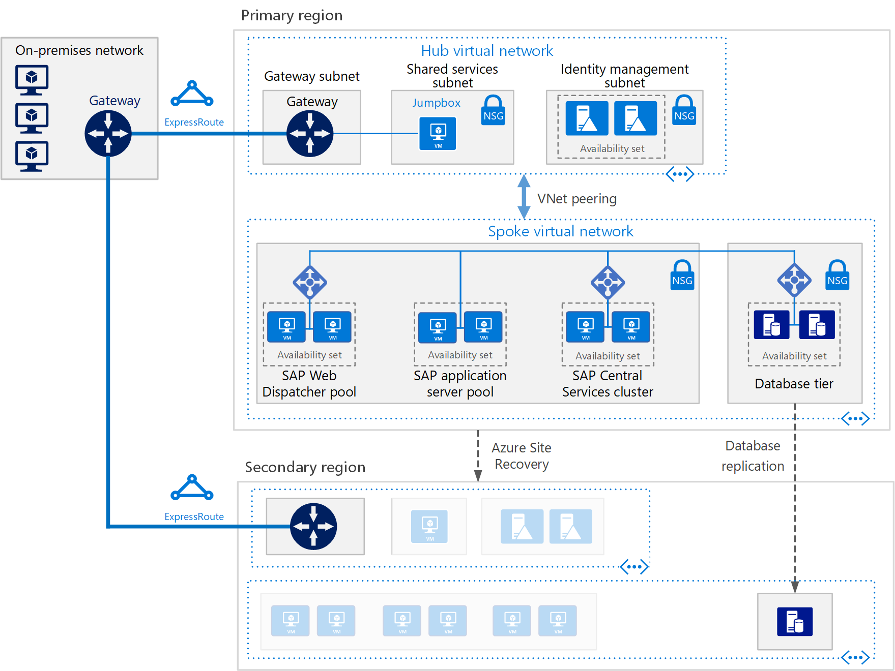

# Deploy SAP NetWeaver (Windows) for AnyDB on Azure virtual machines

This reference architecture shows a set of proven practices for running SAP NetWeaver in a Windows environment on Azure with high availability. The database is AnyDB, the SAP term for any supported DBMS besides SAP HANA. This architecture is deployed with specific virtual machine (VM) sizes that can be changed to accommodate your organization's needs.

*Download a [Visio file][visio-download] of this architecture.*

> [!NOTE]
> Deploying this reference architecture requires appropriate licensing of SAP products and other non-Microsoft technologies.

## Architecture

The architecture consists of the following infrastructure and key software components.

**Virtual network**. The Azure Virtual Network service securely connects Azure resources to each other. In this architecture, the virtual network connects to an on-premises environment through a VPN gateway deployed in the hub of a [hub-spoke](../hybrid-networking/hub-spoke.md). The spoke is the virtual network used for the SAP applications and database tier.

**Subnets**. The virtual network is subdivided into separate subnets for each tier: application (SAP NetWeaver), database, shared services (the jumpbox), and Active Directory.

**Virtual machines**. This architecture uses virtual machines for the application tier and database tier, grouped as follows:

- **SAP NetWeaver**. The application tier uses Windows virtual machines and runs SAP Central Services and SAP application servers. The VMs that run Central Services are configured as a Windows Server Failover Cluster for high availability, supported by SIOS DataKeeper Cluster Edition.
- **AnyDB**. The database tier runs AnyDB as the source database, such as Microsoft SQL Server, Oracle, or IBM DB2.
- **Jumpbox**. Also called a bastion host. This is a secure virtual machine on the network that administrators use to connect to the other virtual machines.
- **Windows Server Active Directory domain controllers**. The domain controllers are used on all VMs and users in the domain.

**Load balancers**. [Azure Load Balancer](/azure/load-balancer/load-balancer-overview) instances are used to distribute traffic to virtual machines in the application tier subnet. At the data tier, high availability may be achieved using built-in SAP load balancers, Azure Load Balancer, or other mechanisms, depending on the DBMS. For more information, see [Azure Virtual Machines DBMS deployment for SAP NetWeaver](/azure/virtual-machines/workloads/sap/dbms-guide).

**Availability sets**. Virtual machines for the SAP Web Dispatcher, SAP application server, and (A)SCS, roles are grouped into separate [availability sets](/azure/virtual-machines/windows/tutorial-availability-sets), and at least two virtual machines are provisioned per role. This makes the virtual machines eligible for a higher [service level agreement](https://azure.microsoft.com/support/legal/sla/virtual-machines) (SLA).

**NICs**. [Network interface cards](/azure/virtual-network/virtual-network-network-interface) (NICs) enable all communication of virtual machines on a virtual network.

**Network security groups**. To restrict incoming, outgoing, and intra-subnet traffic in the virtual network, you can create [network security groups](/azure/virtual-network/virtual-networks-nsg) (NSGs).

**Gateway**. A gateway extends your on-premises network to the Azure virtual network. [ExpressRoute](/azure/architecture/reference-architectures/hybrid-networking/expressroute) is the recommended Azure service for creating private connections that do not go over the public Internet, but a [Site-to-Site](/azure/vpn-gateway/vpn-gateway-howto-site-to-site-resource-manager-portal) connection can also be used.

**Azure Storage**. To provide persistent storage of a virtual machine's virtual hard disk (VHD), [Azure Storage](/azure/storage/storage-standard-storage) is required. It is also used by [Cloud Witness](/windows-server/failover-clustering/deploy-cloud-witness) to implement a failover cluster operation.

## Recommendations

Your requirements might differ from the architecture described here. Use these recommendations as a starting point.

### SAP Web Dispatcher pool

The Web Dispatcher component is used as a load balancer for SAP traffic among the SAP application servers. To achieve high availability for the Web Dispatcher component, Azure Load Balancer is used to implement the parallel Web Dispatcher setup. Web Dispatcher uses in a round-robin configuration for HTTP(S) traffic distribution among the available Web Dispatchers in the balancers pool.

For details about running SAP NetWeaver in Azure VMs, see [Azure Virtual Machines planning and implementation for SAP NetWeaver](/azure/virtual-machines/workloads/sap/planning-guide).

### Application servers pool

To manage logon groups for ABAP application servers, the SMLG transaction is used. It uses the load balancing function within the message server of the Central Services to distribute workload among SAP application servers pool for SAPGUIs and RFC traffic. The application server connection to the highly available Central Services is through the cluster virtual network name.

### SAP Central Services cluster

This reference architecture runs Central Services on VMs in the application tier. The Central Services is a potential single point of failure (SPOF) when deployed to a single VM &mdash; a typical deployment when high availability is not a requirement. To implement a high availability solution, use either a shared disk cluster or a file share cluster.

To configure VMs for a shared disk cluster, use [Windows Server Failover Cluster](https://blogs.sap.com/2018/01/25/how-to-create-sap-resources-in-windows-failover-cluster/). [Cloud Witness](/windows-server/failover-clustering/deploy-cloud-witness) is recommended as a quorum witness. To support the failover cluster environment, [SIOS DataKeeper Cluster Edition](https://azuremarketplace.microsoft.com/marketplace/apps/sios_datakeeper.sios-datakeeper-8) performs the cluster shared volume function by replicating independent disks owned by the cluster nodes. Azure does not natively support shared disks and therefore requires solutions provided by SIOS.

For details, see "3. Important Update for SAP Customers Running ASCS on SIOS on Azure” at [Running SAP applications on the Microsoft platform](https://blogs.msdn.microsoft.com/saponsqlserver/2017/05/04/sap-on-azure-general-update-for-customers-partners-april-2017/).

Another way to handle clustering is to implement a file share cluster using Windows Server Failover Cluster. [SAP](https://blogs.sap.com/2018/03/19/migration-from-a-shared-disk-cluster-to-a-file-share-cluster/) recently modified the Central Services deployment pattern to access the /sapmnt global directories via a UNC path. This change [removes the requirement](https://blogs.msdn.microsoft.com/saponsqlserver/2017/08/10/high-available-ascs-for-windows-on-file-share-shared-disk-no-longer-required/) for SIOS or other shared disk solutions on the Central Services VMs. It is still recommended to ensure that the /sapmnt UNC share is [highly available](https://blogs.sap.com/2017/07/21/how-to-create-a-high-available-sapmnt-share/). This can be done on the Central Services instance by using Windows Server Failover Cluster with [Scale Out File Server](https://blogs.msdn.microsoft.com/saponsqlserver/2017/11/14/file-server-with-sofs-and-s2d-as-an-alternative-to-cluster-shared-disk-for-clustering-of-an-sap-ascs-instance-in-azure-is-generally-available/) (SOFS) and the [Storage Spaces Direct](https://blogs.sap.com/2018/03/07/your-sap-on-azure-part-5-ascs-high-availability-with-storage-spaces-direct/) (S2D) feature in Windows Server 2016.

### Availability sets

Availability sets distribute servers to different physical infrastructure and update groups to improve service availability. Put virtual machines that perform the same role into an availability sets to help guard against downtime caused by Azure infrastructure maintenance and to meet [SLAs](https://azure.microsoft.com/support/legal/sla/virtual-machines) (SLAs). Two or more virtual machines per availability set is recommended.

All virtual machines in a set must perform the same role. Do not mix servers of different roles in the same availability set. For example, don't place a Central Services node in the same availability set with the application server.

### NICs

Traditional on-premises SAP deployments implement multiple network interface cards (NICs) per machine to segregate administrative traffic from business traffic. On Azure, the virtual network is a software-defined network that sends all traffic through the same network fabric. Therefore, the use of multiple NICs is unnecessary. However, if your organization needs to segregate traffic, you can deploy multiple NICs per VM, connect each NIC to a different subnet, and then use NSGs to enforce different access control policies.

### Subnets and NSGs

This architecture subdivides the virtual network address space into subnets. This reference architecture focuses primarily on the application tier subnet. Each subnet can be associated with a NSG that defines the access policies for the subnet. Place application servers on a separate subnet so you can secure them more easily by managing the subnet security policies, not the individual servers.

When a NSG is associated with a subnet, it applies to all the servers within the subnet. For more information about using NSGs for fine-grained control over the servers in a subnet, see [Filter network traffic with network security groups](https://azure.microsoft.com/blog/multiple-vm-nics-and-network-virtual-appliances-in-azure).

### Load balancers

[SAP Web Dispatcher](https://help.sap.com/doc/saphelp_nw73ehp1/7.31.19/en-US/48/8fe37933114e6fe10000000a421937/frameset.htm) handles load balancing of HTTP(S) traffic to a pool of SAP application servers.

For traffic from SAP GUI clients connecting a SAP server via DIAG protocol or Remote Function Calls (RFC), the Central Services message server balances the load through SAP application server [logon groups](https://wiki.scn.sap.com/wiki/display/SI/ABAP+Logon+Group+based+Load+Balancing), so no additional load balancer is needed.

### Azure Storage

For all database server virtual machines, we recommend using Azure Premium Storage for consistent read/write latency. For any single instance virtual machine using Premium Storage for all operating system disks and data disks, see [SLA for Virtual Machines](https://azure.microsoft.com/support/legal/sla/virtual-machines). Also, for production SAP systems, we recommend using Premium [Azure Managed Disks](/azure/storage/storage-managed-disks-overview) in all cases. For reliability, Managed Disks are used to manage the VHD files for the disks. Managed disks ensure that the disks for virtual machines within an availability set are isolated to avoid single points of failure.

For SAP application servers, including the Central Services virtual machines, you can use Azure Standard Storage to reduce cost, because application execution takes place in memory and disks are used for logging only. However, at this time, Standard Storage is only certified for unmanaged storage. Since application servers do not host any data, you can also use the smaller P4 and P6 Premium Storage disks to help minimize cost.

Azure Storage is also used by [Cloud Witness](/windows-server/failover-clustering/deploy-cloud-witness) to maintain quorum with a device in a remote Azure region away from the primary region where the cluster resides.

For the backup data store, we recommend using Azure [cool access tier](/azure/storage/storage-blob-storage-tiers) and [archive access tier storage](/azure/storage/storage-blob-storage-tiers). These storage tiers are cost-effective ways to store long-lived data that is infrequently accessed.

## Performance considerations

SAP application servers carry on constant communications with the database servers. For performance-critical applications running on any database platforms, including SAP HANA, consider enabling [Write Accelerator](/azure/virtual-machines/linux/how-to-enable-write-accelerator) to improve log write latency. To optimize inter-server communications, use the [Accelerated Network](https://azure.microsoft.com/blog/linux-and-windows-networking-performance-enhancements-accelerated-networking/). Note that these accelerators are available only for certain VM series.

To achieve high IOPS and disk bandwidth throughput, the common practices in storage volume [performance optimization](/azure/virtual-machines/windows/premium-storage-performance) apply to Azure storage layout. For example, combining multiple disks together to create a striped disk volume improves IO performance. Enabling the read cache on storage content that changes infrequently enhances the speed of data retrieval.

For SAP on SQL, the [Top 10 Key Considerations for Deploying SAP Applications on Azure](https://blogs.msdn.microsoft.com/saponsqlserver/2015/05/25/top-10-key-considerations-for-deploying-sap-applications-on-azure/) blog offers excellent advice on optimizing Azure storage for SAP workloads on SQL Server.

## Scalability considerations

At the SAP application layer, Azure offers a wide range of virtual machine sizes for scaling up and scaling out. For an inclusive list, see [SAP note 1928533](https://launchpad.support.sap.com/#/notes/1928533) - SAP Applications on Azure: Supported Products and Azure VM Types. (SAP Service Marketplace account required for access). SAP application servers and the Central Services clusters can scale up/down or scale out by adding more instances. The AnyDB database can scale up/down but does not scale out. The SAP database container for AnyDB does not support sharding.

## Availability considerations

Resource redundancy is the general theme in highly available infrastructure solutions. For enterprises that have a less stringent SLA, single-instance Azure VMs offer an uptime SLA. For more information, see [Azure Service Level Agreement](https://azure.microsoft.com/support/legal/sla/).

In this distributed installation of the SAP application, the base installation is replicated to achieve high availability. For each layer of the architecture, the high availability design varies.

### Application tier

High availability for SAP Web Dispatcher is achieved with redundant instances. See [SAP Web Dispatcher](https://help.sap.com/doc/saphelp_nw70ehp2/7.02.16/en-us/48/8fe37933114e6fe10000000a421937/frameset.htm) in the SAP Documentation.

High availability of the Central Services is implemented with Windows Server Failover Cluster. When deployed on Azure, the cluster storage for the failover cluster can be configured using two approaches: either a clustered shared volume or a file share.

Since shared disks are not possible on Azure, SIOS Datakeeper is used to replicate the content of independent disks attached to the cluster nodes and to abstract the drives as a cluster shared volume for the cluster manager. For implementation details, see [Clustering SAP ASCS on Azure](https://blogs.msdn.microsoft.com/saponsqlserver/2015/05/20/clustering-sap-ascs-instance-using-windows-server-failover-cluster-on-microsoft-azure-with-sios-datakeeper-and-azure-internal-load-balancer/).

Another option is to use a file share served up by the [Scale Out File Server](https://blogs.msdn.microsoft.com/saponsqlserver/2017/11/14/file-server-with-sofs-and-s2d-as-an-alternative-to-cluster-shared-disk-for-clustering-of-an-sap-ascs-instance-in-azure-is-generally-available/) (SOFS). SOFS offers resilient file shares you can use as a cluster shared volume for the Windows cluster. A SOFS cluster can be shared among multiple Central Services nodes. As of this writing, SOFS is used only for high availability design, because the SOFS cluster does not extend across regions to provide disaster recovery support.

High availability for the SAP application servers is achieved by load balancing traffic within a pool of application servers.
See [SAP certifications and configurations running on Microsoft Azure](/azure/virtual-machines/workloads/sap/sap-certifications).

### Database tier

This reference architecture assumes the source database is running on AnyDB &mdash; that is, a DBMS such as SQL Server, SAP ASE, IBM DB2, or Oracle. The database tier's native replication feature provides either manual or automatic failover between replicated nodes.

For implementation details about specific database systems, see [Azure Virtual Machines DBMS deployment for SAP NetWeaver](/azure/virtual-machines/workloads/sap/dbms-guide).

## Disaster recovery considerations

For disaster recovery (DR), you must be able to fail over to a secondary region. Each tier uses a different strategy to provide disaster recovery (DR) protection.

- **Application servers tier**. SAP application servers do not contain business data. On Azure, a simple DR strategy is to create SAP application servers in the secondary region, then shut them down. Upon any configuration changes or kernel updates on the primary application server, the same changes must be copied to the virtual machines in the secondary region. For example, the kernel executables copied to the DR virtual machines. For automatic replication of application servers to a secondary region, [Azure Site Recovery](/azure/site-recovery/site-recovery-overview) is the recommended solution.

- **Central Services**. This component of the SAP application stack also does not persist business data. You can build a VM in the disaster recovery region to run the Central Services role. The only content from the primary Central Services node to synchronize is the /sapmnt share content. Also, if configuration changes or kernel updates take place on the primary Central Services servers, they must be repeated on the VM in the disaster recovery region running Central Services. To synchronize the two servers, you can use either Azure Site Recovery to replicate the cluster nodes or simply use a regularly scheduled copy job to copy /sapmnt to the disaster recovery region. For details about this simple replication method's build, copy, and test failover process, download [SAP NetWeaver: Building a Hyper-V and Microsoft Azure–based Disaster Recovery Solution](https://download.microsoft.com/download/9/5/6/956FEDC3-702D-4EFB-A7D3-2DB7505566B6/SAP%20NetWeaver%20-%20Building%20an%20Azure%20based%20Disaster%20Recovery%20Solution%20V1_5%20.docx), and refer to "4.3. SAP SPOF layer (ASCS)."

- **Database tier**. DR is best implemented with the database's own integrated replication technology. In the case of SQL Server, for example, we recommend using AlwaysOn Availability Group to establish a replica in a remote region, replicating transactions asynchronously with manual failover. Asynchronous replication avoids an impact to the performance of interactive workloads at the primary site. Manual failover offers the opportunity for a person to evaluate the DR impact and decide if operating from the DR site is justified.

To use Azure Site Recovery to automatically build out a fully replicated production site of your original, you must run customized [deployment scripts](/azure/site-recovery/site-recovery-runbook-automation). Site Recovery first deploys the VMs in availability sets, then runs scripts to add resources such as load balancers.

## Manageability considerations

Azure provides several functions for [monitoring and diagnostics](/azure/architecture/best-practices/monitoring) of the overall infrastructure. Also, enhanced monitoring of Azure virtual machines is handled by Azure Operations Management Suite (OMS).

To provide SAP-based monitoring of resources and service performance of the SAP infrastructure, the [Azure SAP Enhanced Monitoring](/azure/virtual-machines/workloads/sap/deployment-guide#detailed-tasks-for-sap-software-deployment) extension is used. This extension feeds Azure monitoring statistics into the SAP application for operating system monitoring and DBA Cockpit functions.

## Security considerations

SAP has its own Users Management Engine (UME) to control role-based access and authorization within the SAP application. For details, see [SAP NetWeaver Application Server for ABAP Security Guide](https://help.sap.com/viewer/864321b9b3dd487d94c70f6a007b0397/7.4.19) and [SAP NetWeaver Application Server Java Security Guide](https://help.sap.com/doc/saphelp_snc_uiaddon_10/1.0/en-US/57/d8bfcf38f66f48b95ce1f52b3f5184/frameset.htm).

For additional network security, consider implementing a [network DMZ](../dmz/secure-vnet-dmz.md).

For infrastructure security, data is encrypted in transit and at rest. The "Security considerations” section of the [SAP NetWeaver on Azure Virtual Machines (VMs) – Planning and Implementation Guide](/azure/virtual-machines/workloads/sap/planning-guide) begins to address network security. The guide also specifies the network ports you must open on the firewalls to allow application communication.

To encrypt Windows virtual machine disks, you can use [Azure Disk Encryption](/azure/security/fundamentals/azure-disk-encryption-vms-vmss). It uses the BitLocker feature of Windows to provide volume encryption for the operating system and the data disks. The solution also works with Azure Key Vault to help you control and manage the disk-encryption keys and secrets in your key vault subscription. Data on the virtual machine disks are encrypted at rest in your Azure storage.

## Communities

Communities can answer questions and help you set up a successful deployment. Consider the following:

- [Running SAP Applications on the Microsoft Platform Blog](https://blogs.msdn.microsoft.com/saponsqlserver/2017/05/04/sap-on-azure-general-update-for-customers-partners-april-2017/)
- [Azure Community Support](https://azure.microsoft.com/support/community/)
- [SAP Community](https://www.sap.com/community.html)
- [Stack Overflow](https://stackoverflow.com/tags/sap/)

## Related resources

You may wish to review the following [Azure example scenarios](/azure/architecture/example-scenario) that demonstrate specific solutions using some of the same technologies:

- [Running SAP production workloads using an Oracle Database on Azure](/azure/architecture/example-scenario/apps/sap-production)
- [Dev/test environments for SAP workloads on Azure](/azure/architecture/example-scenario/apps/sap-dev-test)

<!-- links -->

[visio-download]: https://archcenter.blob.core.windows.net/cdn/sap-reference-architectures.vsdx
