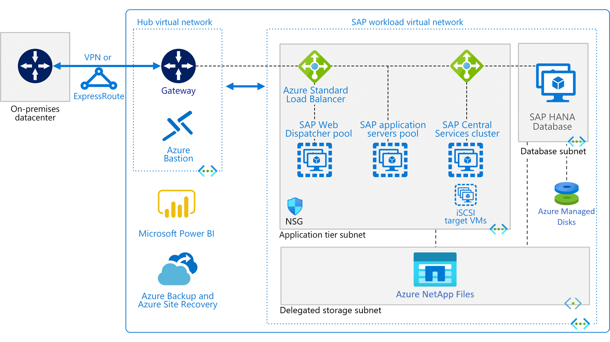

# SAP on Azure Architecture Guide

The SAP on Azure Architecture Guide describes a set of guiding tenets that are used to help ensure the quality of SAP workloads running on Azure. This guide is based on the [Microsoft Azure Well-Architected Framework](../../framework/index.md), but the recommendations are specific to deployments of SAP solutions. A solid architectural foundation starts with five pillars of excellence: cost, DevOps, resiliency, scalability, and security.

Microsoft and SAP work in [partnership](https://blogs.microsoft.com/blog/2019/05/09/microsoft-partners-with-sap-as-the-first-global-cloud-provider-to-launch-project-embrace/) to provide a clear roadmap for organizations that want to innovate in the cloud. Azure supports SAP applications on Linux and Windows across development, test, and production environments. Our customers run SAP deployments of all sizes on Azure—including SAP NetWeaver, SAP S/4HANA, SAP BW/4HANA, SAP BI, and SAP HANA in scale-up and scale-out scenarios.

One way to get started is to run through the [Azure Well-Architected Review](/assessments/?id=azure-architecture-review&mode=pre-assessment).

## Cost

When you move SAP solutions to Azure, you have the opportunity to perform an SAP system rationalization. This assessment takes place at the beginning of your journey to Azure and continues throughout.

System rationalization answers cost-related questions. For example, do you need to move all SAP systems, or can you decommission those which are no longer used? Is it more cost-efficient to refactor certain workloads—or more timely to lift and shift?

To see how Microsoft IT answered these questions, read about how the team decommissioned approximately 60 virtual machines as part of our own [SAP migration to Azure](https://www.microsoft.com/itshowcase/blog/hello-azure-unpacking-microsoft-moved-sap-workload-cloud/).

An efficient approach eliminates waste within your SAP deployment on Azure and helps lower costs and ease operations. For example, after your SAP go-live in Azure, review the sizing. Based on utilization, can you reduce the size of the virtual machines for your SAP landscapes? Can you detach disks that are no longer being used?

Another way to reduce costs is to deallocate or “snooze” virtual machines. If you run your SAP sandbox systems 10 hours a day, Monday through Friday, instead of around the clock every day, you might reduce your costs up to approximately 70 percent in a pay-as-you-go model. When your SAP applications need to run all the time, opt for [Azure Reserved Instances](https://azure.microsoft.com/pricing/reserved-vm-instances/) to also help drive down costs.

Combining virtual machine [pricing options](https://azure.microsoft.com/pricing/details/virtual-machines/sles-sap/)  can also lower costs. For budget predictability, you an use an Azure Reserved Virtual Machine Instance, an advanced purchase for one or three years in a specified region. For low cost and flexibility, you can pay as you go for compute capacity, which requires no long term-commitment.

As a final note, it’s a good practice to review your Azure operations regularly and look for ways to optimize costs. For example, check to see whether a more cost-effective storage option is available or a newer VM series with a better price-to-performance ratio.

### Cost guidance

- Best practices: [How to optimize your cloud investment with Azure Cost Management](/azure/cost-management/cost-mgt-best-practices)

- [Optimize your SAP on Azure cost](https://techcommunity.microsoft.com/t5/running-sap-applications-on-the/optimize-your-sap-on-azure-cost/ba-p/656045)

## DevOps

The DevOps pillar of the SAP on Azure Architecture Guide covers operational and efficiency considerations for deploying any SAP landscapes on Azure and for running SAP solutions in production.

### Automation

To reduce the chance of human error and to improve reliability, SAP deployments in Azure should be automated. Trying to set up the infrastructure manually for individual SAP deployments is not only tedious but also prone to error—and it can take hours or days if multiple SAP installations are required. So, for a predictable, efficient deployment process, it makes sense to automate your Azure infrastructure deployments and SAP software installations as much as possible.

Embracing a DevOps paradigm means using an infrastructure-as-code (IaC) approach to building new SAP environments as needed. IaC is a key consideration in SAP project landscapes.

|Manual deployment pains  | Automated deployment gains |
|---------------------------|----------------------------|
|- Requires specialized knowledge in many domains outside of SAP |- Works immediately and requires little domain knowledge|
|- Takes a lot of time—from one month to many months, depending on the size of the SAP landscape |- Takes from 30 minutes to a couple of hours|
|- Is very expensive |- Provides free resources—like these [SAP HANA templates](https://github.com/Azure/sap-hana) on GitHub|
|- Limits testing—it's harder to inject tests in the process |- Provides templates that include test instrumentation during deployment and migration|
|- Makes it tedious and time-consuming to scale and customize the environment |- Makes it easy to scale up, down, and out, and new deployment templates are available|

### Monitoring

Monitoring and diagnostics are crucial. SAP applications on Azure run in a remote Microsoft datacenter. You give up some control over the infrastructure and, in some cases, the operating system, in exchange for the benefits of cloud services.

For a large application, it's not practical to connect to virtual machines to troubleshoot an issue or sift through log files. In addition, when you use platform as a service (PaaS) on Azure, there may not even be a dedicated virtual machine.

All systems must be observable. Monitoring and diagnostics give insight into a system so that you know when and where failures occur. A best practice is to use a common and consistent logging schema that lets you correlate events across systems.

The monitoring and diagnostics process has several distinct phases:

- **Instrumentation.** Generating the raw data from application logs, web server logs, the diagnostics built into the Azure platform, and other sources

- **Collection and storage.** Consolidating the data into one place

- **Analysis and diagnosis.** Troubleshooting issues and seeing the overall health

- **Visualization and alerts.** Using telemetry data to spot trends or alert your operations team

### DevOps guidance

- [Automating SAP deployments in Microsoft Azure using Terraform and Ansible](https://azure.microsoft.com/blog/automating-sap-deployments-in-microsoft-azure-using-terraform-and-ansible/)

- [Accelerate your SAP on Azure HANA project with SUSE Microsoft Solution Templates](https://azure.microsoft.com/blog/accelerate-your-sap-on-azure-hana-project-with-suse-microsoft-solution-templates)

## Resiliency

The resiliency pillar of the SAP on Azure Architecture Guide refers to the operational stability and business continuity you need to run mission-critical, tier-1 SAP applications. Designing for availability ensures SAP application uptime in the event of localized software or hardware failures.

In production environments, it’s important to guard against a single point of failure. We recommend deploying the virtual machines that run SAP Central Services and databases in [availability sets](/azure/virtual-machines/availability) or [Availability Zones](/azure/virtual-machines/workloads/sap/sap-ha-availability-zones), which help protect applications against planned maintenance events and unplanned
outages.

When applying resiliency to the SAP application servers, we recommend using fewer, smaller servers instead of one larger application server. The practice is to configure the guest operating system’s cluster technologies, such as Windows Failover Cluster or Linux Pacemaker, to help ensure short failover times of the SAP Central Services and database management system (DBMS). To ensure there is no (or minimal) data loss, the best practice is to configure DBMS synchronous or asynchronous replication depending on the scenario.

### Resiliency against data loss

Designing for resiliency means recovering from data loss. That might mean recovering from a logical error on the SAP database, a large-scale disaster, or the loss of a complete Azure region. When designing for recoverability, it is necessary to understand the Recovery Point Objective (RPO) and Recovery Time Objective (RTO) of your SAP application.

### Database resiliency

On the database layer, asynchronous replication can be used to replicate your production data from your primary region to your disaster recovery region. On the SAP application layer, [Azure-to-Azure Site Recovery](/azure/site-recovery/site-recovery-sap) can be used as part of an efficient, cost-conscious disaster recovery solution.

It is essential to carefully consider both availability and recoverability within the design of the SAP deployment architecture. This will protect your business from financial losses resulting in downtime and data loss.

### Resiliency guidance

[Designing reliable Azure applications](../../framework/resiliency/overview.md)

[Design patterns for resiliency](../../patterns/category/resiliency.md)

[Azure Virtual Machines high availability for SAP NetWeaver](/azure/virtual-machines/workloads/sap/sap-high-availability-guide-start)

Best practices:

- [Transient fault handling](../../best-practices/transient-faults.md)

- [Retry guidance for specific services](../../best-practices/retry-service-specific.md)

## Scalability

The scalability pillar of the SAP on Azure Architecture Guide describes performance efficiency and meeting the demands placed on a workload. Users also need high-performing SAP applications so they can work efficiently without frustration. It’s important to undertake a quality sizing exercise for your SAP deployment and to right-size your Azure components—compute, storage, and network.

[SAP Note \#1928533](https://launchpad.support.sap.com/#/notes/1928533) details the [SAPS](https://www.sap.com/about/benchmark/measuring.html) value for the virtual machines that are supported to run SAP applications. (To access this SAP note, an SAP Service Marketplace account is required.) For more information about the network and storage throughput per Azure virtual machine type, see these resources:

- [Sizes for Windows virtual machines in Azure](/azure/virtual-machines/windows/sizes?toc=%2fazure%2fvirtual-n...)

- [Sizes for Linux virtual machines in Azure](/azure/virtual-machines/linux/sizes?toc=%2fazure%2fvirtual-net...)

The agility of Azure allows you to scale your SAP system with ease. For example, you can increase the compute capacity of the database server or scale horizontally by adding application servers when demand arises. You can also temporarily bulk up your infrastructure to accelerate your SAP migration throughput and reduce the downtime.

For the SAP database layer, use Premium Azure Managed Disks to benefit from high-performance and low-latency I/O. You may need to build a RAID-0 stripe to aggregate IOPS and throughput to meet your application needs. For details about storage best practices for SAP HANA workloads, see [SAP HANA infrastructure configurations and operations on Azure](/azure/virtual-machines/workloads/sap/hana-vm-operations).

We recommend using an [Azure ExpressRoute](https://azure.microsoft.com/services/expressroute/) circuit or a virtual private network (VPN) between on-premises resources and Azure. These connections benefit SAP users and the application interfaces that connect to your SAP applications on Azure. For production SAP applications in Azure, we recommend ExpressRoute to create a private, dedicated connection that offers reliability, faster speed, lower latency, and tighter security than site-to-site VPN.

Be mindful of latency-sensitive interfaces between SAP and non-SAP applications. You may need to define *migration move groups*—that is, groups of SAP and non-SAP applications that land on Azure together.

*A common SAP deployment on Azure using a* [hub-spoke](../hybrid-networking/hub-spoke.md)
*network topology.*

### Scalability guidance

Run SAP HANA for Linux virtual machines in a scale-up architecture on Azure

[Design patterns for scalability and performance](../../patterns/category/performance-scalability.md)

Best practices:

- [Autoscaling](../../best-practices/auto-scaling.md)

- [Background jobs](../../best-practices/background-jobs.md)

- [Caching](../../best-practices/caching.md)

- [Content delivery networks](../../best-practices/cdn.md)

- [Data partitioning](../../best-practices/data-partitioning.md)

## Security

Your SAP data is likely the treasure of your organization's technical footprint. Therefore, you need to focus on securing access to your SAP architecture by way of secure authentication, protecting your application and data from network vulnerabilities, and maintaining data integrity through encryption methods.

SAP on Azure is delivered in the infrastructure as a service (IaaS) cloud model. This means security protections are built into the service by Microsoft at the level of the physical datacenter, physical network, physical host, and hypervisor. For the areas above the hypervisor—such as the guest operating system for SAP—you need to carefully evaluate the services and technologies you select to ensure you are providing the proper security controls for your architecture.

For authentication, you can take advantage of [Azure Active Directory](/azure/active-directory/) (Azure AD) to enable single sign-on (SSO) to your [SAP S/4HANA Fiori Launchpad](https://blogs.sap.com/2017/02/20/your-s4hana-environment-part-7-fiori-launchpad-saml-single-sing-on-with-azure-ad/). Azure AD also works with SAP Cloud Platform (SCP) to provide SSO for your SCP services (that also run on Azure).

[Network security groups](/azure/virtual-network/security-overview) (NSGs) allow you to filter network traffic to and from resources in your
[virtual network](/azure/virtual-network/virtual-networks-overview). You can define NSG rules to allow or deny access to your SAP services—for
instance, allowing access to the SAP application ports from on-premises IP addresses ranges and denying public internet access.

With regard to data integrity, [Azure Disk Encryption](/azure/security/azure-security-disk-encryption-faq) helps you encrypt your SAP virtual machine disks. Both the operating system and data volumes can be encrypted at rest in storage.

Azure Disk Encryption works with [Azure Key Vault](/azure/key-vault/key-vault-whatis), a service that controls and manages your encryption keys. Many of our SAP customers choose Azure Disk Encryption for their operating system disks and transparent DBMS data encryption for their SAP database files. This approach promotes the integrity of the operating system and helps ensure that database backups are also encrypted.

### Identity management

Consider using Azure AD to authenticate and authorize users. Azure AD is a fully managed identity and access management service. You can use it to create domains that exist purely on Azure or to integrate with your on-premises Active Directory identities. Azure AD also integrates with Microsoft 365, Dynamics CRM Online, and many software as a service (SaaS) applications from partners.

For consumer-facing applications, Azure Active Directory B2C lets users authenticate with their existing social accounts (such as Facebook, Google, or LinkedIn) or to create a new user account that is managed by Azure AD.

If you want to integrate an on-premises Active Directory environment with an Azure network, several approaches are possible, depending on your requirements. For more information, see the [identity management](../identity/index.md) reference architectures.

### Protecting your infrastructure

Control access to the Azure resources that you deploy. Every Azure subscription has a [trust relationship](/azure/active-directory/active-directory-how-subscriptions-associated-directory) with an Azure AD tenant. Use [role-based access control](/azure/active-directory/role-based-access-control-what-is) (RBAC) to grant users within your organization the correct permissions to Azure resources. Grant access by assigning RBAC roles to users or groups at a certain scope. The scope can be a subscription, a resource group, or a single resource. Make sure to [audit](/azure/azure-resource-manager/resource-group-audit) all changes to infrastructure.

### Application security

In general, the security best practices for application development also apply in the cloud. These include things like using Secure Sockets Layers (SSLs) everywhere, protecting against cross-site request forgery and cross-site scripting (XSS) attacks, and preventing SQL injection attacks.

Cloud applications often use managed services that have access keys. It bears repeating: never check these into source control. Instead, consider storing application secrets in Azure Key Vault.

### Data sovereignty and encryption

Make sure that your data remains in the correct geopolitical zone when using highly available regions in Azure. Azure Storage, like [Azure NetApp Files](/azure/azure-netapp-files/azure-netapp-files-introduction), can provide geo-replication based on the concept of a [paired region](/azure/best-practices-availability-paired-regions) in the same geopolitical zone.

We recommend using Key Vault to safeguard cryptographic keys and secrets. You can use Key Vault to encrypt keys and small secrets, like passwords, that use keys stored in hardware security modules (HSMs). Many storage and database services support data encryption at rest, including [Azure Storage](/azure/storage/storage-service-encryption), [Azure SQL Database](/azure/sql-database/sql-database-always-encrypted-azure-key-vault), [Azure Synapse Analytics](/azure/synapse-analytics/sql-data-warehouse/sql-data-warehouse-overview-what-is), and [Azure Cosmos DB](/azure/cosmos-db/database-security).

### Security resources

- [Azure Security Center](https://azure.microsoft.com/services/security-center) provides integrated security monitoring and policy management across your Azure subscriptions.

- [Azure security documentation](/azure/security)

- [Microsoft Trust Center](https://azure.microsoft.com/support/trust-center)

## Infrastructure

A quality SAP deployment starts with careful planning. The [SAP workloads on Azure: planning and deployment checklist](/azure/virtual-machines/workloads/sap/sap-deployment-checklist) points you in the right direction, with checklists, milestones, and best practices.

If you are moving an existing SAP estate to Azure, the [Migration Methodologies for SAP on Azure](https://azure.microsoft.com/resources/migration-methodologies-for-sap-on-azure/) white paper describes migration options. If your SAP application has a significant database footprint, refer to the [Very Large Database Migration to Azure](https://techcommunity.microsoft.com/t5/Running-SAP-Applications-on-the/Very-Large-Database-Migration-to-Azure-8211-Recommendations/ba-p/368146) blog post.

The following scenarios outline a few of the common ways SAP solutions are built on an Azure infrastructure.

<ul class="columns is-multiline has-margin-left-none has-margin-bottom-none has-padding-top-medium">
    <li class="column is-one-third has-padding-top-small-mobile has-padding-bottom-small">
        <a class="is-undecorated is-full-height is-block"
            href="/azure/architecture/reference-architectures/sap/hana-large-instances">
            <article class="card has-outline-hover is-relative is-fullheight">
                    <figure class="image has-margin-right-none has-margin-left-none has-margin-top-none has-margin-bottom-none">
                        
                    </figure>
                

                    

                        <h3 class="is-size-4 has-margin-top-none has-margin-bottom-none has-text-primary">Run SAP HANA on Azure (Large Instances)</h3>
                    

                    

                        
Proven practices for running SAP HANA in a high availability environment on Azure (Large Instances).

                    

                

            </article>
        </a>
    </li>
    <li class="column is-one-third has-padding-top-small-mobile has-padding-bottom-small">
        <a class="is-undecorated is-full-height is-block"
            href="/azure/architecture/reference-architectures/sap/sap-netweaver">
            <article class="card has-outline-hover is-relative is-fullheight">
                    <figure class="image has-margin-right-none has-margin-left-none has-margin-top-none has-margin-bottom-none">
                        
                    </figure>
                

                    

                        <h3 class="is-size-4 has-margin-top-none has-margin-bottom-none has-text-primary">Run SAP NetWeaver in Windows on Azure</h3>
                    

                    

                        
Proven practices for running SAP NetWeaver in a Windows environment on Azure with high availability.

                    

                

            </article>
        </a>
    </li>
    <li class="column is-one-third has-padding-top-small-mobile has-padding-bottom-small">
        <a class="is-undecorated is-full-height is-block"
            href="/azure/architecture/reference-architectures/sap/sap-s4hana">
            <article class="card has-outline-hover is-relative is-fullheight">
                    <figure class="image has-margin-right-none has-margin-left-none has-margin-top-none has-margin-bottom-none">
                        
                    </figure>
                

                    

                        <h3 class="is-size-4 has-margin-top-none has-margin-bottom-none has-text-primary">SAP /4HANA in Linux on Azure</h3>
                    

                    

                        
Proven practices for running SAP S/4HANA in a Linux environment on Azure with high availability.

                    

                

            </article>
        </a>
    </li>
</ul>

<ul class="columns is-multiline has-margin-left-none has-margin-bottom-none has-padding-top-medium">
    <li class="column is-one-third has-padding-top-small-mobile has-padding-bottom-small">
        <a class="is-undecorated is-full-height is-block"
            href="/azure/architecture/reference-architectures/sap/run-sap-hana-for-Linux-virtual-machines">
            <article class="card has-outline-hover is-relative is-fullheight">
                    <figure class="image has-margin-right-none has-margin-left-none has-margin-top-none has-margin-bottom-none">
                        
                    </figure>
                

                    

                        <h3 class="is-size-4 has-margin-top-none has-margin-bottom-none has-text-primary">Run SAP HANA on Linux virtual machines in a scale-up architecture on Azure</h3>
                    

                    

                        
Proven practices for running SAP HANA in a high-availability, scale-up environment that supports disaster recovery on Azure.

                    

                

            </article>
        </a>
    </li>
    <li class="column is-one-third has-padding-top-small-mobile has-padding-bottom-small">
        <a class="is-undecorated is-full-height is-block"
            href="/azure/architecture/reference-architectures/sap/run-sap-bw4hana-with-Linux-virtual-machines">
            <article class="card has-outline-hover is-relative is-fullheight">
                    <figure class="image has-margin-right-none has-margin-left-none has-margin-top-none has-margin-bottom-none">
                        
                    </figure>
                

                    

                        <h3 class="is-size-4 has-margin-top-none has-margin-bottom-none has-text-primary">Run SAP BW/4HANA with Linux virtual machines on Azure</h3>
                    

                    

                        
This example focuses specifically on the SAP BW/4HANA application tier and is suitable for a small-scale production environment of SAP BW/4HANA on Azure where high availability is a priority.

                    

                

            </article>
        </a>
    </li>
</ul>

## GitHub resources

The SAP community provides many free templates to help you get started. Although not officially supported by Microsoft, they can help jump-start your automation process. For example:

- [Automated SAP deployments in Azure](https://github.com/Azure/sap-hana)

- [SAP NetWeaver 3-tier (managed disk)](https://azure.microsoft.com/resources/templates/sap-3-tier-marketplace-image-md/)

## Next steps

The following resources can help you get started:

- [Use Azure to host and run SAP workload scenarios](/azure/virtual-machines/workloads/sap/get-started)

- [Azure Virtual Machines planning and implementation for SAP NetWeaver](/azure/virtual-machines/workloads/sap/planning-guide)

- [Migration Methodologies for SAP on Azure](https://azure.microsoft.com/resources/migration-methodologies-for-sap-on-azure/)

- [SAP workloads on Azure: planning and deployment checklist](/azure/virtual-machines/workloads/sap/sap-deployment-checklist)