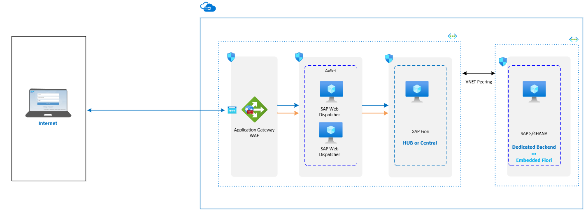

<!-- cSpell:ignore lbrader HANA Fiori -->

This reference architecture shows a set of proven practices for running S/4HANA and Suite on HANA in a high availability environment that supports disaster recovery on Azure. The Fiori information applies only to S/4HANA applications.

*Download a [Visio file][visio-download] of this architecture.*

> [!NOTE]
> Deploying this reference architecture requires appropriate licensing of SAP products and other non-Microsoft technologies.

## Architecture

This reference architecture describes a common production system. This architecture is deployed with virtual machine sizes that can be changed to accommodate your organization's needs. To suit your business needs, this configuration can be reduced to a single virtual machine.

The network layout is greatly simplified to demonstrate architectural principals and is not intended to describe a full enterprise network.

The following components are required.

**Azure Virtual Network.** The [Azure Virtual Network](/azure/virtual-network/virtual-networks-overview) (VNet) service securely connects Azure resources to each other. In this architecture, a VNet connects to an on-premises environment through a gateway deployed in the hub of a [hub-spoke topology](../../reference-architectures/hybrid-networking/hub-spoke.yml). The spoke is the VNet used for the SAP applications and the database tiers.

**Virtual network peering.** This architecture uses multiple virtual networks that are [peered together](/azure/virtual-network/virtual-network-peering-overview). This topology offers network segmentation and isolation for services deployed on Azure. Peering connects networks transparently through the Microsoft backbone network and does not incur a performance penalty if implemented within a single region. Separate subnets are used for each tier-application (SAP NetWeaver), database, and shared services (such as the jumpbox and Active Directory).

**Virtual machines.** This architecture uses virtual machines running Linux for the application tier and database tier, grouped as follows:

- **Application tier.** Includes the Fiori Front-end Server pool, SAP Web Dispatcher pool, application server pool, and SAP Central Services cluster. For high availability of Central Services on Azure running in Linux virtual machines, a highly available network file share service is required, such as [Azure NetApp Files](/azure/virtual-machines/workloads/sap/high-availability-guide-suse-netapp-files), clustered Network File Shares (NFS) servers, or SIOS DataKeeper. To set up a highly available file share for the Central Services cluster on Red Hat Enterprise Linux, [GlusterFS](/azure/virtual-machines/workloads/sap/high-availability-guide-rhel-glusterfs) can be configured on Azure virtual machines running Red Hat Enterprise Linux. On SUSE Linux Enterprise Server 15 SP1 and later versions or SUSE Linux Enterprise Server for SAP Applications, you can use [Azure Shared Disks](/azure/virtual-machines/disks-shared#linux) on a Pacemaker cluster to achieve high availability.

- **SAP HANA.** The database tier uses two or more Linux virtual machines in a cluster to achieve high availability in a scale-up deployment. HANA System Replication (HSR) is used to replicate contents between primary and secondary HANA systems. Linux clustering is used to detect system failures and facilitate automatic failover. A storage-based or cloud-based fencing mechanism must be used to ensure the failed system is isolated or shut down to avoid the cluster split-brain condition. In HANA scale-out deployments, database high availability is achieved by configuring standby nodes without the need of the Linux clustering component.

- **Jumpbox.** Also called a bastion host, this secure virtual machine on the network is used to connect to the other virtual machines and is typically deployed as part of the shared services, such as domain controllers and backup services. The jumpbox is deployed on a virtual machine to support SAP HANA Studio, SAPGUI, file transfer, and other functions that are commonly used for installation and administration purposes. For remote desktop protocol (RDP) or secure shell (SSH) services, try [Azure Bastion](/azure/bastion/bastion-overview). If only RDP and SSH are used for administration, Azure Bastion is a great alternative.

**Load balancers.** To distribute traffic to virtual machines in the application-tier subnet, [load balancers](/azure/load-balancer/) are used. When using Azure Zones, use the Standard Load Balancer. It's important to highlight that the Standard Load Balancer is secure by default, and no virtual machines behind the Standard Load Balancer will have outbound internet connectivity. To enable outbound internet in the virtual machines, you must consider your [Standard Load Balancer](/azure/virtual-machines/workloads/sap/high-availability-guide-standard-load-balancer-outbound-connections) configuration. For high availability, use the built-in SAP Web Dispatcher, [Azure Load Balancer](/azure/load-balancer/load-balancer-overview), or another mechanism, depending on the traffic type (such as HTTP or SAP GUI) or the required network services (such as Secure Sockets Layer (SSL) termination).

**Availability sets.** Virtual machines for all pools and clusters (Web Dispatcher, SAP application servers, Central Services, and HANA) are grouped into separate [availability sets](/azure/virtual-machines/windows/tutorial-availability-sets), and at least two virtual machines are provisioned per role. Availability sets increase the availability of applications and virtual machines through management of hosts system faults or maintenance events by distributing role instances onto multiple hosts. An alternative is to use [Availability Zones](/azure/virtual-machines/workloads/sap/sap-ha-availability-zones) to improve workload availability as described later in this article.

**Zone-redundant gateway.** Azure ExpressRoute or virtual private network (VPN) gateways can be deployed across zones to guard against zone failures. This architecture uses [zone-redundant](/azure/vpn-gateway/about-zone-redundant-vnet-gateways) VNet gateways for resiliency rather than a zonal deployment based on the same Availability Zone.

**Proximity placement group.** This logical group places a constraint on VMs deployed in an availability set or a Virtual Machine Scale Set. A [proximity placement group](https://azure.microsoft.com/blog/introducing-proximity-placement-groups/) favors colocation, meaning that virtual machines reside in the same datacenter to minimize application latency.

**Network security groups.** To restrict incoming, outgoing, and intra-subnet traffic in the virtual network, you can create [network security groups](/azure/virtual-network/security-overview) (NSGs).

**Application security groups.** To define fine-grained network security policies based on workloads and centered on applications, use [application security groups](/azure/virtual-network/security-overview#application-security-groups) instead of explicit IP addresses. You can group virtual machines by name and secure applications by filtering traffic from trusted segments of your network.

**Gateway.** A gateway connects distinct networks, extending your on-premises network to the Azure VNet.
[ExpressRoute](../../reference-architectures/hybrid-networking/expressroute.yml) is the recommended Azure service for creating private connections that do not go over the public internet, but a
[site-to-site](../../reference-architectures/hybrid-networking/vpn.yml) connection can also be used. To reduce latency,
[ExpressRoute Global Reach](/azure/expressroute/expressroute-global-reach) and [ExpressRoute FastPath](/azure/expressroute/about-fastpath) are connectivity options discussed later in this article.

**Azure Storage.** To provide data persistence for a virtual machine in the form of virtual hard disk (VHD). [Azure Managed Disk](/azure/virtual-machines/windows/managed-disks-overview) is recommended.

## Recommendations

This architecture describes a small, production-level deployment. Your deployment will differ based on your business requirements, so consider these recommendations as a starting point.

### Virtual machines

In application server pools and clusters, adjust the number of virtual machines based on your requirements. The [Azure Virtual Machines planning and implementation guide](/azure/virtual-machines/workloads/sap/planning-guide) includes details about running SAP NetWeaver on virtual machines, and this information also applies to SAP S/4HANA deployment.

For details about SAP support for Azure virtual machine types and throughput metrics (SAPS), see [SAP Note 1928533](https://launchpad.support.sap.com/#/notes/1928533). (To access the SAP notes, you must have an SAP Service Marketplace account.) The [SAP Certified and Supported SAP HANA Hardware Directory](https://www.sap.com/dmc/exp/2014-09-02-hana-hardware/enEN/iaas.html#categories=Microsoft%20Azure) has a list of certified Azure virtual machines for the HANA database.

### SAP Web Dispatcher

The Web Dispatcher component is used as a load balancer for SAP traffic among the SAP application servers. To achieve [high availability of the SAP Web Dispatcher](https://help.sap.com/doc/saphelp_nw73ehp1/7.31.19/en-US/48/9a9a6b48c673e8e10000000a42189b/frameset.htm), Azure Load Balancer implements either the failover cluster or the parallel Web Dispatcher setup. For internet facing communications a stand-alone solution in DMZ would be the recommended architecture to satisfy security concerns. [Embedded Web Dispatcher on ASCS](https://help.sap.com/viewer/00b4e4853ef3494da20ebcaceb181d5e/LATEST/en-US/2e708e2d42134b4baabdfeae953b24c5.html) is a special option, proper sizing due to additional workload on ASCS should be taken into account.

### Fiori Front-end Server (FES)

This architecture addresses broad base requirements and assumes that the Embedded Fiori FES model is used. All the technology components are installed on the S/4 system itself, meaning that each S/4 system has its own Fiori Launchpad. The high availability setup for this deployment model is that of the S/4 system-no additional clustering or virtual machines are required. That's why the architecture diagram does not show the FES component.

[SAP Fiori Deployment Options and System Landscape Recommendations](https://www.sap.com/documents/2018/02/f0148939-f27c-0010-82c7-eda71af511fa.html) document describes the primary deployment options-either embedded or hub, depending on the scenarios. In achieving simplification and performance, the software releases between the Fiori technology components and the S/4 applications are tightly coupled, making a hub deployment fitting for only a few, narrow use cases.

If you use the FES hub deployment, the FES is an add-on component to the classic SAP NetWeaver ABAP stack. Set up high availability in the same way you protect a three-tier ABAP application stack with clustered or multi-host capability-with a standby server database layer, clustered ASCS layer with high availability NFS for shared storage, and at least two application servers. Traffic is load-balanced via a pair of either clustered or parallel Web Dispatchers. For internet facing Fiori apps a [FES hub deployment](https://blogs.sap.com/2017/12/15/considerations-and-recommendations-for-internet-facing-fiori-apps/) in DMZ would be recommended. Use [Azure Application Gateway/WAF](/azure/application-gateway/) as a critical component to defense traffic with [Azure AD with SAML](/azure/active-directory/saas-apps/sap-netweaver-tutorial) for user authentication and SSO for [SAP Fiori](/azure/active-directory/saas-apps/sap-fiori-tutorial).

### Application servers pool

To manage logon groups for ABAP application servers, it's common to use the SMLG transaction to load-balance logon users, SM61 for batch server groups, RZ12 for RFC groups, and so on. These transactions use the load-balancing capability within the message server of the Central Services to distribute incoming sessions or workload among SAP application servers pool for SAPGUIs and RFC traffic.

### SAP Central Services cluster

Central Services can be deployed to a single virtual machine when the Azure single-instance VM availability SLA meets your requirement. However, the virtual machine becomes a potential single point of failure (SPOF) for the SAP environment. For a [highly available Central Services deployment](/azure/virtual-machines/workloads/sap/high-availability-guide-suse-netapp-files), the Azure NetApp Files service and a Central Services cluster are used.

Another option is to use [Azure Shared Disks](/azure/virtual-machines/disks-shared) to achieve high availability. On SUSE Linux Enterprise Server 15 SP1 and later or SUSE Linux Enterprise Server for SAP Applications, you can set up a Pacemaker cluster by using [Azure Shared Disks for Linux](/azure/virtual-machines/disks-shared#linux).

Alternately, an NFS file share can be used for the [Linux cluster shared storage](/azure/virtual-machines/workloads/sap/high-availability-guide-suse-netapp-files).

On an Azure deployment, the application servers connect to the highly available Central Services through the virtual host names of the Central Services or ERS services. These host names are assigned to the cluster frontend IP configuration of the load balancer. An Azure Load Balancer supports multiple frontend IPs, so both the Central Services and ERS virtual IPs (VIPs) can be bound to one load balancer.

Linux cluster support for [ASCS multi-SIDs installation](/azure/virtual-machines/workloads/sap/high-availability-guide-suse-multi-sid) on Azure is now supported. Fewer clusters help to simplify the SAP landscape.

### Availability sets

Availability sets distribute servers to different physical infrastructure and update groups to improve service availability. Put virtual machines that perform the same role into an availability set to help guard against downtime caused by Azure infrastructure maintenance and to meet service-level agreements ([SLAs](https://azure.microsoft.com/support/legal/sla/virtual-machines)). Two or more virtual machines per availability set are required to get the higher SLA.

All virtual machines in a set must perform the same role. Do not mix servers of different roles in the same availability set. For example, don't place an ASCS node in the same availability set with application servers.

You can deploy Azure availability sets within [Azure Availability Zones](/azure/virtual-machines/workloads/sap/sap-ha-availability-zones) when you use a [proximity placement group](/azure/virtual-machines/linux/co-location).

### Networking

This architecture uses a hub-spoke topology, where the hub VNet acts as a central point of connectivity to an on-premises network. The spokes are VNets that peer with the hub, and they can be used to isolate workloads. Traffic flows between the on-premises datacenter and the hub through a gateway connection.

### Network interface cards (NICs)

Traditional on-premises SAP deployments implement multiple NICs per machine to segregate administrative traffic from business traffic. On Azure, the VNet is a software-defined network that sends all traffic through the same network fabric. Therefore, the use of multiple NICs is unnecessary for performance considerations. However, if your organization needs to segregate traffic, you can deploy multiple NICs per virtual machine, connect each NIC to a different subnet, and then use NSGs to enforce different access control policies.

Azure NICs support multiple IPs, which supports the SAP recommended practice of using virtual host names for installations as outlined in [SAP note
962955](https://launchpad.support.sap.com/#/notes/962955). (To access the SAP notes, you must have an SAP Service Marketplace account.)

### Subnets and NSGs

This architecture subdivides the VNet address space into subnets. Each subnet can be associated with an NSG that defines the access policies for the subnet. Place application servers on a separate subnet so you can secure them more easily by managing the subnet security policies, rather than the individual servers.

When associated with a subnet, an NSG applies to all the servers within the subnet and offers fine-grained control over the servers. Set them up using the [portal](/azure/virtual-network/tutorial-filter-network-traffic), [PowerShell](/azure/virtual-network/tutorial-filter-network-traffic-powershell), or [Azure CLI](/azure/virtual-network/tutorial-filter-network-traffic-cli).

### ExpressRoute Global Reach

If your network environment includes two or more ExpressRoute circuits, an option to reduce network hops and lower latency is to use [ExpressRoute Global Reach](/azure/expressroute/expressroute-global-reach). This is a Border Gateway Protocol (BGP) route peering setup between two or more ExpressRoute circuits for bridging two ExpressRoute routing domains. Global Reach lowers latency when network traffic traverses more than one ExpressRoute circuit and is currently available only for private peering on ExpressRoute circuits.

At this time, there are no network access control list (ACLs) or other attributes that can be changed in Global Reach, which means that all routes learned by a given ExpressRoute circuit (from on-premises and Azure) are advertised across the circuit peering to the other ExpressRoute circuit. It is recommended to establish network traffic filtering on-premises to restrict access to resources.

### ExpressRoute FastPath

Also known as Microsoft Edge Exchange (MSEE) v2, [FastPath](/azure/expressroute/about-fastpath) implements MSEE at the entry point of the Azure network. It reduces network hops for most data packets. FastPath lowers network latency, improves application performance, and is the default for new ExpressRoute connections to Azure.

For existing ExpressRoute circuits, activate FastPath with Azure support.

FastPath does not support VNet peering. If you have other VNets peered with the one that is connected to ExpressRoute, the network traffic from your on-premises network to the other spoke VNets will continue to be sent to the VNet gateway. The workaround is to connect all the VNets to the ExpressRoute circuit directly.

### Load balancers

The [SAP Web Dispatcher](https://help.sap.com/doc/saphelp_nw73ehp1/7.31.19/en-US/48/8fe37933114e6fe10000000a421937/frameset.htm) handles load balancing of HTTP(S) traffic to a pool of SAP application servers. This software load balancer offers application layer services (referred to as layer 7 in the ISO networking model) capable of SSL termination and other offloading functions.

[Azure Load Balancer](https://azure.microsoft.com/blog/azure-load-balancer-new-distribution-mode/) is a network transmission layer service (layer 4), which balances traffic by a 5-tuples hash from the data streams (based on source IP, source port, destination IP, destination port, and protocol type). It's used in cluster setups to direct traffic to the primary service instance or the healthy node in case of a fault. We recommend using [Azure Standard Load Balancer](/azure/load-balancer/load-balancer-standard-overview) for all SAP scenarios. It's important to highlight that the Standard Load Balancer is secure by default, and no virtual machines behind the Standard Load Balancer will have outbound internet connectivity. To enable outbound internet in the virtual machines, you must consider your [Standard Load Balancer](/azure/virtual-machines/workloads/sap/high-availability-guide-standard-load-balancer-outbound-connections) configuration.

For traffic from SAP GUI clients connecting an SAP server via DIAG protocol or Remote Function Calls (RFC), the Central Services message server balances the load through SAP application server [logon groups](https://wiki.scn.sap.com/wiki/display/SI/ABAP+Logon+Group+based+Load+Balancing). No additional load balancer is needed.

### Azure Storage

Some customers use standard storage for their application servers. Because standard managed disks are not supported, as stated in SAP note 1928533, we recommend using Premium [Azure Managed Disks](/azure/storage/storage-managed-disks-overview) or [Azure NetApp Files](/azure/azure-netapp-files/azure-netapp-files-introduction) in all cases. Note that a recent update to [SAP note 2015553](https://launchpad.support.sap.com/#/notes/2015553) excludes the use of Standard HDD Storage and Standard SSD Storage for a few specific use cases.

Because application servers do not host any business data, you can also use the smaller P4 and P6 Premium disks to help minimize cost and benefit from the
[single instance VM SLA](https://azure.microsoft.com/support/legal/sla/virtual-machines/v1_6/) in case of a central SAP stack installation.

For High-Availability scenarios [Azure Shared Disks](/azure/virtual-machines/disks-shared) features are available on Premium SSD and Ultra SSD [Azure Managed Disks](/azure/storage/storage-managed-disks-overview). Azure Shared Disks can be used with Windows Server, SUSE Enterprise Linux 15 SP 1 and above, or SUSE Enterprise Linux For SAP. 
Azure NetApp Files has file sharing functionality built in.

For NFS Share scenarios, [Azure NetApp Files](/azure/virtual-machines/workloads/sap/hana-vm-operations-netapp) provides 99.99% availability (four nines) for NFS shares that can be used for /hana/shared, /hana/data, and /hana/log volumes. Using Azure NetApp Files-based NFS shares for the /hana/data and /hana/log volumes requires the usage of the NFS v4.1 protocol. For the /hana/shared volume the NFS v3 protocol is supported.

Azure Storage and Azure NetApp Files both use [Cloud Witness](/windows-server/failover-clustering/deploy-cloud-witness) to maintain quorum in the pacemaker cluster with a device in the same Azure region.

For the backup data store, we recommend using Azure [cool and archive access tiers](/azure/storage/blobs/access-tiers-overview). These storage tiers are cost-effective ways to store long-lived data that is infrequently accessed. You can also consider using [Azure NetApp Files Standard tier](/azure/azure-netapp-files/azure-netapp-files-service-levels#supported-service-levels) as a backup target or [Azure NetApp Files Backup option](/azure/azure-netapp-files/backup-introduction). For Managed disk the recommended backup data tier is the Azure cool or archive access tier.

Both [Ultra SSDs](/azure/virtual-machines/linux/disks-enable-ultra-ssd) and Azure NetApp Files [Ultra performance tier](/azure/azure-netapp-files/azure-netapp-files-service-levels) greatly reduce disk latency and benefit performance-critical applications and the SAP database servers.

## Performance considerations

SAP application servers carry on constant communications with the database servers. For performance-critical applications running on any database platforms, including SAP HANA, enable [Write Accelerator](/azure/virtual-machines/windows/how-to-enable-write-accelerator) (WA) for the log volume to improve log write latency. WA is available for M-series VMs.

To optimize inter-server communications, use [Accelerated Networking](https://azure.microsoft.com/blog/linux-and-windows-networking-performance-enhancements-accelerated-networking/). This option is available only for supported virtual machines, including D/DSv2, D/DSv3, E/ESv3, F/FS, FSv2, and Ms/Mms.

For details about SAP HANA performance requirements, see [SAP note 1943937 - Hardware Configuration Check Tool](https://launchpad.support.sap.com/#/notes/1943937) (SAP Service Marketplace account required for access).

To achieve high IOPS and disk bandwidth throughput, the common practices in storage volume [performance optimization](/azure/virtual-machines/linux/premium-storage-performance) apply to Azure storage layout. For example, combining multiple disks together to create a striped disk volume improves IO performance. Enabling the read cache on storage content that changes infrequently enhances the speed of data retrieval. See also recommendations about [storage configurations](/azure/virtual-machines/workloads/sap/hana-vm-operations-storage) for various virtual machine sizes when running SAP HANA.

[Ultra disk](/azure/virtual-machines/linux/disks-enable-ultra-ssd) is a new generation of storage to meet intensive IOPS and the transfer bandwidth demands of applications such as SAP HANA. You can dynamically change the performance of ultra disks and independently configure metrics like IOPS and MB/s without rebooting your virtual machine. When available, Ultra SSD is recommended in place of WA.

Some SAP applications require frequent communication with the database. Network latency between the application and database layers, due to proximity distance, can adversely impact application performance. Azure [proximity placement groups](/azure/virtual-machines/workloads/sap/sap-proximity-placement-scenarios) set a placement constraint for virtual machines deployed in availability sets. Within the logical construct of a group, colocation and performance are favored over scalability, availability, and cost. Proximity placement groups can greatly improve the user experience for most SAP applications, and [scripts and utilities](https://github.com/msftphleiten/proximity-placement-groups) are available on GitHub.

We advise against the placement of any network virtual appliance (NVA) in between the application and the database layers for any SAP application stack, because this practice introduces significant data packets processing time and unacceptably slows application performance.

We also recommend you consider performance when deploying resources with
[Availability Zones](/azure/virtual-machines/workloads/sap/sap-ha-availability-zones), which can enhance service availability as described later in this article. Consider creating a clear network latency profile between all zones of a target region. This helps you decide on the resource placement for minimum latency between zones. To create this profile, run a test by deploying small virtual machines in each zone. Recommended tools for the test include
[PsPing](/sysinternals/downloads/psping) and
[Iperf](https://sourceforge.net/projects/iperf/). After testing, remove these virtual machines. The [public domain network latency test tool](https://github.com/Azure/SAP-on-Azure-Scripts-and-Utilities/tree/master/AvZone-Latency-Test) is also available for your convenience.

Azure NetApp Files has unique performance features that allow for real time tuning that meet the needs of the most demanding SAP environments.  For performance considerations using Azure NetApp Files see [this article](/azure/virtual-machines/workloads/sap/sap-hana-scale-out-standby-netapp-files-suse#sizing-for-hana-database-on-azure-netapp-files).

## Scalability considerations

At the SAP application layer, Azure offers a wide range of virtual machine sizes for scaling up and scaling out. For an inclusive list, see [SAP Note
1928533](https://launchpad.support.sap.com/#/notes/1928533) - SAP Applications on Azure: Supported Products and Azure VM types (SAP Service Marketplace account required for access). As we continue to certify more virtual machines types, you can scale up or down in the same cloud deployment.

At the database layer, this architecture runs SAP HANA S/4 applications on Azure virtual machines that can scale up to 6 terabytes (TB) in one instance. If your workload exceeds the maximum virtual machine size, Microsoft offers [Azure Large Instances](/azure/virtual-machines/workloads/sap/hana-overview-architecture) for SAP HANA, an option that far exceeds the 12 TB RAM cap. Rev. 4 of these physical servers are located in a Microsoft Azure datacenter and, as of this writing, provide up to 24 TB of memory capacity for a single instance. A multi-node configuration is also possible with a total memory capacity of up to 24 TB for online transaction processing (OLTP) applications and 60 TB for online analytical processing (OLAP) applications.

## Availability considerations

Resource redundancy is the general theme in highly available infrastructure solutions. For enterprises that have a less stringent SLA, single-instance Azure virtual machines with premium disks offer an [uptime SLA](https://buildazure.com/2016/11/24/single-instance-vms-now-with-99-9-sla/). When redundant resources are deployed in an availability set or across Availability Zones, the service availability is elevated.

In this distributed installation of the SAP application, the base installation is replicated to achieve high availability. For each layer of the architecture, the high availability design varies.

### Web Dispatcher in the application servers tier

High availability is achieved with redundant Web Dispatcher instances. See the [SAP Web Dispatcher](https://help.sap.com/doc/saphelp_nw73ehp1/7.31.19/en-US/48/8fe37933114e6fe10000000a421937/frameset.htm) in the SAP documentation.

### Central Services in the application servers tier

For high availability of Central Services on Azure Linux virtual machines, the appropriate high availability extension for the selected Linux distribution is used, and the shared file systems are placed on highly available NFS storage, using SUSE DRDB or Red Hat GlusterFS. [Azure NetApp Files](/azure/virtual-machines/workloads/sap/high-availability-guide-suse-netapp-files) can also be used to provide a highly available NFS, eliminating the need for a NFS cluster, and it can host the SAP HANA data and log files, which enables the
[HANA scale-out](/azure/virtual-machines/workloads/sap/sap-hana-scale-out-standby-netapp-files-suse) deployment model with standby nodes.

Azure NetApp Files also supports high availability of [ASCS on SUSE](/azure/virtual-machines/workloads/sap/high-availability-guide-suse-netapp-files) Linux Enterprise Servers (SLES). For ASCS on Red Hat Enterprise Linux (RHEL) HA, see the [SIOS DataKeeper](https://us.sios.com/solutions/sap-high-availability/) information for details. The improved Azure Fence Agent is available for both
[SUSE](/azure/virtual-machines/workloads/sap/high-availability-guide-suse-pacemaker) and [Red Hat](/azure/virtual-machines/workloads/sap/high-availability-guide-rhel-pacemaker) and provides significantly faster service failover compared to the previous version of the agent.

Other option is to use [Azure Shared Disks](/azure/virtual-machines/disks-shared) to achieve high availability. On SUSE Enterprise Linux 15 SP 1 and above, or SUSE Enterprise Linux For SAP, Pacemaker cluster can be set up using [Azure Shared Disk](/azure/virtual-machines/disks-shared#linux) to achieve high availability.

With the introduction of the Standard Azure Load Balancer SKU, you can now simply enable the [high availability port](/azure/load-balancer/load-balancer-ha-ports-overview) and avoid the need to configure load balancing rules for many SAP ports. Also, in setting up load balancers in general, whether it's on-premises or on Azure, enabling the Direct Server Return (also known as Floating IP or DSR) feature allows for server responses to client inquiries to bypass the load balancer. This direct connection keeps the load balancer from becoming the bottleneck in the path of data transmission. For the SAP ASCS and HANA DB clusters, we recommend enabling DSR. If virtual machines in the backend pool require public outbound connectivity, additional
[configuration](/azure/virtual-machines/workloads/sap/high-availability-guide-standard-load-balancer-outbound-connections) is required.

For traffic from SAP GUI clients connecting to an SAP server via DIAG protocol or RFC, the Central Services message server balances the load through SAP application server [logon groups](https://wiki.scn.sap.com/wiki/display/SI/ABAP+Logon+Group+based+Load+Balancing). No additional load balancer is needed.

### Application servers in the application servers tier

High availability is achieved by load balancing traffic within a pool of application servers.

### Database tier

This reference architecture depicts a highly available SAP HANA database system consisting of two Azure virtual machines. The database tier's native system replication feature provides either manual or automatic failover between replicated nodes:

- For manual failover, deploy more than one HANA instance and use HANA System Replication (HSR).

- For automatic failover, use both HSR and Linux High Availability Extension (HAE) for your Linux distribution. Linux HAE provides the cluster services to the HANA resources, detecting failure events and orchestrating the failover of errant services to the healthy node.

- Much like the application servers layer, the commonly deployed HANA high availability solution for SLES is Pacemaker and SIOS LifeKeeper for RHEL.

### Deploy virtual machines across Availability Zones

[Availability Zones](/azure/virtual-machines/workloads/sap/sap-ha-availability-zones) can help enhance service availability. Zones refer to physically separated locations within a specific Azure region. They improve workload availability and protect application services and virtual machines against datacenter outages. Virtual machines in a single zone are treated as if they were in a single update or fault domain. When zonal deployment is selected, virtual machines in the same zone are distributed to fault and upgrade domains on a best-effort basis.

In [Azure regions](https://azure.microsoft.com/global-infrastructure/regions/) that support this feature, at least three zones are available. However, the maximum distance between datacenters in these zones is not guaranteed. To deploy a multi-tier SAP system across zones, you must know the network latency within a zone and across targeted zones, and how sensitive your deployed applications are to network latency.

Several
[considerations](/azure/virtual-machines/workloads/sap/sap-ha-availability-zones) apply when deciding to deploy resources across Availability Zones, including:

- Latency between virtual machines within one zone.

- Latency between virtual machines across chosen zones.

- Availability of the same Azure services (virtual machine types) in the chosen zones.

> [!NOTE]
> Availability Zones support high availability but are not an effective disaster recovery (DR) strategy. The distance between zones is too close. Typical DR regions should be at least 100 miles away from the primary region.

**Active/passive deployment example**

In this example deployment, the
[active/passive](/azure/virtual-machines/workloads/sap/sap-ha-availability-zones#activepassive-deployment) status refers to the application service state within the zones. In the application layer, all four active application servers of the SAP system are in zone 1. Another set of four passive application servers are built in zone 2 yet shut down, only to be activated when needed.

The two-node clusters for Central Services and the database are stretched across two zones. In the event zone 1 fails, Central Services and database services will run in zone 2. The passive application servers in zone 2 get activated. With all components of this SAP system collocated in the same zone, network latency is minimized.

**Active/active deployment example**

In an
[active/active](/azure/virtual-machines/workloads/sap/sap-ha-availability-zones#activeactive-deployment) deployment, two sets of application servers are built across two zones. Within each zone, two in each set of application servers are inactive (shut down). As a result, there are active application servers in both zones in normal operations.

The ASCS and database services run in zone 1. The application servers in zone 2 may have longer network latency when connecting to the ASCS and database services due to the physical distance between zones.

If zone 1 goes offline, the ASCS and database services will fail over to zone 2. The dormant application servers can be brought online to provide full capacity for application processing.

## Disaster recovery considerations

Every tier in the SAP application stack uses a different approach to provide DR protection.
### Application servers tier

SAP application servers do not contain business data. On Azure, a simple DR strategy is to create SAP application servers in the secondary region, then shut them down. Upon any configuration changes or kernel updates on the primary application server, the same changes must be applied to the virtual machines in the secondary region. For example, copy the SAP kernel executables to the DR virtual machines.

Azure Site Recovery can also be used to set up DR for a [multi-tier SAP NetWeaver application](/azure/site-recovery/site-recovery-sap) deployment.

### Central Services

This component of the SAP application stack also does not persist business data. You can build a virtual machine in the DR region to run the Central Services role.

The ASCS global host files, namely the /sapmnt share, are commonly served by either a highly available NFS cluster or [Azure NetApp Files](/azure/azure-netapp-files/azure-netapp-files-introduction). To protect this content, copy it to the remote file service (NFS or Azure NetApp Files) that provides the /sapmnt share to the DR SAP system. Use Rsync or any reliable file copy tools.

Azure Site Recovery supports the replication of STONITH devices created with iSCSI targets.

To replicate the two operating system drives of the Central Services servers to the DR region, you can use Azure Site Recovery.

For step-by-step guidance, see [Building a Disaster Recovery Solution for SAP using Azure Site Recovery](https://gallery.technet.microsoft.com/Building-a-Disaster-fc7406b3).

### Database tier

Use HSR for HANA-supported replication. In addition to a local, two-node high availability setup, HSR supports multi-tier replication where a third node in a separate Azure region acts as a foreign entity, not part of the cluster, and registers to the secondary replica of the clustered HSR pair as its replication target. This forms a replication daisy chain.

The failover to the DR node is a manual process. Since HANA 2.0 SPS 03, it is possible to configure [multitarget system replication](https://help.sap.com/viewer/6b94445c94ae495c83a19646e7c3fd56/2.0.03/en-US/ba457510958241889a459e606bbcf3d3.html), which supports additional replicas by replicating the primary node in the DR region asynchronously. In addition, if using Azure NetApp Files for either the Central Services or the HANA database layer, use rsync or the content replication tool of choice.

### DR for shared services

Many IT services are shared by all your deployed cloud assets, such as administrative jumpboxes, cloud-based directory services, backup, and monitoring services. Replicate your shared services into the DR region using whatever means the services provide.

### Automated DR with Azure Site Recovery

To use Azure Site Recovery to automatically build a fully replicated production site of your original configuration, you must run customized [deployment scripts](/azure/site-recovery/site-recovery-runbook-automation). For example, Site Recovery first deploys the VMs in availability sets, then runs your custom scripts to attach the existing (pre-built) load balancer, which already has the backend pool defined, to the NIC of the failover virtual machines. An example of the custom Site Recovery Automation Runbooks script is available on
[GitHub](https://github.com/Azure/azure-quickstart-templates/tree/master/demos/asr-automation-recovery).

> [!NOTE]
> In case of a regional disaster that affects many customers in one region and causes a mass failover event, the target region's [resource capacity](/azure/site-recovery/azure-to-azure-common-questions#does-site-recovery-work-with-reserved-instances) is **not** guaranteed. Like all Azure services, Site Recovery continues to add features and capabilities. See the [support matrix](/azure/site-recovery/azure-to-azure-support-matrix) for the latest information about Azure-to-Azure replication.

## Cost considerations

Use the [Azure pricing calculator][azure-pricing-calculator] to estimate costs.

For more information, see the cost section in [Microsoft Azure Well-Architected Framework][aaf-cost].

### Virtual machines

This architecture uses virtual machines running Linux, for the application tier and database tier. SAP NetWeaver tier uses Windows virtual machines to run SAP services and applications. The database tier runs AnyDB as the database, such as Microsoft SQL Server, Oracle, or IBM DB2. Virtual machines are also used as jump boxes for management.

There are several payment options for virtual machines in general:

For workloads with no predictable time of completion or resource consumption, consider the Pay-as-you-go option.

Consider using [Azure Reservations](/azure/cost-management-billing/reservations/save-compute-costs-reservations) if you can commit to using a virtual machine over a one-year or three-year term. VM reservations can reduce costs up to 72% compared to pay-as-you-go prices.

Use [Azure Spot VMs][az-spot-vms] to run workloads that can be interrupted and do not require completion within a predetermined timeframe or an SLA. Azure deploys Spot VMs if there is available capacity and evicts when it needs the capacity back. Costs associated with Spot virtual machines are significantly lower. Consider Spot VMs for these workloads:

- High-performance computing scenarios, batch processing jobs, or visual rendering applications.
- Test environments, including continuous integration and continuous delivery workloads.
- Large-scale stateless applications.

For more information [Linux Virtual Machines Pricing][linux-vms-pricing].

### Virtual machines and availability sets

For all pools and clusters (Web Dispatcher, SAP application servers, Central Services, and HANA) the virtual machines are grouped into separate availability sets. There is no cost for the availability set. You only pay for each VM instance that you create.

### Azure Load Balancer

In this scenario, Azure Load Balancers are used to distribute traffic to virtual machines in the application-tier subnet.

You are charged only for the number of configured load-balancing and outbound rules. Inbound NAT rules are free. There is no hourly charge for the Standard Load Balancer when no rules are configured.

### Azure ExpressRoute

In this architecture, Azure ExpressRoute is the networking service used for creating private connections between an on-premises network and Azure virtual networks.

All inbound data transfer is free. All outbound data transfer is charged based on a pre-determined rate. See [Azure ExpressRoute pricing][expressroute-pricing] For more info.

## Management and operations considerations

### Backup

SAP HANA data can be backed up in many ways. After migrating to Azure, continue to use any existing backup solutions you already have. Azure provides two native approaches to backup. You can back up [SAP HANA on virtual machines](/azure/virtual-machines/workloads/sap/sap-hana-backup-guide), and use [Azure Backup on the file level](/azure/virtual-machines/workloads/sap/sap-hana-backup-file-level). Azure Backup is now [BackInt certified](https://www.sap.com/dmc/exp/2013_09_adpd/enEN/#/d/solutions?id=8f3fd455-a2d7-4086-aa28-51d8870acaa5) by SAP.  See also the [Azure Backup FAQ](/azure/backup/backup-azure-backup-faq).

> [!NOTE]
> As of this writing, only HANA single container deployments support Azure storage snapshot.

### Identity management

Use a centralized identity management system to control access to resources at all levels:

- Provide access to Azure resources through [Azure role-based access control (Azure RBAC)](/azure/role-based-access-control/overview).

- Grant access to Azure virtual machines through LDAP, Azure Active Directory, Kerberos, or another system.

- Support access within the apps themselves through the services that SAP provides, or use [OAuth 2.0 and Azure Active Directory](/azure/active-directory/develop/active-directory-protocols-oauth-code).

### Monitoring

To maximize the availability and performance of applications and services, use [Azure Monitor](/azure/azure-monitor/overview), a comprehensive solution for collecting, analyzing, and acting on telemetry from your cloud and on-premises environments. Azure Monitor shows how applications are performing and proactively identifies issues affecting them and the resources they depend on.

To provide SAP-based monitoring of resources and service performance of the SAP infrastructure, the [Azure SAP Enhanced Monitoring](/azure/virtual-machines/workloads/sap/deployment-guide#d98edcd3-f2a1-49f7-b26a-07448ceb60ca) extension is used. This extension feeds Azure monitoring statistics into the SAP application for operating system monitoring and DBA Cockpit functions. SAP enhanced monitoring is a mandatory prerequisite to run SAP on Azure. For details, see [SAP Note 2191498](https://launchpad.support.sap.com/#/notes/2191498) – "SAP on Linux with Azure: Enhanced Monitoring". (SAP Service Marketplace account required for access)

## Security considerations

SAP has its own Users Management Engine (UME) to control role-based access and authorization within the SAP application and databases. For details, see [SAP HANA Security: An Overview](https://archive.sap.com/documents/docs/DOC-62943).

For additional network security, consider implementing a [network DMZ](../../reference-architectures/dmz/secure-vnet-dmz.yml), which uses a network virtual appliance to create a firewall in front of the subnet for the Web Dispatcher and Fiori Front-End Server pools.

For infrastructure security, data is encrypted in transit and at rest. The "Security considerations" section of the [SAP NetWeaver on Azure Virtual Machines–Planning and Implementation Guide](/azure/virtual-machines/workloads/sap/planning-guide) begins to address network security and applies to S/4HANA. The guide also specifies the network ports you must open on the firewalls to allow application communication.

To encrypt Linux virtual machine disks, you have various choices, as described in [Disk Encryption Overview](/azure/virtual-machines/disk-encryption-overview). For SAP HANA data-at-rest encryption, we recommend using the SAP HANA native encryption technology. For support of Azure Disk Encryption on specific Linux distros/versions/images check the document [Azure Disk Encryption for Linux VMs](/azure/virtual-machines/linux/disk-encryption-overview).

For SAP HANA data-at-rest encryption, we recommend using the SAP HANA native encryption technology.

> [!NOTE]
> Do not use the HANA data-at-rest encryption with Azure Disk Encryption or host-based encryption on the same storage volume. For HANA, use only HANA data encryption. Also, the usage of customer managed keys might have an impact on the I/O throughput.

## Communities

Communities can answer questions and help you set up a successful deployment. Consider the following:

- [Running SAP Applications on the Microsoft Platform Blog](/archive/blogs/saponsqlserver/sap-on-azure-general-update-for-customers-partners-april-2017)

- [Azure Community Support](https://azure.microsoft.com/support/forums/)

- [SAP Community](https://www.sap.com/community.html)

- [Stack Overflow SAP](http://stackoverflow.com/tags/sap/info)

## Related resources

See the following articles for more information and for examples of SAP workloads that use some of the same technologies:

- [Deploy SAP S/4HANA or BW/4HANA on Azure](/azure/virtual-machines/workloads/sap/cal-s4h)

- [Azure Virtual Machines planning and implementation for SAP NetWeaver](/azure/virtual-machines/workloads/sap/planning-guide)

- [Use Azure to host and run SAP workload scenarios](/azure/virtual-machines/workloads/sap/get-started)

- [Running SAP production workloads using an Oracle Database on Azure](../../example-scenario/apps/sap-production.yml)

- [Dev/test environments for SAP workloads on Azure](../../example-scenario/apps/sap-dev-test.yml)

<!-- links -->

[aaf-cost]: /azure/architecture/framework/cost/overview
[azure-pricing-calculator]: https://azure.microsoft.com/pricing/calculator
[linux-vms-pricing]: https://azure.microsoft.com/pricing/details/virtual-machines/linux
[expressroute-pricing]: https://azure.microsoft.com/pricing/details/expressroute
[visio-download]: https://arch-center.azureedge.net/sap-s4hana.vsdx
[az-spot-vms]: /azure/virtual-machines/windows/spot-vms
