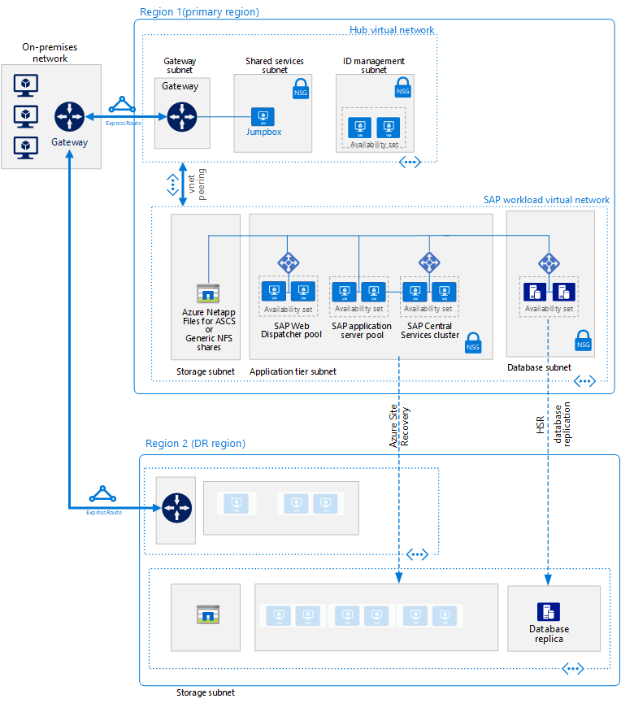

# SAP S/4HANA for Linux virtual machines on Azure

This reference architecture shows a set of proven practices for running S/4HANA in a high availability environment that supports disaster recovery on Azure. This architecture is deployed with specific virtual machine (VM) sizes that can be changed to accommodate your organization's needs.

*Download a [Visio file][visio-download] of this architecture.*

> [!NOTE]
> Deploying this reference architecture requires appropriate licensing of SAP products and other non-Microsoft technologies.

## Architecture

This reference architecture describes an enterprise-grade, production-level system. To suit your business needs, this configuration can be reduced to a single virtual machine. However, the following components are required:

**Virtual network**. The [Azure Virtual Network](/azure/virtual-network/virtual-networks-overview) service securely connects Azure resources to each other. In this architecture, the virtual network connects to an on-premises environment through a gateway deployed in the hub of a [hub-spoke topology](../hybrid-networking/hub-spoke.md). The spoke is the virtual network used for the SAP applications.

**Subnets**. The virtual network is subdivided into separate [subnets](/azure/virtual-network/virtual-network-manage-subnet) for each tier: gateway, application, database, and shared services.

**Virtual machines**. This architecture uses virtual machines running Linux for the application tier and database tier, grouped as follows:

- **Application tier**. Includes the Fiori Front-end Server pool, SAP Web Dispatcher pool, application server pool, and SAP Central Services cluster. For high availability of Central Services on Azure Linux virtual machines, a highly available Network File System (NFS) service is required.
- **NFS cluster**. This architecture uses an [NFS](/azure/virtual-machines/workloads/sap/high-availability-guide-suse-nfs) server running on a Linux cluster to store data shared between SAP systems. This centralized cluster can be shared across multiple SAP systems. For high availability of the NFS service, the appropriate High Availability Extension for the selected Linux distribution is used.
- **SAP HANA**. The database tier uses two or more Linux virtual machines in a cluster to achieve high availability. HANA System Replication (HSR) is used to replicate contents between primary and secondary HANA systems. Linux clustering is used to detect system failures and facilitate automatic failover. A storage-based or cloud-based fencing mechanism can be used to ensure the failed system is isolated or shut down to avoid the cluster split-brain condition.
- **Jumpbox**. Also called a bastion host. This is a secure virtual machine on the network that administrators use to connect to the other virtual machines. It can run Windows or Linux. Use a Windows jumpbox for web browsing convenience when using HANA Cockpit or HANA Studio management tools.

**Load balancers**. Both built-in SAP load balancers and [Azure Load Balancer](/azure/load-balancer/load-balancer-overview) are used to achieve HA. Azure Load Balancer instances are used to distribute traffic to virtual machines in the application tier subnet.

**Availability sets**. Virtual machines for all pools and clusters (Web Dispatcher, SAP application servers, Central Services, NFS, and HANA) are grouped into separate [availability sets](/azure/virtual-machines/windows/tutorial-availability-sets), and at least two virtual machines are provisioned per role. This makes the virtual machines eligible for a higher [service level agreement](https://azure.microsoft.com/support/legal/sla/virtual-machines) (SLA).

**NICs**. [Network interface cards](/azure/virtual-network/virtual-network-network-interface) (NICs) enable all communication of virtual machines on a virtual network.

**Network security groups**. To restrict incoming, outgoing, and intra-subnet traffic in the virtual network, [network security groups](/azure/virtual-network/virtual-networks-nsg) (NSGs) are used.

**Gateway**. A gateway extends your on-premises network to the Azure virtual network. [ExpressRoute](/azure/architecture/reference-architectures/hybrid-networking/expressroute) is the recommended Azure service for creating private connections that do not go over the public Internet, but a [Site-to-Site](/azure/vpn-gateway/vpn-gateway-howto-site-to-site-resource-manager-portal) connection can also be used.

**Azure Storage**. To provide persistent storage of a virtual machine's virtual hard disk (VHD), [Azure Storage](/azure/storage/) is required.

## Recommendations

This architecture describes a small production-level enterprise deployment. Your deployment will differ based on your business requirements. Use these recommendations as a starting point.

### Virtual machines

In application server pools and clusters, adjust the number of virtual machines based on your requirements. The [Azure Virtual Machines planning and implementation guide](/azure/virtual-machines/workloads/sap/planning-guide) includes details about running SAP NetWeaver on virtual machines, but the information applies to SAP S/4HANA as well.

For details about SAP support for Azure virtual machine types and throughput metrics (SAPS), see [SAP Note 1928533](https://launchpad.support.sap.com/#/notes/1928533).

### SAP Web Dispatcher pool

The Web Dispatcher component is used as a load balancer for SAP traffic among the SAP application servers. To achieve high availability for the Web Dispatcher component, Azure Load Balancer is used to implement the parallel Web Dispatcher setup in a round-robin configuration for HTTP(S) traffic distribution among the available Web Dispatchers in the balancers back-end pool.

### Fiori Front-end Server

The Fiori Front-end Server uses a [NetWeaver Gateway](https://help.sap.com/doc/saphelp_gateway20sp12/2.0/en-US/76/08828d832e4aa78748e9f82204a864/content.htm?no_cache=true). For small deployments, it can be loaded on the Fiori server. For large deployments, a separate server for the NetWeaver Gateway may be deployed in front of the Fiori Front-end Server pool.

### Application servers pool

To manage logon groups for ABAP application servers, the SMLG transaction is used. It uses the load balancing function within the message server of the Central Services to distribute workload among SAP application servers pool for SAPGUIs and RFC traffic. The application server connection to the highly available Central Services is through the cluster virtual network name. This avoids the need to change the application server profile for Central Services connectivity after a local failover.

### SAP Central Services cluster

Central Services can be deployed to a single virtual machine when high availability is not a requirement. However, the single virtual machine becomes a potential single point of failure (SPOF) for the SAP environment. For a highly available Central Services deployment, a highly available NFS cluster and a highly available Central Services cluster are used.

### NFS cluster

DRBD (Distributed Replicated Block Device) is used for replication between the nodes of the NFS cluster.

### Availability sets

Availability sets distribute servers to different physical infrastructure and update groups to improve service availability. Put virtual machines that perform the same role into an availability sets to help guard against downtime caused by Azure infrastructure maintenance and to meet [SLAs](https://azure.microsoft.com/support/legal/sla/virtual-machines). Two or more virtual machines per availability set is recommended.

All virtual machines in a set must perform the same role. Do not mix servers of different roles in the same availability set. For example, don't place an ASCS node in the same availability set with the application server.

### NICs

Traditional on-premises SAP landscapes implement multiple network interface cards (NICs) per machine to segregate administrative traffic from business traffic. On Azure, the virtual network is a software-defined network that sends all traffic through the same network fabric. Therefore, the use of multiple NICs is unnecessary. However, if your organization needs to segregate traffic, you can deploy multiple NICs per VM, connect each NIC to a different subnet, and then use NSGs to enforce different access control policies.

### Subnets and NSGs

This architecture subdivides the virtual network address space into subnets. Each subnet can be associated with a NSG that defines the access policies for the subnet. Place application servers on a separate subnet so you can secure them more easily by managing the subnet security policies, not the individual servers.

When a NSG is associated with a subnet, it then applies to all the servers within the subnet. For more information about using NSGs for fine-grained control over the servers in a subnet, see [Filter network traffic with network security groups](https://azure.microsoft.com/blog/multiple-vm-nics-and-network-virtual-appliances-in-azure/).

See also [Planning and design for VPN Gateway](/azure/vpn-gateway/vpn-gateway-plan-design).

### Load balancers

[SAP Web Dispatcher](https://help.sap.com/doc/saphelp_nw73ehp1/7.31.19/en-US/48/8fe37933114e6fe10000000a421937/frameset.htm) handles load balancing of HTTP(S) traffic including Fiori style applications to a pool of SAP application servers.

For traffic from SAP GUI clients connecting a SAP server via DIAG or Remote Function Calls (RFC), the Central Service message server balances the load through SAP application server [logon groups](https://wiki.scn.sap.com/wiki/display/SI/ABAP+Logon+Group+based+Load+Balancing), so no additional load balancer is needed.

### Azure Storage

We recommend using Azure Premium Storage for the database server virtual machines. Premium storage provides consistent read/write latency. For details about using Premium Storage for the operating system disks and data disks of a single-instance virtual machine, see [SLA for Virtual Machines](https://azure.microsoft.com/support/legal/sla/virtual-machines/).

For all production SAP systems, we recommend using Premium [Azure Managed Disks](/azure/storage/storage-managed-disks-overview). Managed Disks are used to manage the VHD files for the disks, adding reliability. They also ensure that the disks for virtual machines within an availability set are isolated to avoid single points of failure.

For SAP application servers, including the Central Services virtual machines, you can use Azure Standard Storage to reduce cost, because application execution takes place in memory and uses disks for logging only. However, at this time, Standard Storage is only certified for unmanaged storage. Since application servers do not host any data, you can also use the smaller P4 and P6 Premium Storage disks to help minimize cost.

For the backup data store, we recommend using Azure [cool access tier storage and/or archive access tier storage](/azure/storage/storage-blob-storage-tiers). These storage tiers are cost-effective ways to store long-lived data that is less frequently accessed.

## Performance considerations

SAP application servers carry on constant communications with the database servers. For the HANA database virtual machines, consider enabling [Write Accelerator](/azure/virtual-machines/linux/how-to-enable-write-accelerator) to improve log write latency. To optimize inter-server communications, use the [Accelerated Network](https://azure.microsoft.com/blog/linux-and-windows-networking-performance-enhancements-accelerated-networking/). Note that these accelerators are available only for certain VM series.

To achieve high IOPS and disk bandwidth throughput, the common practices in storage volume [performance optimization](/azure/virtual-machines/linux/premium-storage-performance) apply to Azure storage layout. For example, combining multiple disks together to create a striped disk volume improves IO performance. Enabling the read cache on storage content that changes infrequently enhances the speed of data retrieval. For details about performance requirements, see [SAP note 1943937 - Hardware Configuration Check Tool](https://launchpad.support.sap.com/#/notes/1943937) (SAP Service Marketplace account required for access).

## Scalability considerations

At the SAP application layer, Azure offers a wide range of virtual machine sizes for scaling up and scaling out. For an inclusive list, see [SAP Note 1928533](https://launchpad.support.sap.com/#/notes/1928533) - SAP Applications on Azure: Supported Products and Azure VM types (SAP Service Marketplace account required for access). As we continue to certify more virtual machines types, you can scale up or down with the same cloud deployment.

At the database layer, this architecture runs HANA on VMs. If your workload exceeds the maximum VM size, Microsoft also offers [Azure Large Instances](/azure/virtual-machines/workloads/sap/hana-overview-architecture) for SAP HANA. These physical servers are co-located in a Microsoft Azure certified datacenter and as of this writing, provide up to 20 TB of memory capacity for a single instance. Multi-node configuration is also possible with a total memory capacity of up to 60 TB.

## Availability considerations

Resource redundancy is the general theme in highly available infrastructure solutions. For enterprises that have a less stringent SLA, single-instance Azure VMs offer an uptime SLA. For more information, see [Azure Service Level Agreement](https://azure.microsoft.com/support/legal/sla/).

In this distributed installation of the SAP application, the base installation is replicated to achieve high availability. For each layer of the architecture, the high availability design varies.

### Application tier

- Web Dispatcher. High availability is achieved with redundant Web Dispatcher instances. See [SAP Web Dispatcher](https://help.sap.com/doc/saphelp_nw70ehp2/7.02.16/en-us/48/8fe37933114e6fe10000000a421937/frameset.htm) in the SAP documentation.
- Fiori servers. High availability is achieved by load balancing traffic within a pool of servers.
- Central Services. For high availability of Central Services on Azure Linux virtual machines, the appropriate High Availability Extension for the selected Linux distribution is used, and the highly available NFS cluster hosts DRBD storage.
- Application servers. High availability is achieved by load balancing traffic within a pool of application servers.

### Database tier

This reference architecture depicts a highly available SAP HANA database system consisting of two Azure virtual machines. The database tier's native system replication feature provides either manual or automatic failover between replicated nodes:

- For manual failover, deploy more than one HANA instance and use HANA System Replication (HSR).
- For automatic failover, use both HSR and Linux High Availability Extension (HAE) for your Linux distribution. Linux HAE provides the cluster services to the HANA resources, detecting failure events and orchestrating the failover of errant services to the healthy node.

See [SAP certifications and configurations running on Microsoft Azure](/azure/virtual-machines/workloads/sap/sap-certifications).

### Disaster recovery considerations

Each tier uses a different strategy to provide disaster recovery (DR) protection.

- **Application servers tier**. SAP application servers do not contain business data. On Azure, a simple DR strategy is to create SAP application servers in the secondary region, then shut them down. Upon any configuration changes or kernel updates on the primary application server, the same changes must be applied to the virtual machines in the secondary region. For example, copy the SAP kernel executables to the DR virtual machines. For automatic replication of application servers to a secondary region, [Azure Site Recovery](/azure/site-recovery/site-recovery-overview) is the recommended solution. As of the writing of this paper, Azure Site Recovery doesn't yet support the replication of the Accelerated Network configuration setting in Azure VMs.

- **Central Services**. This component of the SAP application stack also does not persist business data. You can build a VM in the secondary region to run the Central Services role. The only content from the primary Central Services node to synchronize is the /sapmnt share content. Also, if configuration changes or kernel updates take place on the primary Central Services servers, they must be repeated on the VM in the secondary region running Central Services. To synchronize the two servers, you can use either Azure Site Recovery, to replicate the cluster nodes, or simply use a regularly scheduled copy job to copy /sapmnt to the DR side. For details about the build, copy, and test failover process, download [SAP NetWeaver: Building a Hyper-V and Microsoft Azure–based Disaster Recovery Solution](https://download.microsoft.com/download/9/5/6/956FEDC3-702D-4EFB-A7D3-2DB7505566B6/SAP%20NetWeaver%20-%20Building%20an%20Azure%20based%20Disaster%20Recovery%20Solution%20V1_5%20.docx), and refer to section 4.3, "SAP SPOF layer (ASCS)." This paper applies to NetWeaver running on Windows, but you can create the equivalent configuration for Linux. For Central Services, use [Azure Site Recovery](/azure/site-recovery/site-recovery-overview) to replicate the cluster nodes and storage. For Linux, create a three node geo-cluster using a High Availability Extension.

- **SAP database tier**. Use HSR for HANA-supported replication. In addition to a local, two-node high availability setup, HSR supports multi-tier replication where a third node in a separate Azure region acts as a foreign entity, not part of the cluster, and registers to the secondary replica of the clustered HSR pair as its replication target. This form a replication daisy chain. The failover to the DR node is a manual process.

To use Azure Site Recovery to automatically build a fully replicated production site of your original, you must run customized [deployment scripts](/azure/site-recovery/site-recovery-runbook-automation). Site Recovery first deploys the virtual machines in availability sets, then runs scripts to add resources such as load balancers.

## Manageability considerations

SAP HANA has a backup feature that makes use of the underlying Azure infrastructure. To back up the SAP HANA database running on Azure virtual machines, both the SAP HANA snapshot and Azure storage snapshot are used to ensure the backup files' consistency. For details, see [Backup guide for SAP HANA on Azure Virtual Machines](/azure/virtual-machines/workloads/sap/sap-hana-backup-guide) and the [Azure Backup service FAQ](/azure/backup/backup-azure-backup-faq). Only HANA single container deployments support Azure storage snapshot.

### Identity management

Control access to resources by using a centralized identity management system at all levels:

- Provide access to Azure resources through [role-based access control](/azure/active-directory/role-based-access-control-what-is) (RBAC).
- Grant access to Azure VMs through LDAP, Azure Active Directory, Kerberos, or another system.
- Support access within the apps themselves through the services that SAP provides, or use [OAuth 2.0 and Azure Active Directory](/azure/active-directory/develop/active-directory-protocols-oauth-code).

### Monitoring

Azure provides several functions for [monitoring and diagnostics](/azure/architecture/best-practices/monitoring) of the overall infrastructure. Also, enhanced monitoring of Azure virtual machines (Linux or Windows) is handled by Azure Operations Management Suite (OMS).

To provide SAP-based monitoring of resources and service performance of the SAP infrastructure, the [Azure SAP Enhanced Monitoring](/azure/virtual-machines/workloads/sap/deployment-guide#d98edcd3-f2a1-49f7-b26a-07448ceb60ca) extension is used. This extension feeds Azure monitoring statistics into the SAP application for operating system monitoring and DBA Cockpit functions. SAP enhanced monitoring is a mandatory prerequisite to run SAP on Azure. For details, see [SAP Note 2191498](https://launchpad.support.sap.com/#/notes/2191498) – "SAP on Linux with Azure: Enhanced Monitoring."

## Security considerations

SAP has its own Users Management Engine (UME) to control role-based access and authorization within the SAP application. For details, see [SAP HANA Security  &mdash;  An Overview](https://archive.sap.com/documents/docs/DOC-62943) (SAP Service Marketplace account required for access.)

For additional network security, consider implementing a [Network DMZ](../dmz/secure-vnet-dmz.md) with a firewall in front of the subnet for Web Dispatcher and Fiori Front-End Server pools.

For infrastructure security, data is encrypted in transit and at rest. The "Security considerations" section of the [SAP NetWeaver on Azure Virtual Machines–Planning and Implementation Guide](/azure/virtual-machines/workloads/sap/planning-guide) begins to address network security and applies to S/4HANA. The guide also specifies the network ports you must open on the firewalls to allow application communication.

To encrypt Linux IaaS virtual machine disks, you can use [Azure Disk Encryption](/azure/security/fundamentals/azure-disk-encryption-vms-vmss). It uses the DM-Crypt feature of Linux to provide volume encryption for the operating system and the data disks. The solution also works with Azure Key Vault to help you control and manage the disk-encryption keys and secrets in your key vault subscription. Data on the virtual machine disks are encrypted at rest in your Azure storage.

For SAP HANA data-at-rest encryption, we recommend using the SAP HANA native encryption technology.

> [!NOTE]
> Do not use the HANA data-at-rest encryption with Azure Disk Encryption on the same server. For HANA, use only HANA data encryption.

## Communities

Communities can answer questions and help you set up a successful deployment. Consider the following:

- [Running SAP Applications on the Microsoft Platform Blog](https://blogs.msdn.microsoft.com/saponsqlserver/2017/05/04/sap-on-azure-general-update-for-customers-partners-april-2017/)
- [Azure Community Support](https://azure.microsoft.com/support/community/)
- [SAP Community](https://www.sap.com/community.html)
- [Stack Overflow](https://stackoverflow.com/tags/sap/)

## Related resources

You may wish to review the following [Azure example scenarios](/azure/architecture/example-scenario) that demonstrate specific solutions using some of the same technologies:

- [Running SAP production workloads using an Oracle Database on Azure](/azure/architecture/example-scenario/apps/sap-production)
- [Dev/test environments for SAP workloads on Azure](/azure/architecture/example-scenario/apps/sap-dev-test)

<!-- links -->

[visio-download]: https://archcenter.blob.core.windows.net/cdn/sap-reference-architectures.vsdx
