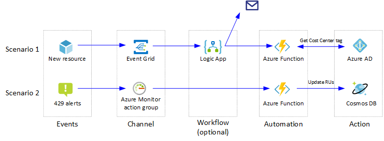
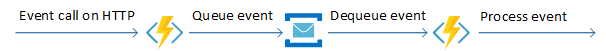

<!-- cSpell:ignore ADAL -->

Automating workflows and repetitive tasks on the cloud, by using [serverless technologies](https://azure.microsoft.com/solutions/serverless/), can dramatically improve productivity of an organization's DevOps team. A serverless model is best suited for automation scenarios that fit an [event driven approach](../../guide/architecture-styles/event-driven.yml).

## Architecture



### Scenarios

This article illustrates two key cloud automation scenarios:

1. [**Cost center tagging**](https://github.com/mspnp/serverless-automation/blob/main/src/automation/cost-center/deployment.md): This implementation tracks the cost centers of each Azure resource. The [Azure Policy](/azure/governance/policy/) service [tags all new resources](/azure/azure-resource-manager/resource-group-using-tags) in a group with a default cost center ID. The Azure Event Grid monitors resource creation events, and then calls an [Azure function](/azure/azure-functions/). The function interacts with Azure Active Directory, and validates the cost center ID for the new resource. If different, it updates the tag and sends out an email to the resource owner. The REST queries for Azure Active Directory are mocked out for simplicity. Azure AD can also be integrated using the [Azure AD PowerShell module](/powershell/module/azuread/) or the [MSAL for Python library](https://github.com/AzureAD/microsoft-authentication-library-for-python).

1. **Throttling response**: This example monitors an Azure Cosmos DB database for throttling. [Azure Monitor alerts](/azure/azure-monitor/overview#alerts) are triggered when data access requests to Azure Cosmos DB exceed the [capacity in Request Units (or RUs)](/azure/cosmos-db/request-units). An [Azure Monitor action group](https://azure.microsoft.com/resources/videos/azure-friday-azure-monitor-action-groups/) is configured to call the automation function in response to these alerts. The function scales the RUs to a higher value, increasing the capacity and in turn stopping the alerts.

> [!NOTE]
> These solutions are not the only away to accomplish these tasks and are shown as illustrative of how serverless technologies can react to environmental signals (events) and influence changes to your environment. Where practical, use platform-native solutions over custom solutions. For example, Azure Cosmos DB natively supports [autoscale throughput](/azure/cosmos-db/provision-throughput-autoscale) as a native alternative to the Throttling response scenario.

 The reference implementation for scenario one is available on [GitHub](https://github.com/mspnp/serverless-automation).

The functions in these serverless cloud automation scenarios are often written in PowerShell and Python, two of the most common scripting languages used in system automation. They are deployed using [Azure Functions Core Tools](/azure/azure-functions/functions-run-local) in Azure CLI. Alternatively, you use the [Az.Functions PowerShell cmdlet to deploy and manage Azure Functions](https://www.powershellgallery.com/packages/Az.Functions).

### Workflow

Event-based automation scenarios are best implemented using Azure Functions. They follow these common patterns:

- **Respond to events on resources**. These are responses to events such as an Azure resource or resource group getting created, deleted, changed, and so on. This pattern uses [Event Grid](/azure/event-grid/overview) to trigger the function for such events. The cost center tagging scenario is an example of this pattern. Other common scenarios include:

  - granting the DevOps teams access to newly created resource groups,
  - sending notification to the DevOps when a resource is deleted, and
  - responding to maintenance events for resources such as Azure Virtual Machines (VMs).

- **Scheduled tasks**. These are typically maintenance tasks executed using [timer-triggered functions](/azure/azure-functions/functions-create-scheduled-function). Examples of this pattern are:

  - stopping a resource at night, and starting in the morning,
  - reading Blob Storage content at regular intervals, and converting to an Azure Cosmos DB document,
  - periodically scanning for resources no longer in use, and removing them, and
  - automated backups.

- **Process Azure alerts**. This pattern uses the ease of integrating Azure Monitor alerts and action groups with Azure Functions. The function typically takes remedial actions in response to metrics, log analytics, and alerts originating in the applications and the infrastructure. The throttling response scenario is an example of this pattern. Other common scenarios are:

  - truncating the table when SQL Database reaches maximum size,
  - restarting a service in a VM when it is erroneously stopped, and
  - sending notifications if a function is failing.

- **Orchestrate with external systems**. This pattern enables integration with external systems, using [Logic Apps](/azure/logic-apps/) to orchestrate the workflow. [Logic Apps connectors](/azure/connectors/apis-list) can easily integrate with several third-party services as well as Microsoft services such as Microsoft 365. Azure Functions can be used for the actual automation. The cost center tagging scenario demonstrates this pattern. Other common scenarios include:

  - monitoring IT processes such as change requests or approvals, and
  - sending email notification when automation task is completed.

- **Expose as a *web hook* or API**. Automation tasks using Azure Functions can be integrated into third-party applications or even command-line tools, by exposing the function as a web hook/API using [an HTTP trigger](/azure/azure-functions/functions-create-first-azure-function). Multiple authentication methods are available in both PowerShell and Python to secure external access to the function. The automation happens in response to the app-specific external events, for example, integration with power apps or GitHub. Common scenarios include:

  - triggering automation for a failing service, and
  - onboarding users to the organization's resources.

- **Create ChatOps interface**. This pattern enables customers to create a chat-based operational interface, and run development and operations functions and commands in-line with human collaboration. This can integrate with the Azure Bot Framework and use Microsoft Teams or Slack commands for deployment, monitoring, common questions, and so on. A ChatOps interface creates a real-time system for managing production incidents, with each step documented automatically on the chat. Read [How ChatOps can help you DevOps better](https://chatbotsmagazine.com/how-chatops-can-help-you-devops-better-5-minutes-read-507438c156bf) for more information.

- **Hybrid automation**. This pattern uses the [Azure App Service Hybrid Connections](/azure/app-service/app-service-hybrid-connections) to install a software component on your local machine. This component allows secure access to resources on that machine. The ability to [manage hybrid environments](/azure/azure-functions/functions-hybrid-powershell) is currently available on Windows-based systems using PowerShell functions. Common scenarios include:

  - managing your on-premises machines, and
  - managing other systems behind the firewall (for example, an on-premises SQL Server) through a [jump server](https://wikipedia.org/wiki/Jump_server).

### Components

The architecture consists of the following components:

- [Azure Functions](https://azure.microsoft.com/products/functions). Azure Functions provide the event-driven, serverless compute capabilities in this architecture. A function performs automation tasks, when triggered by events or alerts. In two scenarios, a function is invoked with an HTTP request. Code complexity should be minimized, by developing the function that is **stateless** and **idempotent**.

   Multiple executions of an idempotent function create the same results. To maintain idempotency, the function scaling in the throttling scenario is kept simplistic. In real world automation, make sure to scale up or down appropriately. Read the [Optimize the performance and reliability of Azure Functions](/azure/azure-functions/functions-best-practices) for best practices when writing your functions.

- [Azure Logic Apps](https://azure.microsoft.com/products/logic-apps). Logic Apps can be used to perform simpler tasks, easily implemented using [the built-in connectors](/azure/connectors/apis-list). These tasks can range from email notifications, to integrating with external management applications. To learn how to use Logic Apps with third-party applications, read [basic enterprise integration in Azure](../../reference-architectures/enterprise-integration/basic-enterprise-integration.yml).

   Logic Apps provides a *no code* or *low code* visual designer, and may be used alone in some automation scenarios. Read [this comparison between Azure Functions and Logic Apps](/azure/azure-functions/functions-compare-logic-apps-ms-flow-webjobs#compare-azure-functions-and-azure-logic-apps) to see which service can fit your scenario.

- [Event Grid](https://azure.microsoft.com/products/event-grid). Event Grid has built-in support for events from other Azure services, as well as custom events (also called *custom topics*). Operational events such as resource creation can be easily propagated to the automation function, using the Event Grid's built-in mechanism.

   Event Grid simplifies the event-based automation with a [publish-subscribe model](/azure/event-grid/concepts), allowing reliable automation for events delivered over HTTPS.

- [Azure Monitor](https://azure.microsoft.com/products/monitor). Azure Monitor alerts can monitor for critical conditions, and take corrective action using Azure Monitor action groups. These action groups are easily integrated with Azure Functions. This is useful to watch for and fix any error conditions in your infrastructure, such as database throttling.

- **Automation action**. This broad block represents other services that your function can interact with, to provide the automation functionality. For example, Azure Active Directory for tag validation as in the first scenario, or a database to provision as in the second scenario.

## Considerations

These considerations implement the pillars of the Azure Well-Architected Framework, which is a set of guiding tenets that can be used to improve the quality of a workload. For more information, see [Microsoft Azure Well-Architected Framework](/azure/architecture/framework).

### Resiliency

#### Azure Functions

##### Handle HTTP timeouts

To avoid HTTP timeouts for a longer automation task, queue this event in a [Service Bus](/azure/service-bus-messaging/service-bus-messaging-overview#queues), and handle the actual automation in another function. The throttling response automation scenario illustrates this pattern, even though the actual Azure Cosmos DB RU provisioning is fast.



[Durable Functions](/azure/azure-functions/durable/durable-functions-overview), which maintain state between invocations, provide an alternative to the above approach. Durable Functions only support [specific languages](/azure/azure-functions/durable/durable-functions-overview?#language-support).

##### Log failures

As a best practice, the function should log any failures in carrying out automation tasks. This allows for proper troubleshooting of the error conditions. Azure Functions natively supports integration with [Application Insights](/azure/azure-monitor/app/app-insights-overview) as the telemetry system.

##### Concurrency

Verify the concurrency requirement for your automation function. Concurrency is limited by setting the variable `maxConcurrentRequests` in the file [host.json](/azure/azure-functions/functions-host-json). This setting limits the number of concurrent function instances running in your function app. Since every instance consumes CPU and memory, this value needs to be adjusted for CPU-intensive operations. Lower the `maxConcurrentRequests` if your function calls appear to be too slow or aren't able to complete. See the section [Configure host behaviors to better handle concurrency](/azure/azure-functions/functions-best-practices#consider-concurrency) for more details.

##### Idempotency

Make sure your automation function is idempotent. Both Azure Monitor and Event Grid may emit alerts or events that indicate progression such as your subscribed event is *resolved*, *fired*, *in progress*, etc., your resource is *being provisioned*, *created successfully*, etc., or even send false alerts due to a misconfiguration. Make sure your function acts only on the relevant alerts and events, and ignores all others, so that false or misconfigured events do not cause unwanted results. For more information, see [Designing Azure Functions for identical input](/azure/azure-functions/functions-idempotent).

#### Event Grid

If your workflow uses Event Grid, check if your scenario could generate a high volume of events, enough to clog the grid. See [Event Grid message delivery and retry](/azure/event-grid/delivery-and-retry) to understand how it handles events when delivery isn't acknowledged, and modify your logic accordingly. The cost center workflow does not implement additional checks for this, since it only watches for resource creation events in a resource group. Monitoring resources created in an entire subscription, can generate larger number of events, requiring a more resilient handling.

#### Azure Monitor

If a sufficiently large number of alerts are generated, and the automation updates Azure resources, [throttling limits of the Azure Resource Manager](/azure/azure-resource-manager/resource-manager-request-limits#subscription-and-tenant-limits) might be reached. This can negatively affect the rest of the infrastructure in that subscription. Avoid this situation by limiting the *frequency* of alerts getting generated by the Azure Monitor. You may also limit the alerts getting generated for a particular error. Refer to the [documentation on Azure Monitor alerts](/azure/azure-monitor/platform/alerts-overview) for more information.

### Security

Security provides assurances against deliberate attacks and the abuse of your valuable data and systems. For more information, see [Overview of the security pillar](/azure/architecture/framework/security/overview).

#### Control access to the function

Restrict access to an HTTP-triggered function by setting the [authorization level](/azure/azure-functions/functions-bindings-http-webhook). With *anonymous* authentication, the function is easily accessible with a URL such as `http://<APP_NAME>.azurewebsites.net/api/<FUNCTION_NAME>`. *Function* level authentication can obfuscate the http endpoint, by requiring function keys in the URL. This level is set in the file [function.json](https://github.com/mspnp/serverless-automation/blob/main/src/automation/cost-center/cost-center-tagging/OnResourceWriteSuccess/function.json):

```json
{
  "bindings": [
    {
      "authLevel": "function",
      "type": "httpTrigger",
      "direction": "in",
      "name": "Request",
      "methods": [
        "get",
        "post"
      ]
    },
    {
      "type": "http",
      "direction": "out",
      "name": "Response"
    }
  ]
}
```

For production environment, additional strategies might be required to secure the function. In these scenarios, the functions are executed within the Azure platform by other Azure services, and will not be exposed to the Internet. Function authorization is sometimes sufficient for functions accessed as web hooks.

Consider adding security layers on top of function authentication, such as,

- authenticating with client certificates, or
- making sure the caller is part of or has access to the directory that hosts the function, by [enabling App Service Authentication](/azure/azure-functions/security-concepts#enable-app-service-authenticationauthorization).

Function-level authentication is the only option available to Azure Monitor [action groups using Azure Functions](/azure/azure-monitor/alerts/action-groups#function).

If the function needs to be called from a third-party application or service, it is recommended to provide access to it with an [API Management](/azure/api-management/api-management-key-concepts) layer. This layer should enforce authentication. API Management has a [consumption tier](/azure/api-management/api-management-features) integrated with Azure Functions, which allows you to pay only if the API gets executed. For more information, read [Create and expose your functions with OpenAPI](/azure/azure-functions/functions-openapi-definition).

If the calling service supports service endpoints or private link, the following costlier options could be considered:

- Use a dedicated App Service plan, where you can lock down the functions in a virtual network to limit access to it. This is not possible in a consumption-based serverless model.
- Use the [Azure Functions Premium plan](/azure/azure-functions/functions-premium-plan), which includes a dedicated virtual network to be used by your function apps.

To compare pricing and features between these options, read [Azure Functions scale and hosting](/azure/azure-functions/functions-scale).

#### Control what the function can access

[Managed identities for Azure resources](/azure/active-directory/managed-identities-azure-resources/overview), an Azure Active Directory feature, simplifies how the function authenticates and accesses other Azure resources and services. The code does not need to manage the authentication credentials, since it is managed by Azure AD.

There are two types of managed identities:

- **System-assigned managed identities**: These are created as part of the Azure resource, and cannot be shared among multiple resources. These get deleted when the resource is deleted. Use these for scenarios, which involve single Azure resource or which need independent identities. Both of the scenarios use system-assigned identities since they update only a single resource. Managed identities are only required to update another resource. For example, a function can read the resource tags without a managed identity. See [these instructions](/azure/app-service/overview-managed-identity#add-a-system-assigned-identity) to add a system-assigned identity to your function.

- **User-assigned managed identities**: These are created as stand-alone Azure resources. These can be shared across multiple resources, and need to be explicitly deleted when no longer needed. Read [these instructions](/azure/app-service/overview-managed-identity#add-a-user-assigned-identity) on how to add user-assigned identity to your function. Use these for scenarios that:

  - Require access to multiple resources that can share a single identity, or
  - Need pre-authorization to secure resources during provisioning, or
  - Have resources that are recycled frequently, while permissions need to be consistent.

Once the identity is assigned to the Azure function, assign it a role using [Azure role-based access control (Azure RBAC)](/azure/role-based-access-control/overview) to access the resources. For example, to update a resource, the *Contributor* role will need to be assigned to the function's identity.

### Cost optimization

Cost optimization is about looking at ways to reduce unnecessary expenses and improve operational efficiencies. For more information, see [Overview of the cost optimization pillar](/azure/architecture/framework/cost/overview).

Use the [Azure pricing calculator][azure-pricing-calculator] to estimate costs. The following are some considerations for lowering cost.

#### Azure Logic Apps

Logic apps have a pay-as-you-go pricing model. Triggers, actions, and connector executions are metered each time a logic app runs. All successful and unsuccessful actions, including triggers, are considered as executions.

Logic apps have also a fixed pricing model. If you need to run logic apps that communicate with secured resources in an Azure virtual network, you can create them in an [Integration Service Environment (ISE)][az-logic-apps-ISE].

For details, see [Pricing model for Azure Logic Apps][logic-app-pricing].

In this architecture, logic apps are used in the cost center tagging scenario to orchestrate the workflow.

Built-in connectors are used to connect to Azure Functions and send email notification a when an automation task is completed. The functions are exposed as a web hook/API using an HTTP trigger. Logic apps are triggered only when an HTTPS request occurs. This is a cost effective way when compared to a design where functions continuously poll and check for certain criteria. Every polling request is metered as an action.

For more information, see [Logic Apps pricing][Logic-Apps-Pricing].

#### Azure Functions

Azure Functions are available with [the following three pricing plans](/azure/azure-functions/functions-scale).

- **Consumption plan**. This is the most cost-effective, serverless plan available, where you only pay for the time your function runs. Under this plan, functions can run for up to 10 minutes at a time.

- **Premium plan**. Consider using [Azure Functions Premium plan](/azure/azure-functions/functions-premium-plan) for automation scenarios with additional requirements, such as a dedicated virtual network, a longer execution duration, and so on. These functions can run for up to an hour, and should be chosen for longer automation tasks such as running backups, database indexing, or generating reports.

- **App Service plan**. Hybrid automation scenarios that use the [Azure App Service Hybrid Connections](/azure/app-service/app-service-hybrid-connections), will need to use the App Service plan. The functions created under this plan can run for unlimited duration, similar to a web app.

In these automation scenarios Azure Functions are used for tasks such as updating tags in Azure Active Directory, or changing Azure Cosmos DB configuration by scaling up the RUs to a higher value. The **Consumption plan** is the appropriate for this use case because those tasks are interactive and not long-running.

#### Azure Cosmos DB

Azure Cosmos DB bills for provisioned throughput and consumed storage by hour. Provisioned throughput is expressed in Request Units per second (RU/s), which can be used for typical database operations, such as inserts, reads. Storage is billed for each GB used for your stored data and index. See [Azure Cosmos DB pricing model][cosmosdb-pricing] for more information.

In this architecture, when data access requests to Azure Cosmos DB exceed the capacity in Request Units (or RUs), Azure Monitor triggers alerts. In response to those alerts, an Azure Monitor action group is configured to call the automation function. The function scales the RUs to a higher value. This helps to keep the cost down because you only pay for the resources that your workloads need on a per-hour basis.

To get a quick cost estimate of your workload, use the [Azure Cosmos DB capacity calculator][cosmos-calculator].

For more information, see the Cost section in [Microsoft Azure Well-Architected Framework][aaf-cost].

### Deployment considerations

For critical automation workflows that manage behavior of your application, zero downtime deployment must be achieved using an efficient DevOps pipeline. For more information, read [serverless backend deployment](../../web-apps/serverless/architectures/web-app.yml#back-end-deployment).

If the automation covers multiple applications, keep the resources required by the automation in a [separate resource group](/azure/azure-resource-manager/resource-group-overview#resource-groups). A single resource group can be shared between automation and application resources, if the automation covers a single application.

If the workflow involves a number of automation functions, group the functions catering to one scenario in a single function app. Read [Manage function app](/azure/azure-functions/functions-how-to-use-azure-function-app-settings) for more information.

As you deploy your application, you will need to monitor it. Consider using [Application Insights][app-insights] to enable the developers to monitor performance and detect issues.

For more information, see the DevOps section in [Microsoft Azure Well-Architected Framework][AAF-devops].

#### Imperative actions on Azure resources

In both scenarios above, the end result was a change in Azure resource state via direct Azure Resource Manager interaction. While this was the intended outcome, consider the impact doing so might have on your environment if the modified resources were originally deployed declaratively, such as by Bicep or Terraform templates. Unless those changes are replicated back into your source templates, the next usage of those templates might undo the changes made by this automation. Consider the impact of mixing imperative changes to Azure resources that are routinely deployed via templates.

## Deploy this scenario

To deploy the cost center scenario, see the [deployment steps on GitHub](https://github.com/mspnp/serverless-automation).

## Next steps

- [Training: Introduction to Azure Functions](/training/modules/intro-azure-functions)
- [Documentation: Introduction to Azure Functions](/azure/azure-functions/functions-overview)
- [What is Azure Event Grid?](/azure/event-grid/overview)

## Related resources

- [Code walkthrough: Serverless application with Functions](../../web-apps/serverless/architectures/code.yml)
- [Serverless functions architecture design](../../serverless-quest/serverless-overview.md)
- [Serverless functions reference architectures](../../serverless-quest/reference-architectures.md)

<!-- links -->

[AAF-cost]: /azure/architecture/framework/cost/overview
[AAF-devops]: /azure/architecture/framework/devops/overview
[app-insights]: /azure/azure-monitor/app/app-insights-overview
[az-logic-apps-ISE]: /azure/logic-apps/connect-virtual-network-vnet-isolated-environment-overview
[cosmos-calculator]: https://cosmos.azure.com/capacitycalculator
[azure-pricing-calculator]: https://azure.microsoft.com/pricing/calculator
[logic-apps-pricing]: https://azure.microsoft.com/pricing/details/logic-apps
[logic-app-pricing]: /azure/logic-apps/logic-apps-pricing
[cosmosdb-pricing]: /azure/cosmos-db/how-pricing-works
