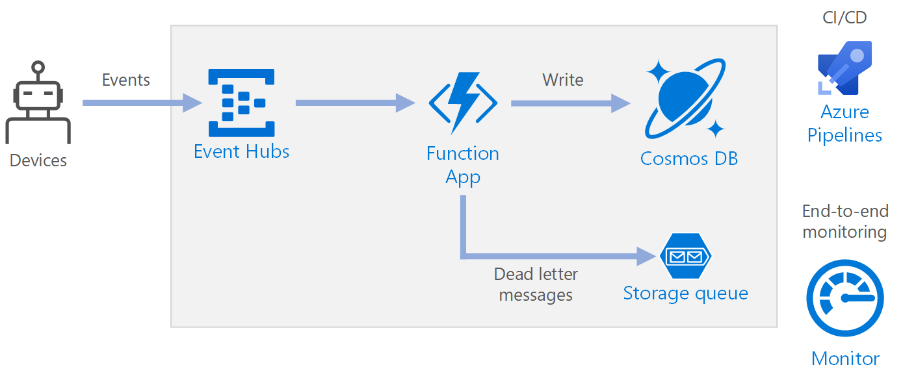

<!-- cSpell:ignore upsert deadletterqueue KEDA -->

This reference architecture shows a [serverless](https://azure.microsoft.com/solutions/serverless), event-driven architecture that ingests a stream of data, processes the data, and writes the results to a back-end database.

## Architecture



### Workflow

- Events arrive at Azure Event Hubs.
- A Function App is triggered to handle the event.
- The event is stored in an Azure Cosmos DB database.
- If the Function App fails to store the event successfully, the event is saved to a Storage queue to be processed later.

### Components

- **Event Hubs** ingests the data stream. [Event Hubs](https://azure.microsoft.com/products/event-hubs) is designed for high-throughput data streaming scenarios.

   > [!NOTE]
   > For Internet of Things (IoT) scenarios, we recommend [Azure IoT Hub][iot-hub-product]. IoT Hub has a built-in endpoint that's compatible with the Azure Event Hubs API, so you can use either service in this architecture with no major changes in the back-end processing. For more information, see [Connecting IoT Devices to Azure: IoT Hub and Event Hubs][iot].

- **Function App**. [Azure Functions](https://azure.microsoft.com/products/functions) is a serverless compute option. It uses an event-driven model, where a piece of code (a *function*) is invoked by a trigger. In this architecture, when events arrive at Event Hubs, they trigger a function that processes the events and writes the results to storage.

   Function Apps are suitable for processing individual records from Event Hubs. For more complex stream processing scenarios, consider [Apache Spark using Azure Databricks][spark-databricks-product], or [Azure Stream Analytics][stream-analytics-product].

- **Azure Cosmos DB**. [Azure Cosmos DB](https://azure.microsoft.com/products/cosmos-db) is a multi-model database service that is available in a serverless, consumption-based mode. For this scenario, the event-processing function stores JSON records, using [Azure Cosmos DB for NoSQL][cosmosdb-sql].

- **Queue storage**. [Queue storage](https://azure.microsoft.com/products/storage/queues) is used for dead-letter messages. If an error occurs while processing an event, the function stores the event data in a dead-letter queue for later processing. For more information, see the [Resiliency section](#resiliency) later in this article.

- **Azure Monitor**. [Monitor](https://azure.microsoft.com/products/monitor) collects performance metrics about the Azure services deployed in the solution. By visualizing these in a dashboard, you can get visibility into the health of the solution.

- **Azure Pipelines**. [Pipelines](https://azure.microsoft.com/products/devops/pipelines) is a continuous integration (CI) and continuous delivery (CD) service that builds, tests, and deploys the application.

## Considerations

These considerations implement the pillars of the Azure Well-Architected Framework, which is a set of guiding tenets that can be used to improve the quality of a workload. For more information, see [Microsoft Azure Well-Architected Framework](/azure/architecture/framework).

### Availability

The deployment shown here resides in a single Azure region. For a more resilient approach to disaster-recovery, take advantage of geo-distribution features in the various services:

- **Event Hubs.** Create two Event Hubs namespaces, a primary (active) namespace and a secondary (passive) namespace. Messages are automatically routed to the active namespace unless you fail over to the secondary namespace. For more information, see [Azure Event Hubs Geo-disaster recovery](/azure/event-hubs/event-hubs-geo-dr).
- **Function App.** Deploy a second function app that is waiting to read from the secondary Event Hubs namespace. This function writes to a secondary storage account for a dead-letter queue.
- **Azure Cosmos DB.** Azure Cosmos DB supports [multiple write regions][cosmosdb-geo], which enables writes to any region that you add to your Azure Cosmos DB account. If you don't enable multi-write, you can still fail over the primary write region. The Azure Cosmos DB client SDKs and the Azure Function bindings automatically handle the failover, so you don't need to update any application configuration settings.
- **Azure Storage.** Use [RA-GRS storage][ra-grs] for the dead-letter queue. This creates a read-only replica in another region. If the primary region becomes unavailable, you can read the items currently in the queue. In addition, provision another storage account in the secondary region that the function can write to after a fail-over.

### Scalability

#### Event Hubs

The throughput capacity of Event Hubs is measured in [throughput units][eh-throughput]. You can autoscale an event hub by enabling [auto-inflate][eh-autoscale], which automatically scales the throughput units based on traffic, up to a configured maximum.

The [Event Hubs trigger][eh-trigger] in the function app scales according to the number of partitions in the event hub. Each partition is assigned one function instance at a time. To maximize throughput, receive the events in a batch, instead of one at a time.

#### Azure Cosmos DB

Azure Cosmos DB is available in two different capacity modes:

- [Serverless][cosmosdb-serverless], for workloads with intermittent or unpredictable traffic and low average-to-peak traffic ratio.
- [Provisioned throughput][cosmosdb-provisioned], for workloads with sustained traffic requiring predictable performance.

To make sure your workload is scalable, it is important to choose an appropriate [partition key][partition-key] when you create your Azure Cosmos DB containers. Here are some characteristics of a good partition key:

- The key value space is large.
- There will be an even distribution of reads/writes per key value, avoiding hot keys.
- The maximum data stored for any single key value won't exceed the maximum physical partition size (20 GB).
- The partition key for a document won't change. You can't update the partition key on an existing document.

In the scenario for this reference architecture, the function stores exactly one document per device that is sending data. The function continually updates the documents with the latest device status using an [upsert operation](/powerapps/developer/data-platform/use-upsert-insert-update-record). Device ID is a good partition key for this scenario because writes will be evenly distributed across the keys, and the size of each partition will be strictly bounded because there is a single document for each key value. For more information about partition keys, see [Partition and scale in Azure Cosmos DB][cosmosdb-scale].

### Resiliency

When using the Event Hubs trigger with Functions, catch exceptions within your processing loop. If an unhandled exception occurs, the Functions runtime doesn't retry the messages. If a message can't be processed, put the message into a dead-letter queue. Use an out-of-band process to examine the messages and determine corrective action.

The following code shows how the ingestion function catches exceptions and puts unprocessed messages onto a dead-letter queue.

```csharp
[FunctionName("RawTelemetryFunction")]
[StorageAccount("DeadLetterStorage")]
public static async Task RunAsync(
    [EventHubTrigger("%EventHubName%", Connection = "EventHubConnection", ConsumerGroup ="%EventHubConsumerGroup%")]EventData[] messages,
    [Queue("deadletterqueue")] IAsyncCollector<DeadLetterMessage> deadLetterMessages,
    ILogger logger)
{
    foreach (var message in messages)
    {
        DeviceState deviceState = null;

        try
        {
            deviceState = telemetryProcessor.Deserialize(message.Body.Array, logger);
        }
        catch (Exception ex)
        {
            logger.LogError(ex, "Error deserializing message", message.SystemProperties.PartitionKey, message.SystemProperties.SequenceNumber);
            await deadLetterMessages.AddAsync(new DeadLetterMessage { Issue = ex.Message, EventData = message });
        }

        try
        {
            await stateChangeProcessor.UpdateState(deviceState, logger);
        }
        catch (Exception ex)
        {
            logger.LogError(ex, "Error updating status document", deviceState);
            await deadLetterMessages.AddAsync(new DeadLetterMessage { Issue = ex.Message, EventData = message, DeviceState = deviceState });
        }
    }
}
```

Notice that the function uses the [Queue storage output binding][queue-binding] to put items in the queue.

The code shown also logs exceptions to Application Insights. You can use the partition key and sequence number to correlate dead-letter messages with the exceptions in the logs.

Messages in the dead-letter queue should have enough information so that you can understand the context of the error. In this example, the `DeadLetterMessage` class contains the exception message, the original event data, and the deserialized event message (if available).

```csharp
public class DeadLetterMessage
{
    public string Issue { get; set; }
    public EventData EventData { get; set; }
    public DeviceState DeviceState { get; set; }
}
```

Use [Azure Monitor][monitor] to monitor the event hub. If you see there is input but no output, it means that messages aren't being processed. In that case, go into [Log Analytics][log-analytics] and look for exceptions or other errors.

### DevOps

Use infrastructure as code (IaC) when possible. IaC manages the infrastructure, application, and storage resources with a declarative approach like [Azure Resource Manager][arm-template]. That will help in automating deployment using DevOps as a continuous integration and continuous delivery (CI/CD) solution. Templates should be versioned and included as part of the release pipeline.

When creating templates, group resources as a way to organize and isolate them per workload. A common way to think about workload is a single serverless application or a virtual network. The goal of workload isolation is to associate the resources to a team, so that the DevOps team can independently manage all aspects of those resources and perform CI/CD.

This architecture includes steps to configure the Drone Status Function App using Azure Pipelines with YAML and Azure Functions Slots.

As you deploy your services you will need to monitor them. Consider using [Application Insights][app-insights] to enable the developers to monitor performance and detect issues.

For more information, see the [DevOps checklist][AWAF-devops-checklist].

### Disaster recovery

The deployment shown here resides in a single Azure region. For a more resilient approach to disaster-recovery, take advantage of geo-distribution features in the various services:

- **Event Hubs**. Create two Event Hubs namespaces, a primary (active) namespace and a secondary (passive) namespace. Messages are automatically routed to the active namespace unless you fail over to the secondary namespace. For more information, see [Azure Event Hubs Geo-disaster recovery][eh-dr].

- **Function App**. Deploy a second function app that is waiting to read from the secondary Event Hubs namespace. This function writes to a secondary storage account for dead-letter queue.

- **Azure Cosmos DB**. Azure Cosmos DB supports [multiple write regions][cosmosdb-geo], which enables writes to any region that you add to your Azure Cosmos DB account. If you don't enable multi-write, you can still fail over the primary write region. The Azure Cosmos DB client SDKs and the Azure Function bindings automatically handle the failover, so you don't need to update any application configuration settings.

- **Azure Storage**. Use [RA-GRS][ra-grs] storage for the dead-letter queue. This creates a read-only replica in another region. If the primary region becomes unavailable, you can read the items currently in the queue. In addition, provision another storage account in the secondary region that the function can write to after a fail-over.

### Cost optimization

Cost optimization is about looking at ways to reduce unnecessary expenses and improve operational efficiencies. For more information, see [Overview of the cost optimization pillar](/azure/architecture/framework/cost/overview).

Use the [Azure Pricing calculator][azure-pricing-calculator] to estimates costs. Here are some other considerations for Azure Functions and Azure Cosmos DB.

#### Azure Functions

Azure Functions supports two hosting models:

- **Consumption plan.** Compute power is automatically allocated when your code is running.
- **App Service plan.** A set of virtual machines (VMs) are allocated for your code. The App Service plan defines the number of VMs and the VM size.

In this architecture, each event that arrives on Event Hubs triggers a function that processes that event. From a cost perspective, the recommendation is to use the **consumption plan** because you pay only for the compute resources you use.

#### Azure Cosmos DB

With Azure Cosmos DB, you pay for the operations you perform against the database and for the storage consumed by your data.

- **Database operations.** The way you get charged for your database operations depends on the type of Azure Cosmos DB account you're using.
  - In [serverless mode][cosmosdb-serverless], you don't have to provision any throughput when creating resources in your Azure Cosmos DB account. At the end of your billing period, you get billed for the amount of [Request Units][ru] consumed by your database operations.
  - In [provisioned throughput][cosmosdb-provisioned] mode, you specify the throughput that you need in [Request Units][ru] per second (RU/s), and get billed hourly for the maximum provisioned throughput for a given hour. **Note:** Because the provisioned throughput model dedicates resources to your container or database, you'll be charged for the throughput you've provisioned even if you don't run any workloads.
- **Storage.** You're billed a flat rate for the total amount of storage (in GBs) consumed by your data and indexes for a given hour.

In this reference architecture, the function stores exactly one document per device that is sending data. The function continually updates the documents with latest device status, using an upsert operation, which is cost effective in terms of consumed storage. For more information, see [Azure Cosmos DB pricing model][cosmosdb-pricing].

Use the [Azure Cosmos DB capacity calculator][Cosmos-Calculator] to get a quick estimate of the workload cost.

## Deploy this scenario

 A reference implementation for this architecture is [available on GitHub][github].

## Next steps

- [Introduction to Azure Functions][functions]
- [Welcome to Azure Cosmos DB][cosmosdb]
- [What is Azure Queue Storage?][queue]
- [Azure Monitor overview][monitor]
- [Azure Pipelines documentation][pipelines]

## Related resources

- [Code walkthrough: Serverless application with Azure Functions](../../serverless/code.yml)
- [Monitoring serverless event processing](../../serverless/guide/monitoring-serverless-event-processing.md)
- [De-batching and filtering in serverless event processing with Event Hubs](../../solution-ideas/articles/serverless-event-processing-filtering.yml)
- [Private link scenario in event stream processing](../../solution-ideas/articles/serverless-event-processing-private-link.yml)
- [Azure Kubernetes in event stream processing](../../solution-ideas/articles/serverless-event-processing-aks.yml)

<!-- links -->

[AAF-cost]: /azure/architecture/framework/cost/overview
[AAF-devops]: /azure/architecture/framework/devops/overview
[AWAF-overview]: /azure/architecture/framework/
[AWAF-devops-checklist]: ../../checklist/dev-ops.md
[app-insights]: /azure/azure-monitor/app/app-insights-overview
[arm-template]: /azure/azure-resource-manager/resource-group-overview#resource-groups
[azure-pricing-calculator]: https://azure.microsoft.com/pricing/calculator
[Cosmos-Calculator]: https://cosmos.azure.com/capacitycalculator/
[cosmosdb]: /azure/cosmos-db/introduction
[cosmosdb-geo]: /azure/cosmos-db/distribute-data-globally
[cosmosdb-scale]: /azure/cosmos-db/partition-data
[cosmosdb-pricing]: https://azure.microsoft.com/pricing/details/cosmos-db/
[cosmosdb-sql]: /azure/cosmos-db/sql-api-introduction
[cosmosdb-serverless]: /azure/cosmos-db/serverless
[cosmosdb-provisioned]: /azure/cosmos-db/set-throughput
[eh]: /azure/event-hubs/
[eh-autoscale]: /azure/event-hubs/event-hubs-auto-inflate
[eh-dr]: /azure/event-hubs/event-hubs-geo-dr
[eh-throughput]: /azure/event-hubs/event-hubs-scalability#throughput-units
[eh-trigger]: /azure/azure-functions/functions-bindings-event-hubs
[functions]: /azure/azure-functions/functions-overview
[iot]: /azure/iot-hub/iot-hub-compare-event-hubs
[iot-hub-product]: https://azure.microsoft.com/services/iot-hub/
[log-analytics]: /azure/log-analytics/log-analytics-queries
[monitor]: /azure/azure-monitor/overview
[partition-key]: /azure/cosmos-db/partitioning-overview
[pipelines]: /azure/devops/pipelines/index
[queue]: /azure/storage/queues/storage-queues-introduction
[queue-binding]: /azure/azure-functions/functions-bindings-storage-queue-output
[ra-grs]: /azure/storage/common/storage-redundancy-grs
[ru]: /azure/cosmos-db/request-units

[spark-databricks-product]: https://azure.microsoft.com/services/databricks/
[stream-analytics-product]: https://azure.microsoft.com/services/stream-analytics/

[github]: https://github.com/mspnp/serverless-reference-implementation/tree/v0.1.0
[readme]: https://github.com/mspnp/serverless-reference-implementation/blob/v0.1.0/README.md
