These reference architectures show different variations of [serverless](https://azure.microsoft.com/solutions/serverless/), event-driven architecture that ingests a stream of data, processes the data, and writes the results to a back-end database.

## First Architecture

 A reference implementation for this architecture is available on [GitHub][github].


### Components

**Event Hubs** ingests the data stream. [Event Hubs][eh] is designed for high-throughput data streaming scenarios.

> [!NOTE]
> For IoT scenarios, we recommend IoT Hub. IoT Hub has a built-in endpoint that’s compatible with the Azure Event Hubs API, so you can use either service in this architecture with no major changes in the backend processing. For more information, see [Connecting IoT Devices to Azure: IoT Hub and Event Hubs][iot].

**Function App**. [Azure Functions][functions] is a serverless compute option. It uses an event-driven model, where a piece of code (a “function”) is invoked by a trigger. In this architecture, when events arrive at Event Hubs, they trigger a function that processes the events and writes the results to storage.

Function Apps are suitable for processing individual records from Event Hubs. For more complex stream processing scenarios, consider Apache Spark using Azure Databricks, or Azure Stream Analytics.

**Cosmos DB**. [Cosmos DB][cosmosdb] is a multi-model database service that is available in a serverless, consumption-based mode. For this scenario, the event-processing function stores JSON records, using the Cosmos DB [SQL API][cosmosdb-sql].

**Queue storage**. [Queue storage][queue] is used for dead letter messages. If an error occurs while processing an event, the function stores the event data in a dead letter queue for later processing. For more information, see [Resiliency Considerations](#resiliency-considerations).

**Azure Monitor**. [Monitor][monitor] collects performance metrics about the Azure services deployed in the solution. By visualizing these in a dashboard, you can get visibility into the health of the solution.

**Azure Pipelines**. [Pipelines][pipelines] is a continuous integration (CI) and continuous delivery (CD) service that builds, tests, and deploys the application.

## Second Architecture

This is a popular use case for implementing an end to end event stream processing pattern. It includes the Azure Event Hubs streaming ingestion service to receive and process events per second using a de-batching and transformation logic implemented with highly scalable event hub triggered Azure Functions.

### Workflow

* Events will be generated by the K6 load generator which acts as a simulator for load.
* The first Azure Function will perform de-batching and filtering of data coming in from the Input Event Hub.
* The second Azure Function will be used to decode and transform the messages coming in from the Output Event Hub.

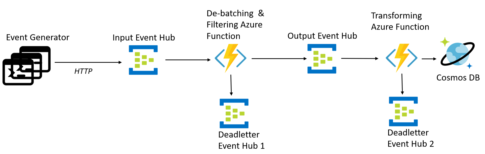

### Input event schema

A load for an IoT scenario is being simulated where data from different sensors is captured in an XML format. All the device data is represented by a very basic XML schema given below. This will be the event schema for load generated.

```xml
<xs:schema attributeFormDefault="unqualified" elementFormDefault="qualified" xmlns:xs="http://www.w3.org/2001/XMLSchema">
  <xs:element name="devices">
    <xs:complexType>
      <xs:sequence>
        <xs:element name="sensor" maxOccurs="unbounded" minOccurs="0">
          <xs:complexType>
            <xs:sequence>
              <xs:element type="xs:string" name="value"/>
            </xs:sequence>
            <xs:attribute type="xs:int" name="id" use="optional"/>
            <xs:attribute type="xs:string" name="type" use="optional"/>
            <xs:attribute type="xs:int" name="timestamp" use="optional"/>
          </xs:complexType>
        </xs:element>
      </xs:sequence>
    </xs:complexType>
  </xs:element>
</xs:schema>
```

Sample data:

```xml
<?xml version="1.0" encoding="utf-8"?>
<devices>
<sensor id="212321" type="alpha1" timestamp="1607029842"><value>eyJsb2NhdGlvbiI6IlNlYXR0bGUiLCJyZWFkaW5nIjozMS4yLCJjYXRlZ29yeSI6InRlbXBlcmF0dXJlIiwidGFncyI6WzIxMyw1NjQsNDM1XX0=</value></sensor>
<sensor id="435363" type="alpha1" timestamp="1607039842"><value>eyJsb2NhdGlvbiI6IlNlYXR0bGUiLCJyZWFkaW5nIjozMS4yLCJjYXRlZ29yeSI6InRlbXBlcmF0dXJlIiwidGFncyI6WzIxMyw1NjQsNDM1XX0=</value></sensor>
<sensor id="141297" type="alpha3" timestamp="1607135057"><value>eyJsb2NhdGlvbiI6Ik11bWJhaSIsInJlYWRpbmciOjEyLjMsImNhdGVnb3J5IjoiaHVtaWRpdHkiLCJ0YWdzIjpbNjQsNjU4LDEyM119</value></sensor>
<sensor id="231173" type="beta1" timestamp="1607245800"><value>eyJsb2NhdGlvbiI6Ik11bWJhaSIsInJlYWRpbmciOjEyLjMsImNhdGVnb3J5IjoiaHVtaWRpdHkiLCJ0YWdzIjpbNjQsNjU4LDEyM119</value></sensor>
</devices>
```

### De-batching & Filtering

The de-batching and filtering Azure Function will attempt to extract each message from the events and filter it based on whether `type==alpha*`. We do not want to process messages from any test device of type `beta`.

This Azure Function will send only the filtered xml messages to the Output Event Hub.

It will also check if a valid XML is received from the Input Event Hub.

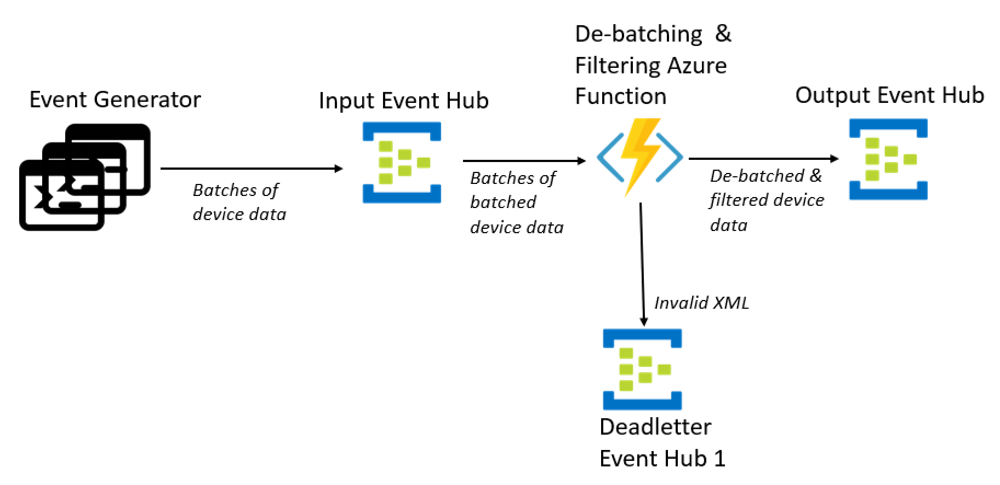

Any XML message with empty `value` field or invalid XML will be sent to Deadletter Event Hub 1

_Note: Here we are simulating each incoming event to be a batch of sensor device data. The Event Hub batch triggered Azure Function will ideally receive multiple such batches of sensor device data._

### De-coding & Transformation

The transforming Azure Function will base64 decode the `value` field of the incoming XML messages from Output Event Hub. If an error occurs while decoding, the message is sent to the Deadletter Event Hub 2.

Next, the function will convert the incoming XML messages from Output Event Hub into JSON. If an error occurs while converting XML to JSON, the message is sent to the Deadletter Event Hub 2.

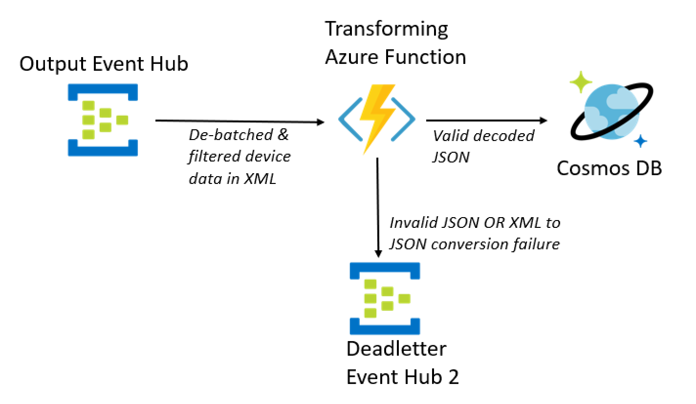

The final valid and decoded JSON entry to be upserted in Cosmos DB should look like this:

```json
{
  "value": "eyJsb2NhdGlvbiI6IlNlYXR0bGUiLCJyZWFkaW5nIjozMS4yLCJjYXRlZ29yeSI6InRlbXBlcmF0dXJlIiwidGFncyI6WzIxMyw1NjQsNDM1XX0=",
  "id": "212321",
  "type": "alpha1",
  "timestamp": "1607029842",
  "decodedValue": {
      "location":"Seattle",
      "reading":31.2,
      "category":"temperature",
      "tags":[213,564,435]
      }
}
```

 A reference implementation for this architecture is available on [GitHub][<ADD LINK>].

## Third Architecture

A variation from the second architecture that had been seen in customer projects was adding VNET integration to the solution as shown below.

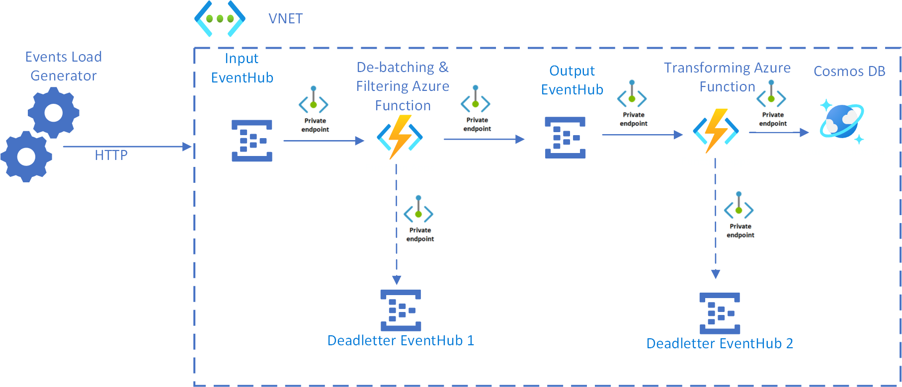

_Note: subnets are not shown in the image above for brevity.

 A reference implementation for this architecture is available on [GitHub][<ADD LINK>].

## Fourth Architecture

Another variation from the second architecture that had been seen in customer projects was running the same scenario on Azure Kubernates with KEDA as shown below.

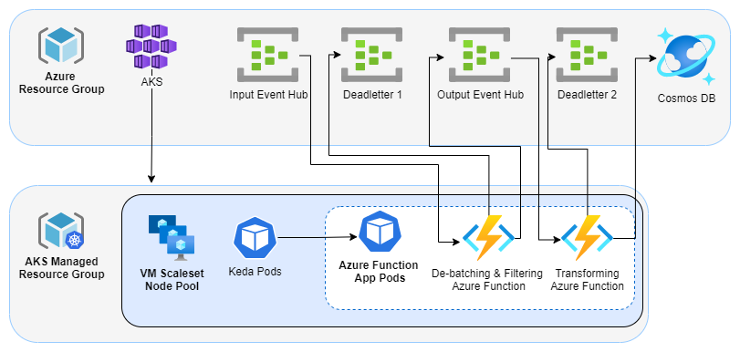

 A reference implementation for this architecture is available on [GitHub][<ADD LINK>].

## Monitoring

* Monitoring provides insight into the behaviour and health of your systems
* It helps to build a holistic view of the environment, give historic trends, correlate diverse factors, and measure changes in performance, consumption, or error rate.
* Finally, monitoring can be used to setup the next step which is defining and activating alerts.

### Metrics from Azure Monitor

The below metrics will be of interest to capture useful insights for Event Hub

* Incoming requests
* Outgoing requests
* Throttled requests
* Successful requests
* Incoming messages
* Outgoing messages
* Captured messages
* Incoming bytes
* Outgoing bytes
* Captured bytes
* User errors

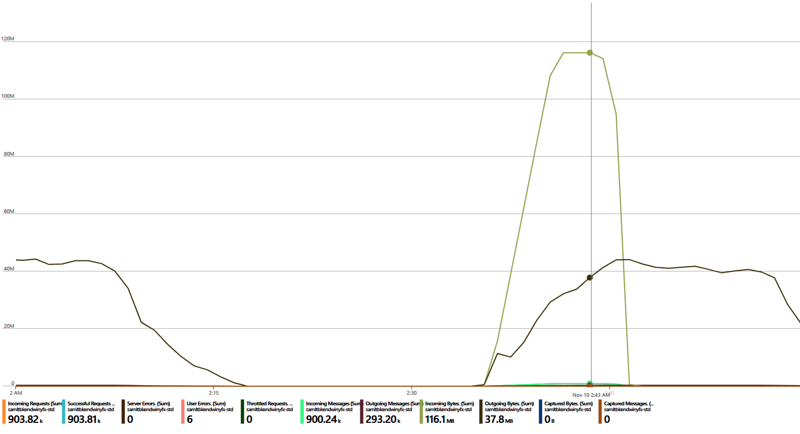

The below metrics will be of interest to capture useful insights for Azure Functions

* Function execution count
* Connections
* Data in
* Data out
* Http server errors
* Requests
* Requests in application queue
* Response time

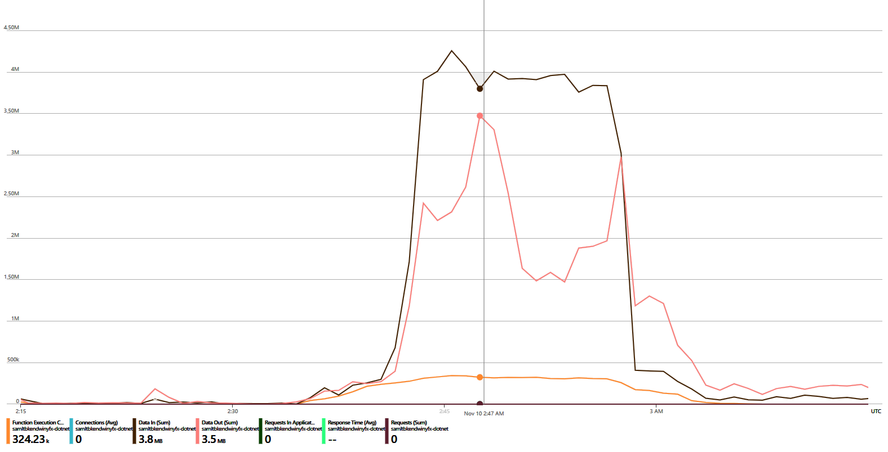

### Using Log Diagnostics to capture insights from above metrics

The different metrics can be used to capture the following insights:

* Rate of requests processed by Event Hubs
* Rate of requests processed by Azure Functions
* Total Event Hub throughput
* User errors
* Duration of Azure Functions
* End-to-end latency
* Latency at each stage
* Number of messages lost
* Number of messages processed more than once

Enabling Diagnostic setting for Event Hubs ensures that the necessary metrics are captured and made available in the Log Analytics Workspace. The log and metric categories that we are interested in are

* OperationalLogs
* AutoScaleLogs
* KafkaCoordinatorLogs _(for Kafka workloads)_
* KafkaUserErrorLogs _(for Kafka workloads)_
* EventHubVNetConnectionEvent
* AllMetrics

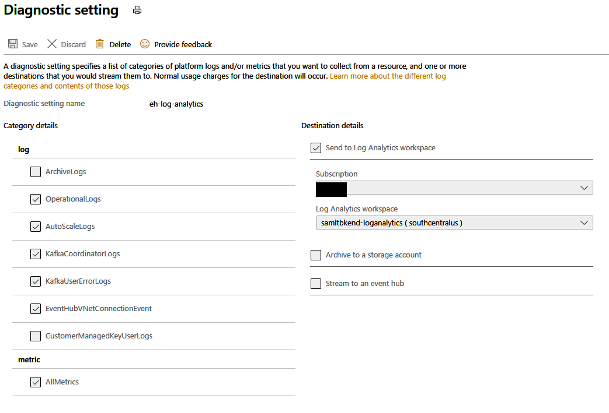

The options to stream the logs to Event Hubs can be used if an external system is being used to analyze the logs.

*Constraint:*

The Event Hubs in an Event Hub namespace are represented under a dimension called `EntityName` in Azure Monitor metrics. Data for specific Event Hub can be viewed on the Azure portal instance of Azure Monitor. However, when metric data is routed to Log Diagnostics, currently there is no way to view data per Event Hub by filtering on the `EntityName` dimension.

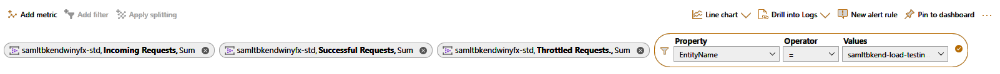

Thus the only easy resource is to create Event Hubs in different namespaces in order to utilize Log Diagnostics to capture above insights.

### Using Application Insights

Application Insights can be enabled for capturing metrics and custom telemetry from Azure Functions and proves to be another way to get important insights for the Serverless Event Processing scenario using Event Hubs.

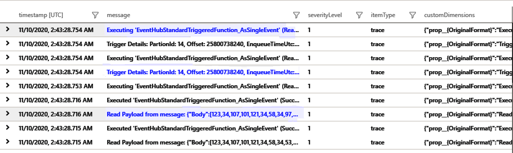

#### Default Custom Metrics

Custom metrics for Azure Functions are stored in the `customMetrics` table in Application Insights and includes below values spanned over a timeline for different Azure function instances:

* `AvgDurationMs`
* `MaxDurationMs`
* `MinDurationMs`
* `Successes`
* `Failures`
* `SuccessRate`
* `Count`

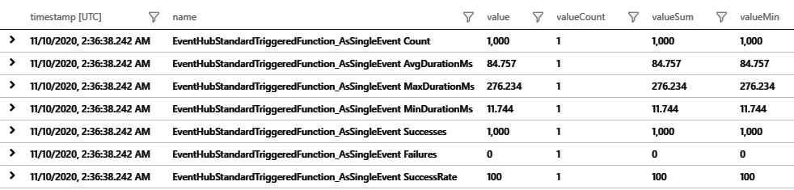

These metrics can be used to efficiently calculate the aggregated averages across the multiple function instances invoked in a run.

#### Custom Messages

Custom messages logged in the Azure Function code using the `ILogger` are obtained from the Application Insights `traces` table.

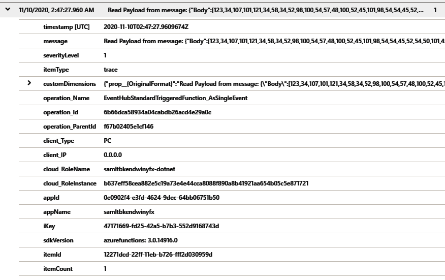

It has important properties like

* `_TimeReceived`
* `cloud_RoleInstance`
* `operation_Id`
* `operation_Name`
* `message`

If the incoming Event Hub message or EventData[] is logged as a part of this custom `ILogger` message, then that too is made available in AppInsights.

For the Serverless Event Processing scenario, we will be logging the Json serialized message body received from the Event Hub to capture the raw byte array along with SystemProperties like `x-opt-sequence-number`, `x-opt-offset` and `x-opt-enqueued-time`. The `x-opt-enqueued-time` is used to determine when each message was actually received by the Event Hub.

Sample Query

```kql
traces
| where timestamp between(min_t .. max_t)
| where message contains "Body"
| extend m = parse_json(message))
| project timestamp = todatetime(m.SystemProperties.["x-opt-enqueued-time"])
```

Message with Trigger Details is logged by default on Application Insights with the following properties which can be useful to capture insight around messages received per partition, offset and sequence number of message, etc.

_Constraint for Java Azure Functions: [PartitionId is not accessible in Java runtime](https://github.com/Azure/azure-functions-java-library/issues/138).

```kql
"message": Trigger Details: PartionId: 26, Offset: 17194119200, EnqueueTimeUtc: 2020-11-03T02:14:01.7740000Z, SequenceNumber: 843572, Count: 10,
```

#### Tracking message flow using Transaction Id with Application Insights

We can view all the telemetry related to a particular transaction using the `Operation Id` value.
This can be especially useful for capturing the percentile values of average times for messages as it moves through the end to end event stream pipeline.

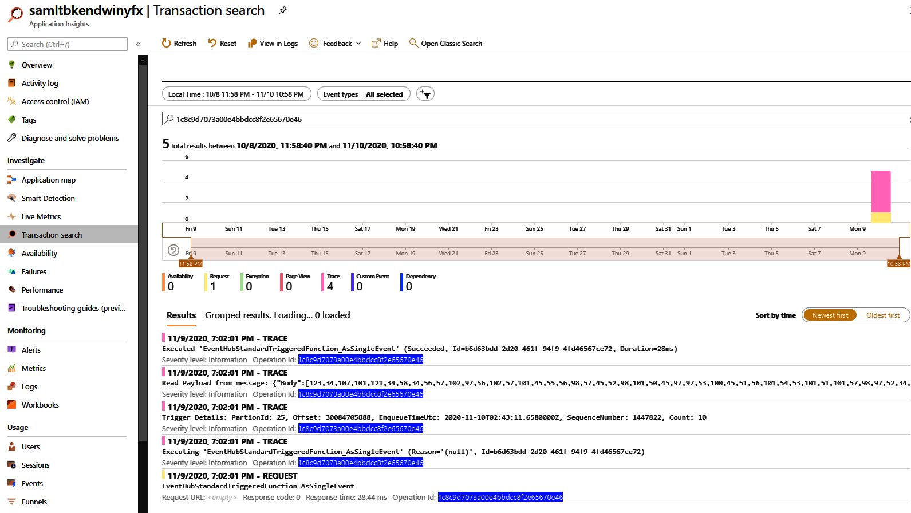

Query generated for a specific operation id will look like:

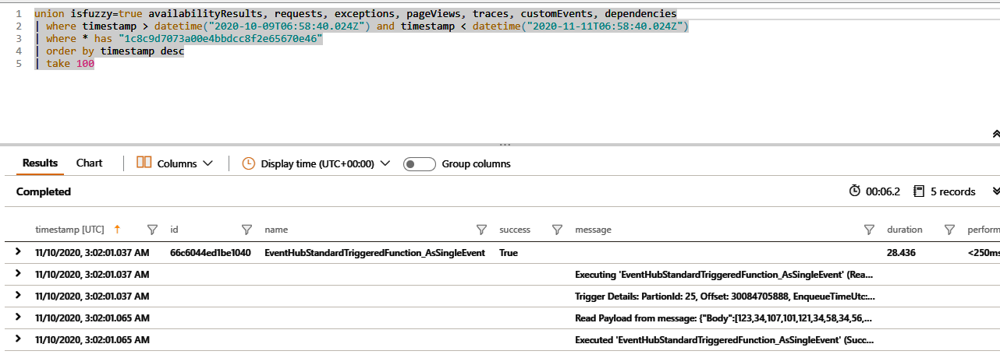

## Observability

### Capturing Custom Metrics from Azure Functions

#### .NET Functions

We have used [Structured Logging](https://docs.microsoft.com/en-us/azure/azure-functions/functions-dotnet-class-library?tabs=v2%2Ccmd#structured-logging) in the dotnet Azure functions for capturing custom dimensions in the Application Insights `traces` table. These custom dimensions can then be used for querying data.

As an example, here is the log statement in the .NET `TransformingFunction`:

```csharp
log.LogInformation("TransformingFunction: Processed sensorDataJson={sensorDataJson}, " +
    "partitionId={partitionId}, offset={offset} at {enqueuedTimeUtc}, " +
    "inputEH_enqueuedTime={inputEH_enqueuedTime}, processedTime={processedTime}, " +
    "transformingLatencyInMs={transformingLatencyInMs}, processingLatencyInMs={processingLatencyInMs}",
    sensorDataJson,
    partitionId,
    offset,
    enqueuedTimeUtc,
    inputEH_enqueuedTime,
    processedTime,
    transformingLatencyInMs,
    processingLatencyInMs);
```

The resulting logs created on Application Insights contain the above parameters as custom dimensions as shown below:


These can be queried easily as follows:

```kql
traces
| where timestamp between(min_t .. max_t)
// Function name should be of the function consuming from the Event Hub of interest
| where operation_Name == "{Function_Name}"
| where message has "{Function_Name}: Processed"
| project timestamp = todatetime(customDimensions.prop__enqueuedTimeUtc)
```

_Constraints: In order to make sure we do not affect performance in these tests, we have turned on the sampling settings of Azure Function logs for Application Insights using the `host.json` file as shown below. This means that all statistics captured from logging are considered to be average values and not actual counts._

```json
"logging": {
    "applicationInsights": {
    "samplingExcludedTypes": "Request",
    "samplingSettings": {
        "isEnabled": true
    }
  }
}
```

#### Java Functions

At the time of writing this, [Structured Logging](https://docs.microsoft.com/en-us/azure/azure-functions/functions-dotnet-class-library?tabs=v2%2Ccmd#structured-logging) was not supported in Java Azure functions for capturing custom dimensions in the Application Insights `traces` table.

As an example, here is the log statement in the Java `TransformingFunction`:

```java
LoggingUtilities.logSuccessInfo(context.getLogger(), "TransformingFunction", "SuccessInfo", offset, processedTimeString, dateformatter.format(enqueuedTime), transformingLatency);
```

The resulting logs created on Application Insights contain the above parameters in message as shown below:

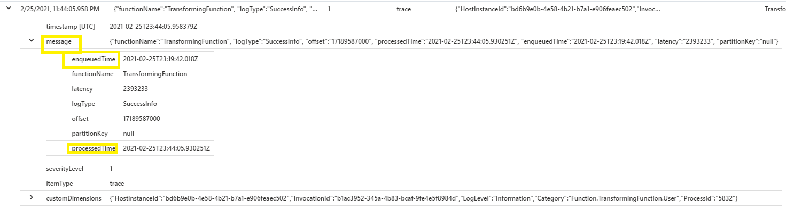

These can be queried easily as follows:

```kql
traces
| where timestamp between(min_t .. max_t)
// Function name should be of the function consuming from the Event Hub of interest
| where operation_Name in ("{Function name}") and message contains "SuccessInfo"
| project timestamp = todatetime(tostring(parse_json(message).enqueuedTime))
```

_Constraints: In order to make sure we do not affect performance in these tests, we have turned on the sampling settings of Azure Function logs for Application Insights using the `host.json` file as shown below. This means that all statistics captured from logging are considered to be average values and not actual counts._

```json
"logging": {
    "applicationInsights": {
    "samplingExcludedTypes": "Request",
    "samplingSettings": {
        "isEnabled": true
    }
  }
}
```

## Scalability considerations

### Event Hubs

The throughput capacity of Event Hubs is measured in [throughput units][eh-throughput]. You can autoscale an event hub by enabling [auto-inflate][eh-autoscale], which automatically scales the throughput units based on traffic, up to a configured maximum.

The [Event Hub trigger][eh-trigger] in the function app scales according to the number of partitions in the event hub. Each partition is assigned one function instance at a time. To maximize throughput, receive the events in a batch, instead of one at a time.

### Cosmos DB

Cosmos DB is available in 2 different capacity modes:

- [Serverless][cosmosdb-serverless] for workloads with intermittent or unpredictable traffic and low average-to-peak traffic ratio.
- [Provisioned throughput][cosmosdb-provisioned], for workloads with sustained traffic requiring predictable performance.

To make sure your workload is scalable, it is important to choose an appropriate [partition key][partition-key] when you create your Cosmos DB containers. Here are some characteristics of a good partition key:

- The key value space is large.
- There will be an even distribution of reads/writes per key value, avoiding hot keys.
- The maximum data stored for any single key value will not exceed the maximum physical partition size (20 GB).
- The partition key for a document won't change. You can't update the partition key on an existing document.

In the scenario for this reference architecture, the function stores exactly one document per device that is sending data. The function continually updates the documents with latest device status, using an upsert operation. Device ID is a good partition key for this scenario, because writes will be evenly distributed across the keys, and the size of each partition will be strictly bounded, because there is a single document for each key value. For more information about partition keys, see [Partition and scale in Azure Cosmos DB][cosmosdb-scale].

## Resiliency considerations

When using the Event Hubs trigger with Functions, catch exceptions within your processing loop. If an unhandled exception occurs, the Functions runtime does not retry the messages. If a message cannot be processed, put the message into a dead letter queue. Use an out-of-band process to examine the messages and determine corrective action.

The following code shows how the ingestion function catches exceptions and puts unprocessed messages onto a dead letter queue.

```csharp
[FunctionName("RawTelemetryFunction")]
[StorageAccount("DeadLetterStorage")]
public static async Task RunAsync(
    [EventHubTrigger("%EventHubName%", Connection = "EventHubConnection", ConsumerGroup ="%EventHubConsumerGroup%")]EventData[] messages,
    [Queue("deadletterqueue")] IAsyncCollector<DeadLetterMessage> deadLetterMessages,
    ILogger logger)
{
    foreach (var message in messages)
    {
        DeviceState deviceState = null;

        try
        {
            deviceState = telemetryProcessor.Deserialize(message.Body.Array, logger);
        }
        catch (Exception ex)
        {
            logger.LogError(ex, "Error deserializing message", message.SystemProperties.PartitionKey, message.SystemProperties.SequenceNumber);
            await deadLetterMessages.AddAsync(new DeadLetterMessage { Issue = ex.Message, EventData = message });
        }

        try
        {
            await stateChangeProcessor.UpdateState(deviceState, logger);
        }
        catch (Exception ex)
        {
            logger.LogError(ex, "Error updating status document", deviceState);
            await deadLetterMessages.AddAsync(new DeadLetterMessage { Issue = ex.Message, EventData = message, DeviceState = deviceState });
        }
    }
}
```

Notice that the function uses the [Queue storage output binding][queue-binding] to put items in the queue.

The code shown above also logs exceptions to Application Insights. You can use the partition key and sequence number to correlate dead letter messages with the exceptions in the logs.

Messages in the dead letter queue should have enough information so that you can understand the context of error. In this example, the `DeadLetterMessage` class contains the exception message, the original event data, and the deserialized event message (if available).

```csharp
public class DeadLetterMessage
{
    public string Issue { get; set; }
    public EventData EventData { get; set; }
    public DeviceState DeviceState { get; set; }
}
```

Use [Azure Monitor][monitor] to monitor the event hub. If you see there is input but no output, it means that messages are not being processed. In that case, go into [Log Analytics][log-analytics] and look for exceptions or other errors.

## Disaster recovery considerations

The deployment shown here resides in a single Azure region. For a more resilient approach to disaster-recovery, take advantage of geo-distribution features in the various services:

- **Event Hubs**. Create two Event Hubs namespaces, a primary (active) namespace and a secondary (passive) namespace. Messages are automatically routed to the active namespace unless you fail over to the secondary namespace. For more information, see [Azure Event Hubs Geo-disaster recovery][eh-dr].

- **Function App**. Deploy a second function app that is waiting to read from the secondary Event Hubs namespace. This function writes to a secondary storage account for dead letter queue.

- **Cosmos DB**. Cosmos DB supports [multiple write regions][cosmosdb-geo], which enables writes to any region that you add to your Cosmos DB account. If you don’t enable multi-write, you can still fail over the primary write region. The Cosmos DB client SDKs and the Azure Function bindings automatically handle the failover, so you don’t need to update any application configuration settings.

- **Azure Storage**. Use [RA-GRS][ra-grs] storage for the dead letter queue. This creates a read-only replica in another region. If the primary region becomes unavailable, you can read the items currently in the queue. In addition, provision another storage account in the secondary region that the function can write to after a fail-over.

## Cost considerations

Use the [Azure Pricing calculator][azure-pricing-calculator] to estimates costs. See also the Cost section in [Microsoft Azure Well-Architected Framework][aaf-cost]. Here are some other considerations.

### Azure Functions

Azure Functions supports two hosting models. 

- **Consumption plan**. 

    Compute power is automatically allocated when your code is running. 

- **App Service** plan. 

    A set of VMs are allocated for your code. The App Service plan defines the number of VMs and the VM size.

In this architecture, each event that arrives on Event Hubs, triggers a function that processes that event. From a cost perspective, the recommendation is to use **consumption plan** because you pay only for the compute resources you use.

### Azure Cosmos DB

With Cosmos DB, you pay for the operations you perform against the database and for the storage consumed by your data.

- **Database operations**: The way you get charged for your database operations depends on the type of Azure Cosmos DB account you are using.

  - In [serverless][cosmosdb-serverless] mode, you don't have to provision any throughput when creating resources in your Azure Cosmos account. At the end of your billing period, you get billed for the amount of [Request Units][ru] that has been consumed by your database operations.

  - In [provisioned throughput][cosmosdb-provisioned] mode, you specify the throughput that you need in [Request Units][ru] per second (RU/s), and get billed hourly for the maximum provisioned throughput for a given hour. **Note**: Because the provisioned throughput model dedicates resources to your container or database, you will be charged for the throughput you have provisioned even if you don't run any workloads.

- **Storage**: You are billed a flat rate for the total amount of storage (in GBs) consumed by your data and indexes for a given hour.

In this reference architecture, the function stores exactly one document per device that is sending data. The function continually updates the documents with latest device status, using an upsert operation, which is cost effective in terms of consumed storage. For more information, see [Cosmos DB pricing model][cosmosdb-pricing].

Use the [Cosmos DB capacity calculator][Cosmos-Calculator] to get a quick estimate of the workload cost.

## DevOps considerations

Use Infrastructure as code (IaC) when possible. IaC manages the infrastructure, application, and storage resources with a declarative approach like [Azure Resource Manager][arm-template]. That will help in automating deployment using DevOps as a continuous integration and continuous delivery (CI/CD) solution. Templates should be versioned and included as part of the release pipeline.

When creating templates, group resources as a way to organize and isolate them per workload. A common way to think about workload is a single serveless application or a virtual network. The goal of workload isolation is to associate the resources to a team, so that the DevOps team can independently manage all aspects of those resources and perform CI/CD.

This architecture includes steps to configure the Drone Status Function App using Azure Pipelines with YAML and Azure Functions Slots. 

As you deploy your services you will need to monitor them. Consider using [Application Insights][app-insights] to enable the developers to monitor performance and detect issues.


For more information, see the DevOps section in [Microsoft Azure Well-Architected Framework][AAF-devops].


## Deploy the solution

* To deploy first reference architecture, view the [GitHub readme][readme].
* To deploy second reference architecture, view the [GitHub readme][ADD LINK].
* To deploy third reference architecture, view the [GitHub readme][ADD LINK].
* To deploy fourth reference architecture, view the [GitHub readme][ADD LINK].

## Next steps

To learn more about the reference implementation, read [Code walkthrough: Serverless application with Azure Functions](../../serverless/code.md).

<!-- links -->


[AAF-cost]: ../../framework/cost/overview.md
[AAF-devops]: ../../framework/devops/overview.md
[app-insights]: /azure/azure-monitor/app/app-insights-overview
[arm-template]: /azure/azure-resource-manager/resource-group-overview#resource-groups
[Cosmos-Calculator]: https://cosmos.azure.com/capacitycalculator/
[cosmosdb]: /azure/cosmos-db/introduction
[cosmosdb-geo]: /azure/cosmos-db/distribute-data-globally
[cosmosdb-scale]: /azure/cosmos-db/partition-data
[cosmosdb-pricing]: https://azure.microsoft.com/pricing/details/cosmos-db/
[cosmosdb-sql]: /azure/cosmos-db/sql-api-introduction
[cosmosdb-serverless]: /azure/cosmos-db/serverless
[cosmosdb-provisioned]: /azure/cosmos-db/set-throughput
[Cost-Calculator]: https://azure.microsoft.com/pricing/calculator/
[eh]: /azure/event-hubs/
[eh-autoscale]: /azure/event-hubs/event-hubs-auto-inflate
[eh-dr]: /azure/event-hubs/event-hubs-geo-dr
[eh-throughput]: /azure/event-hubs/event-hubs-scalability#throughput-units
[eh-trigger]: /azure/azure-functions/functions-bindings-event-hubs
[functions]: /azure/azure-functions/functions-overview
[iot]: /azure/iot-hub/iot-hub-compare-event-hubs
[log-analytics]: /azure/log-analytics/log-analytics-queries
[monitor]: /azure/azure-monitor/overview
[partition-key]: /azure/cosmos-db/partition-data
[pipelines]: /azure/devops/pipelines/index
[queue]: /azure/storage/queues/storage-queues-introduction
[queue-binding]: /azure/azure-functions/functions-bindings-storage-queue-output
[ra-grs]: /azure/storage/common/storage-redundancy-grs
[ru]: /azure/cosmos-db/request-units

[cosmosdb-geo]: /azure/cosmos-db/distribute-data-globally
[cosmosdb-scale]: /azure/cosmos-db/partition-data
[cosmosdb-pricing]: https://azure.microsoft.com/pricing/details/cosmos-db
[cosmosdb-sql]: /azure/cosmos-db/sql-api-introduction
[azure-pricing-calculator]: https://azure.microsoft.com/pricing/calculator
[eh]: /azure/event-hubs
[eh-autoscale]: /azure/event-hubs/event-hubs-auto-inflate
[eh-dr]: /azure/event-hubs/event-hubs-geo-dr
[eh-throughput]: /azure/event-hubs/event-hubs-scalability#throughput-units
[eh-trigger]: /azure/azure-functions/functions-bindings-event-hubs
[functions]: /azure/azure-functions/functions-overview
[iot]: /azure/iot-hub/iot-hub-compare-event-hubs
[log-analytics]: /azure/log-analytics/log-analytics-queries
[monitor]: /azure/azure-monitor/overview
[partition-key]: /azure/cosmos-db/partition-data
[pipelines]: /azure/devops/pipelines/index
[queue]: /azure/storage/queues/storage-queues-introduction
[queue-binding]: /azure/azure-functions/functions-bindings-storage-queue-output
[ra-grs]: /azure/storage/common/storage-redundancy-grs
[ru]: /azure/cosmos-db/request-units

[github]: https://github.com/mspnp/serverless-reference-implementation/tree/v0.1.0
[readme]: https://github.com/mspnp/serverless-reference-implementation/blob/v0.1.0/README.md