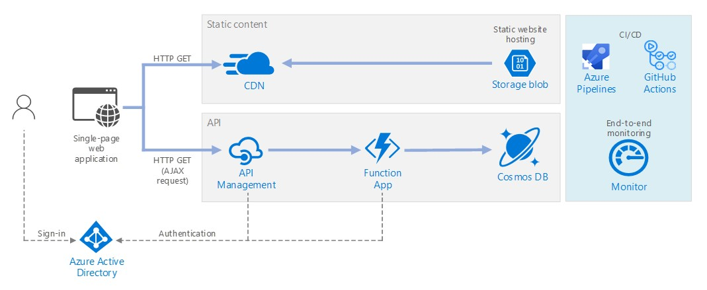

# Serverless web application 

This reference architecture shows a serverless web application. The application serves static content from Azure Blob Storage, and implements an API using Azure Functions. The API reads data from Cosmos DB and returns the results to the web app.


 
A reference implementation for this architecture is available on [GitHub][github]. 

The term serverless has two distinct but related meanings:

- **Backend as a service** (BaaS). Backend cloud services, such as databases and storage, provide APIs then enable client applications to connect directly to these services. 
- **Functions as a service** (FaaS). In this model, a "function" is a piece of code that is deployed to the cloud and runs inside a hosting environment that completely abstracts the servers that run the code. 

What both definitions have in common is that developers and DevOps personnel using these services don't have to deploy, configure, or manage servers. This reference architecture focuses on FaaS using Azure Functions, although serving web content from Azure Blob Storage is an example of BaaS. Some important characteristics of FaaS are:

1. Compute resources are allocated dynamically as needed by the platform.
1. Consumption-based pricing: You are charged only for the compute resources used to execute your code.
1. The compute resources scale on demand based on traffic, without the developer needing to do any configuration.

Functions are executed when an external trigger occurs, such as an HTTP request or a message arriving on a queue. This makes an [event-driven architecture style][event-driven] natural for serverless architectures. To coordinate work between components in the architecture, consider using message brokers or pub/sub patterns. For help choosing between messaging technologies in Azure, see [Choose between Azure services that deliver messages][azure-messaging].

## Architecture
The architecture consists of the following components.

**Blob Storage**. Static files are stored in Azure Blob Storage and served to client by using [static website hosting][static-hosting]. This makes it possible to deliver web content without managing any servers. All dynamic interaction happens through JavaScript code making calls to the backend APIs. There is no server-side code to render the web page.

> [!NOTE]
> Static website hosting is currently in [preview][static-hosting-preview].

**CDN**. Use [Azure Content Delivery Network][cdn] (CDN) to cache content for lower latency and faster delivery of content as well as provide a HTTPS endpoint.

**Function Apps**. Azure Functions is a serverless compute option. It uses an event-driven model, where a piece of code (a "function") is invoked by a trigger. In this architecture, the function is invoked when a client makes an HTTP request through API Management. 

**API Management**. API Management provides a API gateway that sits in front of the HTTP function. You can use API Management to publish and manage APIs used by client applications. Using a gateway helps to decouple the front-end application from the back-end APIs. For example, API Management can rewrite URLs, transform requests before they reach the backend, set request or response headers, and so forth.
API Management can also be used to implement cross-cutting concerns such as:

- Enforcing usage quotas and rate limits
- Validating OAuth tokens for authentication
- Enabling cross-origin requests (CORS)
- Caching responses
- Monitoring and logging requests  

If you don't need all of the functionality provided by API Management, another option is to use Functions Proxies. This feature of Azure Functions allows you define a single API surface for multiple function apps, by defining routes to back-end functions. While function proxies can transform the HTTP request and response, they don't provide the same rich policy-based capabilities of API Management.

**Cosmos DB**. Cosmos DB is a multi-model database  service. For this scenario, the function app fetches documents from Cosmos DB in response to HTTP GET requests from the client application.

**Azure Active Directory** (Azure AD). Users sign into the web application by using their Azure AD credentials. 

**Azure Monitor**. Azure Monitor collects performance metrics about the Azure services deployed in the solution. By visualizing these in a dashboard, you can get visibility into the health of the solution. 

**Azure Pipelines** is a continuous integration (CI) and continuous delivery (CD) service that builds, tests, and deploys the application.

## Recommendations

### Function App plans

Azure Functions supports two hosting models. With the **consumption plan**, compute power is automatically allocated when your code is running.  With the **App Service** plan, a set of VMs are allocated for your code. The App Service plan defines the number of VMs and the VM size. 

Note that the App Service plan is not strictly serverless, according to the definition given above. The programming model is the same, however &mdash; the same code can run in a consumption or an App Service plan.

Here are some factors to consider when choosing which type of plan to use:

- **Cold start**. With the consumption plan, a function that hasn't been invoked recently will incur some additional latency the next time it runs. This additional latency is due to allocating and preparing the runtime environment. It is usually on the order of seconds but depends on several factors, including the number of dependencies that need to be loaded. For more information, see [Understanding Serverless Cold Start][functions-cold-start]. Cold start is usually more of a concern for interactive workloads (HTTP triggers) than asynchronous message-driven workloads (queue or event hubs triggers), because the additional latency is directly observed by users.
- **Timeout period**.  In the consumption plan, a function execution times out after a [configurable][functions-timeout] period of time (to a maximum of 10 minuts)
- **Virtual network isolation**. Using an App Service plan allows to run functions inside of an [App Service Environment][ase], which is a dedicated and isolated hosting environment.
- **Pricing model**. Consumption plan is billed by the number of executions and resource consumptione (memory x execution time). The App Service plan is billed hourly based on VM instance SKU.  The consumption plan can be cheaper than an App Service plan, because you pay only for the compute resources that you use. However, if an application experiences constant high-volume throughput, an App Service plan may cost less.
- **Scaling**. A big advantage of the consumption model is that it scales to as many VMs as needed based on the incoming traffic. While this scaling occurs quickly, there is a ramp-up period. For some workloads, you might want to deliberately overprovision the VMs in order to handle bursts with zero ramp-up time, in which case you should consider the App plan. 

### Function App boundaries

A *function app* hosts the execution of one or more functions. You can use a function app to group several functions together as a logical unit. Within a function app, the functions share the same application settings, hosting plan, and deployment. Each function app has its own hostname.  

Use function apps to group functions that share the same lifecycle and settings. Functions that don't share the same lifecycle should be hosted in different Function Apps. 

Consider taking a microservices approach, where each Function App represents one microservice, possibly consisting of multiple related functions. In a microservices architecture, services should have loose coupling and high functional cohesion. Loosely coupled means you can change one service without requiring other services to be updated at the same time. Cohesive means a service has a single, well-defined purpose. For more discussion of these ideas, see [Designing microservices: Domain analysis][microservices-domain-analysis].

### Function bindings

Use Function [bindings][functions-bindings] when possible. Bindings provide a declarative way to connect your code to data and integrate with other Azure services. An input binding populates an input parameter from an external data source. An output binding sends the function's return value to a data sink, such as a queue or database.

For example, the `GetStatus` function in the reference implementation uses the Cosmos DB [input binding][cosmosdb-input-binding]. This binding is configured to look up a document in Cosmos DB, using query parameters that are taken from the query string in the HTTP request. If the document is found, it is passed to the function as a parameter.

```csharp
[FunctionName("GetStatusFunction")]
public static Task<IActionResult> Run(
    [HttpTrigger(AuthorizationLevel.Function, "get", "post", Route = null)] HttpRequest req, 
    [CosmosDB(
        databaseName: "%COSMOSDB_DATABASE_NAME%",
        collectionName: "%COSMOSDB_DATABASE_COL%",
        ConnectionStringSetting = "COSMOSDB_CONNECTION_STRING",
        Id = "{Query.deviceId}",
        PartitionKey = "{Query.deviceId}")] dynamic deviceStatus, 
    ILogger log)
{
    ...
}
```

By using bindings, you don't need to write code that talks directly to the service, which makes the function code simpler and also abstracts the details of where the data is coming from or being sent. In some cases, however, you may need more complex logic than the binding provides. In that case, use the Azure client SDKs directly.

## Scalability considerations

**Functions**. For consumption plan, the HTTP trigger scales based on the traffic. There is a limit to the number of concurrent function instances, but each instance can process more than one request at a time. For an App Service plan, the HTTP trigger scales according to the number of VM instances, which can be a fixed value or can autoscale based on a set of autoscaling rules. For information, see [Azure Functions scale and hosting][functions-scale]. 

**Cosmos DB**. Throughput capacity for Cosmos DB is measured in [Request Units][ru] (RU). A 1-RU throughput corresponds to the throughput of the GET of a 1-KB document. In order to scale a Cosmos DB container past 10,000 RU, you must specify a partition key when you create the container and include the [partition key][partition-key] in every document that you create. For more information about partition keys, see [Partition and scale in Azure Cosmos DB][cosmosdb-scale].

**API Management**. API Management can scale out and supports rule-based autoscaling. Note that the scaling process takes at least 20 minutes. If your traffic is bursty, you should provision for the maximum burst traffic that you expect. However, autoscaling is useful for handling hourly or daily variations in traffic. For more information, see [Automatically scale an Azure API Management instance][apim-scale].

## Disaster recovery considerations

The deployment shown here resides in a single Azure region. For a more resilient approach to disaster-recovery, take advantage of geo-distribution features in the various services:

- Azure API Management supports multi-region deployment, which can be used to distribute a single API Management instance across any number of Azure regions. 

- Use Traffic Manager to route HTTP requests to the primary region. If the Function App running in that region becomes unavailable, Traffic Manager can fail over to a secondary region.

- Cosmos DB supports multiple master regions, which enables writes to any region that you add to your Cosmos DB account. If you don't enable multi-master, you can still fail over the primary write region. The Cosmos DB client SDKs and the Azure Function bindings automatically handle the failover, so you don't need to update any application configuration settings.

## Security considerations

### Authentication

The GetStatus API uses Azure Active Directory (Azure AD) to authenticate requests. Azure AD supports the Open ID Connect protocol, which is an authentication protocol built on top of the OAuth 2 protocol.

In our reference implementation, the client application is a single-page application (SPA) that runs in the browser. This type of client application cannot keep a client secret or a authorization code hidden, so the implicit grant flow is appropriate. (See [Which OAuth 2.0 flow should I use?][oauth-flow])

1. The user clicks the "Sign in" link in the web application
1. The browser is redirected the Azure AD sign in page. 
1. The user signs in
1. Azure AD redirects back to the client application, including an access token in the URL fragment
1. When the web application calls the GetStatus API, it includes the access token in the Authentication header. The application ID is sent as the audience (‘aud') claim in the access token. 
1. The backend API validates the access token.

Register an application in your Azure AD tenant. This generates an application ID, which the client includes with the login URL.

Enable Azure AD authentication inside the Function App. For more information, see [Authentication and authorization in Azure App Service][app-service-auth].

Also add a policy to API Management to pre-authorize the request by validating the access token:

```xml
<validate-jwt header-name="Authorization" failed-validation-httpcode="401" failed-validation-error-message="Unauthorized. Access token is missing or invalid.">
    <openid-config url="https://login.microsoftonline.com/[Azure AD tenant ID]/.well-known/openid-configuration" />
    <required-claims>
        <claim name="aud">
            <value>[Application ID]</value>
        </claim>
    </required-claims>
</validate-jwt>
```

### Authorization

In many applications, the backend API must check whether a user has permission to perform a given action. It's recommended to use [claims-based authorization][claims], where information about the user is conveyed by the identity provider (in this case, Azure AD) and used to make authorization decisions. 

Some claims are provided inside the ID token that Azure AD returns to the client. You can get these claims from within the Function app by examining the X-MS-CLIENT-PRINCIPAL header in the request. For other claims, use [Microsoft Graph][graph] to query Azure Active Directory (requires user consent during sign-in). 

For example, when you register an application in Azure AD, you can define a set of application roles in the application's registration manifest. When a user signs into the application, Azure AD includes a "roles" claim for each role that the user has been granted (including roles that are inherited through group membership). 

In the reference implementation, the function checks whether the authenticated user is a member of the `GetStatus` application role. If not, the function returns an HTTP Unauthorized (401) response. 

```csharp
[FunctionName("GetStatusFunction")]
public static Task<IActionResult> Run(
    [HttpTrigger(AuthorizationLevel.Function, "get", "post", Route = null)] HttpRequest req, 
    [CosmosDB(
        databaseName: "%COSMOSDB_DATABASE_NAME%",
        collectionName: "%COSMOSDB_DATABASE_COL%",
        ConnectionStringSetting = "COSMOSDB_CONNECTION_STRING",
        Id = "{Query.deviceId}",
        PartitionKey = "{Query.deviceId}")] dynamic deviceStatus, 
    ILogger log)
{
    log.LogInformation("Processing GetStatus request.");

    return req.HandleIfAuthorizedForRoles(new[] { GetDeviceStatusRoleName },
        async () =>
        {
            string deviceId = req.Query["deviceId"];
            if (deviceId == null)
            {
                return new BadRequestObjectResult("Missing DeviceId");
            }

            return await Task.FromResult<IActionResult>(deviceStatus != null
                    ? (ActionResult)new OkObjectResult(deviceStatus)
                    : new NotFoundResult());
        },
        log);
}
```

In this code example, `HandleIfAuthorizedForRoles` is an extension method that checks for the role claim and returns HTTP 401 if the claim isn't found. You can find the source code [here][HttpRequestAuthorizationExtensions]. Notice that `HandleIfAuthorizedForRoles` takes an `ILogger` parameter. You should log unauthorized requests so that you have an audit trail and can diagnose issues if needed. At the same time, avoid leaking any detailed information inside the HTTP 401 response.

### CORS

In this reference architecture, the web application and the API do not share the same origin. That means when the application calls the API, it is a cross-origin request. Browser security prevents a web page from making AJAX requests to another domain. This restriction is called the same-origin policy and prevents a malicious site from reading sensitive data from another site. To enable a cross-origin request, add a Cross-Origin Resource Sharing (CORS) [policy][cors-policy] to the API Management gateway:

```xml
<cors allow-credentials="true">
    <allowed-origins>
        <origin>[Website URL]</origin>
    </allowed-origins>
    <allowed-methods>
        <method>GET</method>
    </allowed-methods>
    <allowed-headers>
        <header>*</header>
    </allowed-headers>
</cors>
```

In this example, the **allow-credentials** attribute is **true**. This authorizes the browser to send credentials (including cookies) with the request. Otherwise, by default the browser does not send credentials with a cross-origin request.

> [!NOTE] 
> Be very careful about setting **allow-credentials** to **true**, because it means a website can send the user's credentials to your API on the user's behalf, without the user being aware. You must trust the allowed origin.

### Enforce HTTPS

For maximum security, require HTTPS throughout the request pipeline

- CDN. Azure CDN supports HTTPS on the *.azureedge.net subdomain by default. To enable SSL in the CDN for custom domain names, see [Tutorial: Configure HTTPS on an Azure CDN custom domain][cdn-https].

- Static website hosting. Enable the "[Secure transfer required][storage-https]" option on the Storage account. When this option is enabled, the storage account only allows requests to the account from secure HTTPS connections. 

    > [!NOTE]
    >  To use SSL with a custom domain name, you must use CDN.

- API Management. Configure the APIs to use HTTPS protocol only. You can configure this in the Azure portal or through a Resource Manager template:

    ```json
    {
        "apiVersion": "2018-01-01",
        "type": "apis",
        "name": "dronedeliveryapi",
        "dependsOn": [
            "[concat('Microsoft.ApiManagement/service/', variables('apiManagementServiceName'))]"
        ],
        "properties": {
            "displayName": "Drone Delivery API",
            "description": "Drone Delivery API",
            "path": "api",
            "protocols": [ "HTTPS" ]
        },
        ...
    }
    ```

- Azure Functions. Enable the "[HTTPS Only][functions-https]" setting. 

### Lock down the Function App

Configure the Function App to require a function key. The API Management gateway will include the function key when it calls the Function App. 
In addition, the API Management gateway has a [static IP address][apim-ip]. (This feature is available for Standard tier services only.) Restrict the Azure Function to allow only calls from that static IP address. For more information, see [Azure App Service Static IP Restrictions][app-service-ip-restrictions].

### Protect application secrets

Don't store application secrets, such as database credentials, in your code or configuration files. Instead, use App settings, which are stored encrypted in Azure. For more information, see [Security in Azure App Service and Azure Functions][app-service-security].

Alternatively, you can store application secrets in Key Vault. This allows you to centralize the storage of secrets, control their distribution, and monitor how and when secrets are being accessed. For more information, see [Configure an Azure web application to read a secret from Key Vault][key-vault-web-app]. However, note that Function triggers and bindings load their configuration settings from app settings. There is no built-in way to configure the triggers and bindings to use Key Vault secrets.

## DevOps considerations

### API versioning

An API is a contract between a service and clients or consumers of that service. Support versioning in your API contract. If you introduce a breaking API change, introduce a new API version. Deploy the new version side-by-side with the original version, in a separate Function App. This lets you migrate existing clients to the new API without breaking client applications. Eventually, you can deprecate the previous version. For more information about API versioning, see [Versioning a RESTful web API][api-versioning].

For updates that are not breaking API changes, deploy the new version to a staging slot in the same Function App. Verify the deployment succeeded and then swap the staged version with the production version. 

## Deploy the solution

[api-versioning]: ../../best-practices/api-design.md#versioning-a-restful-web-api
[apim-ip]: /azure/api-management/api-management-faq#is-the-api-management-gateway-ip-address-constant-can-i-use-it-in-firewall-rules
[apim-scale]: /azure/api-management/api-management-howto-autoscale
[app-service-auth]: /azure/app-service/app-service-authentication-overview
[app-service-ip-restrictions]: /azure/app-service/app-service-ip-restrictions
[app-service-security]: /azure/app-service/app-service-security
[ase]: /azure/app-service/environment/intro
[azure-messaging]: /azure/event-grid/compare-messaging-services
[claims]: https://en.wikipedia.org/wiki/Claims-based_identity
[cdn]: https://azure.microsoft.com/services/cdn/
[cdn-https]: /azure/cdn/cdn-custom-ssl
[cors-policy]: /azure/api-management/api-management-cross-domain-policies
[cosmosdb-input-binding]: /azure/azure-functions/functions-bindings-cosmosdb-v2#input
[cosmosdb-scale]: /azure/cosmos-db/partition-data
[event-driven]: ../../guide/architecture-styles/event-driven.md
[functions-bindings]: /azure/azure-functions/functions-triggers-bindings
[functions-cold-start]: https://blogs.msdn.microsoft.com/appserviceteam/2018/02/07/understanding-serverless-cold-start/
[functions-https]: /azure/app-service/app-service-web-tutorial-custom-ssl#enforce-https
[functions-scale]: /azure/azure-functions/functions-scale
[functions-timeout]: /azure/azure-functions/functions-scale#consumption-plan
[graph]: https://developer.microsoft.com/graph/docs/concepts/overview
[key-vault-web-app]: /azure/key-vault/tutorial-web-application-keyvault
[microservices-domain-analysis]: ../../microservices/domain-analysis.md
[oauth-flow]: https://auth0.com/docs/api-auth/which-oauth-flow-to-use
[partition-key]: /azure/cosmos-db/partition-data
[ru]: /azure/cosmos-db/request-units
[static-hosting]: /azure/storage/blobs/storage-blob-static-website
[static-hosting-preview]: https://azure.microsoft.com/blog/azure-storage-static-web-hosting-public-preview/
[storage-https]: /azure/storage/common/storage-require-secure-transfer

<!-- TODO: Update these links! -->

[github]: https://github.com/mspnp/reference-architectures
[HttpRequestAuthorizationExtensions]: https://github.com/mspnp/reference-architectures