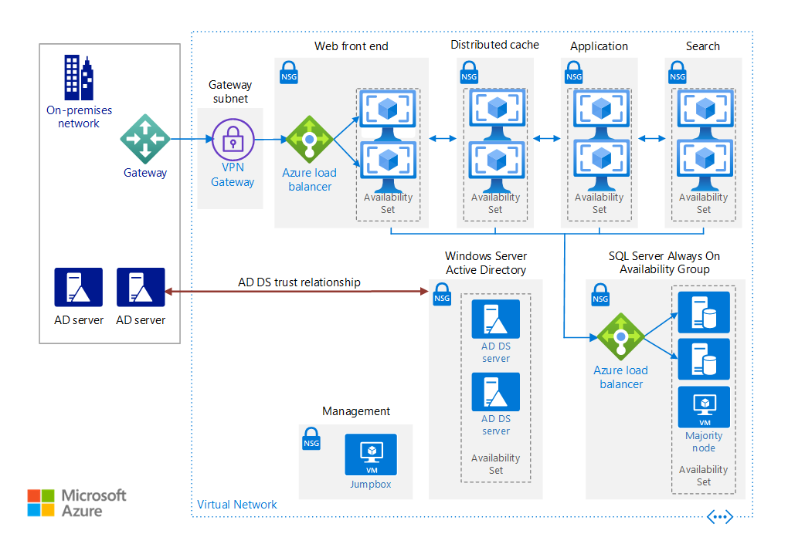

# Run a highly available SharePoint Server 2016 farm in Azure

This reference architecture shows proven practices for deploying a highly available SharePoint Server 2016 farm on Azure, using MinRole topology and SQL Server Always On availability groups. The SharePoint farm is deployed in a secured virtual network with no Internet-facing endpoint or presence. [**Deploy this solution**](#deploy-the-solution).



*Download a [Visio file][visio-download] of this architecture.*

## Architecture

This architecture builds on the one shown in [Run Windows VMs for an N-tier application][windows-n-tier]. It deploys a SharePoint Server 2016 farm with high availability inside an Azure virtual network (VNet). This architecture is suitable for a test or production environment, a SharePoint hybrid infrastructure with Office 365, or as the basis for a disaster recovery scenario.

The architecture consists of the following components:

- **Resource groups**. A [resource group][resource-group] is a container that holds related Azure resources. One resource group is used for the SharePoint servers, and another resource group is used for infrastructure components that are independent of VMs, such as the virtual network and load balancers.

- **Virtual network (VNet)**. The VMs are deployed in a VNet with a unique intranet address space. The VNet is further subdivided into subnets.

- **Virtual machines (VMs)**. The VMs are deployed into the VNet, and private static IP addresses are assigned to all of the VMs. Static IP addresses are recommended for the VMs running SQL Server and SharePoint Server 2016, to avoid issues with IP address caching and changes of addresses after a restart.

- **Availability sets**. Place the VMs for each SharePoint role into separate [availability sets][availability-set], and provision at least two virtual machines (VMs) for each role. This makes the VMs eligible for a higher service level agreement (SLA).

- **Internal load balancer**. The [load balancer][load-balancer] distributes SharePoint request traffic from the on-premises network to the front-end web servers of the SharePoint farm.

- **Network security groups (NSGs)**. For each subnet that contains virtual machines, a [network security group][nsg] is created. Use NSGs to restrict network traffic within the VNet, in order to isolate subnets.

- **Gateway**. The gateway provides a connection between your on-premises network and the Azure virtual network. Your connection can use ExpressRoute or site-to-site VPN. For more information, see [Connect an on-premises network to Azure][hybrid-ra].

- **Windows Server Active Directory (AD) domain controllers**. This reference architecture deploys Windows Server AD domain controllers. These domain controllers run in the Azure VNet and have a trust relationship with the on-premises Windows Server AD forest. Client web requests for SharePoint farm resources are authenticated in the VNet rather than sending that authentication traffic across the gateway connection to the on-premises network. In DNS, intranet A or CNAME records are created so that intranet users can resolve the name of the SharePoint farm to the private IP address of the internal load balancer.

  SharePoint Server 2016 also supports using [Azure Active Directory Domain Services](/azure/active-directory-domain-services/). Azure AD Domain Services provides managed domain services, so that you don't need to deploy and manage domain controllers in Azure.

- **SQL Server Always On availability group**. For high availability of the SQL Server database, we recommend [SQL Server Always On availability groups][sql-always-on]. Two virtual machines are used for SQL Server. One contains the primary database replica and the other contains the secondary replica.

- **Majority node VM**. This VM allows the failover cluster to establish quorum. For more information, see [Understanding Quorum Configurations in a Failover Cluster][sql-quorum].

- **SharePoint servers**. The SharePoint servers perform the web front-end, caching, application, and search roles.

- **Jumpbox**. Also called a [bastion host][bastion-host]. This is a secure VM on the network that administrators use to connect to the other VMs. The jumpbox has an NSG that allows remote traffic only from public IP addresses on a safe list. The NSG should permit remote desktop (RDP) traffic.

## Recommendations

Your requirements might differ from the architecture described here. Use these recommendations as a starting point.

### Resource group recommendations

We recommend separating resource groups according to the server role, and having a separate resource group for infrastructure components that are global resources. In this architecture, the SharePoint resources form one group, while the SQL Server and other utility assets form another.

### Virtual network and subnet recommendations

Use one subnet for each SharePoint role, plus a subnet for the gateway and one for the jumpbox.

The gateway subnet must be named *GatewaySubnet*. Assign the gateway subnet address space from the last part of the virtual network address space. For more information, see [Connect an on-premises network to Azure using a VPN gateway][hybrid-vpn-ra].

### VM recommendations

This architecture requires a minimum of 44 cores:

- 8 SharePoint servers on Standard_DS3_v2 (4 cores each) = 32 cores
- 2 Active Directory domain controllers on Standard_DS1_v2 (1 core each) = 2 cores
- 2 SQL Server VMs on Standard_DS3_v2 = 8 cores
- 1 majority node on Standard_DS1_v2 = 1 core
- 1 management server on Standard_DS1_v2 = 1 core

Make sure your Azure subscription has enough VM core quota for the deployment, or the deployment will fail. See [Azure subscription and service limits, quotas, and constraints][quotas].

For all SharePoint roles except the Search Indexer, we recommended using the [Standard_DS3_v2][vm-sizes-general] VM size. The Search Indexer should be at least the [Standard_DS13_v2][vm-sizes-memory] size. For testing, the parameter files for this reference architecture specify the smaller DS3_v2 size for the Search Indexer role. For a production deployment, update the parameter files to use the DS13 size or larger. For more information, see [Hardware and software requirements for SharePoint Server 2016][sharepoint-reqs].

For the SQL Server VMs, we recommend a minimum of 4 cores and 8 GB RAM. The parameter files for this reference architecture specify the DS3_v2 size. For a production deployment, you might need to specify a larger VM size. For more information, see [Storage and SQL Server capacity planning and configuration (SharePoint Server)](/sharepoint/administration/storage-and-sql-server-capacity-planning-and-configuration#estimate-memory-requirements).

### NSG recommendations

We recommend having one NSG for each subnet that contains VMs, to enable subnet isolation. If you want to configure subnet isolation, add NSG rules that define the allowed or denied inbound or outbound traffic for each subnet. For more information, see [Filter network traffic with network security groups][virtual-networks-nsg].

Do not assign an NSG to the gateway subnet, or the gateway will stop functioning.

### Storage recommendations

The storage configuration of the VMs in the farm should match the appropriate best practices used for on-premises deployments. SharePoint servers should have a separate disk for logs. SharePoint servers hosting search index roles require additional disk space for the search index to be stored. For SQL Server, the standard practice is to separate data and logs. Add more disks for database backup storage, and use a separate disk for [tempdb][tempdb].

For best reliability, we recommend using [Azure Managed Disks][managed-disks]. Managed disks ensure that the disks for VMs within an availability set are isolated to avoid single points of failure.

> [!NOTE]
> Currently the Resource Manager template for this reference architecture does not use managed disks. We are planning to update the template to use managed disks.

Use Premium managed disks for all SharePoint and SQL Server VMs. You can use Standard managed disks for the majority node server, the domain controllers, and the management server.

### SharePoint Server recommendations

Before configuring the SharePoint farm, make sure you have one Windows Server Active Directory service account per service. For this architecture, you need at a minimum the following domain-level accounts to isolate privilege per role:

- SQL Server Service account
- Setup User account
- Server Farm account
- Search Service account
- Content Access account
- Web App Pool accounts
- Service App Pool accounts
- Cache Super User account
- Cache Super Reader account

To meet the support requirement for disk throughput of 200 MB per second minimum, make sure to plan the Search architecture. See [Plan enterprise search architecture in SharePoint Server 2013][sharepoint-search]. Also follow the guidelines in [Best practices for crawling in SharePoint Server 2016][sharepoint-crawling].

In addition, store the search component data on a separate storage volume or partition with high performance. To reduce load and improve throughput, configure the object cache user accounts, which are required in this architecture. Split the Windows Server operating system files, the SharePoint Server 2016 program files, and diagnostics logs across three separate storage volumes or partitions with normal performance.

For more information about these recommendations, see [Initial deployment administrative and service accounts in SharePoint Server 2016][sharepoint-accounts].

### Hybrid workloads

This reference architecture deploys a SharePoint Server 2016 farm that can be used as a [SharePoint hybrid environment][sharepoint-hybrid] &mdash; that is, extending SharePoint Server 2016 to Office 365 SharePoint Online. If you have Office Online Server, see [Office Web Apps and Office Online Server supportability in Azure][office-web-apps].

The default service applications in this deployment are designed to support hybrid workloads. All SharePoint Server 2016 and Office 365 hybrid workloads can be deployed to this farm without changes to the SharePoint infrastructure, with one exception: The Cloud Hybrid Search Service Application must not be deployed onto servers hosting an existing search topology. Therefore, one or more search-role-based VMs must be added to the farm to support this hybrid scenario.

### SQL Server Always On availability groups

This architecture uses SQL Server virtual machines because SharePoint Server 2016 cannot use Azure SQL Database. To support high availability in SQL Server, we recommend using Always On availability groups, which specify a set of databases that fail over together, making them highly available and recoverable. In this reference architecture, the databases are created during deployment, but you must manually enable Always On availability groups and add the SharePoint databases to an availability group. For more information, see [Create the availability group and add the SharePoint databases][create-availability-group].

We also recommend adding a listener IP address to the cluster, which is the private IP address of the internal load balancer for the SQL Server virtual machines.

For recommended VM sizes and other performance recommendations for SQL Server running in Azure, see [Performance best practices for SQL Server in Azure Virtual Machines][sql-performance]. Also follow the recommendations in [Best practices for SQL Server in a SharePoint Server 2016 farm][sql-sharepoint-best-practices].

We recommend that the majority node server reside on a separate computer from the replication partners. The server enables the secondary replication partner server in a high-safety mode session to recognize whether to initiate an automatic failover. Unlike the two partners, the majority node server doesn't serve the database but rather supports automatic failover.

## Scalability considerations

To scale up the existing servers, simply change the VM size.

With the [MinRoles][minroles] capability in SharePoint Server 2016, you can scale out servers based on the server's role and also remove servers from a role. When you add servers to a role, you can specify any of the single roles or one of the combined roles. If you add servers to the Search role, however, you must also reconfigure the search topology using PowerShell. You can also convert roles using MinRoles. For more information, see [Managing a MinRole Server Farm in SharePoint Server 2016][sharepoint-minrole].

Note that SharePoint Server 2016 doesn't support using virtual machine scale sets for autoscaling.

## Availability considerations

This reference architecture supports high availability within an Azure region, because each role has at least two VMs deployed in an availability set.

To protect against a regional failure, create a separate disaster recovery farm in a different Azure region. Your recovery time objectives (RTOs) and recovery point objectives (RPOs) will determine the setup requirements. For details, see [Choose a disaster recovery strategy for SharePoint 2016][sharepoint-dr]. The secondary region should be a *paired region* with the primary region. In the event of a broad outage, recovery of one region is prioritized out of every pair. For more information, see [Business continuity and disaster recovery (BCDR): Azure Paired Regions][paired-regions].

## Manageability considerations

To operate and maintain servers, server farms, and sites, follow the recommended practices for SharePoint operations. For more information, see [Operations for SharePoint Server 2016][sharepoint-ops].

The tasks to consider when managing SQL Server in a SharePoint environment may differ from the ones typically considered for a database application. A best practice is to fully back up all SQL databases weekly with incremental nightly backups. Back up transaction logs every 15 minutes. Another practice is to implement SQL Server maintenance tasks on the databases while disabling the built-in SharePoint ones. For more information, see [Storage and SQL Server capacity planning and configuration][sql-server-capacity-planning].

## Security considerations

The domain-level service accounts used to run SharePoint Server 2016 require Windows Server AD domain controllers or Azure Active Directory Domain Services for domain-join and authentication processes. However, to extend the Windows Server AD identity infrastructure already in place in the intranet, this particular architecture uses two VMs as Windows Server AD replica domain controllers of an existing on-premises Windows Server AD forest.

In addition, it's always wise to plan for security hardening. Other recommendations include:

- Add rules to NSGs to isolate subnets and roles.
- Don't assign public IP addresses to VMs.
- For intrusion detection and analysis of payloads, consider using a network virtual appliance in front of the front-end web servers instead of an internal Azure load balancer.
- As an option, use IPsec policies for encryption of cleartext traffic between servers. If you are also doing subnet isolation, update your network security group rules to allow IPsec traffic.
- Install anti-malware agents for the VMs.

## Deploy the solution

A deployment for this reference architecture is available on [GitHub][github]. The entire deployment can take several hours to complete.

The deployment creates the following resource groups in your subscription:

- ra-onprem-sp2016-rg
- ra-sp2016-network-rg

The template parameter files refer to these names, so if you change them, update the parameter files to match.

The parameter files include a hard-coded password in various places. Change these values before you deploy.

### Prerequisites

[!INCLUDE [ref-arch-prerequisites.md](../../../includes/ref-arch-prerequisites.md)]

### Deployment steps

1. Run the following command to deploy a simulated on-premises network.

    ```bash
    azbb -s <subscription_id> -g ra-onprem-sp2016-rg -l <location> -p onprem.json --deploy
    ```

2. Run the following command to deploy the Azure VNet and the VPN gateway.

    ```bash
    azbb -s <subscription_id> -g ra-onprem-sp2016-rg -l <location> -p connections.json --deploy
    ```

3. Run the following command to deploy the jumpbox, AD domain controllers, and SQL Server VMs.

    ```bash
    azbb -s <subscription_id> -g ra-onprem-sp2016-rg -l <location> -p azure1.json --deploy
    ```

4. Run the following command to create the failover cluster and the availability group.

    ```bash
    azbb -s <subscription_id> -g ra-onprem-sp2016-rg -l <location> -p azure2-cluster.json --deploy
    ```

5. Run the following command to deploy the remaining VMs.

    ```bash
    azbb -s <subscription_id> -g ra-onprem-sp2016-rg -l <location> -p azure3.json --deploy
    ```

At this point, verify that you can make a TCP connection from the web front end to the load balancer for the SQL Server Always On availability group. To do so, perform the following steps:

1. Use the Azure portal to find the VM named `ra-sp-jb-vm1` in the `ra-sp2016-network-rg` resource group. This is the jumpbox VM.

2. Click `Connect` to open a remote desktop session to the VM. Use the password that you specified in the `azure1.json` parameter file.

3. From the Remote Desktop session, sign in to 10.0.5.4. This is the IP address of the VM named `ra-sp-app-vm1`.

4. Open a PowerShell console in the VM, and use the `Test-NetConnection` cmdlet to verify that you can connect to the load balancer.

    ```powershell
    Test-NetConnection 10.0.3.100 -Port 1433
    ```

The output should look similar to the following:

```console
ComputerName     : 10.0.3.100
RemoteAddress    : 10.0.3.100
RemotePort       : 1433
InterfaceAlias   : Ethernet 3
SourceAddress    : 10.0.0.132
TcpTestSucceeded : True
```

If it fails, use the Azure portal to restart the VM named `ra-sp-sql-vm2`. After the VM restarts, run the `Test-NetConnection` command again. You may need to wait about a minute after the VM restarts for the connection to succeed.

Now complete the deployment as follows.

1. Run the following command to deploy the SharePoint farm primary node.

    ```bash
    azbb -s <subscription_id> -g ra-onprem-sp2016-rg -l <location> -p azure4-sharepoint-server.json --deploy
    ```

2. Run the following command to deploy the SharePoint cache, search, and web.

    ```bash
    azbb -s <subscription_id> -g ra-onprem-sp2016-rg -l <location> -p azure5-sharepoint-farm.json --deploy
    ```

3. Run the following command to create the NSG rules.

    ```bash
    azbb -s <subscription_id> -g ra-onprem-sp2016-rg -l <location> -p azure6-security.json --deploy
    ```

### Validate the deployment

1. In the [Azure portal][azure-portal], navigate to the `ra-onprem-sp2016-rg` resource group.

2. In the list of resources, select the VM resource named `ra-onpr-u-vm1`.

3. Connect to the VM, as described in [Connect to virtual machine][connect-to-vm]. The user name is `\onpremuser`.

4. When the remote connection to the VM is established, open a browser in the VM and navigate to `http://portal.contoso.local`.

5. In the **Windows Security** box, sign in to the SharePoint portal using `contoso.local\testuser` for the user name.

This sign-in tunnels from the Fabrikam.com domain used by the on-premises network to the contoso.local domain used by the SharePoint portal. When the SharePoint site opens, you'll see the root demo site.

**_Contributors to this reference architecture_** &mdash; Joe Davies, Bob Fox, Neil Hodgkinson, Paul Stork

<!-- links -->

[availability-set]: /azure/virtual-machines/windows/manage-availability
[azure-portal]: https://portal.azure.com
[azure-ps]: /powershell/azure/overview
[azure-pricing]: https://azure.microsoft.com/pricing/calculator/
[bastion-host]: https://en.wikipedia.org/wiki/Bastion_host
[create-availability-group]: /SharePoint/administration/sharepoint-intranet-farm-in-azure-phase-5-create-the-availability-group-and-add
[connect-to-vm]: /azure/virtual-machines/windows/quick-create-portal#connect-to-virtual-machine
[github]: https://github.com/mspnp/reference-architectures
[hybrid-ra]: ../hybrid-networking/index.md
[hybrid-vpn-ra]: ../hybrid-networking/vpn.md
[load-balancer]: /azure/load-balancer/load-balancer-internal-overview
[managed-disks]: /azure/storage/storage-managed-disks-overview
[minroles]: https://docs.microsoft.com/SharePoint/install/overview-of-minrole-server-roles-in-sharepoint-server
[nsg]: /azure/virtual-network/virtual-networks-nsg
[office-web-apps]: https://support.microsoft.com/help/3199955/office-web-apps-and-office-online-server-supportability-in-azure
[paired-regions]: /azure/best-practices-availability-paired-regions
[readme]: https://github.com/mspnp/reference-architectures/tree/master/sharepoint/sharepoint-2016
[resource-group]: /azure/azure-resource-manager/resource-group-overview
[quotas]: /azure/azure-subscription-service-limits
[sharepoint-accounts]: https://technet.microsoft.com/library/ee662513(v=office.16).aspx
[sharepoint-crawling]: https://technet.microsoft.com/library/dn535606(v=office.16).aspx
[sharepoint-dr]: https://technet.microsoft.com/library/ff628971(v=office.16).aspx
[sharepoint-hybrid]: https://aka.ms/sphybrid
[sharepoint-minrole]: https://technet.microsoft.com/library/mt743705(v=office.16).aspx
[sharepoint-ops]: https://technet.microsoft.com/library/cc262289(v=office.16).aspx
[sharepoint-reqs]: https://technet.microsoft.com/library/cc262485(v=office.16).aspx
[sharepoint-search]: https://technet.microsoft.com/library/dn342836.aspx
[sql-always-on]: /sql/database-engine/availability-groups/windows/always-on-availability-groups-sql-server
[sql-performance]: /azure/virtual-machines/windows/sql/virtual-machines-windows-sql-performance
[sql-server-capacity-planning]: https://technet.microsoft.com/library/cc298801(v=office.16).aspx
[sql-quorum]: https://technet.microsoft.com/library/cc731739(v=ws.11).aspx
[sql-sharepoint-best-practices]: https://technet.microsoft.com/library/hh292622(v=office.16).aspx
[tempdb]: /sql/relational-databases/databases/tempdb-database
[virtual-networks-nsg]: /azure/virtual-network/virtual-networks-nsg
[visio-download]: https://archcenter.blob.core.windows.net/cdn/Sharepoint-2016.vsdx
[vm-sizes-general]: /azure/virtual-machines/windows/sizes-general
[vm-sizes-memory]: /azure/virtual-machines/windows/sizes-memory
[windows-n-tier]: ../virtual-machines-windows/n-tier.md
