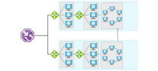

# Running Linux VM workloads

These reference architectures show proven practices for running Linux VMs in Azure. 

<ul class="panelContent">
    <li>
        <a href="./single-vm.md">
            

                

                    

                        

                            

                                
                            

                        

                        

                            <h3>Single VM</h3>
                            
Baseline recommendations for running any Linux VM in Azure.

                        

                    

                

            

        </a>
    </li>
    <li>
        <a href="./multi-vm.md">
            

                

                    

                        

                            

                            
                            

                        

                        

                            <h3>Load balanced VMs</h3>
                            
Multiple VMs placed behind a load balancer for scalability and availability.

                        

                    

                

            

        </a>
    </li>
    <li>
        <a href="./n-tier.md">
            

                

                    

                        

                            

                            
                            

                        

                        

                            <h3>N-tier application</h3>
                            
VMs configured for an N-tier application with Apache Cassandra.

                        

                    

                

            

        </a>
    </li>
    <li>
        <a href="./multi-region-application.md">
            

                

                    

                        

                            

                            
                            

                        

                        

                            <h3>Multi-region application</h3>
                            
N-tier application deployed to two regions for high availability.

                        

                    

                

            

        </a>
    </li>
</ul>

