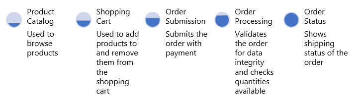

# Failure and disaster recovery for Azure applications

*Disaster recovery* is the process of restoring application functionality in the wake of a catastrophic loss.

Your tolerance for reduced functionality during a disaster is a business decision that varies from one application to the next. It might be acceptable for some applications to be completely unavailable or to be partially available with reduced functionality or delayed processing for a period of time. For other applications, any reduced functionality is unacceptable.

## Disaster recovery plan

Start by creating a recovery plan. The plan is considered complete after it has been fully tested. Include the people, processes, and applications needed to restore functionality within the service-level agreement (SLA) you've defined for your customers.

Consider the following suggestions when creating and testing your disaster recovery plan:

- In your plan, include the process for contacting support and for escalating issues. This information will help to avoid prolonged downtime as you work out the recovery process for the first time.
- Evaluate the business impact of application failures.
- Choose a cross-region recovery architecture for mission-critical applications.
- Identify a specific owner of the disaster recovery plan, including automation and testing.
- Document the process, especially any manual steps.
- Automate the process as much as possible.
- Establish a backup strategy for all reference and transactional data, and test backup restoration regularly.
- Set up alerts for the stack of the Azure services consumed by your application.
- Train operations staff to execute the plan.
- Perform regular disaster simulations to validate and improve the plan.

If you're using [Azure Site Recovery](/azure/site-recovery/) to replicate virtual machines (VMs), create a fully automated recovery plan to fail over the entire application.

## Manual responses

Although automation is ideal, some strategies for disaster recovery require manual responses.

### Alerts

Monitor your application for warning signs that may require proactive intervention. For example, if Azure SQL Database or Azure Cosmos DB consistently throttles your application, you might need to increase your database capacity or optimize your queries. Even though the application might handle the throttling errors transparently, your telemetry should still raise an alert so that you can follow up.

For service limits and quota thresholds, we recommend configuring alerts on Azure resources metrics and diagnostics logs. When possible, set up alerts on metrics, which are lower latency than diagnostics logs.

Through [Resource Health](/azure/service-health/resource-health-checks-resource-types), Azure provides some built-in health status checks that can help you diagnose Azure service throttling issues.

### Failover

Configure a disaster recovery strategy for each Azure application and its Azure services. Acceptable deployment strategies to support disaster recovery may vary based on the SLAs required for all components of each application.  

Azure provides different features within many Azure services to allow for manual failover, such as [redis cache geo-replicas](/azure/azure-cache-for-redis/cache-how-to-geo-replication), or for automated failover, such as [SQL auto-failover groups](/azure/sql-database/sql-database-auto-failover-group). For example:

- For an application that mainly uses virtual machines, you can use Azure Site Recovery for the web and logic tiers. For more information, see [Azure to Azure disaster recovery architecture](/azure/site-recovery/azure-to-azure-architecture). For SQL Server on VMs, use [SQL Server Always On availability groups](/azure/virtual-machines/windows/sql/virtual-machines-windows-portal-sql-availability-group-dr).
- For an application that uses App Service and Azure SQL Database, you can use a smaller tier App Service plan configured in the secondary region, which autoscales when a failover occurs. Use failover groups for the database tier.

In either scenario, an [Azure Traffic Manager](/azure/traffic-manager/traffic-manager-overview) profile provides for the automated failover across regions. [Load balancers](/azure/load-balancer/load-balancer-overview) or [application gateways](/azure/application-gateway/overview) should be set up in the secondary region to support faster availability upon failover.

### Operational readiness testing

Perform an operational readiness test for failover to the secondary region and for failback to the primary region. Many Azure services support manual failover or test failover for disaster recovery drills. Alternatively, you can simulate an outage by shutting down or removing Azure services.

## Application failure

Application failures are either recoverable or nonrecoverable. You can mitigate a recoverable error, but nonrecoverable errors will bring down the application.

- Some failures can be addressed transparently by handling faults automatically and taking alternate actions. For example, Traffic Manager automatically handles failures that result from the underlying hardware or operating system software in the host virtual machine.
- With some errors, the application can continue handling user requests with reduced functionality.
- More severe service disruptions might render the application unavailable.

A well-designed system separates responsibilities at the service level &mdash; at design time and at runtime. This separation prevents a dependent service disruption from bringing down the entire application. For example, consider a web commerce application with the following modules:

If the database for hosting orders goes down, the Order Processing service can't process sales transactions. Depending on the architecture, it might be impossible for the Order Submission and Order Processing services to continue. However, if product data is stored in a different location, the Product Catalog is still available, even though other parts of the application might be unavailable.

It's up to you to determine how the application will inform users of any temporary problems and to build appropriate notifications into the system. In the previous example, the application might allow for viewing products and for adding them to a shopping cart. However, when the customer attempts to make a purchase, the application should notify them that the ordering functionality is temporarily unavailable. Although not ideal for the customer, this approach prevents an application-wide service disruption.

## Data corruption and restoration

If a data store fails, there might be data inconsistencies when it becomes available again, especially if the data was replicated. Understanding the recovery time objective (RTO) and recovery point objective (RPO) of replicated data stores can help you predict the amount of data loss.

To understand whether the cross-regional failover is started manually or by Microsoft, review the Azure service SLAs. For services with no SLAs for cross-regional failover, Microsoft typically decides when to fail over and usually prioritizes recovery of data in the primary region. If data in the primary region is deemed unrecoverable, Microsoft fails over to the secondary region.

### Restoring data from backups

Backups protect you from losing a component of the application because of accidental deletion or data corruption. They preserve a functional version of the component from an earlier time, which you can use to restore it.

Disaster recovery strategies are not a replacement for backups, but regular backups of application data support some disaster recovery scenarios. Your backup storage choices should be based on your disaster recovery strategy.

The frequency of running the backup process determines your RPO. For example, if you perform hourly backups and a disaster occurs two minutes before the backup, you will lose 58 minutes of data. Your disaster recovery plan should include how you will address lost data.

It's common for data in one data store to reference data in another store. For example, consider a SQL Database with a column that links to a blob in Azure Storage. If backups don't happen simultaneously, the database might have a pointer to a blob that wasn't backed up before the failure. The application or the disaster recovery plan must implement processes to handle this inconsistency after a recovery.

> [!NOTE]
> In some scenarios, such as that of VMs backed up using [Azure Backup](/azure/backup/backup-azure-vms-first-look-arm), you can restore only from a backup in the same region. Other Azure services, such as [Azure Cache for Redis](/azure/azure-cache-for-redis/cache-how-to-geo-replication), provide geo-replicated backups, which you can use to restore services across regions.

### Azure Storage and Azure SQL Database

Azure automatically stores Azure Storage and SQL Database data three times within different fault domains in the same region. If you use geo-replication, the data is stored three additional times in a different region. However, if the data is corrupted or deleted in the primary copy (for example, because of user error), the changes replicate to the other copies.

You have two options for managing potential data corruption or deletion:

- **Create a custom backup strategy.** You can store your backups in Azure or on-premises, depending on your business requirements and governance regulations.
- **Use the point-in-time restore option** to recover a SQL Database.

#### Azure Storage recovery

You can develop a custom backup process for Azure Storage or use one of many third-party backup tools.

Azure Storage provides data resiliency through automated replicas, but it doesn't prevent application code or users from corrupting data. Maintaining data fidelity after application or user error requires more advanced techniques, such as copying the data to a secondary storage location with an audit log. You have several options:

- [**Block blobs.**](/rest/api/storageservices/understanding-block-blobs--append-blobs--and-page-blobs) Create a point-in-time snapshot of each block blob. For each snapshot, you are charged only for the storage required to store the differences within the blob since the previous snapshot state. The snapshots are dependent on the original blob, so we recommend copying to another blob or even to another storage account. This approach ensures that backup data is protected against accidental deletion. Use [AzCopy](/azure/storage/common/storage-use-azcopy) or [Azure PowerShell](/azure/storage/common/storage-powershell-guide-full) to copy the blobs to another storage account.

    For more information, see [Creating a Snapshot of a Blob](/rest/api/storageservices/creating-a-snapshot-of-a-blob).

- [**Azure Files.**](/azure/storage/files/storage-files-introduction) Use [share snapshots](/azure/storage/files/storage-snapshots-files), AzCopy, or PowerShell to copy your files to another storage account.
- [**Azure Table storage.**](/azure/storage/tables/table-storage-overview) Use AzCopy to export the table data into another storage account in another region.

#### SQL Database recovery

To protect your business from data loss, SQL Database automatically performs a combination of full database backups weekly, differential database backups hourly, and transaction log backups every 5 to 10 minutes. For the Basic, Standard, and Premium SQL Database tiers, use point-in-time restore to restore a database to an earlier time. See the following articles for more information:

- [Recover an Azure SQL database using automated database backups](/azure/sql-database/sql-database-recovery-using-backups)
- [Overview of business continuity with Azure SQL Database](/azure/sql-database/sql-database-business-continuity)

Another option is to use active geo-replication for SQL Database, which automatically replicates database changes to secondary databases in the same or different Azure region. For more information, see [Creating and using active geo-replication](/azure/sql-database/sql-database-active-geo-replication).

You can also use a more manual approach for backup and restore:

- Use the **DATABASE COPY** command to create a backup copy of the database with transactional consistency.
- Use the Azure SQL Database Import/Export Service, which supports exporting databases to BACPAC files (compressed files containing your database schema and associated data) that are stored in Azure Blob storage. To protect against a region-wide service disruption, copy the BACPAC files to an alternate region.

### SQL Server on VMs

For SQL Server running on VMs, you have two options: traditional backups and log shipping.

- With traditional backups, you can restore to a specific point in time, but the recovery process is slow. Restoring traditional backups requires that you start with an initial full backup and then apply any incremental backups.
- You can configure a log shipping session to delay the restore of log backups. This provides a window to recover from errors made on the primary replica.

### Azure Database for MySQL and Azure Database for PostgreSQL

In Azure Database for MySQL and Azure Database for PostgreSQL, the database service automatically makes a backup every five minutes. You can use these automated backups to restore the server and its databases from an earlier point in time to a new server. For more information, see:

- [How to back up and restore a server in Azure Database for MySQL by using the Azure portal](/azure/mysql/howto-restore-server-portal)
- [How to back up and restore a server in Azure Database for PostgreSQL using the Azure portal](/azure/postgresql/howto-restore-server-portal)

### Azure Cosmos DB

Cosmos DB automatically makes a backup at regular intervals. Backups are stored separately in another storage service and are replicated globally to protect against regional disasters. If you accidentally delete your database or collection, you can file a support ticket or call Azure support to restore the data from the last automatic backup. For more information, see [Online backup and on-demand restore in Azure Cosmos DB](/azure/cosmos-db/online-backup-and-restore).

### Azure Virtual Machines

To protect Azure Virtual Machines from application errors or accidental deletion, use [Azure Backup](/azure/backup/). The created backups are consistent across multiple VM disks. In addition, the Azure Backup vault can be replicated across regions to support recovery from a regional loss.

## Network outage

When parts of the Azure network are inaccessible, you might not be able to access your application or data. In this situation, we recommend designing the disaster recovery strategy to run most applications with reduced functionality.

If reducing functionality isn't an option, the remaining options are application downtime or failover to an alternate region.

In a reduced functionality scenario:

- If your application can't access its data because of an Azure network outage, you might be able to run locally with reduced application functionality by using cached data.
- You might be able to store data in an alternate location until connectivity is restored.

## Dependent service failure

For each dependent service, you should understand the implications of a service disruption and the way that the application will respond. Many services include features that support resiliency and availability, so evaluating each service independently is likely to improve your disaster recovery plan. For example, Azure Event Hubs supports [failing over](/azure/event-hubs/event-hubs-geo-dr#setup-and-failover-flow) to the secondary namespace.

## Region-wide service disruptions

Many failures are manageable within the same Azure region. However, in the unlikely event of a region-wide service disruption, the locally redundant copies of your data aren't available. If you've enabled geo-replication, there are three additional copies of your blobs and tables in a different region. If Microsoft declares the region lost, Azure remaps all the DNS entries to the secondary region.

> [!NOTE]
> This process occurs only for region-wide service disruptions and is not within your control. Consider using [Azure Site Recovery](/azure/site-recovery/) to achieve better RPO and RTO. Using Site Recovery, you decide what is an acceptable outage and when to fail over to the replicated VMs.

Your response to a region-wide service disruption depends on your deployment and your disaster recovery plan.

- As a cost-control strategy, for non-critical applications that don't require a guaranteed recovery time, it might make sense to redeploy to a different region.
- For applications that are hosted in another region with deployed roles but don't distribute traffic across regions (*active/passive deployment*), switch to the secondary hosted service in the alternate region.
- For applications that have a full-scale secondary deployment in another region (*active/active deployment*), route traffic to that region.

To learn more about recovering from a region-wide service disruption, see [Recover from a region-wide service disruption](../resiliency/recovery-loss-azure-region.md).

### VM recovery

For critical apps, plan for recovering VMs in the event of a region-wide service disruption.

- Use Azure Backup or another backup method to create cross-region backups that are application consistent. (Replication of the Backup vault must be configured at the time of creation.)
- Use Site Recovery to replicate across regions for one-click application failover and failover testing.
- Use Traffic Manager to automate user traffic failover to another region.

To learn more, see [Recover from a region-wide service disruption, Virtual machines](../resiliency/recovery-loss-azure-region.md#virtual-machines).

### Storage recovery

To protect your storage in the event of a region-wide service disruption:

- Use geo-redundant storage.
- Know where your storage is geo-replicated. This affects where you deploy other instances of your data that require regional affinity with your storage.
- Check data for consistency after failover and, if necessary, restore from a backup.

To learn more, see [Designing highly available applications using RA-GRS](/azure/storage/common/storage-designing-ha-apps-with-ragrs).

### SQL Database and SQL Server

Azure SQL Database provides two types of recovery:

- Use geo-restore to restore a database from a backup copy in another region. For more information, see [Recover an Azure SQL database using automated database backups](/azure/sql-database/sql-database-recovery-using-backups).
- Use active geo-replication to fail over to a secondary database. For more information, see [Creating and using active geo-replication](/azure/sql-database/sql-database-active-geo-replication).

For SQL Server running on VMs, see [High availability and disaster recovery for SQL Server in Azure Virtual Machines](/azure/virtual-machines/windows/sql/virtual-machines-windows-sql-high-availability-dr/).

## Service-specific guidance

The following articles describe disaster recovery for specific Azure services:

| Service                       | Article                                                                                                                                                                                       |
|-------------------------------|---------------------------------------------------------------------------------------------------------------------------------------------------------------------------------------------|
| Azure Database for MySQL      | [Overview of business continuity with Azure Database for MySQL](/azure/mysql/concepts-business-continuity)                                                  |
| Azure Database for PostgreSQL | [Overview of business continuity with Azure Database for PostgreSQL](/azure/postgresql/concepts-business-continuity)                                        |
| Azure Cloud Services          | [What to do in the event of an Azure service disruption that impacts Azure Cloud Services](/azure/cloud-services/cloud-services-disaster-recovery-guidance) |
| Cosmos DB                     | [High availability with Azure Cosmos DB](/azure/cosmos-db/high-availability)                                                                                |
| Azure Key Vault               | [Azure Key Vault availability and redundancy](/azure/key-vault/key-vault-disaster-recovery-guidance)                                                        |
| Azure Storage                 | [Disaster recovery and storage account failover (preview) in Azure Storage](/azure/storage/common/storage-disaster-recovery-guidance)                       |
| SQL Database                  | [Restore an Azure SQL Database or failover to a secondary region](/azure/sql-database/sql-database-disaster-recovery)                                       |
| Virtual Machines              | [What to do in the event of an Azure service disruption impacts Azure Cloud](/azure/cloud-services/cloud-services-disaster-recovery-guidance)               |
| Azure Virtual Network         | [Virtual Network – Business Continuity](/azure/virtual-network/virtual-network-disaster-recovery-guidance)                                                  |

## Next steps

- [Recover from data corruption or accidental deletion](../resiliency/recovery-data-corruption.md)
- [Recover from a region-wide service disruption](../resiliency/recovery-loss-azure-region.md)