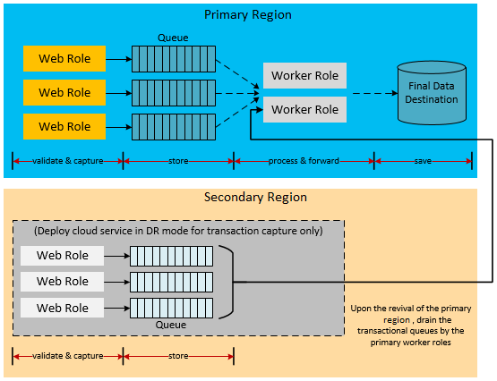

[!INCLUDE [header](../_includes/header.md)]
# Disaster recovery for Azure applications
Resiliency and high availability strategies are intended to handling temporary failure conditions. Disaster recovery (DR) is focused on recovering from a catastrophic loss of application functionality. For example, if an Azure region hosting your application becomes unavailable, you need a plan for running your application or accessing your data in another region. Executing this plan involves people, processes, and supporting applications that allow the system to continue functioning. Your plan should include rehearsing failures and testing the recovery of databases to ensure the plan is sound. The business and technology owners who define the system's operational mode for a disaster also determine the level of service functionality required during a disaster. This level of functionality can take a few forms: completely unavailable, partially available via reduced functionality or delayed processing, or fully available.

## Azure disaster recovery features
As with availability considerations, Azure provides [resiliency technical guidance](./index.md) designed to support disaster recovery. There is also a relationship between availability features of Azure and disaster recovery. For example, the management of roles across fault domains increases the availability of an application. Without that management, an unhandled hardware failure would become a “disaster” scenario. Leveraging these availability features and strategies is an important part of disaster-proofing your application. However, this article goes beyond general availability issues to more serious (and rarer) disaster events.

## Multiple datacenter regions
Azure maintains datacenters in many regions around the world. This infrastructure supports several disaster recovery scenarios, such as system-provided geo-replication of Azure Storage to secondary regions. You can also easily and inexpensively deploy a cloud service to multiple locations around the world. Compare this with the cost and difficulty of building and maintaining your own datacenters in multiple regions. Deploying data and services to multiple regions helps protect your application from a major outage in a single region. As you design your disaster recovery plan, it’s important to understand the concept of paired regions. For more information, see [Business continuity and disaster recovery (BCDR): Azure Paired Regions](/azure/best-practices-availability-paired-regions).

## Azure Traffic Manager
When a region-specific failure occurs, you must redirect traffic to services or deployments in another region. It is most effective to handle this via services such as Azure Traffic Manager, which automates the failover of user traffic to another region if the primary region fails. Understanding the fundamentals of Traffic Manager is important when designing an effective DR strategy.

Traffic Manager uses the Domain Name System (DNS) to direct client requests to the most appropriate endpoint based on a traffic-routing method and the health of the endpoints. In the following diagram, users connect to a Traffic Manager URL (`http://myATMURL.trafficmanager.net`) which abstracts the actual site URLs (`http://app1URL.cloudapp.net` and `http://app2URL.cloudapp.net`). User requests are routed to the proper underlying URL based on your configured [Traffic Manager routing method](/azure/traffic-manager/traffic-manager-routing-methods). For the sake of this article, we will be concerned with only the failover option.

When configuring Traffic Manager, you provide a new Traffic Manager DNS prefix, which users will use to access your service. Traffic Manager now abstracts load balancing one level higher that the regional level. The Traffic Manager DNS maps to a CNAME for all the deployments that it manages.

Within Traffic Manager, you specify a prioritized list of deployments that users will be routed to when failure occurs. Traffic Manager monitors the deployment endpoints. If the primary deployment becomes unavailable, Traffic Manager routes users to the next deployment on the priority list.

Although Traffic Manager decides where to go during a failover, you can decide whether your failover domain is dormant or active while you're not in failover mode (which is unrelated to Traffic Manager). Traffic Manager detects a failure in the primary site and rolls over to the failover site, regardless of whether that site is currently serving users.

For more information on how Azure Traffic Manager works, refer to:

* [Traffic Manager overview](/azure/traffic-manager/traffic-manager-overview/)
* [Traffic Manager routing methods](/azure/traffic-manager/traffic-manager-routing-methods)
* [Configure failover routing method](/azure/traffic-manager/traffic-manager-configure-failover-routing-method/)

## Azure disaster scenarios
The following sections cover several different types of disaster scenarios. Region-wide service disruptions are not the only cause of application-wide failures. Poor design and administrative errors can also lead to outages. It's important to consider the possible causes of a failure during both the design and testing phases of your recovery plan. A good plan takes advantage of Azure features and augments them with application-specific strategies. The chosen response is determined by the importance of the application, the recovery point objective (RPO), and the recovery time objective (RTO).

### Application failure
Azure Traffic Manager automatically handles failures that result from the underlying hardware or operating system software in the host virtual machine. Azure creates a new role instance and adds it to the available pool. If  more than one role instance was already running, Azure shifts processing to the other running role instances while replacing the failed node.

Serious application errors can occur without any underlying failure of the hardware or operating system. The application might fail due to catastrophic exceptions caused by bad logic or data integrity issues. You must include sufficient telemetry in the application code so that a monitoring system can detect failure conditions and notify an application administrator. An administrator who has full knowledge of the disaster recovery processes can decide whether to trigger a failover process or accept an availability outage while resolving the critical errors.

### Data corruption
Azure automatically stores Azure SQL Database and Azure Storage data three times redundantly within different fault domains in the same region. If you use geo-replication, the data is stored three additional times in a different region. However, if your users or your application corrupts that data in the primary copy, the data quickly replicates to the other copies. Unfortunately, this results in multiple copies of corrupt data.

To manage potential corruption of your data, you have two options. First, you can manage a custom backup strategy. You can store your backups in Azure or on-premises, depending on your business requirements or governance regulations. Another option is to use the point-in-time restore option to recover a SQL database. For more information, see the [data strategies for disaster recovery](#data-strategies-for-disaster-recovery) section below.

### Network outage
When parts of the Azure network are inaccessible, you may be unable to access your application or data. If one or more role instances are unavailable due to network issues, Azure uses the remaining available instances of your application. If your application cannot access its data because of an Azure network outage, you can potentially run with reduced application functionality locally by using cached data. You need to design the disaster recovery strategy to run with reduced functionality in your application. For some applications, this might not be practical.

Another option is to store data in an alternate location until connectivity is restored. If reducing functionality is not an option, the remaining options are application downtime or failover to an alternate region. The design of an application running with reduced functionality is as much a business decision as a technical one. This is discussed further in the section on [reduced application functionality](#reduced-application-functionality).

### Failure of a dependent service
Azure provides many services that can experience periodic downtime. For example, [Azure Redis Cache](https://azure.microsoft.com/services/cache/) is a multi-tenant service which provides caching capabilities to your application. It's important to consider what happens in your application if the dependent service is unavailable. In many ways, this scenario is similar to the network outage scenario. However, considering each service independently results in potential improvements to your overall plan.

Azure Redis Cache provides caching to your application from within your cloud service deployment, which provides disaster recovery benefits. First, the service now runs on roles that are local to your deployment. Therefore, you're better able to monitor and manage the status of the cache as part of your overall management processes for the cloud service. This type of caching also exposes new features such as high availability for cached data, which preserves cached data if a single node fails by maintaining duplicate copies on other nodes.

Note that high availability decreases throughput and increases latency because write operations must also upedate any secondary copies. The amount of memory required to store the cached data is effectively doubled, which must be taken into account during capacity planning.  This example demonstrates that each dependent service might have capabilities that improve your overall availability and resistance to catastrophic failures.

With each dependent service, you should understand the implications of a service disruption. In the caching example, it might be possible to access the data directly from a database until you restore your cache. This would result in reduced performance while providing full access to application data.

### Region-wide service disruption
The previous failures have primarily been failures that can be managed within the same Azure region. However, you must also prepare for the possibility that there is a service disruption of the entire region. If a region-wide service disruption occurs, the locally redundant copies of your data are not available. If you have enabled geo-replication, there are three additional copies of your blobs and tables in a different region. If Microsoft declares the region lost, Azure remaps all of the DNS entries to the geo-replicated region.

> [!NOTE]
> Be aware that you don't have any control over this process, and it will occur only for region-wide service disruption. Because of this, you must rely on other application-specific backup strategies to achieve the highest level of availability. For more information, see the section on [data strategies for disaster recovery](#data-strategies-for-disaster-recovery).
> 
> 

### Azure-wide service disruption
In disaster planning, you must consider the entire range of possible disasters. One of the most severe service disruptions would involve all Azure regions simultaneously. As with other service disruptions, you might decide to accept the risk of temporary downtime in that event. Widespread service disruptions that span regions are much rarer than isolated service disruptions involving dependent services or single regions.

However, you may decide that certain mission-critical applications require a backup plan for a multi-region service disruption. This plan might include failing over to services in an [alternative cloud](#alternative-cloud) or a [hybrid on-premises and cloud solution](#hybrid-on-premises-and-cloud-solution).

### Reduced application functionality
A well-designed application typically uses services that communicate with each other though the implementation of loosely coupled information-interchange patterns. A DR-friendly application requires separation of responsibilities at the service level. This prevents the disruption of a dependent service from bringing down the entire application. For example, consider a web commerce application for Company Y. The following modules might constitute the application:

* **Product Catalog** allows users to browse products.
* **Shopping Cart** allows users to add/remove products in their shopping cart.
* **Order Status** shows the shipping status of user orders.
* **Order Submission** finalizes the shopping session by submitting the order with payment.
* **Order Processing** validates the order for data integrity and performs a quantity availability check.

When a service dependency in this application becomes unavailable, how does the service function until the dependency recovers? A well-designed system implements isolation boundaries through separation of responsibilities, both at design time and at runtime. You can categorize every failure as recoverable and non-recoverable. Non-recoverable errors will bring down the service, but you can mitigate a recoverable error through alternatives. Certain problems addressed by automatically handling faults and taking alternate actions are transparent to the user. During a more serious service disruption, the application might be completely unavailable. A third option is to continue handling user requests with reduced functionality.

For instance, if the database for hosting orders goes down, the Order Processing service loses its ability to process sales transactions. Depending on the architecture, it might be difficult or impossible for the Order Submission and Order Processing services of the application to continue. If the application is not designed to handle this scenario, the entire application might go offline. However, if the product data is stored in a different location, then the Product Catalog module can still be used for viewing products. However, other parts of the application are unavailable, such as ordering or inventory queries.

Deciding what reduced application functionality is available is both a business decision and a technical decision. You must decide how the application will inform the users of any temporary problems. In the example above, the application might allow viewing products and adding them to a shopping cart. However, when the user attempts to make a purchase, the application notifies the user that the ordering functionality is temporarily unavailable. This isn't ideal for the customer, but it does prevent an application-wide service disruption.

## Data strategies for disaster recovery
Proper data handling is a challenging aspect of a disaster recovery plan. During the recovery process, data restoration typically takes the most time. Different choices for reducing functionality result in difficult challenges for data recovery from failure and consistency after failure.

One consideration is the need to restore or maintain a copy of the application’s data. You will use this data for reference and transactional purposes at a secondary site. An on-premises deployment requires an expensive and lengthy planning process to implement a multiple-region disaster recovery strategy. Conveniently, most cloud providers, including Azure, readily allow the deployment of applications to multiple regions. These regions are geographically distributed in such a way that multiple-region service disruption should be extremely rare. The strategy for handling data across regions is one of the contributing factors for the success of any disaster recovery plan.

The following sections discuss disaster recovery techniques related to data backups, reference data, and transactional data.

### Backup and restore
Regular backups of application data can support some disaster recovery scenarios. Different storage resources require different techniques.

#### SQL Database
For the Basic, Standard, and Premium SQL Database tiers, you can take advantage of point-in-time restore to recover your database. For more information, see [Overview: Cloud business continuity and database disaster recovery with SQL Database](/azure/sql-database/sql-database-business-continuity/). Another option is to use Active Geo-Replication for SQL Database. This automatically replicates database changes to secondary databases in the same Azure region or even in a different Azure region. This provides a potential alternative to some of the more manual data synchronization techniques presented in this article. For more information, see [Overview: SQL Database Active Geo-Replication](/azure/sql-database/sql-database-geo-replication-overview/).

You can also use a more manual approach for backup and restore. Use the DATABASE COPY command to create a backup copy of the database with transactional consistency. You can also use the import/export service of Azure SQL Database, which supports exporting databases to BACPAC files (compressed files containing your database schema and associated data) that are stored in Azure Blob storage.

The built-in redundancy of Azure Storage creates two replicas of the backup file in the same region. However, the frequency of running the backup process determines your RPO, which is the amount of data you might lose in disaster scenarios. For example, imagine that you perform a backup at the top of each hour, and a disaster occurs two minutes before the top of the hour. You lose 58 minutes of data recorded after the last backup was performed. Also, to protect against a region-wide service disruption, you should copy the BACPAC files to an alternate region. You then have the option of restoring those backups in the alternate region. For more details, see [Overview: Cloud business continuity and database disaster recovery with SQL Database](/azure/sql-database/sql-database-business-continuity/).

#### Azure Storage
For Azure Storage, you can develop a custom backup process or use one of many third-party backup tools. Note that most application designs have additional complexities where storage resources reference each other. For example, consider a SQL database that has a column that links to a blob in Azure Storage. If the backups do not happen simultaneously, the database might have a pointer to a blob that was not backed up before the failure. The application or disaster recovery plan must implement processes to handle this inconsistency after a recovery.

#### Other data platforms
Other infrastructure-as-a-service (IaaS) hosted data platforms, such as Elasticsearch or MongoDB, have their own capabilities and considerations when creating an integrated backup and restore process. For these data platforms, the general recommendation is to use any native or available integration-based replication or snapshotting capabilities. If those capabilities do not exist or are not suitable, then consider using Azure Backup Service or managed/unmanaged disk snapshots to create a point-in-time copy of application data. In all cases, it’s important to determine how to achieve consistent backups, especially when application data spans multiple files systems, or when multiple drives are combined into a single file system using volume managers or software-based RAID.

### Reference data pattern for disaster recovery
Reference data is read-only data that supports application functionality. It typically does not change frequently. Although backup and restore is one method to handle region-wide service disruptions, the RTO is relatively long. When you deploy the application to a secondary region, some strategies can improve the RTO for reference data.

Because reference data changes infrequently, you can improve the RTO by maintaining a permanent copy of the reference data in the secondary region. This eliminates the time required to restore backups in the event of a disaster. To meet the multiple-region disaster recovery requirements, you must deploy the application and the reference data together in multiple regions. As mentioned in [Reference data pattern for high availability](high-availability-azure-applications.md#reference-data-pattern-for-high-availability), you can deploy reference data to the role itself, to external storage, or to a combination of both.

The reference data deployment model within compute nodes implicitly satisfies the disaster recovery requirements. Reference data deployment to SQL Database requires that you deploy a copy of the reference data to each region. The same strategy applies to Azure Storage. You must deploy a copy of any reference data that's stored in Azure Storage to the primary and secondary regions.

You must implement your own application-specific backup routines for all data, including reference data. Geo-replicated copies across regions are used only in a region-wide service disruption. To prevent extended downtime, deploy the mission-critical parts of the application’s data to the secondary region. For an example of this topology, see the [active-passive model](#active-passive).

### Transactional data pattern for disaster recovery
Implementation of a fully functional disaster mode strategy requires asynchronous replication of the transactional data to the secondary region. The practical time windows within which the replication can occur will determine the RPO characteristics of the application. You might still recover the data that was lost from the primary region during the replication window. You might also be able to merge with the secondary region later.

The following architecture examples provide some ideas on different ways of handling transactional data in a failover scenario. It's important to note that these examples are not exhaustive. For example, intermediate storage locations such as queues might be replaced with Azure SQL Database. The queues themselves might be either Azure Storage or Azure Service Bus queues (see [Azure queues and Service Bus queues - compared and contrasted](/azure/service-bus-messaging/service-bus-azure-and-service-bus-queues-compared-contrasted/)). Server storage destinations might also vary, such as Azure tables instead of SQL Database. In addition, worker roles might be inserted as intermediaries in various steps. The intent is not to emulate these architectures exactly, but to consider various alternatives in the recovery of transactional data and related modules.

#### Replication of transactional data in preparation for disaster recovery
Consider an application that uses Azure Storage queues to hold transactional data. This allows worker roles to process the transactional data to the server database in a decoupled architecture. This requires the transactions to use some form of temporary caching if the front-end roles require the immediate query of that data. Depending on the level of data-loss tolerance, you might choose to replicate the queues, the database, or all of the storage resources. With only database replication, if the primary region goes down, you can still recover the data in the queues when the primary region comes back.

The following diagram shows an architecture where the server database is synchronized across regions.

The biggest challenge to implementing this architecture is the replication strategy between regions. The [Azure SQL Data Sync](/azure/sql-database/sql-database-get-started-sql-data-sync/) service enables this type of replication. As of this writing, the service is in preview and is not yet recommended for production environments. For more information, see [Overview: Cloud business continuity and database disaster recovery with SQL Database](/azure/sql-database/sql-database-business-continuity/). For production applications, you must invest in a third-party solution or create your own replication logic in code. Depending on the architecture, the replication might be bidirectional, which is more complex.

One potential implementation might make use of the intermediate queue in the previous example. The worker role that processes the data to the final storage destination might make the change in both the primary region and the secondary region. These are not trivial tasks, and complete guidance for replication code is beyond the scope of this article. Invest significant time and testing into the approach for replicating data to the secondary region. Additional processing and testing can help ensure that the failover and recovery processes correctly handle any possible data inconsistencies or duplicate transactions.

> [!NOTE]
> Most of this paper focuses on platform as a service (PaaS). However, additional replication and availability options for hybrid applications use Azure Virtual Machines. These hybrid applications use infrastructure as a service (IaaS) to host SQL Server on virtual machines in Azure. This allows traditional availability approaches in SQL Server, such as AlwaysOn Availability Groups or Log Shipping. Some techniques, such as AlwaysOn, work only between on-premises SQL Server instances and Azure virtual machines. For more information, see [High availability and disaster recovery for SQL Server in Azure Virtual Machines](/azure/virtual-machines/windows/sql/virtual-machines-windows-sql-high-availability-dr/).
> 
> 

#### Reduced application functionality for transaction capture
Consider a second architecture that operates with reduced functionality. The application in the secondary region deactivates all the functionality, such as reporting, business intelligence (BI), or draining queues. It accepts only the most important types of transactional workflows, as defined by business requirements. The system captures the transactions and writes them to queues. The system might postpone processing the data during the initial stage of the service disruption. If the system on the primary region is reactivated within the expected time window, the worker roles in the primary region can drain the queues. This process eliminates the need for database merging. If the primary region service disruption goes beyond the tolerable window, the application can start processing the queues.

In this scenario, the database in the secondary region contains incremental transactional data that must be merged after the primary is reactivated. The following diagram shows this strategy for temporarily storing transactional data until the primary region is restored.

For more discussion of data management techniques for resilient Azure applications, see [Failsafe: Guidance for Resilient Cloud Architectures](https://channel9.msdn.com/Series/FailSafe).

## Deployment topologies for disaster recovery
You must prepare mission-critical applications to handle region-wide service disruptions. Incorporate a multiple-region deployment strategy into the operational planning.

Multiple-region deployments might involve IT processes to publish the application and reference data to the secondary region after a disaster. If the application requires instant failover, the deployment process might involve an active/passive setup or an active/active setup. This type of deployment has existing instances of the application running in the alternate region. A routing service such as Azure Traffic Manager provides load-balancing services at the DNS level. It can detect service disruptions and route the users to different regions when needed.

A successful Azure disaster recovery includes building that recovery into the solution from the start. The cloud provides additional options for recovering from failures during a disaster that are not available in a traditional hosting provider. Specifically, you can dynamically and quickly allocate resources in a different region, avoiding the cost of idle resources prior to a failure.

The following sections cover different deployment topologies for disaster recovery. Typically, there's a tradeoff in increased cost or complexity for additional availability.

### Single-region deployment
A single-region deployment is not really a disaster recovery topology, but is meant to contrast with the other architectures. Single-region deployments are common for applications in Azure; however, they do not meet the requirements of a disaster recovery topology.

The following diagram depicts an application running in a single Azure region. Azure Traffic Manager and the use of fault and upgrade domains increase availability of the application within the region.

In this scenario, the database is a single point of failure. Though Azure replicates the data across different fault domains to internal replicas, this replication occurs only within the same region. The application cannot withstand a catastrophic failure. If the region becomes unavailable, then so do the fault domains, including all service instances and storage resources.

For all but the least critical applications, you must devise a plan to deploy your applications across multiple regions. You should also consider RTO and cost constraints in considering which deployment topology to use.

Let’s take a look now at specific approaches to supporting failover across different regions. These examples all use two regions to describe the process.

### Redeployment to a secondary Azure region
For the approach of redeployment to a secondary region, only the primary region has applications and databases running. The secondary region is not set up for an automatic failover. So when a disaster occurs, you must spin up all the parts of the service in the new region. This includes uploading a cloud service to Azure, deploying the cloud service, restoring the data, and changing DNS to reroute the traffic.

Although this is the most affordable of the multiple-region options, it has the worst RTO characteristics. In this model, the service package and database backups are stored either on-premises or in the Azure Blob storage instance of the secondary region. However, you must deploy a new service and restore the data before it resumes operation. Even with full automation of the data transfer from backup storage, provisioning a new database environment consumes a lot of time. Moving data from the backup disk storage to the empty database on the secondary region is the most expensive part of the restore process. You must do this, however, to bring the new database to an operational state because it isn't replicated.

The best approach is to store the service packages in Blob storage in the secondary region. This eliminates the need to upload the package to Azure, which is what happens when you deploy from an on-premises development machine. You can quickly deploy the service packages to a new cloud service from Blob storage by using PowerShell scripts.

This option is practical only for non-critical applications that can tolerate a high RTO. For instance, this might work for an application that can be down for several hours but is required to be available within 24 hours.

### Active-passive
An active-passive topology is the choice that many companies favor. This topology provides improvements to the RTO with a relatively small increase in cost over the redeployment approach. In this scenario, there is again a primary and a secondary Azure region. All of the traffic goes to the active deployment on the primary region. The secondary region is better prepared for disaster recovery because the database is running on both regions. Additionally, a synchronization mechanism is in place between them. This standby approach can involve two variations: a database-only approach or a complete deployment in the secondary region.

#### Database only
In the first variation of the active-passive topology, only the primary region has a deployed cloud service application. However, unlike the redeployment approach, both regions are synchronized with the contents of the database. (For more information, see the section on [transactional data pattern for disaster recovery](#transactional-data-pattern-for-disaster-recovery).) When a disaster occurs, there are fewer activation requirements. You start the application in the secondary region, change connection strings to the new database, and change the DNS entries to reroute traffic.

Like the redeployment approach, you should have already stored the service packages in Azure Blob storage in the secondary region for faster deployment. However, you don’t incur the majority of the overhead that database restore operation requires, because the database is ready and running. This saves a significant amount of time, making this an affordable DR pattern (and the one most frequently used).

#### Full replica
In the second variation of the active-passive topology, both the primary region and the secondary region have a full deployment. This deployment includes the cloud services and a synchronized database. However, only the primary region is actively handling network requests from the users. The secondary region becomes active only when the primary region experiences a service disruption. In that case, all new network requests route to the secondary region. Azure Traffic Manager can manage this failover automatically.

Failover occurs faster than the database-only variation because the services are already deployed. This topology provides a very low RTO. The secondary failover region must be ready to go immediately after failure of the primary region.

Along with a quicker response time, this topology pre-allocates and deploys backup services, avoiding the possibility of a lack of space to allocate new instances during a disaster. This is important if your secondary Azure region is nearing capacity. No service-level agreement (SLA) guarantees that you can instantly deploy one or more new cloud services in any region.

For the fastest response time with this model, you must have similar scale (number of role instances) in the primary and secondary regions. Despite the advantages, paying for unused compute instances is costly, and this might not be the most prudent financial choice. Because of this, it's more common to use a slightly scaled-down version of cloud services on the secondary region. Then you can quickly fail over and scale out the secondary deployment if necessary. You should automate the failover process so that after the primary region is inaccessible, you activate additional instances, depending on the load. This might involve the use of an autoscaling mechanism like [virtual machine scale sets](/azure/virtual-machine-scale-sets/virtual-machine-scale-sets-overview/).

The following diagram shows the model where the primary and secondary regions contain a fully deployed cloud service in an active-passive topology.

### Active-active
In an active-active topology, the cloud services and database are fully deployed in both regions. Unlike the active-passive model, both regions receive user traffic. This option yields the quickest recovery time. The services are already scaled to handle a portion of the load at each region. DNS is already enabled to use the secondary region. There's additional complexity in determining how to route users to the appropriate region. Round-robin scheduling might be possible. It's more likely that certain users would use a specific region where the primary copy of their data resides.

In case of failover, simply disable DNS to the primary region. This routes all traffic to the secondary region.

Even in this model, there are some variations. For example, the following diagram depicts a primary region which owns the master copy of the database. The cloud services in both regions write to that primary database. The secondary deployment can read from the primary or replicated database. Replication in this example is one-way.

There is a downside to the active-active architecture in the preceding diagram. The second region must access the database in the first region because the master copy resides there. Performance significantly drops off when you access data from outside a region. In cross-region database calls, you should consider some type of batching strategy to improve the performance of these calls. For more information, see [How to use batching to improve SQL Database application performance](/azure/sql-database/sql-database-use-batching-to-improve-performance/).

An alternative architecture might involve each region accessing its own database directly. In that model, some type of bidirectional replication is required to synchronize the databases in each region.

With the previous topologies, decreasing RTO generally increases costs and complexity. The active-active topology deviates from this cost pattern. In the active-active topology, you might not need as many instances on the primary region as you would in the active-passive topology. If you have 10 instances on the primary region in an active-passive architecture, you might need only 5 in each region in an active-active architecture. Both regions now share the load. This might be a cost savings over the active-passive topology if you keep a warm standby on the passive region with 10 instances waiting for failover.

Realize that until you restore the primary region, the secondary region might receive a sudden surge of new users. If there are 10,000 users on each server when the primary region experiences a service disruption, the secondary region suddenly has to handle 20,000 users. Monitoring rules on the secondary region must detect this increase and double the instances in the secondary region. For more information on this, see the section on [failure detection](#failure-detection).

## Hybrid on-premises and cloud solution
One additional strategy for disaster recovery is to architect a hybrid application that runs on-premises and in the cloud. Depending on the application, the primary region might be either location. Consider the previous architectures and imagine the primary or secondary region as an on-premises location.

There are some challenges in these hybrid architectures. First, most of this article has addressed PaaS architecture patterns. Typical PaaS applications in Azure rely on Azure-specific constructs such as roles, cloud services, and Traffic Manager. Creating an on-premises solution for this type of PaaS application would require a significantly different architecture. This might not be feasible from a management or cost perspective.

However, a hybrid solution for disaster recovery has fewer challenges for traditional architectures that have been migrated to the cloud, such as IaaS-based architectures. IaaS applications use virtual machines in the cloud that can have direct on-premises equivalents. You can also use virtual networks to connect machines in the cloud with on-premises network resources. This allows several possibilities that are not possible with PaaS-only applications. For example, SQL Server can take advantage of disaster recovery solutions such as AlwaysOn Availability Groups and database mirroring. For details, see [High availability and disaster recovery for SQL Server in Azure virtual machines](/azure/virtual-machines/windows/sql/virtual-machines-windows-sql-high-availability-dr/).

IaaS solutions also provide an easier path for on-premises applications to use Azure as the failover option. You might have a fully functioning application in an existing on-premises region. However, what if you lack the resources to maintain a geographically separate region for failover? You might decide to use virtual machines and virtual networks to get your application running in Azure. In that case, define processes that synchronize data to the cloud. The Azure deployment then becomes the secondary region to use for failover. The primary region remains the on-premises application. For more information about IaaS architectures and capabilities, see the [Virtual Machines documentation](https://azure.microsoft.com/documentation/services/virtual-machines/).

## Alternative cloud
There are situations where the broad capabilities of Microsoft Azure still may not meet internal compliance rules or policies required by your organization. Even the best preparation and design to implement backup systems during a disaster are inadequate during a global service disruption of a cloud service provider.

You should compare availability requirements with the cost and complexity of increased availability. Perform a risk analysis, and define the RTO and RPO for your solution. If your application cannot tolerate any downtime, you might consider using an additional cloud solution. Unless the entire Internet goes down, another cloud solution might still be available if Azure becomes globally inaccessible.

As with the hybrid scenario, the failover deployments in the previous disaster recovery architectures can also exist within another cloud solution. Alternative cloud DR sites should be used only for solutions whose RTO allows very little, if any, downtime. Note that a solution that uses a DR site outside Azure will require more work to configure, develop, deploy, and maintain. It's also more difficult to implement proven practices in a cross-cloud architecture. Although cloud platforms have similar high-level concepts, the APIs and architectures are different.

If your DR strategy relies upon multiple cloud platforms, it's valuable to include abstraction layers in the design of the solution. This eliminates the need to develop and maintain two different versions of the same application for different cloud platforms in case of disaster. As with the hybrid scenario, the use of Azure Virtual Machines or Azure Container Service might be easier in these cases than the use of cloud-specific PaaS designs.

## Automation
Some of the patterns that we just discussed require quick activation of offline deployments as well as restoration of specific parts of a system. Automation scripts can activate resources on demand and deploy solutions rapidly. The DR-related automation examples below use [Azure PowerShell](https://msdn.microsoft.com/library/azure/jj156055.aspx), but using the [Azure CLI](https://docs.microsoft.com/en-us/cli/azure/get-started-with-azure-cli) or the [Service Management REST API](https://msdn.microsoft.com/library/azure/ee460799.aspx) are also good options.

Automation scripts manage aspects of DR not transparently handled by Azure. This produces consistent and repeatable results, minimizing human error. Predefined DR scripts also reduce the time to rebuild a system and its constituent parts during a disaster. You don’t want to try to manually figure out how to restore your site while it's down and losing money every minute.

Test your scripts repeatedly from start to finish. After verifying their basic functionality, make sure to test them in [disaster simulation](#disaster-simulation). This helps uncover defects in the scripts or processes.

A best practice with automation is to create a repository of PowerShell scripts or command-line interface (CLI) scripts for Azure disaster recovery. Clearly mark and categorize them for quick access. Designate a primary person to manage the repository and versioning of the scripts. Document them well with explanations of parameters and examples of script use. Also ensure that you keep this documentation in sync with your Azure deployments. This underscores the purpose of having a primary person in charge of all parts of the repository.

## Failure detection
To correctly handle problems with availability and disaster recovery, you must be able to detect and diagnose failures. Perform advanced server and deployment monitoring to quickly recognize when a system or its components suddenly become unavailable. Monitoring tools that assess the overall health of the cloud service and its dependencies can perform part of this work. One suitable Microsoft tool is [System Center 2016](https://www.microsoft.com/en-us/server-cloud/products/system-center-2016/). Third-party tools can also provide monitoring capabilities. Most monitoring solutions track key performance counters and service availability.

Although these tools are vital, you must plan for fault detection and reporting within a cloud service. You must also plan to properly use Azure Diagnostics. Custom performance counters or event-log entries can also be part of the overall strategy. This provides more data during failures to quickly diagnose the problem and restore full capabilities. It also provides additional metrics that the monitoring tools can use to determine application health. For more information, see [Enabling Azure Diagnostics in Azure Cloud Services](/azure/cloud-services/cloud-services-dotnet-diagnostics/). For a discussion of how to plan for an overall “health model,” see [Failsafe: Guidance for Resilient Cloud Architectures](https://channel9.msdn.com/Series/FailSafe).

## Disaster simulation
Simulation testing involves creating small real-life situations on the work floor to observe how the team members react. Simulations also show how effective the solutions are in the recovery plan. Execute simulations so that the created scenarios don't disrupt actual business, while still feeling like real situations.

Consider architecting a type of “switchboard” in the application to manually simulate availability issues. For instance, through a soft switch, trigger database access exceptions for an ordering module by causing it to malfunction. You can take similar lightweight approaches for other modules at the network interface level.

The simulation highlights any issues that were inadequately addressed. The simulated scenarios must be completely controllable. This means that, even if the recovery plan seems to be failing, you can restore the situation back to normal without causing any significant damage. It’s also important that you inform higher-level management about when and how the simulation exercises will be executed. This plan should detail the time or resources affected during the simulation. Also define the measures of success when testing your disaster recovery plan.

Several other techniques can test disaster recovery plans. However, most of them are simply variations of these basic techniques. The intent of this testing is to evaluate the feasibility of the recovery plan. Disaster recovery testing focuses on the details to discover gaps in the basic recovery plan.

## Service-specific guidance

The following topics describe disaster recovery specific Azure services:

| Service | Topic |
|---------|-------|
| Cloud Services | [What to do in the event of an Azure service disruption that impacts Azure Cloud Services](/azure/cloud-services/cloud-services-disaster-recovery-guidance) |
| Key Vault | [Azure Key Vault availability and redundancy](/azure/key-vault/key-vault-disaster-recovery-guidance) |
|Storage | [What to do if an Azure Storage outage occurs](/azure/storage/storage-disaster-recovery-guidance) |
| SQL Database | [Restore an Azure SQL Database or failover to a secondary](/azure/sql-database/sql-database-disaster-recovery) |
| Virtual machines | [What to do in the event that an Azure service disruption impacts Azure virtual machines](/azure/virtual-machines/virtual-machines-disaster-recovery-guidance) |
| Virtual networks | [Virtual Network – Business Continuity](/azure/virtual-network/virtual-network-disaster-recovery-guidance) |

