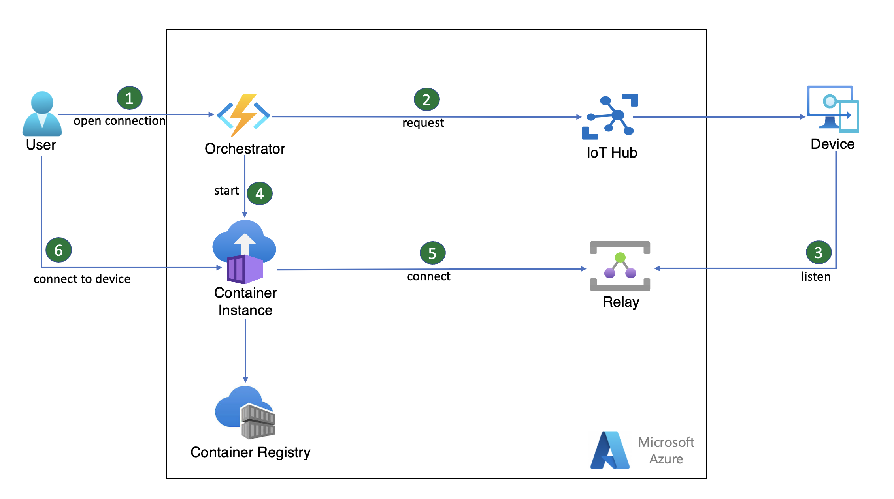

Secure Tunneling with Azure Relay enables users to establish secure, bidirectional TCP connections to edge devices, without making significant changes to the firewall or network configuration on the edge. This example scenario shows how to implement secure tunneling with Azure Relay using a simulated device.

## Architecture

Download a [PowerPoint file](https://arch-center.azureedge.net/secure-tunneling-azure-relay.pptx) of this architecture.

### Workflow

The following workflow demonstrates how a user can access a web server that is running on a remote device in a private network which corresponds to the above diagram:

1. The user triggers an Azure Function that acts as an Orchestrator to initiate a connection with a device specified in the request payload.
2. The Orchestrator invokes a direct method that initiates the user triggered connection to the device via IoT Hub.
    - [Direct methods](https://learn.microsoft.com/en-us/azure/iot-hub/iot-hub-devguide-direct-methods) are synchronous, follow a request-response pattern and are meant for communications that require immediate confirmation of their result (within a user-specified timeout).
3. The target device runs a web server. Upon initiation of a connection, it runs a Remote Forwarder for the port the web server is running on via [Azure Relay Bridge](https://github.com/Azure/azure-relay-bridge) and starts listening to an [Azure Relay Hybrid Connection](https://learn.microsoft.com/en-us/azure/azure-relay/relay-hybrid-connections-protocol) of the same name.
4. Upon successful response of the direct method initialization to the Iot Hub, the Orchestrator provisions and/or starts an Azure Container Instance (ACI) with an image of Azure Relay Bridge Local Forwarder hosted on Azure Container Registry (ACR). The ACI runs the Local Forwarder via Azure Relay Bridge configured to connect to the same Azure Relay Hybrid Connection.
5. The ACI connects to the Azure Relay Hybrid Connection and exposes a public endpoint.
6. When the connection is established, the user can access the web server that is running on the remote device by going to the ACI's fully qualified domain name (FQDN) in their browser.

### Components

- [Azure Relay](https://learn.microsoft.com/en-us/azure/azure-relay/relay-what-is-it) enables you to securely expose services that run in your corporate network to the public cloud without opening a port on your firewall, or intrusive changes to your corporate network infrastructure.
- [Azure IoT Hub](https://learn.microsoft.com/en-us/azure/iot-hub/iot-concepts-and-iot-hub) acts as a central message hub for communication between an IoT application and its attached devices.
- [Azure Container Registry](https://learn.microsoft.com/en-us/azure/container-registry/container-registry-intro) allows you to build, store, and manage container images and artifacts in a private registry for all types of container deployments.
- [Azure Container Instance](https://learn.microsoft.com/en-us/azure/container-instances/container-instances-overview) offers the fastest and simplest way to run a container in Azure.
- [Azure Functions](https://azure.microsoft.com/services/sql-database) is a serverless solution that allows you to write less code, maintain less infrastructure, and save on costs in Azure.

### Alternatives

- You can use the [Azure Web PubSub](https://learn.microsoft.com/en-us/azure/azure-web-pubsub/overview) which is a real-time messaging web applications that uses WebSockets and the publish-subscribe pattern in lieu of Azure Relay Service. However, Azure Web PubSub is not design for this use case as it is mostly used for the broadcast, publisher and subscriber use cases and thus may require more operational overhead and resources.
- You can use a custom WebSocket bidirectional connection from cloud to edge devices. However, a custom WebSocket bidirectional connection may require more overhead and an "always on" connection.

## Scenario details

When devices are installed at remote locations and protected by firewalls, the users who need to access them for troubleshooting or other operational tasks often need to be present on-site or connected to the same local network as the device.

Secure Tunneling enables users to establish secure, bidirectional connections to edge devices, without making significant changes to the firewall or network configuration on the edge.

### Potential use cases

- Remotely accessing Sensor Devices in Hospitals
  - A technician at a medical device company needs the ability securely access their sensor devices on demand, located hundreds of miles away behind a hospital’s firewall to troubleshoot and resolve an issue. Instead of having the technician travel to the hospital to respond to the incident, increasing resolution time and operational costs
- Smart building
  - System integrators in smart building scenario need to securely access the local web servers built in the remote devices over public internet to configure the device settings improving their operational efficiencies.

## Considerations

These considerations implement the pillars of the Azure Well-Architected Framework, which is a set of guiding tenets that can be used to improve the quality of a workload. For more information, see [Microsoft Azure Well-Architected Framework](/azure/architecture/framework).

### Security

Security provides assurances against deliberate attacks and the abuse of your valuable data and systems. For more information, see [Overview of the security pillar](/azure/architecture/framework/security/overview).

- Review the security considerations in the appropriate [Security in Azure App Service](https://learn.microsoft.com/en-us/azure/app-service/overview-security).
- For Azure Container Register, refer to the [Azure security baseline for Container Registry](https://learn.microsoft.com/en-us/security/benchmark/azure/baselines/container-registry-security-baseline).
- Network security is considered throughout the design. Azure Relay is designed to be security conscious with the possibility of introducing Private endpoints, IP firewall. The sample example used is a minimal architecture but can be extended to use the Azure Relay service recommendation. For more information, see [Network security for Azure Relay](https://learn.microsoft.com/en-us/azure/azure-relay/network-security?source=recommendations).

### Cost optimization

Cost optimization is about looking at ways to reduce unnecessary expenses and improve operational efficiencies. For more information, see [Overview of the cost optimization pillar](/azure/architecture/framework/cost/overview).

- The Secure Tunneling with Azure environment is ephemeral. You can easily deploy the environment with the required resources for the event, then tear it down just as easily.
- To estimate the cost of implementing this solution, use the [Azure Pricing Calculator](https://azure.com/e/bb4e865667354736a27887f0695a273e).
- Azure Log Analytics and Azure Monitor are billed per gigabyte (GB) of data ingested into the service (see [Azure Monitor pricing](https://azure.microsoft.com/pricing/details/monitor/)). For more information, see [Azure Monitor overview](https://learn.microsoft.com/en-us/azure/azure-monitor/overview).

### Operational excellence

Operational excellence covers the operations processes that deploy an application and keep it running in production. For more information, see [Overview of the operational excellence pillar](/azure/architecture/framework/devops/overview).

Azure Monitor integrates with all the resources used to support logging. This sample is minimal and does not specifically use Azure Monitor diagnostics settings to collect logs and send them to a Log Analytics workspace but can be incorporated if required. From there, you can use the [Kusto query language](/azure/data-explorer/kusto/query) to write queries across the aggregated logs.

## Deploy this scenario

There is a sample deployment with a simulated device of the Secure Tunneling with Azure Relay on [GitHub](https://github.com/Azure-Samples/secure-tunneling-azure-relay). This sample enables communication between the user and device using HTTP but any protocol that sits above the TCP stack, such as SSH or RDP, can be supported.

## Contributors

*This article is maintained by Microsoft. It was originally written by the following contributors.*

Principal authors:

- [Ola Sowemimo](https://www.linkedin.com/in/ola-sowemimo-54776361/) | Senior Software Engineer

Other contributors:

- [Lila Molyva](https://www.linkedin.com/in/lila-molyva-172863112/) | Senior Software Engineer

*To see non-public LinkedIn profiles, sign in to LinkedIn.*

## Next steps

* [Explore the Azure Relay Bridge CLI tool](https://learn.microsoft.com/en-us/azure/azure-relay/relay-what-is-it)
* [Explore Azure IoT Hub deeper and other Messaging Services as a connection request option](https://learn.microsoft.com/en-us/azure/iot-hub/iot-concepts-and-iot-hub)
