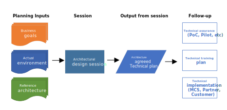

# Architectural design sessions

The ANSI/IEEE Std 1471-2000 definition of *architecture* is "the fundamental organization of a system, embodied in its components, their relationships to each other and the environment, and the principles governing its design and evolution."

Architecture in software technology applies to both the process and the outcome of analyzing and specifying:
- Overall structure
- Logical components
- Interrelationships of computers and their operating systems
- Networks or other conceptions

Review a proposed reference architecture with the team or customer. If they don't agree with the architecture or implementation, hold an *architectural design session (ADS)* to collaborate on a solution.

During an ADS, discuss in depth how a solution blends into an environment. The ADS custom builds an architecture that works in the environment and satisfies all the stakeholders' decision criteria and technical requirements.

Alternative engagements can be a better fit than an ADS:
- Product briefings might provide better, faster, and lower-cost information about solution options.
- Demonstrations or hands-on labs might be better for product testing and tryouts.
- A [proof of concept or pilot project](poc-pilot.md) can demonstrate that a proposed solution is feasible and works to solve the business problem.
- Online or local partner [training](technical-training.md) helps improve specific skills.

## ADS process

### Planning

Meet with the stakeholder to confirm that they're ready for an ADS. The outcome should be a mutual understanding of solution goals, requirements, and logistics. Agree on a high-level agenda for the ADS and a list of participants. Six to eight people is optimal for decision-making.

To plan the ADS:
- Identify stakeholders, decision-makers, implementers, and other attendees.
- Qualify the project and objectives.
- Review the architecture for the project's workload, industry, and technology, and prepare to explain any gaps.
- Schedule local resources and delivery owners.

### Delivery

Typical ADS delivery steps include:
1. Confirm the objectives and validate the agenda.
2. Learn the customer's challenges and opportunities. Record current status and future vision.
3. Explore options. Help customers envision potential solutions with available technical capabilities.
4. Drive to consensus on the solution. Get customer confirmation and engagement for next steps.

An ADS usually runs over two days and discusses business capabilities, technology, data flow, and information flow. Lead an ADS as a facilitator, not as a presenter. Make sure to hear the team or customer's voice throughout the conversation. Take notes on a presentation board to capture thoughts.

In the first, four-hour session:
- Gather requirements. Requirements include customer context, business background, business goals and objectives, business scenarios and user stores, security requirements, operational requirements, and customer environment.
- Verify that all needed information is included and relevant.
- Prioritize goals.

In the next two four-hour sessions:
- Present the proposed architecture.
- Discuss how to blend the architecture into the goals and requirements of the customer's current environment.

In the final four-hour session:
- Validate that the session achieved the customer's business goals.
- Define next steps.

### Follow-up

After the customer agrees on the architecture, clearly define and document next steps. State how the steps fulfill the opportunity and strategy documented in the technical plan. Make sure to include all internal and external stakeholders, and actively hand over the project to other resources if appropriate.

Send a follow-up email that includes:
- The agreed-upon project goals, requirements, and concerns.
- Descriptions of the existing situation and proposed solution.
- Next steps and action items per the key decisions.
- A formalized Visio or PowerPoint illustration from the ADS presentation board.
