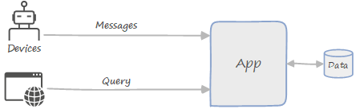
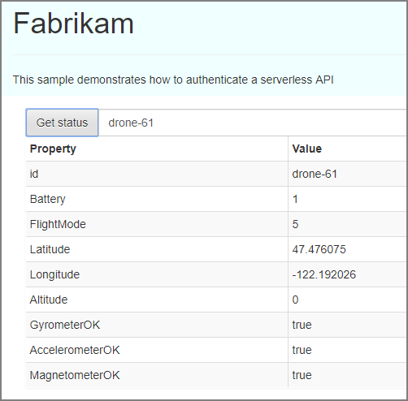
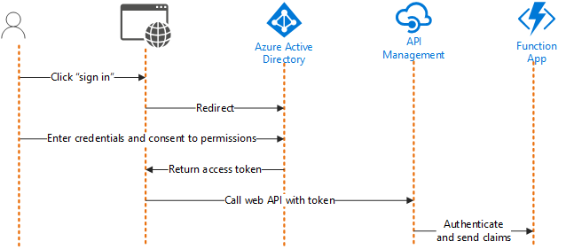

<!--cSpell:ignore Gyrometer upsert deadletterqueue -->
Serverless models abstract code from the underlying compute infrastructure, allowing developers to focus on business logic without extensive setup. Serverless code reduces costs, because you pay only for the code execution resources and duration.

The serverless event-driven model fits situations where a certain event triggers a defined action. For example, receiving an incoming device message triggers storage for later use, or a database update triggers some further processing.

To help you explore Azure serverless technologies in Azure, Microsoft developed and tested a serverless application that uses [Azure Functions](/azure/azure-functions). This article walks through the code for the serverless Functions solution, and describes design decisions, implementation details, and some of the "gotchas" you might encounter.

## Explore the solution

The two-part solution describes a hypothetical drone delivery system. Drones send in-flight status to the cloud, which stores these messages for later use. A web app lets users retrieve the messages to get the latest status of the devices.

You can download the code for this solution from [GitHub](https://github.com/mspnp/serverless-reference-implementation/tree/v0.1.0).

This walkthrough assumes basic familiarity with the following technologies:

- [Azure Functions](/azure/azure-functions)
- [Azure Event Hubs](/azure/event-hubs)
- [.NET Core](/dotnet/core)

You don't need to be an expert in Functions or Event Hubs, but you should understand their features at a high level. Here are some good resources to get started:

- [An introduction to Azure Functions](/azure/azure-functions/functions-overview)
- [Features and terminology in Azure Event Hubs](/azure/event-hubs/event-hubs-features)

## Understand the scenario



Fabrikam manages a fleet of drones for a drone delivery service. The application consists of two main functional areas:

- **Event ingestion**. During flight, drones send status messages to a cloud endpoint. The application ingests and processes these messages, and writes the results to a back-end database (Azure Cosmos DB). The devices send messages in [protocol buffer](https://developers.google.com/protocol-buffers) (protobuf) format. Protobuf is an efficient, self-describing serialization format.

    These messages contain partial updates. At a fixed interval, each drone sends a "key frame" message that contains all of the status fields. Between key frames, the status messages only include fields that changed since the last message. This behavior is typical of many IoT devices that need to conserve bandwidth and power.

- **Web app**. A web application allows users to look up a device and query the device's last-known status.  Users must sign into the application and authenticate with Azure Active Directory (Azure AD). The application only allows requests from users who are authorized to access the app.

Here's a screenshot of the web app, showing the result of a query:



## Design the application

Fabrikam has decided to use Azure Functions to implement the application business logic. Azure Functions is an example of "Functions as a Service" (FaaS). In this computing model, a *function* is a piece of code that is deployed to the cloud and runs in a hosting environment. This hosting environment completely abstracts the servers that run the code.

### Why choose a serverless approach?

A serverless architecture with Functions is an example of an event-driven architecture. The function code is a triggered by some event that's external to the function &mdash; in this case, either a message from a drone, or an HTTP request from a client application. With a function app, you don't need to write any code for the trigger. You only write the code that runs in response to the trigger. That means you can focus on your business logic, rather than writing a lot of code to handle infrastructure concerns like messaging.

There are also some operational advantages to using a serverless architecture:

- There is no need to manage servers.
- Compute resources are allocated dynamically as needed.
- You are charged only for the compute resources used to execute your code.
- The compute resources scale on demand based on traffic.

### Architecture

The following diagram shows the high-level architecture of the application:

:::image type="complex" source="./images/architecture.png" alt-text="Diagram showing the high-level architecture of the serverless Functions application.":::
   In one data flow, arrows show messages going from Devices to Event Hubs and triggering the function app. From the app, one arrow shows dead-letter messages going to a storage queue, and another arrow shows writing to Azure Cosmos DB. In another data flow, arrows show the client web app getting static files from Blob storage static web hosting, through a CDN. Another arrow shows the client HTTP request going through API Management. From API Management, one arrow shows the function app triggering and reading data from Azure Cosmos DB. Another arrow shows authentication through Azure AD. A User also signs in to Azure AD.
:::image-end:::

Event ingestion:

1. Drone messages are ingested by Azure Event Hubs.
1. Event Hubs produces a stream of events that contain the message data.
1. These events trigger an Azure Functions app to process them.
1. The results are stored in Azure Cosmos DB.

Web app:

1. Static files are served by CDN from Blob storage.
1. A user signs into the web app using Azure AD.
1. Azure API Management acts as a gateway that exposes a REST API endpoint.
1. HTTP requests from the client trigger an Azure Functions app that reads from Azure Cosmos DB and returns the result.

This application is based on two reference architectures, corresponding to the two functional blocks described above:

- [Serverless event processing using Azure Functions](../reference-architectures/serverless/event-processing.yml)
- [Serverless web application on Azure](../web-apps/serverless/architectures/web-app.yml)

You can read those articles to learn more about the high-level architecture, the Azure services that are used in the solution, and considerations for scalability, security, and reliability.

## Drone telemetry function

Let's start by looking at the function that processes drone messages from Event Hubs. The function is defined in a class named `RawTelemetryFunction`:

```csharp
namespace DroneTelemetryFunctionApp
{
    public class RawTelemetryFunction
    {
        private readonly ITelemetryProcessor telemetryProcessor;
        private readonly IStateChangeProcessor stateChangeProcessor;
        private readonly TelemetryClient telemetryClient;

        public RawTelemetryFunction(ITelemetryProcessor telemetryProcessor, IStateChangeProcessor stateChangeProcessor, TelemetryClient telemetryClient)
        {
            this.telemetryProcessor = telemetryProcessor;
            this.stateChangeProcessor = stateChangeProcessor;
            this.telemetryClient = telemetryClient;
        }
    }
    ...
}
```

This class has several dependencies, which are injected into the constructor using dependency injection:

- The `ITelemetryProcessor` and `IStateChangeProcessor` interfaces define two helper objects. As we'll see, these objects do most of the work.

- The [TelemetryClient](/dotnet/api/microsoft.applicationinsights.telemetryclient?view=azure-dotnet&preserve-view=true) is part of the Application Insights SDK. It is used to send custom application metrics to Application Insights.

Later, we'll look at how to configure the dependency injection. For now, just assume these dependencies exist.

## Configure the Event Hubs trigger

The logic in the function is implemented as an asynchronous method named `RunAsync`. Here is the method signature:

```csharp
[FunctionName("RawTelemetryFunction")]
[StorageAccount("DeadLetterStorage")]
public async Task RunAsync(
    [EventHubTrigger("%EventHubName%", Connection = "EventHubConnection", ConsumerGroup ="%EventHubConsumerGroup%")]EventData[] messages,
    [Queue("deadletterqueue")] IAsyncCollector<DeadLetterMessage> deadLetterMessages,
    ILogger logger)
{
    // implementation goes here
}
```

The method takes the following parameters:

- `messages` is an array of event hub messages.
- `deadLetterMessages` is an Azure Storage Queue, used for storing dead letter messages.
- `logging` provides a logging interface, for writing application logs. These logs are sent to Azure Monitor.

The `EventHubTrigger` attribute on the `messages` parameter configures the trigger. The properties of the attribute specify an event hub name, a connection string, and a [consumer group](/azure/event-hubs/event-hubs-features#event-consumers). (A *consumer group* is an isolated view of the Event Hubs event stream. This abstraction allows for multiple consumers of the same event hub.)

Notice the percent signs (%) in some of the attribute properties. These indicate that the property specifies the name of an app setting, and the actual value is taken from that app setting at run time. Otherwise, without percent signs, the property gives the literal value.

The `Connection` property is an exception. This property always specifies an app setting name, never a literal value, so the percent sign is not needed. The reason for this distinction is that a connection string is secret and should never be checked into source code.

While the other two properties (event hub name and consumer group) are not sensitive data like a connection string, it's still better to put them into app settings, rather than hard coding. That way, they can be updated without recompiling the app.

For more information about configuring this trigger, see [Azure Event Hubs bindings for Azure Functions](/azure/azure-functions/functions-bindings-event-hubs-trigger#attributes-and-annotations).

## Message processing logic

Here's the implementation of the `RawTelemetryFunction.RunAsync` method that processes a batch of messages:

```csharp
[FunctionName("RawTelemetryFunction")]
[StorageAccount("DeadLetterStorage")]
public async Task RunAsync(
    [EventHubTrigger("%EventHubName%", Connection = "EventHubConnection", ConsumerGroup ="%EventHubConsumerGroup%")]EventData[] messages,
    [Queue("deadletterqueue")] IAsyncCollector<DeadLetterMessage> deadLetterMessages,
    ILogger logger)
{
    telemetryClient.GetMetric("EventHubMessageBatchSize").TrackValue(messages.Length);

    foreach (var message in messages)
    {
        DeviceState deviceState = null;

        try
        {
            deviceState = telemetryProcessor.Deserialize(message.Body.Array, logger);

            try
            {
                await stateChangeProcessor.UpdateState(deviceState, logger);
            }
            catch (Exception ex)
            {
                logger.LogError(ex, "Error updating status document", deviceState);
                await deadLetterMessages.AddAsync(new DeadLetterMessage { Exception = ex, EventData = message, DeviceState = deviceState });
            }
        }
        catch (Exception ex)
        {
            logger.LogError(ex, "Error deserializing message", message.SystemProperties.PartitionKey, message.SystemProperties.SequenceNumber);
            await deadLetterMessages.AddAsync(new DeadLetterMessage { Exception = ex, EventData = message });
        }
    }
}
```

When the function is invoked, the `messages` parameter contains an array of messages from the event hub. Processing messages in batches will generally yield better performance than reading one message at a time. However, you have to make sure the function is resilient and handles failures and exceptions gracefully. Otherwise, if the function throws an unhandled exception in the middle of a batch, you might lose the remaining messages. This consideration is discussed in more detail in the section [Error handling](#error-handling).

But if you ignore the exception handling, the processing logic for each message is simple:

1. Call `ITelemetryProcessor.Deserialize` to deserialize the message that contains a device state change.
1. Call `IStateChangeProcessor.UpdateState` to process the state change.

Let's look at these two methods in more detail, starting with the `Deserialize` method.

### Deserialize method

The `TelemetryProcess.Deserialize` method takes a byte array that contains the message payload. It deserializes this payload and returns a `DeviceState` object, which represents the state of a drone. The state may represent a partial update, containing just the delta from the last-known state. Therefore, the method needs to handle `null` fields in the deserialized payload.

```csharp
public class TelemetryProcessor : ITelemetryProcessor
{
    private readonly ITelemetrySerializer<DroneState> serializer;

    public TelemetryProcessor(ITelemetrySerializer<DroneState> serializer)
    {
        this.serializer = serializer;
    }

    public DeviceState Deserialize(byte[] payload, ILogger log)
    {
        DroneState restored = serializer.Deserialize(payload);

        log.LogInformation("Deserialize message for device ID {DeviceId}", restored.DeviceId);

        var deviceState = new DeviceState();
        deviceState.DeviceId = restored.DeviceId;

        if (restored.Battery != null)
        {
            deviceState.Battery = restored.Battery;
        }
        if (restored.FlightMode != null)
        {
            deviceState.FlightMode = (int)restored.FlightMode;
        }
        if (restored.Position != null)
        {
            deviceState.Latitude = restored.Position.Value.Latitude;
            deviceState.Longitude = restored.Position.Value.Longitude;
            deviceState.Altitude = restored.Position.Value.Altitude;
        }
        if (restored.Health != null)
        {
            deviceState.AccelerometerOK = restored.Health.Value.AccelerometerOK;
            deviceState.GyrometerOK = restored.Health.Value.GyrometerOK;
            deviceState.MagnetometerOK = restored.Health.Value.MagnetometerOK;
        }
        return deviceState;
    }
}
```

This method uses another helper interface, `ITelemetrySerializer<T>`, to deserialize the raw message. The results are then transformed into a [POCO](https://wikipedia.org/wiki/Plain_old_CLR_object) model that is easier to work with. This design helps to isolate the processing logic from the serialization implementation details. The `ITelemetrySerializer<T>` interface is defined in a shared library, which is also used by the device simulator to generate simulated device events and send them to Event Hubs.

```csharp
using System;

namespace Serverless.Serialization
{
    public interface ITelemetrySerializer<T>
    {
        T Deserialize(byte[] message);

        ArraySegment<byte> Serialize(T message);
    }
}
```

### UpdateState method

The `StateChangeProcessor.UpdateState` method applies the state changes. The last-known state for each drone is stored as a JSON document in Azure Cosmos DB. Because the drones send partial updates, the application can't simply overwrite the document when it gets an update. Instead, it needs to fetch the previous state, merge the fields, and then perform an upsert operation.

```csharp
public class StateChangeProcessor : IStateChangeProcessor
{
    private IDocumentClient client;
    private readonly string cosmosDBDatabase;
    private readonly string cosmosDBCollection;

    public StateChangeProcessor(IDocumentClient client, IOptions<StateChangeProcessorOptions> options)
    {
        this.client = client;
        this.cosmosDBDatabase = options.Value.COSMOSDB_DATABASE_NAME;
        this.cosmosDBCollection = options.Value.COSMOSDB_DATABASE_COL;
    }

    public async Task<ResourceResponse<Document>> UpdateState(DeviceState source, ILogger log)
    {
        log.LogInformation("Processing change message for device ID {DeviceId}", source.DeviceId);

        DeviceState target = null;

        try
        {
            var response = await client.ReadDocumentAsync(UriFactory.CreateDocumentUri(cosmosDBDatabase, cosmosDBCollection, source.DeviceId),
                                                            new RequestOptions { PartitionKey = new PartitionKey(source.DeviceId) });

            target = (DeviceState)(dynamic)response.Resource;

            // Merge properties
            target.Battery = source.Battery ?? target.Battery;
            target.FlightMode = source.FlightMode ?? target.FlightMode;
            target.Latitude = source.Latitude ?? target.Latitude;
            target.Longitude = source.Longitude ?? target.Longitude;
            target.Altitude = source.Altitude ?? target.Altitude;
            target.AccelerometerOK = source.AccelerometerOK ?? target.AccelerometerOK;
            target.GyrometerOK = source.GyrometerOK ?? target.GyrometerOK;
            target.MagnetometerOK = source.MagnetometerOK ?? target.MagnetometerOK;
        }
        catch (DocumentClientException ex)
        {
            if (ex.StatusCode == System.Net.HttpStatusCode.NotFound)
            {
                target = source;
            }
        }

        var collectionLink = UriFactory.CreateDocumentCollectionUri(cosmosDBDatabase, cosmosDBCollection);
        return await client.UpsertDocumentAsync(collectionLink, target);
    }
}
```

This code uses the `IDocumentClient` interface to fetch a document from Azure Cosmos DB. If the document exists, the new state values are merged into the existing document. Otherwise, a new document is created. Both cases are handled by the `UpsertDocumentAsync` method.

This code is optimized for the case where the document already exists and can be merged. On the first telemetry message from a given drone, the `ReadDocumentAsync` method will throw an exception, because there is no document for that drone. After the first message, the document will be available.

Notice that this class uses dependency injection to inject the `IDocumentClient` for Azure Cosmos DB and an `IOptions<T>` with configuration settings. We'll see how to set up the dependency injection later.

> [!NOTE]
> Azure Functions supports an output binding for Azure Cosmos DB. This binding lets the function app write documents in Azure Cosmos DB without any code. However, the output binding won't work for this particular scenario, because of the custom upsert logic that's needed.

## Error handling

As mentioned earlier, the `RawTelemetryFunction` function app processes a batch of messages in a loop. That means the function needs to handle any exceptions gracefully and continue processing the rest of the batch. Otherwise, messages might get dropped.

If an exception is encountered when processing a message, the function puts the message onto a dead-letter queue:

```csharp
catch (Exception ex)
{
    logger.LogError(ex, "Error deserializing message", message.SystemProperties.PartitionKey, message.SystemProperties.SequenceNumber);
    await deadLetterMessages.AddAsync(new DeadLetterMessage { Exception = ex, EventData = message });
}
```

The dead-letter queue is defined using an [output binding](/azure/azure-functions/functions-bindings-storage-queue-output) to a storage queue:

```csharp
[FunctionName("RawTelemetryFunction")]
[StorageAccount("DeadLetterStorage")]  // App setting that holds the connection string
public async Task RunAsync(
    [EventHubTrigger("%EventHubName%", Connection = "EventHubConnection", ConsumerGroup ="%EventHubConsumerGroup%")]EventData[] messages,
    [Queue("deadletterqueue")] IAsyncCollector<DeadLetterMessage> deadLetterMessages,  // output binding
    ILogger logger)

```

Here the `Queue` attribute specifies the output binding, and the `StorageAccount` attribute specifies the name of an app setting that holds the connection string for the storage account.

**Deployment tip:** In the Resource Manager template that creates the storage account, you can automatically populate an app setting with the connection string. The trick is to use the [listKeys](/azure/azure-resource-manager/resource-group-template-functions-resource#listkeys) function.

Here is the section of the template that creates the storage account for the queue:

```json
    {
        "name": "[variables('droneTelemetryDeadLetterStorageQueueAccountName')]",
        "type": "Microsoft.Storage/storageAccounts",
        "location": "[resourceGroup().location]",
        "apiVersion": "2017-10-01",
        "sku": {
            "name": "[parameters('storageAccountType')]"
        },
```

Here is the section of the template that creates the function app.

```json

    {
        "apiVersion": "2015-08-01",
        "type": "Microsoft.Web/sites",
        "name": "[variables('droneTelemetryFunctionAppName')]",
        "location": "[resourceGroup().location]",
        "tags": {
            "displayName": "Drone Telemetry Function App"
        },
        "kind": "functionapp",
        "dependsOn": [
            "[resourceId('Microsoft.Web/serverfarms', variables('hostingPlanName'))]",
            ...
        ],
        "properties": {
            "serverFarmId": "[resourceId('Microsoft.Web/serverfarms', variables('hostingPlanName'))]",
            "siteConfig": {
                "appSettings": [
                    {
                        "name": "DeadLetterStorage",
                        "value": "[concat('DefaultEndpointsProtocol=https;AccountName=', variables('droneTelemetryDeadLetterStorageQueueAccountName'), ';AccountKey=', listKeys(variables('droneTelemetryDeadLetterStorageQueueAccountId'),'2015-05-01-preview').key1)]"
                    },
                    ...

```

This defines an app setting named `DeadLetterStorage` whose value is populated using the `listKeys` function. It's important to make the function app resource depend on the storage account resource (see the `dependsOn` element). This guarantees that the storage account is created first and the connection string is available.

## Setting up dependency injection

The following code sets up dependency injection for the `RawTelemetryFunction` function:

```csharp
[assembly: FunctionsStartup(typeof(DroneTelemetryFunctionApp.Startup))]

namespace DroneTelemetryFunctionApp
{
    public class Startup : FunctionsStartup
    {
        public override void Configure(IFunctionsHostBuilder builder)
        {
            builder.Services.AddOptions<StateChangeProcessorOptions>()
                .Configure<IConfiguration>((configSection, configuration) =>
                {
                    configuration.Bind(configSection);
                });

            builder.Services.AddTransient<ITelemetrySerializer<DroneState>, TelemetrySerializer<DroneState>>();
            builder.Services.AddTransient<ITelemetryProcessor, TelemetryProcessor>();
            builder.Services.AddTransient<IStateChangeProcessor, StateChangeProcessor>();

            builder.Services.AddSingleton<IDocumentClient>(ctx => {
                var config = ctx.GetService<IConfiguration>();
                var cosmosDBEndpoint = config.GetValue<string>("CosmosDBEndpoint");
                var cosmosDBKey = config.GetValue<string>("CosmosDBKey");
                return new DocumentClient(new Uri(cosmosDBEndpoint), cosmosDBKey);
            });
        }
    }
}
```

Azure Functions written for .NET can use the ASP.NET Core dependency injection framework. The basic idea is that you declare a startup method for your assembly. The method takes an `IFunctionsHostBuilder` interface, which is used to declare the dependencies for DI. You do this by calling `Add*` method on the `Services` object. When you add a dependency, you specify its lifetime:

- *Transient* objects are created each time they're requested.
- *Scoped* objects are created once per function execution.
- *Singleton* objects are reused across function executions, within the lifetime of the function host.

In this example, the `TelemetryProcessor` and `StateChangeProcessor` objects are declared as transient. This is appropriate for lightweight, stateless services. The `DocumentClient` class, on the other hand, should be a singleton for best performance. For more information, see [Performance tips for Azure Cosmos DB and .NET](/azure/cosmos-db/performance-tips#sdk-usage).

If you refer back to the code for the [RawTelemetryFunction](#drone-telemetry-function), you'll see there another dependency that doesn't appear in DI setup code, namely the `TelemetryClient` class that is used to log application metrics. The Functions runtime automatically registers this class into the DI container, so you don't need to register it explicitly.

For more information about DI in Azure Functions, see the following articles:

- [Use dependency injection in .NET Azure Functions](/azure/azure-functions/functions-dotnet-dependency-injection)
- [Dependency injection in ASP.NET Core](/aspnet/core/fundamentals/dependency-injection)

### Passing configuration settings in DI

Sometimes an object must be initialized with some configuration values. Generally, these settings should come from app settings or (in the case of secrets) from Azure Key Vault.

There are two examples in this application. First, the `DocumentClient` class takes an Azure Cosmos DB service endpoint and key. For this object, the application registers a lambda that will be invoked by the DI container. This lambda uses the `IConfiguration` interface to read the configuration values:

```csharp
builder.Services.AddSingleton<IDocumentClient>(ctx => {
    var config = ctx.GetService<IConfiguration>();
    var cosmosDBEndpoint = config.GetValue<string>("CosmosDBEndpoint");
    var cosmosDBKey = config.GetValue<string>("CosmosDBKey");
    return new DocumentClient(new Uri(cosmosDBEndpoint), cosmosDBKey);
});
```

The second example is the `StateChangeProcessor` class. For this object, we use an approach called the [options pattern](/aspnet/core/fundamentals/configuration/options). Here's how it works:

1. Define a class `T` that contains your configuration settings. In this case, the Azure Cosmos DB database name and collection name.

    ```csharp
    public class StateChangeProcessorOptions
    {
        public string COSMOSDB_DATABASE_NAME { get; set; }
        public string COSMOSDB_DATABASE_COL { get; set; }
    }
    ```

1. Add the class `T` as an options class for DI.

    ```csharp
    builder.Services.AddOptions<StateChangeProcessorOptions>()
        .Configure<IConfiguration>((configSection, configuration) =>
        {
            configuration.Bind(configSection);
        });
    ```

1. In the constructor of the class that is being configured, include an `IOptions<T>` parameter.

    ```csharp
    public StateChangeProcessor(IDocumentClient client, IOptions<StateChangeProcessorOptions> options)
    ```

The DI system will automatically populate the options class with configuration values and pass this to the constructor.

There are several advantages of this approach:

- Decouple the class from the source of the configuration values.
- Easily set up different configuration sources, such as environment variables or JSON configuration files.
- Simplify unit testing.
- Use a strongly typed options class, which is less error prone than just passing in scalar values.

## GetStatus function

The other Functions app in this solution implements a simple REST API to get the last-known status of a drone. This function is defined in a class named `GetStatusFunction`. Here is the complete code for the function:

<!-- cSpell:ignore CosmosDB -->

```csharp
using Microsoft.AspNetCore.Http;
using Microsoft.AspNetCore.Mvc;
using Microsoft.Azure.WebJobs;
using Microsoft.Azure.WebJobs.Extensions.Http;
using Microsoft.Extensions.Logging;
using System.Security.Claims;
using System.Threading.Tasks;

namespace DroneStatusFunctionApp
{
    public static class GetStatusFunction
    {
        public const string GetDeviceStatusRoleName = "GetStatus";

        [FunctionName("GetStatusFunction")]
        public static IActionResult Run(
            [HttpTrigger(AuthorizationLevel.Function, "get", Route = null)]HttpRequest req,
            [CosmosDB(
                databaseName: "%COSMOSDB_DATABASE_NAME%",
                collectionName: "%COSMOSDB_DATABASE_COL%",
                ConnectionStringSetting = "COSMOSDB_CONNECTION_STRING",
                Id = "{Query.deviceId}",
                PartitionKey = "{Query.deviceId}")] dynamic deviceStatus,
            ClaimsPrincipal principal,
            ILogger log)
        {
            log.LogInformation("Processing GetStatus request.");

            if (!principal.IsAuthorizedByRoles(new[] { GetDeviceStatusRoleName }, log))
            {
                return new UnauthorizedResult();
            }

            string deviceId = req.Query["deviceId"];
            if (deviceId == null)
            {
                return new BadRequestObjectResult("Missing DeviceId");
            }

            if (deviceStatus == null)
            {
                return new NotFoundResult();
            }
            else
            {
                return new OkObjectResult(deviceStatus);
            }
        }
    }
}
```

This function uses an HTTP trigger to process an HTTP GET request. The function uses an Azure Cosmos DB input binding to fetch the requested document. One consideration is that this binding will run before the authorization logic is performed inside the function. If an unauthorized user requests a document, the function binding will still fetch the document. Then the authorization code will return a 401, so the user won't see the document. Whether this behavior is acceptable may depend on your requirements. For example, this approach might make it harder to audit data access for sensitive data.

## Authentication and authorization

The web app uses Azure AD to authenticate users. Because the app is a single-page application (SPA) running in the browser, the [implicit grant flow](/azure/active-directory/develop/v1-oauth2-implicit-grant-flow) is appropriate:

1. The web app redirects the user to the identity provider (in this case, Azure AD).
1. The user enters their credentials.
1. The identity provider redirects back to the web app with an access token.
1. The web app sends a request to the web API and includes the access token in the Authorization header.



A Function application can be configured to authenticate users with zero code. For more information, see [Authentication and authorization in Azure App Service](/azure/app-service/overview-authentication-authorization).

Authorization, on the other hand, generally requires some business logic. Azure AD supports *claims based authentication*. In this model, a user's identity is represented as a set of claims that come from the identity provider. A claim can be any piece of information about the user, such as their name or email address.

The access token contains a subset of user claims. Among these are any application roles that the user is assigned to.

The `principal` parameter of the function is a [ClaimsPrincipal](/dotnet/api/system.security.claims.claimsprincipal) object that contains the claims from the access token. Each claim is a key/value pair of claim type and claim value. The application uses these to authorize the request.

The following extension method tests whether a `ClaimsPrincipal` object contains a set of roles. It returns `false` if any of the specified roles is missing. If this method returns false, the function returns HTTP 401 (Unauthorized).

```csharp
namespace DroneStatusFunctionApp
{
    public static class ClaimsPrincipalAuthorizationExtensions
    {
        public static bool IsAuthorizedByRoles(
            this ClaimsPrincipal principal,
            string[] roles,
            ILogger log)
        {
            var principalRoles = new HashSet<string>(principal.Claims.Where(kvp => kvp.Type == "roles").Select(kvp => kvp.Value));
            var missingRoles = roles.Where(r => !principalRoles.Contains(r)).ToArray();
            if (missingRoles.Length > 0)
            {
                log.LogWarning("The principal does not have the required {roles}", string.Join(", ", missingRoles));
                return false;
            }

            return true;
        }
    }
}
```

For more information about authentication and authorization in this application, see the [Security considerations](../web-apps/serverless/architectures/web-app.yml#security) section of the reference architecture.

## Next steps

Once you get a feel for how this reference solution works, learn best practices and recommendations for similar solutions.
- For a serverless event ingestion solution, see [Serverless event processing using Azure Functions](../reference-architectures/serverless/event-processing.yml).
- For a serverless web app, see [Serverless web application on Azure](../web-apps/serverless/architectures/web-app.yml).

Azure Functions is just one Azure compute option. For help with choosing a compute technology, see [Choose an Azure compute service for your application](../guide/technology-choices/compute-decision-tree.yml).

## Related resources

- For in-depth discussion on developing serverless solutions on premises as well as in the cloud, read [Serverless apps: Architecture, patterns, and Azure implementation](/dotnet/standard/serverless-architecture).
- Read more about the [Event-driven architecture style](../guide/architecture-styles/event-driven.yml).
