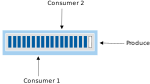
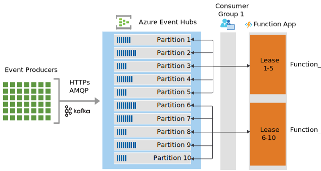

# Event Hubs with Azure Functions Guide

Solutions that use Azure Event Hubs together with Azure Functions benefit from a
[serverless](https://azure.microsoft.com/solutions/serverless/) architecture
that is scalable, cost-effective, and capable of processing large volumes of
data in near real-time. As much as these services work seamlessly well together,
there are many features, settings and intricacies that add complexity to their
relationship. This article aims to provide guidance on how to effectively take
advantage of their integration by highlighting key considerations and techniques
for performance, resiliency, security, observability, and scale.

## Event Hubs core concepts

[Azure Event Hubs](https://azure.microsoft.com/services/event-hubs/) is a
highly scalable event processing service that can receive millions of events per
second. Understanding the fundamental components of Event Hubs will help
establish the patterns and best practices that will be covered in this article
when consuming and publishing events with Azure Functions.

The following figure shows the Event Hubs stream processing architecture:

### Events

An event is a notification or state change that is represented as a fact that
happened in the past. Events are immutable and persisted in an **event hub**,
also referred to as a *topic* in [Kafka](https://kafka.apache.org/). An event
hub is comprised of one or more
[partitions](https://docs.microsoft.com/azure/event-hubs/event-hubs-features#partitions).

### Partitions

As events are received, they are distributed across partitions in an event hub
if no partition is specified by the sender. Each write equals exactly to one
partition entry and are not multi-cast to partitions. Each partition works as a
log where records are written to it in an append-only pattern. The analogy of a
*commit log* is frequently used to describe the nature of how events are added
to the end of a sequence in a partition.

When more than one partition is used, it allows for parallel logs to be utilized
from within the same event hub. This creates opportunities for multiple degrees
of parallelism and enhanced throughput for consumers.

### Consumers and consumer groups

A partition can be consumed by more than one consumer, each reading from and
managing their own offsets.

Event Hubs has the concept of [consumers groups](https://docs.microsoft.com/azure/event-hubs/event-hubs-features#consumer-groups),
which enable multiple consuming applications to each have a separate view of the
event stream, and to read the stream independently at their own pace and with
their own offsets.

References:

- [Deep dive on Event Hubs concepts and features](https://docs.microsoft.com/azure/event-hubs/event-hubs-features)

## Consuming events with Azure Functions

Azure Functions supports [trigger](https://docs.microsoft.com/azure/azure-functions/functions-bindings-event-hubs-trigger?tabs=csharp) and
[output](https://docs.microsoft.com/azure/azure-functions/functions-bindings-event-hubs-output?tabs=csharp)
bindings for Event Hubs. This section covers how Azure Functions responds to
events sent to an event hub event stream using triggers.

Each instance of an Event Hubs triggered function is backed by a single
EventProcessorHost instance. The trigger (powered by Event Hubs) ensures that
only one EventProcessorHost instance can get a lease on a given partition.

For example, consider an Event Hub as follows:

- 10 partitions
- 1,000 events distributed evenly all partitions, with a varying number of
    messages in each partition

When your function is first enabled, there is only one instance of the function.
Let's call the first function instance Function\_1. The Function\_1 function has
a single instance of EventProcessorHost that holds a lease on all ten
partitions. This instance is reading events from partitions 1-10. From this
point forward, one of the following happens:

- **New function instances are not needed**: Function\_1 is able to process
    all 1,000 events before the Functions scaling logic take effect. In this
    case, all 1,000 messages are processed by Function\_1.

    

- **An additional function instance is added**: event-based scaling or other
    automated or manual logic might determine that Function\_1 has more messages
    than it can process and then creates a new function app instance
    (Function\_2). This new function also has an associated instance of
    EventProcessorHost. As the underlying Event Hubs detect that a new host
    instance is trying read messages, it load balances the partitions across the
    host instances. For example, partitions 1-5 may be assigned to Function\_1
    and partitions 6-10 to Function\_2.

    

- **N more function instances are added**: event-based scaling or other
    automated or manual logic determines that both Function\_1 and Function\_2
    have more messages than they can process, new Function\_N function app
    instances are created. Instances are created to the point where N is equal
    to or greater than the number of event hub partitions. In our example, Event
    Hubs again load balances the partitions, in this case across the instances
    Function\_1...Functions\_10.

    

As scaling occurs, N instances can be a number greater than the number of event
hub partitions. This might occur while event-driven scaling stabilizes instance
counts, or because other automated or manual logic created more instances than
partitions. In this case
[EventProcessorHost](https://docs.microsoft.com/dotnet/api/microsoft.azure.eventhubs.processor)
instances will only obtain locks on partitions as they become available from
other instances, as at any given time only one function instance from the same
consumer group can access/read from the partitions it has locks on.

When all function execution completes (with or without errors), checkpoints are
added to the associated storage account. When check-pointing succeeds, all 1,000
messages are never retrieved again.

Dynamic, event-based scaling is possible with Consumption and Premium Azure
plans, as well as with the [KEDA scaler for Event
Hubs](https://keda.sh/docs/2.2/scalers/azure-event-hub/) if the function is
hosted in Kubernetes. Event-based scaling is currently not possible when the
function app is hosted in a (dedicated) App Service plan, and for that you will
need to determine the right number of instances based on your workload.

References:

- [Azure Event Hubs bindings for Azure Functions \| Microsoft
    Docs](https://docs.microsoft.com/azure/azure-functions/functions-bindings-event-hubs)
- [Azure Event Hubs trigger for Azure Functions \| Microsoft
    Docs](https://docs.microsoft.com/azure/azure-functions/functions-bindings-event-hubs-trigger?tabs=csharp)

## Next steps

Now that you understand several key Event Hubs concepts, along with how Azure Functions consumes events, learn about [performance and scale](./performance-scale.md).
