Monitoring provides insights into the behavior and health of your systems, and helps build a holistic view of the environment, historic trends, correlate diverse factors, and measure changes in performance, consumption, or error rate.

Azure Functions offers built-in integration with [Application Insights](/azure/azure-monitor/app/app-insights-overview). From Application Insights, you can get information such as the number of function app instances or request and dependency telemetry of a function. When working with Functions and Event Hubs, Application Insights can also track the outgoing dependency telemetries to the event hub, calculating the time spent in the queue and showing the end-to-end flow of the system connected through Event Hubs.

This section introduces useful features and insights that you can get from Application Insights for your Event Hubs plus Functions solution.

## Application Map

[Application Map](/azure/azure-monitor/app/app-map) shows how the components in a system are interacting with each other. Because of the dependency telemetry that Application Insights provides, it maps out the flow of events between Azure Functions and Event Hubs, including the average of each function execution and average duration of an event in Event Hubs, as well as showing transactions that contain failures marked in red.

After sending the expected load to your system, you can go to Application Insights in the [Azure portal](https://portal.azure.com), and on the sidebar, choose on **Application Map**. Here's a map that shows three functions, three event hubs, and apparent failures when writing to a downstream database:

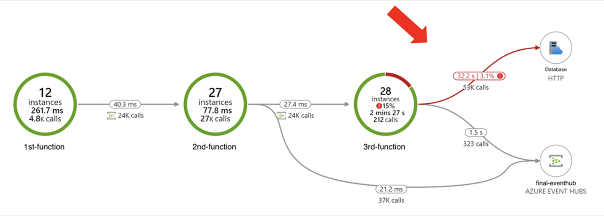

## End-to-end transaction details

End-to-end transaction details show how your system components interact with each other, in chronological order. This view also shows how long an event has spent in the queue. You can also drill into the telemetry of each component from this view, which makes it easier to troubleshoot across components within the same request when an issue occurred.

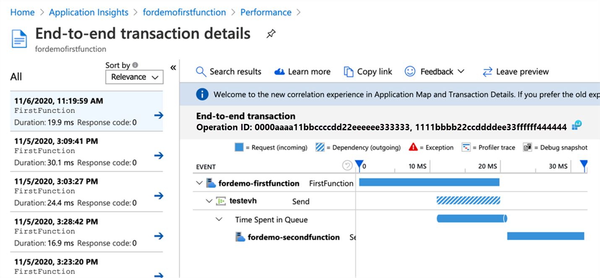

## Platform metrics and telemetry

Platform-generated metrics in Azure Monitor for Event Hubs and Azure Functions can be used for overall monitoring of the solution behavior and health:

- [Azure Event Hubs metrics in Azure Monitor](/azure/event-hubs/event-hubs-metrics-azure-monitor) are of interest to capture useful insights for Event Hubs (like aggregates of Incoming Requests, Outgoing Requests, Throttled Requests, Successful Requests, Incoming Messages, Outgoing Messages, Captured Messages, Incoming Bytes, Outgoing Bytes, Captured Bytes, User Errors).

- Azure Functions metrics share many of the metrics from [Azure App Service](/azure/app-service/web-sites-monitor), with the addition of [Function Execution Count and Function Execution Units](/azure/azure-functions/analyze-telemetry-data#azure-monitor-metrics) that can be used for [understanding utilization and cost of the Consumption plan](/azure/azure-functions/functions-consumption-costs). Other metrics of interest are Connections, Data In, Data Out, Average Memory Working Set, Thread Count, Requests, and Response Time.

Azure Functions integrates with Application Insights to provide advanced and detailed telemetry and insights into the Functions host and function executions. To learn more, see [Analyze Azure Functions telemetry in Application Insights](/azure/azure-functions/analyze-telemetry-data). When using Application Insights to monitor a topology, there are a variety of configurations available. To learn more, see [How to configure monitoring for Azure Functions](/azure/azure-functions/configure-monitoring).

The following is an example of extra telemetry for Event Hubs triggered functions generated in the **traces** table:

<pre>Trigger Details: PartionId: 6, Offset: 3985758552064-3985758624640, EnqueueTimeUtc: 2022-10-31T12:51:58.1750000+00:00-2022-10-31T12:52:03.8160000+00:00, SequenceNumber: 3712266-3712275, Count: 10</pre>

This information requires that you use Event Hubs extension 4.2.0 or a later version. This data is very useful as it contains information about the message that triggered the function execution and can be used for querying and insights. It includes the following data for each time the function is triggered:

- The **partition ID** (6)
- The **partition offset** range (3985758552064-3985758624640)
- The **Enqueue Time range** in UTC (2022-10-31T12:51:58.1750000+00:00-2022-10-31T12:52:03.8160000+00:00)
- The **sequence number range** 3712266-3712275
- And the **count of messages** (10)

Refer to the [Example Application Insights queries](#example-application-insights-queries) section for examples on how to use this telemetry.

Custom telemetry is also possible for different languages ([C\# class library](/azure/azure-functions/functions-dotnet-class-library#logging), [C\# Isolated](/azure/azure-functions/dotnet-isolated-process-guide#logging), [C\# Script](/azure/azure-functions/functions-reference-csharp#logging), [JavaScript](/azure/azure-functions/functions-reference-node#write-trace-output-to-logs), [Java](/azure/azure-functions/functions-reference-java#logger), [PowerShell](/azure/azure-functions/functions-reference-powershell#logging), and [Python](/azure/azure-functions/functions-reference-python#logging)). This logging shows up in the **traces** table in Application Insights. You can create your own entries into Application Insights and add custom dimensions that can be used for querying data and creating custom dashboards.

Finally, when your function app connects to an event hub using an output binding, entries are also written to the [Application Insights Dependencies table](/azure/azure-functions/functions-monitoring#dependencies).

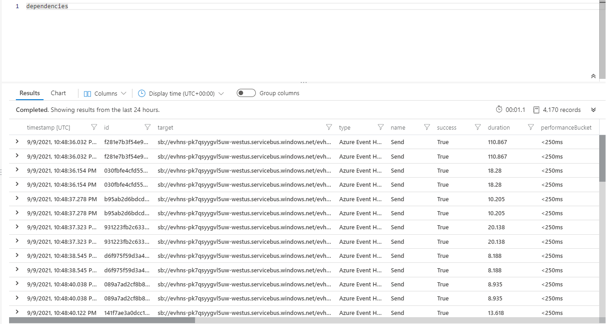

For Event Hubs, the correlation is injected into the event payload, and you see a **Diagnostic-Id** property in events:

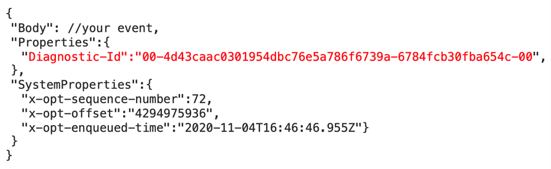

This follows the [W3C Trace Context](https://www.w3.org/TR/trace-context/) format that's also used as **Operation Id** and **Operation Links** in telemetry created by Functions, which allows Application Insights to construct the correlation between event hub events and function executions, even when they're distributed.

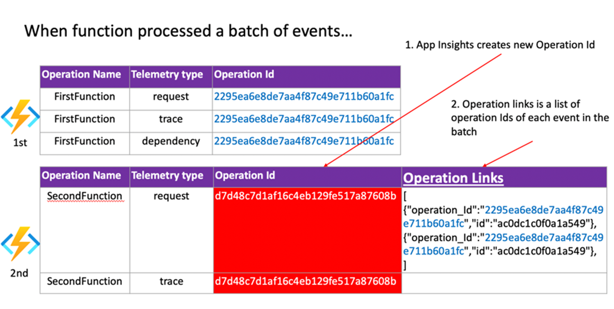

## Example Application Insights queries

Below is a list of helpful Application Insights queries when monitoring Event Hubs with Azure Functions. This query display detailed information for event hub triggered function using telemetry **emitted by the Event Hubs extension 4.2.0 and greater**.

When [sampling is enabled](/azure/azure-functions/configure-monitoring?tabs=v2#configure-sampling) in Application Insights, there can be gaps in the data.

### Detailed event processing information

The data is only emitted in the correct format when batched dispatch is used. Batch dispatch means that the function accepts multiple events for each execution, which is [recommended for performance](performance-scale.yml#batching-for-triggered-functions). Keep in mind the following considerations:

- The `dispatchTimeMilliseconds` value approximates the length of time between when the event was written to the event hub and when it was picked up by the function app for processing.
- `dispatchTimeMilliseconds` can be negative or otherwise inaccurate because of clock drift between the event hub server and the function app.
- Event Hubs partitions are processed sequentially. A message won't be dispatched to function code for processing until all previous messages have been processed. Monitor the execution time of your functions as longer execution times will cause dispatch delays.
- The calculation uses the enqueueTime of the first message in the batch. Dispatch times might be lower for other messages in the batch.
- `dispatchTimeMilliseconds` is based on the point in time.
- Sequence numbers are per-partition, and duplicate processing can occur because Event Hubs does not guarantee exactly-once message delivery.

```kusto
traces
| where message startswith "Trigger Details: Parti"
| parse message with * "tionId: " partitionId:string ", Offset: "
offsetStart:string "-" offsetEnd:string", EnqueueTimeUtc: "
enqueueTimeStart:datetime "+00:00-" enqueueTimeEnd:datetime "+00:00, SequenceNumber: "
sequenceNumberStart:string "-" sequenceNumberEnd:string ", Count: "
messageCount:int
| extend dispatchTimeMilliseconds = (timestamp - enqueueTimeStart) / 1ms
| project timestamp, cloud_RoleInstance, operation_Name, processId =
customDimensions.ProcessId, partitionId, messageCount, sequenceNumberStart,
sequenceNumberEnd, enqueueTimeStart, enqueueTimeEnd, dispatchTimeMilliseconds
```

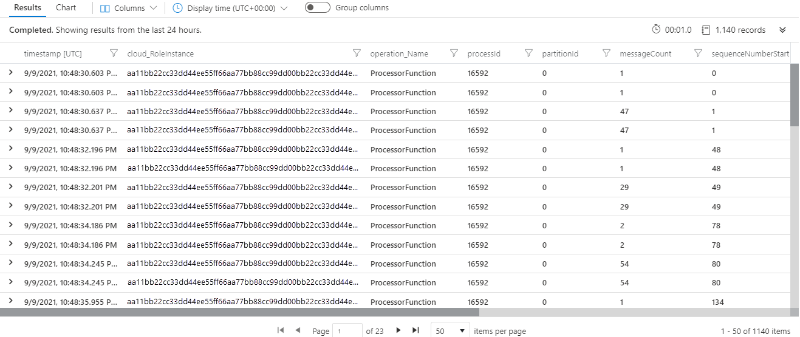

### Dispatch latency visualization

This query visualizes the 50th and 90th percentile event dispatch latency for a given event hub triggered function. See the above query for more details and notes.

```kusto
traces
| where operation_Name == "<ENTER THE NAME OF YOUR FUNCTION HERE>"
| where message startswith "Trigger Details: Parti"
| parse message with * "tionId: " partitionId:string ", Offset: "
offsetStart:string "-" offsetEnd:string", EnqueueTimeUtc: "
enqueueTimeStart:datetime "+00:00-" enqueueTimeEnd:datetime "+00:00, SequenceNumber: "
sequenceNumberStart:string "-" sequenceNumberEnd:string ", Count: "
messageCount:int
| extend dispatchTimeMilliseconds = (timestamp - enqueueTimeStart) / 1ms
| summarize percentiles(dispatchTimeMilliseconds, 50, 90) by bin(timestamp, 5m)
| render timechart
```

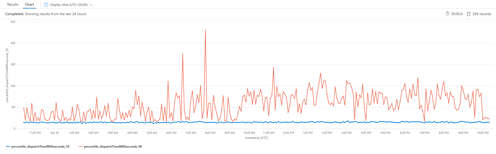

### Dispatch latency summary

This query is similar to above but shows a summary view.

```kusto
traces
| where message startswith "Trigger Details: Parti"
| parse message with * "tionId: " partitionId:string ", Offset: "
offsetStart:string "-" offsetEnd:string", EnqueueTimeUtc: "
enqueueTimeStart:datetime "+00:00-" enqueueTimeEnd:datetime "+00:00, SequenceNumber: "
sequenceNumberStart:string "-" sequenceNumberEnd:string ", Count: "
messageCount:int
| extend dispatchTimeMilliseconds = (timestamp - enqueueTimeStart) / 1ms
| summarize messageCount = sum(messageCount),
percentiles(dispatchTimeMilliseconds, 50, 90, 99, 99.9, 99.99) by operation_Name
```

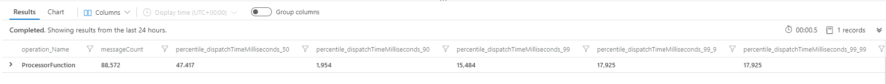

### Message distribution across partitions

This query shows how to visualize message distribution across partitions.

```kusto
traces
| where message startswith "Trigger Details: Parti"
| parse message with * "tionId: " partitionId:string ", Offset: "
offsetStart:string "-" offsetEnd:string", EnqueueTimeUtc: "
enqueueTimeStart:datetime "+00:00-" enqueueTimeEnd:datetime "+00:00, SequenceNumber: "
sequenceNumberStart:string "-" sequenceNumberEnd:string ", Count: "
messageCount:int
| summarize messageCount = sum(messageCount) by cloud_RoleInstance,
bin(timestamp, 5m)
| render areachart kind=stacked
```

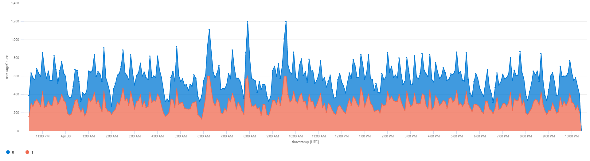

### Message distribution across instances

This query shows how to visualize message distribution across instances.

```kusto
traces
| where message startswith "Trigger Details: Parti"
| parse message with * "tionId: " partitionId:string ", Offset: "
offsetStart:string "-" offsetEnd:string", EnqueueTimeUtc: "
enqueueTimeStart:datetime "+00:00-" enqueueTimeEnd:datetime "+00:00, SequenceNumber: "
sequenceNumberStart:string "-" sequenceNumberEnd:string ", Count: "
messageCount:int
| summarize messageCount = sum(messageCount) by cloud_RoleInstance,
bin(timestamp, 5m)
| render areachart kind=stacked
```

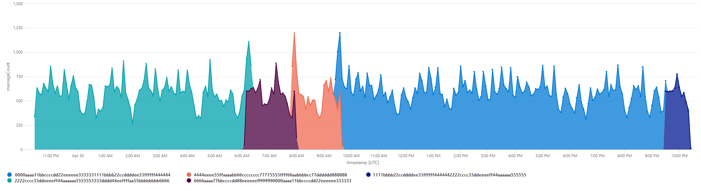

### Executing Instances and Allocated Instances

This query shows how to visualize the number of Azure Functions instances that are processing events from Event Hubs, and the total number of instances (processing and waiting for lease). Most of the time they should be the same.

```kusto
traces
| where message startswith "Trigger Details: Parti"
| summarize type = "Executing Instances", Count = dcount(cloud_RoleInstance) by
bin(timestamp, 60s)
| union (
    traces
    | summarize type = "Allocated Instances", Count = dcount(cloud_RoleInstance) by
bin(timestamp, 60s)
)
| project timestamp, type, Count
| render timechart
```

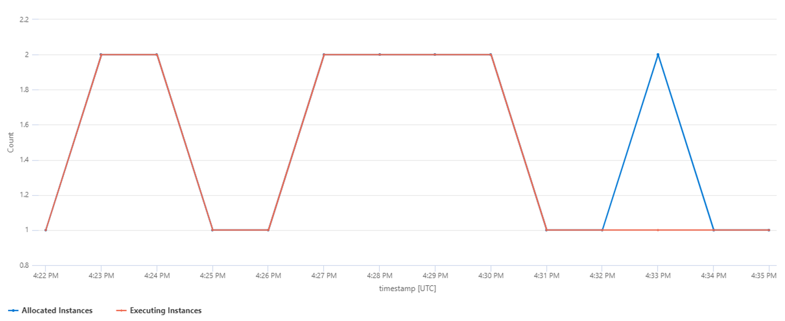

### All Telemetry for a specific Function Execution

The **operation_Id** field can be used across the different tables in Application Insights. For Event Hubs triggered Azure Functions the following query for example will result in the trigger information, telemetry from logs inside the Function code, and dependencies and exceptions:

```kusto
union isfuzzy=true requests, exceptions, traces, dependencies
| where * has "<ENTER THE OPERATION_ID OF YOUR FUNCTION EXECUTION HERE>"
| order by timestamp asc
```

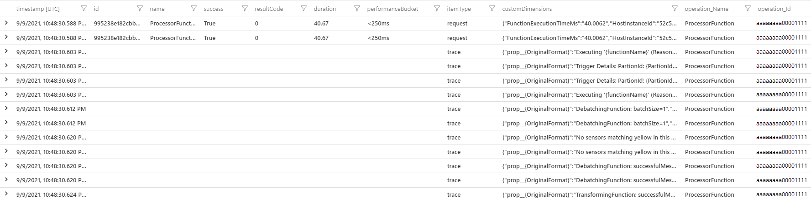

### End-to-End Latency for an Event

As the **enqueueTimeUtc** property in the trigger detail trace shows the enqueue time of only the first event of each batch that the function processed, a more advanced query can be used to calculate the end-to-end latency of events between two functions with Event Hubs in between. This query will expand the operation links (if any) in the second function's request and map its end time to the same corresponding operation ID of the first function start time.

```kusto
let start = view(){
requests
| where operation_Name == "FirstFunction"
| project start_t = timestamp, first_operation_Id = operation_Id
};
let link = view(){
requests
| where operation_Name == "SecondFunction"
| mv-expand ex = parse_json(tostring(customDimensions["_MS.links"]))
| extend parent = case(isnotempty(ex.operation_Id), ex.operation_Id, operation_Id )
| project first_operation_Id = parent, second_operation_Id = operation_Id
};
let finish = view(){
traces
| where customDimensions["EventName"] == "FunctionCompleted" and operation_Name
== "SecondFunction"
| project end_t = timestamp, second_operation_Id = operation_Id
};
start
| join kind=inner (
link
| join kind=inner finish on second_operation_Id
) on first_operation_Id
| project start_t, end_t, first_operation_Id, second_operation_Id
| summarize avg(datetime_diff('second', end_t, start_t))
```

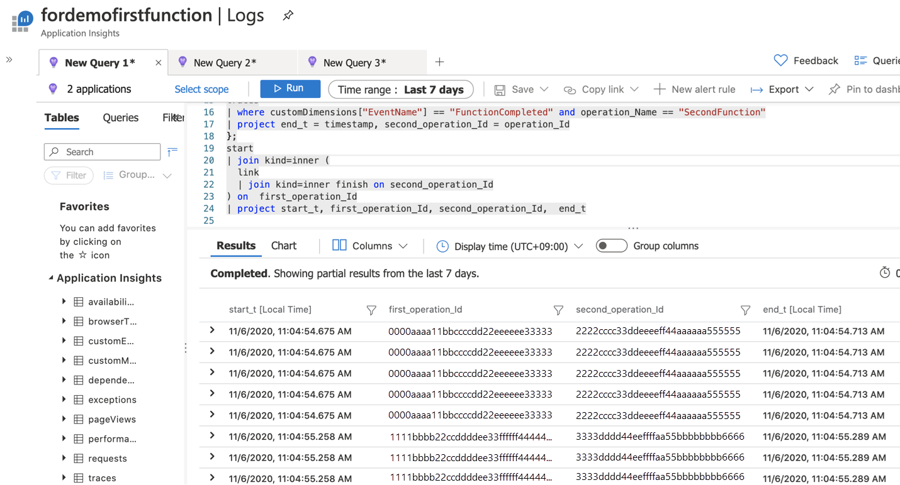

## Contributors

*This article is maintained by Microsoft. It was originally written by the following contributors.*

Principal author:

- [David Barkol](https://www.linkedin.com/in/davidbarkol/) | Principal Solution Specialist GBB

*To see non-public LinkedIn profiles, sign in to LinkedIn.*

## Next steps

To learn more, consider reviewing these related articles:

- [Monitoring serverless event processing](../guide/monitoring-serverless-event-processing.md)
- [Analyze Azure Functions telemetry in Application Insights](/azure/azure-functions/analyze-telemetry-data)
- [Configure monitoring for Azure Functions](/azure/azure-functions/configure-monitoring?tabs=v2)
- [Analyze Azure Functions telemetry in Application Insights](/azure/azure-functions/analyze-telemetry-data)
- [Metrics in Azure Monitor - Azure Event Hubs](/azure/event-hubs/event-hubs-metrics-azure-monitor)
- [Kusto Query Language](/azure/data-explorer/kusto/concepts/)

## Related resources

- [Monitoring serverless event processing](../guide/monitoring-serverless-event-processing.md) provides guidance on monitoring serverless event-driven architectures.
- [Serverless event processing](../../reference-architectures/serverless/event-processing.yml) is a reference architecture detailing a typical architecture of this type, with code samples and discussion of important considerations.
- [De-batching and filtering in serverless event processing with Event Hubs](../../solution-ideas/articles/serverless-event-processing-filtering.yml) describes in more detail how these portions of the reference architecture work.
