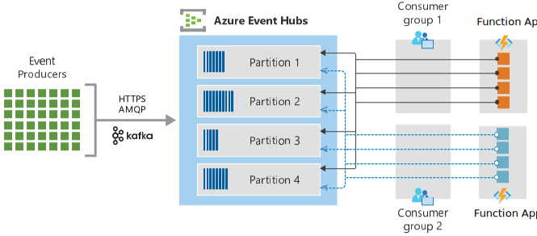
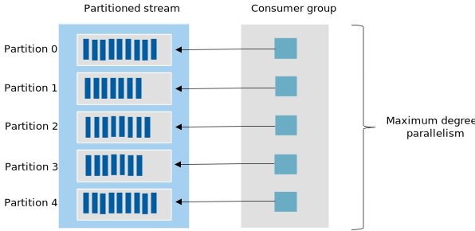

This article provides guidance for optimizing scalability and performance when you use Azure Event Hubs and Azure Functions together in your applications.

## Function grouping

Typically, a function encapsulates a unit of work in an event-processing stream. For instance, a function can transform an event into a new data structure or enrich data for downstream applications.

In Functions, a function app provides the execution context for functions. Function app behaviors apply to all functions that the function app hosts. Functions in a function app are deployed together and scaled together. All functions in a function app must be of the same language.

How you group functions into function apps can affect the performance and scaling capabilities of your function apps. You can group according to access rights, deployment, and the usage patterns that invoke your code.

For guidance on Functions best practices for grouping and other aspects, see [Best practices for reliable Azure Functions](/azure/azure-functions/functions-best-practices#function-organization-best-practices) and [Improve the performance and reliability of Azure Functions](/azure/azure-functions/performance-reliability).

The following list is guidance for grouping functions. The guidance considers storage and consumer group aspects:

- **Host a single function in a function app:** If Event Hubs triggers a function, you can, to reduce contention between that function and other functions, isolate the function in its own function app. Isolation is especially important if the other functions are CPU or memory intensive. This technique helps because each function has its own memory footprint and usage patterns that can directly affect the scaling of the function app that hosts it.
- **Give each function app its own storage account:** Avoid sharing storage accounts between function apps. Also, if a function app uses a storage account, don't use that account for other storage operations or needs. It can be especially important to avoid sharing storage accounts for functions that Event Hubs triggers, because such functions can have a high volume of storage transactions due to checkpointing.
- **Create a dedicated consumer group for each function app:** A consumer group is a view of an event hub. Different consumer groups have different views, which means that the states, positions, and offsets can differ. Consumer groups make it possible for multiple consuming applications to have their own views of the event stream, and to read the stream independently at their own pace and with their own offsets. For more information about consumer groups, see [Features and terminology in Azure Event Hubs](/azure/event-hubs/event-hubs-features).

  A consumer group has one or more consumer applications associated with it, and a consumer application can use one or more one consumer groups. In a stream processing solution, each consumer application equates to a consumer group. A function app is a prime example of a consumer application. The following diagram provides an example of two function apps that read from an event hub, where each app has its own dedicated consumer group:

    

  Don't share consumer groups between function apps and other consumer applications. Each function app should be a distinct application with its own assigned consumer group to ensure offset integrity for each consumer and to simplify dependencies in an event streaming architecture. Such a configuration, along with providing each event hub-triggered function its own function app and storage account, helps set the foundation for optimal performance and scaling.

## Function hosting plans

Every function app is hosted according to one of three hosting plans. For information about these plans, see [Azure Functions hosting options](/azure/azure-functions/functions-scale). Take note of how the three options scale.

The Consumption plan is the default. Function apps in the Consumption plan scale independently and are most effective when they avoid long-running tasks.

The Premium and Dedicated plans are often used to host multiple function apps and functions that are more CPU and memory intensive. With the Dedicated plan, you run your functions in an Azure App Service plan at regular App Service plan rates. It's important to note that all the function apps in these plans share the resources that are allocated to the plan. If functions have different load profiles or unique requirements, it's best to host them in different plans, especially in stream processing applications.

## Event Hubs scaling

When you deploy an Event Hubs namespace, there are several important settings that you need to set properly to ensure peak performance and scaling. This section focuses on the Standard tier of Event Hubs and the unique features of that tier that affect scaling when you also use Functions. For more information about Event Hubs tiers, see [Basic vs. Standard vs. Premium vs. Dedicated tiers](/azure/event-hubs/event-hubs-quotas#basic-vs-standard-vs-premium-vs-dedicated-tiers).

An Event Hubs namespace corresponds to a Kafka cluster. For information about how Event Hubs and Kafka relate to one another, see [What is Azure Event Hubs for Apache Kafka](/azure/event-hubs/event-hubs-for-kafka-ecosystem-overview).

### Understanding throughput units (TUs)

In the Event Hubs Standard tier, throughput is classified as the amount of data that enters and is read from the namespace per unit of time. TUs are pre-purchased units of throughput capacity.

TUs are billed on an hourly basis.

All the event hubs in a namespace share the TUs. To properly calculate capacity needs, you must consider all the applications and services, both publishers and consumers. Functions affect the number of bytes and events that are published to and read from an event hub.

The emphasis for determining the number of TUs is on the point of ingress. However, the aggregate for the consumer applications, including the rate at which those events are processed, must also be included in the calculation.

For more information Event Hubs throughput units, see [Throughput units](/azure/event-hubs/event-hubs-faq#throughput-units).

### Scale up with Auto-inflate

Auto-inflate can be enabled on an Event Hubs namespace to accommodate situations in which the load exceeds the configured number of TUs. Using Auto-inflate prevents throttling of your application and helps ensure that processing, including the ingesting of events, continues without disruption. Because the TU setting affects costs, using Auto-inflate helps address concerns about overprovisioning.

Auto-inflate is a feature of Event Hubs that's often confused with autoscale, especially in the context of serverless solutions. However, Auto-inflate, unlike autoscale, doesn't scale-down when added capacity is no longer needed.

If the application needs capacity that exceeds the maximum allowed number of TUs, consider using Event Hubs [Premium tier](/azure/event-hubs/event-hubs-premium-overview) or [Dedicated tier](/azure/event-hubs/event-hubs-dedicated-overview).

### Partitions and concurrent functions

When an event hub is created, the number of
[partitions](/azure/event-hubs/event-hubs-features#partitions) must be specified. The partition count remains fixed and can't be changed except from the Premium and Dedicated tiers. When Event Hubs triggers functions apps, it's possible that the number of concurrent instances can equal the number of partitions.

In Consumption and Premium hosting plans, the function app instances scale out dynamically to the meet the number of partitions, if needed. The Dedicated hosting plan runs functions in an App Service plan and requires that you manually configure your instances or set up an autoscale scheme. For more information, see [Dedicated hosting plans for Azure Functions](/azure/azure-functions/dedicated-plan).

Ultimately, a one-to-one relationship between the number of partitions and function app instances is the ideal target for maximum throughput in a stream processing solution. To achieve optimal parallelism, have multiple consumers in a consumer group. For Functions, this objective translates to many instances of a function app in the plan. The result is referred to as *partition-level parallelism* or the *maximum degree of parallelism*, as shown in the following diagram:

It might seem to make sense to configure as many partitions as possible to achieve maximum throughput and to account for the possibility of a higher volume of events. However, there are several important factors to consider when you configure many partitions:

- **More partitions can lead to more throughput:** Because the degree of parallelism is the number of consumers (function app instances), the more partitions there are, the higher the concurrent throughput can be. This fact is important when you share a designated number of TUs for an event hub with other consumer applications.
- **More functions can require more memory:** As the number of function app instances increases, so does the memory footprint of resources in the plan. At some point, too many partitions can deteriorate performance for consumers.
- **There's a risk of back pressure from downstream services:** As more throughput is generated, you run the risk of overwhelming downstream services or receiving back pressure from them. Consumer fan-out must be accounted for when considering the consequences to surrounding resources. Possible consequences included throttling from other services, network saturation, and other forms of resource contention.
- **Partitions can be sparsely populated:** The combination of many partitions and a low volume of events can lead to data that's sparsely distributed across partitions. Instead, a smaller number of partitions can provide better performance and resource usage

### Availability and consistency

When a partition key or ID isn't specified, Event Hubs routes an incoming event to the next available partition. This practice provides high availability and helps increase throughput for consumers.

When ordering of a set of events is required, the event producer can specify that a particular partition is to be used for all the events of the set. The consumer application that reads from the partition receives the events in proper order. This tradeoff provides consistency but compromises availability. Don't use this approach unless the order of events must be preserved.

For Functions, ordering is achieved when events are published to a particular partition and an Event Hubs triggered function obtains a lease to the same partition. Currently, the ability to configure a partition with the Event Hubs output binding isn't supported. Instead, the best approach is to use one of the Event Hubs SDKs to publish to a specific partition.

For more information about how Event Hubs supports availability and consistency, see [Availability and consistency in Event Hubs](/azure/event-hubs/event-hubs-availability-and-consistency).

## Event Hubs trigger

This section focuses on the settings and considerations for optimizing functions that Event Hubs triggers. Factors include batch processing, sampling, and related features that influence the behavior of an event hub trigger binding.

### Batching for triggered functions

You can configure functions that an event hub triggers to process a batch of events or one event at a time. Processing a batch of events is more efficient because it eliminates some of the overhead of function invocations. Unless you need to process only a single event, your function should be configured to process multiple events when invoked.

Enabling batching for the Event Hubs trigger binding varies between languages:

- JavaScript, Python, and other languages enable batching when the **cardinality** property is set to **many** in the function.json file for the function.
- In C#, **cardinality** is automatically configured when an array is designated for the type in the **EventHubTrigger** attribute.

For more information about how batching is enabled, see [Azure Event Hubs trigger for Azure Functions](/azure/azure-functions/functions-bindings-event-hubs-trigger).

### Trigger settings

Several configuration settings in the [host.json](/azure/azure-functions/functions-bindings-event-hubs#hostjson-settings) file play a key role in the performance characteristics of the Event Hubs trigger binding for Functions:

- **maxEventBatchSize:** This setting represents the maximum number of events that the function can receive when it's invoked. If the number of events received is less than this amount, the function is still invoked with as many events as are available. You can't set a minimum batch size.
- **prefetchCount:** The prefetch count is one of the most important settings when you optimize for performance. The underlying AMQP channel references this value to determine how many messages to fetch and cache for the client. The prefetch count should be greater than or equal to the **maxEventBatchSize** value and is commonly set to a multiple of that amount. Setting this value to a number less than the **maxEventBatchSize** setting can hurt performance.
- **batchCheckpointFrequency:** As your function processes batches, this value determines the rate at which checkpoints are created. The default value is 1, which means that there's a checkpoint whenever a function successfully processes a batch. A checkpoint is created at the partition level for each reader in the consumer group. For information about how this setting influences replays and retries of events, see [Event hub triggered Azure function: Replays and Retries (blog post)](https://shervyna.medium.com/event-triggered-azure-function-replays-retries-a3cb1efd17b5).

Do several performance tests to determine the values to set for the trigger binding. We recommend that you change settings incrementally and measure consistently to fine-tune these options. The default values are a reasonable starting point for most event processing solutions.

### Checkpointing

Checkpoints mark or commit reader positions in a partition event sequence. It's the responsibility of the Functions host to checkpoint as events are processed and the setting for the batch checkpoint frequency is met. For more information about checkpointing, see [Features and terminology in Azure Event Hubs](/azure/event-hubs/event-hubs-features).

The following concepts can help you understand the relationship between checkpointing and the way that your function processes events:

- **Exceptions still count towards success:** If the function process doesn't crash while processing events, the completion of the function is considered successful, even if exceptions occurred. When the function completes, the Functions host evaluates **batchCheckpointFrequency**. If it's time for a checkpoint, it creates one, regardless of whether there were exceptions. The fact that exceptions don't affect checkpointing shouldn't affect your proper use of exception checking and handling.
- **Batch frequency matters:** In high-volume event streaming solutions, it can be beneficial to change the **batchCheckpointFrequency** setting to a value greater than 1. Increasing this value can reduce the rate of checkpoint creation and, as a consequence, the number of storage I/O operations.
- **Replays can happen:** Each time a function is invoked with the Event Hubs trigger binding, it uses the most recent checkpoint to determine where to resume processing. The offset for every consumer is saved at the partition level for each consumer group. Replays happen when a checkpoint doesn't occur during the last invocation of the function, and the function is invoked again. For more information about duplicates and deduplication techniques, see [Idempotency](resilient-design.md#idempotency).

Understanding checkpointing becomes critical when you consider best practices for error handling and retries, a topic that's discussed later in this article.

### Telemetry sampling

Functions provides built-in support for Application Insights, an extension of Azure Monitor that provides application performance monitoring capabilities. With this feature, you can log information about function activities, performance, runtime exceptions, and more. For more information, see [Application Insights overview](/azure/azure-monitor/app/app-insights-overview).

This powerful capability offers some key configuration choices that affect performance. Some of the notable settings and considerations for monitoring and performance are:

- **Enable telemetry sampling:** For high-throughput scenarios, you should evaluate the amount of telemetry and information that you need. Consider using the telemetry [sampling](/azure/azure-monitor/app/sampling) feature in Application Insights to avoid degrading the performance of your function with unnecessary telemetry and metrics.
- **Configure aggregation settings:** Examine and configure the frequency of aggregating and sending data to Application Insights. This configuration setting is in the [host.json](/azure/azure-functions/functions-host-json) file along with many other sampling and logging related options. For more information, see [Configure the aggregator](/azure/azure-functions/configure-monitoring?tabs=v2#configure-the-aggregator).
- **Disable AzureWebJobDashboard:** For apps that target version 1.x of the Functions runtime, this setting stores the connection string to a storage account that the Azure SDK uses to retain logs for the WebJobs dashboard. If Application Insights is used instead of the WebJobs dashboard, then this setting should be removed. For more information, see [AzureWebJobsDashboard](/azure/azure-functions/functions-app-settings#azurewebjobsdashboard).

When Application Insights is enabled without sampling, all telemetry is sent. Sending data about all events can have a detrimental effect on the performance of the function, especially under high-throughput event streaming scenarios.

Taking advantage of sampling and continually assessing the appropriate amount of telemetry needed for monitoring is crucial for optimum performance. Telemetry should be used for general platform health evaluation and for occasional troubleshooting, not to capture core business metrics. For more information, see [Configure sampling](/azure/azure-functions/configure-monitoring?tabs=v2#configure-sampling).

## Output binding

Use the [Event Hubs output binding for Azure Functions](/azure/azure-functions/functions-bindings-event-hubs-output) to simplify publishing to an event stream from a function. The benefits of using this binding include:

- **Resource management:** The binding handles both the client and connection lifecycles for you, and reduces the potential for issues that can arise with port exhaustion and connection pool management.
- **Less code:** The binding abstracts the underlying SDK and reduces the amount of code that you need to publish events. It helps you write code that's easier to write and maintain.
- **Batching:** For several languages, batching is supported to efficiently publish to an event stream. Batching can improve performance and help streamline the code that sends the events.

We strongly recommend that you review the list of [Languages that Functions supports](/azure/azure-functions/supported-languages) and the developer guides for those languages. The **Bindings** section for each language provides detailed examples and documentation.

### Batching when publishing events

If your function only publishes a single event, configuring the binding to return a value is a common approach that's helpful if the function execution always ends with a statement that sends the event. This technique should only be used for synchronous functions that return only one event.

Batching is encouraged to improve performance when sending multiple events to a stream. Batching allows the binding to publish events in the most efficient possible way.

Support for using the output binding to send multiple events to Event Hubs is available in C#, Java, Python, and JavaScript.

### Output multiple events (C#)

Use the **ICollector** and **IAsyncCollector** types when you send multiple events from a function in C#.

- The **ICollector\<T\>.Add()** method can be used in both synchronous and asynchronous functions. It executes the add operation as soon as it's called.
- The **IAsyncCollector\<T\>.AddAsync()** method prepares the events to be published to the event stream. If you write an asynchronous function, you should use **IAsyncCollector** to better manage the published events.

For examples of using C# to publish single and multiple events, see [Azure Event Hubs output binding for Azure Functions](/azure/azure-functions/functions-bindings-event-hubs-output?tabs=csharp).

### Throttling and back pressure

Throttling considerations apply to output binding, not only for Event Hubs but also for Azure services such as [Azure Cosmos DB](/azure/cosmos-db). It's important to become familiar with the limits and quotas that apply to those services and to plan accordingly.

To handle downstream errors, you can wrap **AddAsync** and **FlushAsync** in an exception handler for .NET Functions in order to catch exceptions from IAsyncCollector. Another option is to use the Event Hubs SDKs directly instead of using output bindings.

## Function code

This section covers the key areas that must be considered when writing code to process events in a function that Event Hubs triggers.

### Asynchronous programming

We recommend that you write your function to [use async code and avoid blocking calls](/azure/azure-functions/performance-reliability#use-async-code-but-avoid-blocking-calls), especially when I/O calls are involved.

 Here are guidelines that you should follow when you write a function to process asynchronously:

- **All asynchronous or all synchronous:** If a function is configured to run asynchronously, all the I/O calls should be asynchronous. In most cases, partially asynchronous code is worse than code that's entirely synchronous. Choose either asynchronous or synchronous, and stick with the choice all the way through.
- **Avoid blocking calls:** Blocking calls return to the caller only after the call completes, in contrast to asynchronous calls that return immediately. An example in C# would be calling **Task.Result** or **Task.Wait** on an asynchronous operation.

### More about blocking calls

Using blocking calls for asynchronous operations can lead to thread-pool starvation and cause the function process to crash. The crash happens because a blocking call requires another thread to be created to compensate for the original call that's now waiting. As a result, it requires twice as many threads to complete the operation.

Avoiding this *sync over async* approach is especially important when Event Hubs is involved, because a function crash doesn't update the checkpoint. The next time the function is invoked it could end up in this cycle and appear to be stuck or to move along slowly as function executions eventually time out.

Troubleshooting this phenomenon usually starts with reviewing the trigger settings and running experiments that can involve increasing the partition count. Investigations can also lead to changing several of the batching options such as the max batch size or prefetch count. The impression is that it's a throughput problem or configuration setting that just needs to be tuned accordingly. However, the core problem is in the code itself and must be addressed there.

## Contributors

*This article is maintained by Microsoft. It was originally written by the following contributor.*

Principal author:

- [David Barkol](https://www.linkedin.com/in/davidbarkol) | Principal Solution Specialist GBB

*To see non-public LinkedIn profiles, sign in to LinkedIn.*

## Next steps

Before continuing, consider reviewing these related articles:

- [Monitor executions in Azure Functions](/azure/azure-functions/functions-monitoring)
- [Azure Functions reliable event processing](/azure/azure-functions/functions-reliable-event-processing)
- [Designing Azure Functions for identical input](/azure/azure-functions/functions-idempotent)
- [ASP.NET Core async guidance](https://github.com/davidfowl/AspNetCoreDiagnosticScenarios/blob/master/AsyncGuidance.md).
- [Azure Event Hubs trigger for Azure Functions](/azure/azure-functions/functions-bindings-event-hubs-trigger)

> [!div class="nextstepaction"]
> [Resilient Event Hubs and Functions design](resilient-design.md)

## Related resources

- [Monitoring serverless event processing](../guide/monitoring-serverless-event-processing.md)
- [Serverless event processing](../../reference-architectures/serverless/event-processing.yml)
- [De-batching and filtering in serverless event processing with Event Hubs](../../solution-ideas/articles/serverless-event-processing-filtering.yml)
