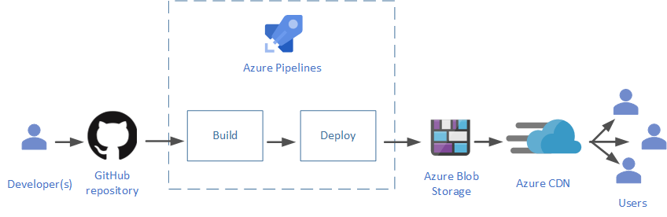
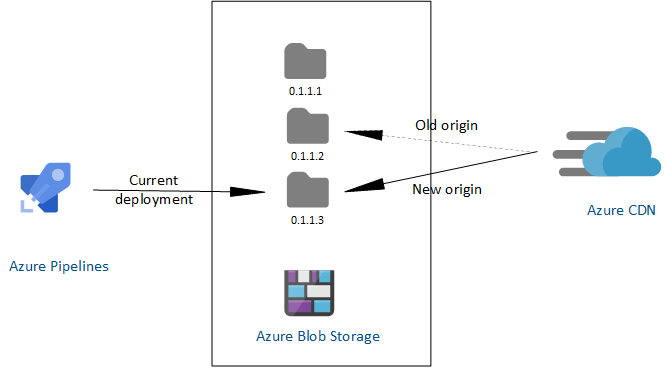

<!-- cSpell:ignore PageWriter-MSFT cicd brotli iname fabrikamdronestatus Jamstack setvariable CDNS -->
Serverless computing abstracts the servers, infrastructure, and operating systems, allowing developers to focus on application development. A robust *CI/CD* or *Continuous Integration*/*Continuous Delivery* of such applications allows companies to ship fully tested and integrated software versions within minutes of development. It provides a backbone of modern DevOps environment.

What does CI/CD actually stand for?

- Continuous Integration allows development teams to integrate code changes in a shared repository almost instantaneously. This ability, coupled with automated build and testing before the changes are integrated, ensures that only fully functional application code is available for deployment.
- Continuous Delivery allows changes in the source code, configuration, content, and other artifacts to be delivered to production, and ready to be deployed to end-users, as quickly and safely as possible. The process keeps the code in a *deployable state* at all times. A special case of this is *Continuous Deployment*, which includes actual deployment to end users.

This article discusses a CI/CD pipeline for the web frontend of a [serverless reference implementation](../../reference-architectures/serverless/web-app.yml). This pipeline is developed using Azure services. The web frontend demonstrates a modern web application, with client-side JavaScript, reusable server-side APIs, and pre-built Markup, alternatively called [Jamstack](https://jamstack.org). You can find the code in [this GitHub repository](https://github.com/mspnp/serverless-reference-implementation/tree/master/src/ClientApp). The readme describes the steps to download, build, and deploy the application.

The following diagram describes the CI/CD pipeline used in this sample frontend:



This article does not discuss the [backend deployment](../../reference-architectures/serverless/web-app.yml#back-end-deployment).

## Prerequisites

To work with this sample application, make sure you have the following:

- A GitHub account.
- An Azure account. If you don't have one, you can try out a [free Azure account](https://azure.microsoft.com/free/).
- An Azure DevOps organization. If you don't have one, you can try out a [basic plan](https://azure.microsoft.com/pricing/details/devops/azure-devops-services/), which includes DevOps services such as Azure Pipelines.

## Use an online version control system

Version control systems keep track and control changes in your source code. Keeping your source code in an online version control system allows multiple development teams to collaborate. It is also easier to maintain than a traditional version control on premises. These online systems can be easily integrated with leading CI/CD services. You get the ability to create and maintain the source code in multiple directories, along with build and configuration files, in what is called a *repository*.

The project files for this sample application are kept in GitHub. If you don't have a GitHub account, read [this documentation to get started with GitHub repositories](https://help.github.com/en#dotcom).

## Automate your build and deploy

Using a CI/CD service such as [Azure Pipelines](/azure/devops/pipelines/) can help you to automate the build and deploy processes. You can create multiple stages in the pipeline, each stage running based on the result of the previous one. The stages can run in either a [Windows or Linux container](/azure/devops/pipelines/process/container-phases?tabs=yaml). The script must make sure the tools and environments are set properly in the container. Azure Pipelines can run a variety of build tools, and can work with quite a few [online version control systems](/azure/devops/pipelines/repos/).

### Integrate build tools

Modern build tools can simplify your build process, and provide functionality such as pre-configuration, [minification](https://techterms.com/definition/minification) of the JavaScript files, and static site generation. Static site generators can build markup files before they are deployed to the hosting servers, resulting in a fast user experience. You can select from a variety of these tools, based on the type of your application's programming language and platform, as well as additional functionality needed. [This article](https://blog.logrocket.com/the-best-static-websites-generators-compared-5f1f9eeeaf1a/) provides a list of popular build tools for a modern application.

The sample is a React application, built using [Gatsby.js](https://www.gatsbyjs.org/), which is a static site generator and front-end development framework. These tools can be run locally during development and testing phases, and then integrated with [Azure Pipelines](/azure/devops/pipelines/get-started/what-is-azure-pipelines) for the final deployment.

The sample uses the Gatsby file [gatsby-ssr.js](https://www.gatsbyjs.org/docs/ssr-apis/) for rendering, and [gatsby-config.js](https://www.gatsbyjs.org/docs/gatsby-config/) for site configuration. Gatsby converts all JavaScript files under the `pages` subdirectory of the `src` folder to HTML files. Additional components go in the `components` subdirectory. The sample also uses the [gatsby-plugin-typescript](https://www.gatsbyjs.org/packages/gatsby-plugin-typescript/) plugin that allows using [TypeScript](https://www.typescriptlang.org/) for type safety, instead of JavaScript.

For more information about setting up a Gatsby project, see the official [Gatsby documentation](https://www.gatsbyjs.org/docs/recipes/#creating-pages-automatically).

### Automate builds

Automating the build process reduces the human errors that can be introduced in manual processes. The file [azure-pipelines.yml](https://github.com/mspnp/serverless-reference-implementation/blob/master/src/ClientApp/azure-pipelines.yml) includes the script for a two-stage automation. [The Readme for this project](https://github.com/mspnp/serverless-reference-implementation/tree/master/src/ClientApp) describes the steps required to set up the automation pipeline using Azure Pipelines. The following subsections show how the pipeline stages are configured.

#### Build stage

Since Azure Pipelines is [integrated with the GitHub repository](/azure/devops/pipelines/repos/github?tabs=yaml), any changes in the tracked directory of the main branch trigger the first stage of the pipeline, the build stage:

```yaml
trigger:
  batch: true
  branches:
    include:
    - main
  paths:
    include:
    - src/ClientApp
```

The following snippet illustrates the start of the build stage, which starts an Ubuntu container to run this stage.

```yaml
    stages:
    - stage: Build
      jobs:
      - job: WebsiteBuild
        displayName: Build Fabrikam Drone Status app
        pool:
          vmImage: 'Ubuntu-16.04'
        continueOnError: false
    steps:
```

This is followed by *tasks* and *scripts* required to successfully build the project. These include the following:

- Installing Node.js and setting up environment variables,
- Installing and running Gatsby.js that builds the static website:

    ```yaml
        - script: |
            cd src/ClientApp
            npm install
            npx gatsby build
          displayName: 'gatsby build'
    ```

- installing and running a compression tool named *brotli*, to [compress the built files](#host-and-distribute-using-the-cloud) before deployment:

    ```yaml
        - script: |
            cd src/ClientApp/public
            sudo apt-get install brotli --install-suggests --no-install-recommends -q --assume-yes
            for f in $(find . -type f \( -iname '*.html' -o -iname '*.map' -o -iname '*.js' -o -iname '*.json' \)); do brotli $f -Z -j -f -v && mv ${f}.br $f; done
          displayName: 'enable compression at origin level'
    ```

- Computing the version of the current build for [cache management](#manage-website-cache),
- Publishing the built files for use by the [deploy stage](/azure/devops/pipelines/artifacts/pipeline-artifacts?tabs=yaml):

    ```yaml
        - task: PublishPipelineArtifact@1
          inputs:
            targetPath: 'src/ClientApp/public'
            artifactName: 'drop'
    ```

A successful completion of the build stage tears down the Ubuntu environment, and triggers the deploy stage in the pipeline.

#### Deploy stage

The deploy stage runs in a new Ubuntu container:

```yaml
    - stage: Deploy
      jobs:
      - deployment: WebsiteDeploy
        displayName: Deploy Fabrikam Drone Status app
        pool:
          vmImage: 'Ubuntu-16.04'
        environment: 'fabrikamdronestatus-prod'
        strategy:
          runOnce:
            deploy:
              steps:
```

This stage includes various deployment tasks and scripts to:

- Download the build artifacts to the container (which happens automatically as a consequence of using `PublishPipelineArtifact` in the build stage),
- Record the build release version, and update in the GitHub repository,
- Upload the website files to Blob Storage, in a new folder corresponding to the new version, and
- Change the CDN to point to this new folder.

The last two steps together replicate a cache purge, since older folders are no longer accessible by the CDN edge servers. The following snippet shows how this is achieved:

```yaml
       - script: |
              az login --service-principal -u $(azureArmClientId) -p $(azureArmClientSecret) --tenant $(azureArmTenantId)
              # upload content to container versioned folder
              az storage blob upload-batch -s "$(Pipeline.Workspace)/drop" --destination "\$web\$(releaseSemVer)" --account-name $(azureStorageAccountName) --content-encoding br --pattern "*.html" --content-type "text/html"
              az storage blob upload-batch -s "$(Pipeline.Workspace)/drop" --destination "\$web\$(releaseSemVer)" --account-name $(azureStorageAccountName) --content-encoding br --pattern "*.js" --content-type "application/javascript"
              az storage blob upload-batch -s "$(Pipeline.Workspace)/drop" --destination "\$web\$(releaseSemVer)" --account-name $(azureStorageAccountName) --content-encoding br --pattern "*.js.map" --content-type "application/octet-stream"
              az storage blob upload-batch -s "$(Pipeline.Workspace)/drop" --destination "\$web\$(releaseSemVer)" --account-name $(azureStorageAccountName) --content-encoding br --pattern "*.json" --content-type "application/json"
              az storage blob upload-batch -s "$(Pipeline.Workspace)/drop" --destination "\$web\$(releaseSemVer)" --account-name $(azureStorageAccountName) --pattern "*.txt" --content-type "text/plain"
              # target new version
              az cdn endpoint update --resource-group $(azureResourceGroup) --profile-name $(azureCdnName) --name $(azureCdnName) --origin-path '/$(releaseSemVer)'
              AZURE_CDN_ENDPOINT_HOSTNAME=$(az cdn endpoint show --resource-group $(azureResourceGroup) --name $(azureCdnName) --profile-name $(azureCdnName) --query hostName -o tsv)
              echo "Azure CDN endpoint host ${AZURE_CDN_ENDPOINT_HOSTNAME}"
              echo '##vso[task.setvariable variable=azureCndEndpointHost]'$AZURE_CDN_ENDPOINT_HOSTNAME
            displayName: 'upload to Azure Storage static website hosting and purge Azure CDN endpoint'
```

### Atomic deploys

Atomic deployment ensures that the users of your website or application always get the content corresponding to the same version.

In the sample CI/CD pipeline, the website contents are deployed to the Blob storage, which acts as [the origin server for the Azure CDN](/azure/cdn/cdn-create-endpoint-how-to). If the files are updated in the same *root folder* in the blob, the website will be served inconsistently. Uploading to a new versioned folder as shown in the preceding section solves this problem. The users either get *all or nothing* of the new successful build, since the CDN points to the new folder as the origin, only after all files are successfully updated.



The advantages of this approach are as follows:

- Since new content is not available to users until the CDN points to the new origin folder, it results in an atomic deployment.
- You can easily roll back to an older version of the website if necessary.
- Since the origin can host multiple versions of the website side by side, you can fine-tune the deployment by using techniques such as allowing preview to certain users before wider availability.

## Host and distribute using the cloud

A content delivery network (CDN) is a set of distributed servers that speed up the content delivery to users over a vast geographical area. Every user gets the content from the server nearest to them. The CDN accesses this content from an *origin* server, and caches it to *edge* servers at strategic locations. The sample CI/CD in this article uses [Azure CDN](/azure/cdn), pointing to website content hosted on [Azure Blob Storage](/azure/storage/blobs/storage-blobs-overview) as the origin server. The Blob storage is [configured for static website hosting](https://github.com/mspnp/serverless-reference-implementation/tree/master/src/ClientApp#create-azure-storage-static-website-hosting). For a quick guide on how to use Azure CDN with Azure Blob Storage, read [Integrate an Azure storage account with Azure CDN](/azure/cdn/cdn-create-a-storage-account-with-cdn).

The following are some strategies that can improve the CDN performance.

### Compress the content

Compressing the files before serving improves file transfer speed and increases page-load performance for the end users.

There are two ways to do this:

1. **On the fly in the CDN edge servers**. This improves bandwidth consumption by a significant percentage, making the website considerably faster than without compression. It is relatively easy to [enable this type of compression on Azure CDN](/azure/cdn/cdn-improve-performance#enabling-compression). Since it's controlled by the CDN, you cannot choose or configure the compression tool. Use this compression if website performance is not a critical concern.

1. **Pre-compressing before reaching the CDN**, either on your origin server, or before reaching the origin. Pre-compressing further improves the run time performance of your website, since it's done before being fetched by the CDN. The sample CI/CD pipeline compresses the built files in the deployment stage, using [brotli](https://brotli.org), as shown in the [build section above](#build-stage). The advantages of using pre-compression are as follows:
    1. You can use any compression tool that you're comfortable with, and further fine-tune the compression. CDNs may have limitations on the tools they use.
    2. Some CDNs limit file sizes that can be compressed on the fly, causing a performance hit for larger files. Pre-compression sets no limits on the file size.
    3. Pre-compressing in the deployment pipeline results in less storage required at the origin.
    4. This is faster and more efficient than the CDN compression.

For more information, see [Improve performance by compressing files in Azure CDN](/azure/cdn/cdn-improve-performance).

### Dynamic site acceleration

Using CDN is optimal for static content, which can be safely cached at the edge servers. However, dynamic web sites require the server to generate content based on user response. This type of content cannot be cached on the edge, requiring a more involved end-to-end solution that can speed up the content delivery. [Dynamic site acceleration by Azure CDN](/azure/cdn/cdn-dynamic-site-acceleration) is one such solution that measurably improves the performance of dynamic web pages.

This sample enables dynamic site acceleration as shown in [this section of the readme](https://github.com/mspnp/serverless-reference-implementation/tree/master/src/ClientApp#configure-dynamic-site-acceleration).

## Manage website cache

CDNs use caching to improve their performance. Configuring and managing this cache becomes an integral part of your deployment pipeline. The Azure CDN documentation shows several ways to do this. You can set caching rules on your CDN, as well as [configure the time-to-live for the content in the origin server](/azure/cdn/cdn-manage-expiration-of-blob-content). Static web content can be cached for a long duration, since it may not change too much over time. This reduces the overhead of accessing the single origin server for every user request. For more information, see [How caching works](/azure/cdn/cdn-how-caching-works).

### Cache purge

The CDN caches the website files at the edge servers until their time-to-live expires. These are updated for a new client request, only after their time-to-live has expired. Purging your CDN cache is required to guarantee that every user gets the latest live website files, especially if the deployment happens at the same CDN origin folder. Azure CDN allows you to [purge the cache from the Azure portal](/azure/cdn/cdn-purge-endpoint).

A better approach is to invalidate this cache by [using versioning during deployment](#atomic-deploys). An explicit cache purge or expiration usually causes the CDN to retrieve newer versions of the web content. However, since the CDN always points to the latest version of the deployment, it improves caching in the following manner:

1. The CDN validates the index.html against the origin, for every new website instance.
1. Except for the index.html and 404.html, all other website files are fingerprinted and cached for a year. This is based on the assumption that resources such as images and videos, do not need frequent changes. If these files are updated and rebuilt, their names are updated by a new fingerprint GUID. This results in an update to the index.html with an updated reference to the changed resource file. The CDN then retrieves the updated index.html, and since it does not find the reference resource file in its cache, it also retrieves the changed resource files.

This ensures that the CDN always gets new updated files, and removes the need to purge the cache for a new build.

## Contributors

*This article is maintained by Microsoft. It was originally written by the following contributors.* 

Principal author:

 - [Dhanashri Kshirsagar](https://www.linkedin.com/in/dhanashrikr/) | Senior Content PM
 
*To see non-public LinkedIn profiles, sign in to LinkedIn.*

## Next steps

- Now that you understand the basics, follow [this readme](https://github.com/mspnp/serverless-reference-implementation/tree/master/src/ClientApp) to set up and execute the CI/CD pipeline.

- Learn [best practices for using content delivery networks (CDNs)](../../best-practices/cdn.yml)
