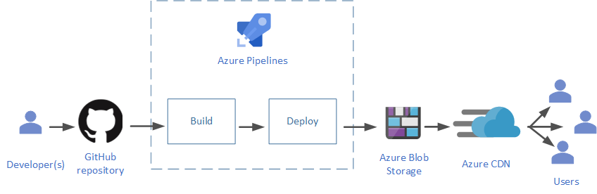

# Develop a robust CI/CD pipeline for serverless application frontend on Azure

Serverless computing abstracts the servers, infrastructure, and operating systems, allowing developers to focus on application development. A robust *CI/CD* or *Continuous Integration*/*Continuous Delivery* of such applications allows companies to ship fully-tested and integrated software versions within minutes of development; it provides a backbone of modern DevOps environment. 

What does CI/CD actually stand for?

- Continuous Integration allows development teams to integrate code changes in a shared repository almost instantaneously. This ability coupled with automated build and testing before the changes are actually integrated, ensures that only fully-functional application code is available for deployment.
- Continuous Delivery allows changes in the source code, configuration, content, and other artifacts, to be delivered to production, and ready to be deployed to end-users, as quickly and safely as possible. The process keeps the code in a *deployable state* at all times. A special case of this a *Continuous Deployment* which includes actual deployment to end-users.

This article discusses CI/CD pipeline for the web frontend for serverless architecture developed in Azure. This is a modern way of building web applications, using client-side JavaScript, reusable server-side APIs, and pre-built Markup, alternatively called as [JAMstack](https://jamstack.org). The application frontend used in this article is in [this GitHub repository](https://github.com/mspnp/serverless-reference-implementation/). The readme describes the steps to download the application, and create your own CI/CD pipeline.

The following figure describes the CI/CD pipeline used in this sample frontend:



## Prerequisites

To work with this sample application, make sure you have the following:

- A GitHub account
- An Azure DevOps account

## Use an online version control system

Version control systems keep track and control changes in your source code. Keeping your source code in an online version control system allows multiple development teams to collaborate, and is easier to maintain than an on-premises traditional version control. These online systems can also more easily integrated with leading CI/CD services. These systems give you the ability to create and maintain your source code in multiple directories, along with build and configuration files, in what is called as a *repository*. The sample application project files are kept in GitHub, one of the most popular online version control systems today.

## Automate your build and deploy

Use a powerful CI/CD service such as Azure Pipelines to automate your build and deploy processes.

### Integrate your build tools

In JAMstack, markup files are built before getting deployed to the CDN servers, using modern build tools. These build tools simplify your build process, provide powerful pre-configuration, minification of the JavaScript files, as well as provide additional functionality such as static site generation. There are a variety of such tools you can use, based on the type of your application. For more detailed analysis, read the [comparison of top static site generators for JAMstack](https://blog.logrocket.com/the-best-static-websites-generators-compared-5f1f9eeeaf1a/).

Since the sample is a React application, it is built using Gatsby.js, a React-based static site generator and front-end development framework, powered by GraphQL. Tools such as Gatsby.js can not only be integrated with your Azure resources using [Azure Pipelines]((https://docs.microsoft.com/en-us/azure/devops/pipelines/get-started/what-is-azure-pipelines?view=azure-devops) to pre-build before deploy, they can also be used on your local machine to during the development and testing phases.

The sample installs the [gatsby-plugin-typescript](https://www.gatsbyjs.org/packages/gatsby-plugin-typescript/) using the [gatsby-config.js](https://github.com/mspnp/serverless-reference-implementation/blob/master/src/ClientApp/gatsby-config.js).

### Automate builds

Automating the build process reduces the human errors. Since the markup files are prebuilt, the content changes will go live only when after a build is completed. The sample achieves automated builds using [Azure Pipelines](https://docs.microsoft.com/en-us/azure/devops/pipelines/get-started/what-is-azure-pipelines?view=azure-devops). The file [azure-pipelines.yml](https://github.com/mspnp/serverless-reference-implementation/blob/master/src/ClientApp/azure-pipelines.yml) includes the following two-stage automation: 

- Build stage: Every change to the content or source specified in the `path` variable triggers a build process using Gatsby, followed by compression using Brotli. Lastly the version is updated.
- Deploy stage: After the build is successfully completed, the Deploy pipeline starts which uploads all the files required to render the website to the Blob storage, in a new directory for the new version. When the upload is successfully completed, it then points the Azure CDN to the new version's folder. 
 
### Atomic deploys

Versioned deployment is recommended for static websites. Every build triggers deployment to a new versioned folder. This is true for any change in any of the files. The origin for the CDN, i.e. the Blob Storage in our case, is pointed to the new versioned folder only after all build and uploading is completed. This ensures a truly atomic deployment of the website. This also helps fast rollback to a previous version. You can configure how many such versions should be stored.  

## Host on cloud and distribute with a CDN

A Content Delivery Network or CDN is a set of distributed servers that speed up the content delivery to clients and devices spread out geographically, with every user getting content from the server nearest to them. The CDN accesses this content from an *origin* server, and then caches it to *edge* servers at strategic locations. For static websites, these edge servers can cache content for a long duration, since it may not change too much over time. This reduces the overhead of accessing the single origin server for every user request, leading to better traffic management. Dynamic websites also benefit from this model, since their scripts can be run in a CDN cache instead of a remote server, reducing response time to the end-users. Using a CDN will help you create a fast and efficient experience for your users all over the world.

The sample code uses [Azure CDN](https://docs.microsoft.com/azure/cdn/cdn-overview) to cache the markup and the JavaScript files. You would also use it to store any other resources such as images, video, etc. It uses [Azure Blob Storage](https://docs.microsoft.com/en-us/azure/storage/blobs/storage-blobs-overview) as the origin server for these files. For a quick guide on how to use Azure CDN with Azure Blob Storage, read [Integrate an Azure storage account with Azure CDN](https://docs.microsoft.com/en-us/azure/cdn/cdn-create-a-storage-account-with-cdn).

To further improve performance, you should [compress the files in the Azure CDN](https://docs.microsoft.com/en-us/azure/cdn/cdn-improve-performance). There are two ways to do this: at the origin level or on the CDN edge servers. The advantage of compressing at the origin is that it is done during deployment rather than at run time, further improving the run time performance of your website. Additionally, you can finetune the compression by controlling which tool to use. The sample compresses the files before uploading to the Blob Storage using [Brotli](https://brotli.org/). Refer to the following script at line 40 of [azure-pipelines.yml](https://github.com/mspnp/serverless-reference-implementation/blob/master/src/ClientApp/azure-pipelines.yml):

```JavaScript
    - script: |
        cd src/ClientApp/public
        sudo apt-get install brotli --install-suggests --no-install-recommends -q --assume-yes
        for f in $(find . -type f \( -iname '*.html' -o -iname '*.map' -o -iname '*.js' -o -iname '*.json' \)); do brotli $f -Z -j -f -v && mv ${f}.br $f; done
      displayName: 'enable compression at origin level'
```

## Manage cache at the edge and user devices

You may choose to [purge your Azure CDN cache ](https://docs.microsoft.com/en-us/azure/cdn/cdn-purge-endpoint) to guarantee a new user will get the latest live website files. Since the sample deploys latest files in a versioned folder, it takes another approach to invalidate the CDN cache: 

1. The CDN validates the index.html against the one in the origin, every time a new website instance is loaded. 
2. If there is no change in the index.html, the files in the CDN cache is fetched. If change is found, the latest file is transfered to the CDN cache and presented to the client. 
3. All other resource files are fingerprinted and cached for a year. This is based on the assumption that resources such as images and videos do not need frequent changes. Everytime the resource file is built, it;s name is appended by a new fingerprint GUID. This means the name changes. Which also means index.html which calls this new file, has also changed to call the new fingerprint file. Since the CDN validates the cached index.html against the origin, it detects the change and downloads the latest index.html to the CDN servers. When it tries to render the html, it finds a new fingerprint file not available in the browser's or CDN's cache. It then accesses the origin and downloads the changed resource files.

This process makes sure that regardless of the cache staleness, the users get all the new website files for every new instance or a refresh. This also removes the costly purge process. 

