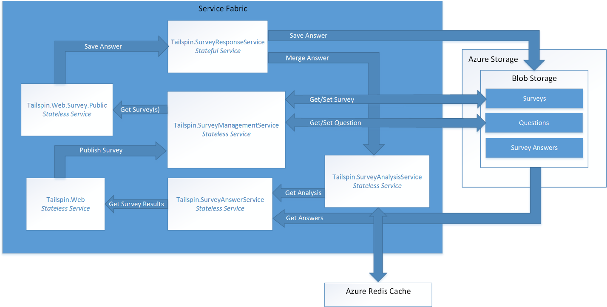

[:::image type="icon" source="../_images/github.png" border="false"::: Sample code][sample-code]

This article describes migrating an application from Azure Cloud Services to Azure Service Fabric. It focuses on architectural decisions and recommended practices.

For this project, we started with a Cloud Services application called Surveys and ported it to Service Fabric. The goal was to migrate the application with as few changes as possible. Later in the article, we show how to optimize the application for Service Fabric.

Before reading this article, it will be useful to understand the basics of Service Fabric. See [Overview of Azure Service Fabric][sf-overview]

## About the Surveys application

A fictional company named Tailspin created an application called the Surveys app that allows customers to create surveys. After a customer signs up for the application, users can create and publish surveys, and collect the results for analysis. The application includes a public website where people can take a survey. Read more about the original Tailspin scenario [here][tailspin-scenario].

Now Tailspin wants to move the Surveys application to a microservices architecture, using Service Fabric running on Azure. Because the application is already deployed as a Cloud Services application, Tailspin adopts a multi-phase approach:

1. Port the cloud services to Service Fabric, while minimizing changes to the application.
2. Optimize the application for Service Fabric, by moving to a microservices architecture.

In a real-world project, it's likely that both stages would overlap. While porting to Service Fabric, you would also start to rearchitect the application into micro-services. Later you might refine the architecture further, perhaps dividing coarse-grained services into smaller services.

The application code is available on [GitHub][sample-code]. This repo contains both the Cloud Services application and the Service Fabric version.

## Why Service Fabric?

Service Fabric is a good fit for this project, because most of the features needed in a distributed system are built into Service Fabric, including:

- **Cluster management**. Service Fabric automatically handles node failover, health monitoring, and other cluster management functions.
- **Horizontal scaling**. When you add nodes to a Service Fabric cluster, the application automatically scales, as services are distributed across the new nodes.
- **Service discovery**. Service Fabric provides a discovery service that can resolve the endpoint for a named service.
- **Stateless and stateful services**. Stateful services use [reliable collections][sf-reliable-collections], which can take the place of a cache or queue, and can be partitioned.
- **Application lifecycle management**. Services can be upgraded independently and without application downtime.
- **Service orchestration** across a cluster of machines.
- **Higher density** for optimizing resource consumption. A single node can host multiple services.

Service Fabric is used by various Microsoft services, including Azure SQL Database, Azure Cosmos DB, Azure Event Hubs, and others, making it a proven platform for building distributed cloud applications.

## Comparing Cloud Services with Service Fabric

The following table summarizes some of the important differences between Cloud Services and Service Fabric applications. For a more in-depth discussion, see [Learn about the differences between Cloud Services and Service Fabric before migrating applications][sf-compare-cloud-services].

| Area | Cloud Services | Service Fabric |
|--------|---------------|----------------|
| Application composition | Roles| Services |
| Density |One role instance per VM | Multiple services in a single node |
| Minimum number of nodes | 2 per role | 5 per cluster, for production deployments |
| State management | Stateless | Stateless or stateful* |
| Hosting | Azure | Cloud or on-premises |
| Web hosting | IIS** | Self-hosting |
| Deployment model | [Classic deployment model][azure-deployment-models] | [Resource Manager][azure-deployment-models]  |
| Packaging | Cloud service package files (.cspkg) | Application and service packages |
| Application update | VIP swap or rolling update | Rolling update |
| Autoscaling | [Built-in service][cloud-service-autoscale] | Virtual machine scale sets for auto scale out |
| Debugging | Local emulator | Local cluster |

\* Stateful services use [reliable collections][sf-reliable-collections] to store state across replicas, so that all reads are local to the nodes in the cluster. Writes are replicated across nodes for reliability. Stateless services can have external state, using a database or other external storage.

** Worker roles can also self-host ASP.NET Web API using OWIN.

## The Surveys application on Cloud Services

The following diagram shows the architecture of the Surveys application running on Cloud Services.


The application consists of two web roles and a worker role.

- The **Tailspin.Web** web role hosts an ASP.NET website that Tailspin customers use to create and manage surveys. Customers also use this website to sign up for the application and manage their subscriptions. Finally, Tailspin administrators can use it to see the list of tenants and manage tenant data.

- The **Tailspin.Web.Survey.Public** web role hosts an ASP.NET website where people can take the surveys that Tailspin customers publish.

- The **Tailspin.Workers.Survey** worker role does background processing. The web roles put work items onto a queue, and the worker role processes the items. Two background tasks are defined: Exporting survey answers to Azure SQL Database, and calculating statistics for survey answers.

In addition to Cloud Services, the Surveys application uses some other Azure services:

- **Azure Storage** to store surveys, surveys answers, and tenant information.

- **Azure Cache for Redis** to cache some of the data that is stored in Azure Storage, for faster read access.

- **Azure Active Directory** (Azure AD) to authenticate customers and Tailspin administrators.

- **Azure SQL Database** to store the survey answers for analysis.

## Moving to Service Fabric

As mentioned, the goal of this phase was migrating to Service Fabric with the minimum necessary changes. To that end, we created stateless services corresponding to each cloud service role in the original application:


Intentionally, this architecture is similar to the original application. However, the diagram hides some important differences. In the rest of this article, we'll explore those differences.

## Converting the cloud service roles to services

For the initial migration, Tailspin followed the steps outlined in [Guide to converting Web and Worker Roles to Service Fabric stateless services][sf-migration].

### Creating the web front-end services

In Service Fabric, a service runs inside a process created by the Service Fabric runtime. For a web front end, that means the service is not running inside IIS. Instead, the service must host a web server. This approach is called *self-hosting*, because the code that runs inside the process acts as the web server host.

The original Surveys application uses ASP.NET MVC. Because ASP.NET MVC cannot be self-hosted in Service Fabric, Tailspin considered the following migration options:

- Port the web roles to ASP.NET Core, which can be self-hosted.
- Convert the web site into a single-page application (SPA) that calls a web API implemented using ASP.NET Web API. This would have required a complete redesign of the web front end.
- Keep the existing ASP.NET MVC code and deploy IIS in a Windows Server container to Service Fabric. This approach would require little or no code change.

The first option, porting to ASP.NET Core, allowed Tailspin to take advantage of the latest features in ASP.NET Core. To do the conversion, Tailspin followed the steps described in [Migrating From ASP.NET MVC to ASP.NET Core MVC][aspnet-migration].

> [!NOTE]
> When using ASP.NET Core with Kestrel, you should place a reverse proxy in front of Kestrel to handle traffic from the Internet, for security reasons. For more information, see [Kestrel web server implementation in ASP.NET Core][kestrel]. The section [Deploying the application](#deploying-the-application) describes a recommended Azure deployment.

### HTTP listeners

In Cloud Services, a web or worker role exposes an HTTP endpoint by declaring it in the [service definition file][cloud-service-endpoints]. A web role must have at least one endpoint.

```xml
<!-- Cloud service endpoint -->
<Endpoints>
    <InputEndpoint name="HttpIn" protocol="http" port="80" />
</Endpoints>
```

Similarly, Service Fabric endpoints are declared in a service manifest:

```xml
<!-- Service Fabric endpoint -->
<Endpoints>
    <Endpoint Protocol="http" Name="ServiceEndpoint" Type="Input" Port="8002" />
</Endpoints>
```

Unlike a cloud service role, Service Fabric services can be colocated within the same node. Therefore, every service must listen on a distinct port. Later in this article, we'll discuss how client requests on port 80 or port 443 get routed to the correct port for the service.

A service must explicitly create listeners for each endpoint. The reason is that Service Fabric is agnostic about communication stacks. For more information, see [Build a web service front end for your application using ASP.NET Core][sf-aspnet-core].

## Packaging and configuration

 A cloud service contains the following configuration and package files:

| File | Description |
|------|-------------|
| Service definition (.csdef) | Settings used by Azure to configure the cloud service. Defines the roles, endpoints, startup tasks, and the names of configuration settings. |
| Service configuration (.cscfg) | Per-deployment settings, including the number of role instances, endpoint port numbers, and the values of configuration settings.
| Service package (.cspkg) | Contains the application code and configurations, and the service definition file.  |

There is one .csdef file for the entire application. You can have multiple .cscfg files for different environments, such as local, test, or production. When the service is running, you can update the .cscfg but not the .csdef. For more information, see [What is the Cloud Service model and how do I package it?][cloud-service-config]

Service Fabric has a similar division between a service *definition* and service *settings*, but the structure is more granular. To understand Service Fabric's configuration model, it helps to understand how a Service Fabric application is packaged. Here is the structure:

```text
Application package
  - Service packages
    - Code package
    - Configuration package
    - Data package (optional)
```

The application package is what you deploy. It contains one or more service packages. A service package contains code, configuration, and data packages. The code package contains the binaries for the services, and the configuration package contains configuration settings. This model allows you to upgrade individual services without redeploying the entire application. It also lets you update just the configuration settings, without redeploying the code or restarting the service.

A Service Fabric application contains the following configuration files:

| File | Location | Description |
|------|----------|-------------|
| ApplicationManifest.xml | Application package | Defines the services that compose the application. |
| ServiceManifest.xml | Service package| Describes one or more services. |
| Settings.xml | Configuration package | Contains configuration settings for the services defined in the service package. |

For more information, see [Model an application in Service Fabric][sf-application-model].

To support different configuration settings for multiple environments, use the following approach, described in [Manage application parameters for multiple environments][sf-multiple-environments]:

1. Define the setting in the Setting.xml file for the service.
2. In the application manifest, define an override for the setting.
3. Put environment-specific settings into application parameter files.

## Deploying the application

Whereas Azure Cloud Services is a managed service, Service Fabric is a runtime. You can create Service Fabric clusters in many environments, including Azure and on premises. The following diagram shows a recommended deployment for Azure:


The Service Fabric cluster is deployed to a [virtual machine scale set][vm-scale-sets]. Scale sets are an Azure Compute resource that can be used to deploy and manage a set of identical VMs.

As mentioned, it's recommended to place the Kestrel web server behind a reverse proxy for security reasons. This diagram shows [Azure Application Gateway][application-gateway], which is an Azure service that offers various layer 7 load-balancing capabilities. It acts as a reverse-proxy service, terminating the client connection and forwarding requests to back-end endpoints. You might use a different reverse proxy solution, such as nginx.

### Layer 7 routing

In the [original Surveys application](/previous-versions/msp-n-p/hh534477(v=pandp.10)#sec21), one web role listened on port 80, and the other web role listened on port 443.

| Public site | Survey management site |
|-------------|------------------------|
| `http://tailspin.cloudapp.net` | `https://tailspin.cloudapp.net` |

Another option is to use layer 7 routing. In this approach, different URL paths get routed to different port numbers on the back end. For example, the public site might use URL paths starting with `/public/`.

Options for layer 7 routing include:

- Use Application Gateway.
- Use a network virtual appliance (NVA), such as nginx.
- Write a custom gateway as a stateless service.

Consider this approach if you have two or more services with public HTTP endpoints, but want them to appear as one site with a single domain name.

> One approach that we *don't* recommend is allowing external clients to send requests through the Service Fabric [reverse proxy][sf-reverse-proxy]. Although this is possible, the reverse proxy is intended for service-to-service communication. Opening it to external clients exposes *any* service running in the cluster that has an HTTP endpoint.

### Node types and placement constraints

In the deployment shown above, all the services run on all the nodes. However, you can also group services, so that certain services run only on particular nodes within the cluster. Reasons to use this approach include:

- Run some services on different VM types. For example, some services might be compute-intensive or require GPUs. You can have a mix of VM types in your Service Fabric cluster.
- Isolate front-end services from back-end services, for security reasons. All the front-end services will run on one set of nodes, and the back-end services will run on different nodes in the same cluster.
- Different scale requirements. Some services might need to run on more nodes than other services. For example, if you define front-end nodes and back-end nodes, each set can be scaled independently.

The following diagram shows a cluster that separates front-end and back-end services:


To implement this approach:

1. When you create the cluster, define two or more node types.
2. For each service, use [placement constraints][sf-placement-constraints] to assign the service to a node type.

When you deploy to Azure, each node type is deployed to a separate virtual machine scale set. The Service Fabric cluster spans all node types. For more information, see [The relationship between Service Fabric node types and virtual machine scale sets][sf-node-types].

> If a cluster has multiple node types, one node type is designated as the *primary* node type. Service Fabric runtime services, such as the Cluster Management Service, run on the primary node type. Provision at least 5 nodes for the primary node type in a production environment. The other node type should have at least 2 nodes.

## Configuring and managing the cluster

Clusters must be secured to prevent unauthorized users from connecting to your cluster. It is recommended to use Azure AD to authenticate clients, and X.509 certificates for node-to-node security. For more information, see [Service Fabric cluster security scenarios][sf-security].

To configure a public HTTPS endpoint, see [Specify resources in a service manifest][sf-manifest-resources].

You can scale out the application by adding VMs to the cluster. Virtual machine scale sets support autoscaling using autoscale rules based on performance counters. For more information, see [Scale a Service Fabric cluster in or out using autoscale rules][sf-auto-scale].

While the cluster is running, collect logs from all the nodes in a central location. For more information, see [Collect logs by using Azure Diagnostics][sf-logs].

## Refactor the application

After the application is ported to Service Fabric, the next step is to refactor it to a more granular architecture. Tailspin's motivation for refactoring is to make it easier to develop, build, and deploy the Surveys application. By decomposing the existing web and worker roles to a more granular architecture, Tailspin wants to remove the existing tightly coupled communication and data dependencies between these roles.

Tailspin sees other benefits in moving the Surveys application to a more granular architecture:

- Each service can be packaged into independent projects with a scope small enough to be managed by a small team.
- Each service can be independently versioned and deployed.
- Each service can be implemented using the best technology for that service. For example, a service fabric cluster can include services built using different versions of the .NET Framework, Java, or other languages such as C or C++.
- Each service can be independently scaled to respond to increases and decreases in load.

The source code for the refactored version of the app is available on [GitHub](https://github.com/mspnp/cloud-services-to-service-fabric/tree/master/servicefabric-phase-2).

## Design considerations

The following diagram shows the architecture of the Surveys application refactored to a more granular architecture:



**Tailspin.Web** is a stateless service self-hosting an ASP.NET MVC application that Tailspin customers visit to create surveys and view survey results. This service shares most of its code with the *Tailspin.Web* service from the ported Service Fabric application. As mentioned earlier, this service uses ASP.NET core and switches from using Kestrel as web frontend to implementing a WebListener.

**Tailspin.Web.Survey.Public** is a stateless service also self-hosting an ASP.NET MVC site. Users visit this site to select surveys from a list and then fill them out. This service shares most of its code with the *Tailspin.Web.Survey.Public* service from the ported Service Fabric application. This service also uses ASP.NET Core and also switches from using Kestrel as web frontend to implementing a WebListener.

**Tailspin.SurveyResponseService** is a stateful service that stores survey answers in Azure Blob Storage. It also merges answers into the survey analysis data. The service is implemented as a stateful service because it uses a [ReliableConcurrentQueue][reliable-concurrent-queue] to process survey answers in batches. This functionality was originally implemented in the *Tailspin.AnswerAnalysisService* service in the ported Service Fabric application.

**Tailspin.SurveyManagementService** is a stateless service that stores and retrieves surveys and survey questions. The service uses Azure Blob storage. This functionality was also originally implemented in the data access components of the *Tailspin.Web* and *Tailspin.Web.Survey.Public* services in the ported Service Fabric application. Tailspin refactored the original functionality into this service to allow it to scale independently.

**Tailspin.SurveyAnswerService** is a stateless service that retrieves survey answers and survey analysis. The service also uses Azure Blob storage. This functionality was also originally implemented in the data access components of the *Tailspin.Web* service in the ported Service Fabric application. Tailspin refactored the original functionality into this service because it expects less load and wants to use fewer instances to conserve resources.

**Tailspin.SurveyAnalysisService** is a stateless service that persists survey answer summary data in a Redis cache for quick retrieval. This service is called by the *Tailspin.SurveyResponseService* each time a survey is answered and the new survey answer data is merged in the summary data. This service includes the functionality originally implemented in the *Tailspin.AnswerAnalysisService* service from the ported Service Fabric application.

## Stateless versus stateful services

Azure Service Fabric supports the following programming models:

- The guest executable model allows any executable to be packaged as a service and deployed to a Service Fabric cluster. Service Fabric orchestrates and manages execution of the guest executable.
- The container model allows for deployment of services in container images. Service Fabric supports creation and management of containers on top of Linux kernel containers as well as Windows Server containers.
- The reliable services programming model allows for the creation of stateless or stateful services that integrate with all Service Fabric platform features. Stateful services allow for replicated state to be stored in the Service Fabric cluster. Stateless services do not.
- The reliable actors programming model allows for the creation of services that implement the virtual actor pattern.

All the services in the Surveys application are stateless reliable services, except for the *Tailspin.SurveyResponseService* service. This service implements a [ReliableConcurrentQueue][reliable-concurrent-queue] to process survey answers when they are received. Responses in the ReliableConcurrentQueue are saved into Azure Blob Storage and passed to the *Tailspin.SurveyAnalysisService* for analysis. Tailspin chooses a ReliableConcurrentQueue because responses do not require strict first-in-first-out (FIFO) ordering provided by a queue such as Azure Service Bus. A ReliableConcurrentQueue is also designed to deliver high throughput and low latency for queue and dequeue operations.

Operations to persist dequeued items from a ReliableConcurrentQueue should ideally be idempotent. If an exception is thrown during the processing of an item from the queue, the same item may be processed more than once. In the Surveys application, the operation to merge survey answers to the *Tailspin.SurveyAnalysisService* is not idempotent because Tailspin decided that the survey analysis data is only a current snapshot of the analysis data and does not need to be consistent. The survey answers saved to Azure Blob Storage are eventually consistent, so the survey final analysis can always be recalculated correctly from this data.

## Communication framework

Each service in the Surveys application communicates using a RESTful web API. RESTful APIs offer the following benefits:

- Ease of use: each service is built using ASP.NET Core MVC, which natively supports the creation of Web APIs.
- Security: While each service does not require SSL, Tailspin could require each service to do so.
- Versioning: clients can be written and tested against a specific version of a web API.

Services in the Survey application use the [reverse proxy][reverse-proxy] implemented by Service Fabric. Reverse proxy is a service that runs on each node in the Service Fabric cluster and provides endpoint resolution, automatic retry, and handles other types of connection failures. To use the reverse proxy, each RESTful API call to a specific service is made using a predefined reverse proxy port.  For example, if the reverse proxy port has been set to **19081**, a call to the *Tailspin.SurveyAnswerService* can be made as follows:

```csharp
static SurveyAnswerService()
{
    httpClient = new HttpClient
    {
        BaseAddress = new Uri("http://localhost:19081/Tailspin/SurveyAnswerService/")
    };
}
```

To enable reverse proxy, specify a reverse proxy port during creation of the Service Fabric cluster. For more information, see [reverse proxy][reverse-proxy] in Azure Service Fabric.

## Performance considerations

Tailspin created the ASP.NET Core services for *Tailspin.Web* and *Tailspin.Web.Surveys.Public* using Visual Studio templates. By default, these templates include logging to the console. Logging to the console may be done during development and debugging, but all logging to the console should be removed when the application is deployed to production.

> [!NOTE]
> For more information about setting up monitoring and diagnostics for Service Fabric applications running in production, see [monitoring and diagnostics][monitoring-diagnostics] for Azure Service Fabric.

For example, the following lines in *startup.cs* for each of the web front end services should be commented out:

```csharp
// This method gets called by the runtime. Use this method to configure the HTTP request pipeline.
public void Configure(IApplicationBuilder app, IHostingEnvironment env, ILoggerFactory loggerFactory)
{
    //loggerFactory.AddConsole(Configuration.GetSection("Logging"));
    //loggerFactory.AddDebug();

    app.UseMvc();
}
```

> [!NOTE]
> These lines may be conditionally excluded when Visual Studio is set to **release** when publishing.

Finally, when Tailspin deploys the Tailspin application to production, they switch Visual Studio to **release** mode.

## Deployment considerations

The refactored Surveys application is composed of five stateless services and one stateful service, so cluster planning is limited to determining the correct VM size and number of nodes. In the *applicationmanifest.xml* file that describes the cluster, Tailspin sets the *InstanceCount* attribute of the *StatelessService* tag to -1 for each of the services. A value of -1 directs Service Fabric to create an instance of the service on each node in the cluster.

> [!NOTE]
> Stateful services require the additional step of planning the correct number of partitions and replicas for their data.

Tailspin deploys the cluster using the Azure portal. The Service Fabric Cluster resource type deploys all of the necessary infrastructure, including virtual machine scale sets and a load balancer. The recommended VM sizes are displayed in the Azure portal during the provisioning process for the Service Fabric cluster. Because the VMs are deployed in a virtual machine scale set, they can be both scaled up and out as user load increases.

## Next steps

The Surveys application code is available on [GitHub][sample-code].

If you are just getting started with [Azure Service Fabric][service-fabric], first set up your development environment then download the latest [Azure SDK][azure-sdk] and the [Azure Service Fabric SDK][service-fabric]. The SDK includes the OneBox cluster manager so you can deploy and test the Surveys application locally with full F5 debugging.

## Related resources

- [Migration architecture design](../guide/migration/migration-start-here.md)
- [Build migration plan with Azure Migrate](/azure/migrate/concepts-migration-planning)
- [Modernize enterprise applications with Azure Service Fabric](../service-fabric/modernize-app-azure-service-fabric.yml)

<!-- links -->

[application-gateway]: /azure/application-gateway
[aspnet-webapi]: https://www.asp.net/web-api
[aspnet-migration]: /aspnet/core/migration/mvc
[aspnet-webapi]: https://www.asp.net/web-api
[azure-deployment-models]: /azure/azure-resource-manager/resource-manager-deployment-model
[azure-sdk]: https://azure.microsoft.com/downloads/archive-net-downloads
[cloud-service-autoscale]: /azure/cloud-services/cloud-services-how-to-scale-portal
[cloud-service-config]: /azure/cloud-services/cloud-services-model-and-package
[cloud-service-endpoints]: /azure/cloud-services/cloud-services-enable-communication-role-instances#worker-roles-vs-web-roles
[kestrel]: /aspnet/core/fundamentals/servers/kestrel
[monitoring-diagnostics]: /azure/service-fabric/service-fabric-diagnostics-overview
[reliable-concurrent-queue]: /azure/service-fabric/service-fabric-reliable-services-reliable-concurrent-queue
[reverse-proxy]: /azure/service-fabric/service-fabric-reverseproxy
[sample-code]: https://github.com/mspnp/cloud-services-to-service-fabric
[service-fabric]: /azure/service-fabric/service-fabric-get-started
[sf-application-model]: /azure/service-fabric/service-fabric-application-model
[sf-aspnet-core]: /azure/service-fabric/service-fabric-add-a-web-frontend
[sf-auto-scale]: /azure/service-fabric/service-fabric-cluster-resource-manager-autoscaling
[sf-compare-cloud-services]: /azure/service-fabric/service-fabric-cloud-services-migration-differences
[sf-logs]: /azure/service-fabric/service-fabric-diagnostics-how-to-setup-wad
[sf-manifest-resources]: /azure/service-fabric/service-fabric-service-manifest-resources
[sf-migration]: /azure/service-fabric/service-fabric-cloud-services-migration-worker-role-stateless-service
[sf-multiple-environments]: /azure/service-fabric/service-fabric-manage-multiple-environment-app-configuration
[sf-node-types]: /azure/service-fabric/service-fabric-cluster-nodetypes
[sf-overview]: /azure/service-fabric/service-fabric-overview
[sf-placement-constraints]: /azure/service-fabric/service-fabric-cluster-resource-manager-cluster-description
[sf-reliable-collections]: /azure/service-fabric/service-fabric-reliable-services-reliable-collections
[sf-reverse-proxy]: /azure/service-fabric/service-fabric-reverseproxy
[sf-security]: /azure/service-fabric/service-fabric-cluster-security
[tailspin-scenario]: /previous-versions/msp-n-p/hh534482(v=pandp.10)
[vm-scale-sets]: /azure/virtual-machine-scale-sets/virtual-machine-scale-sets-overview
