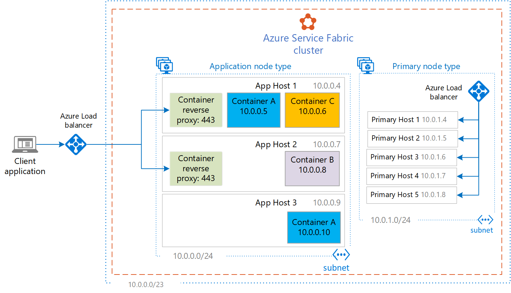
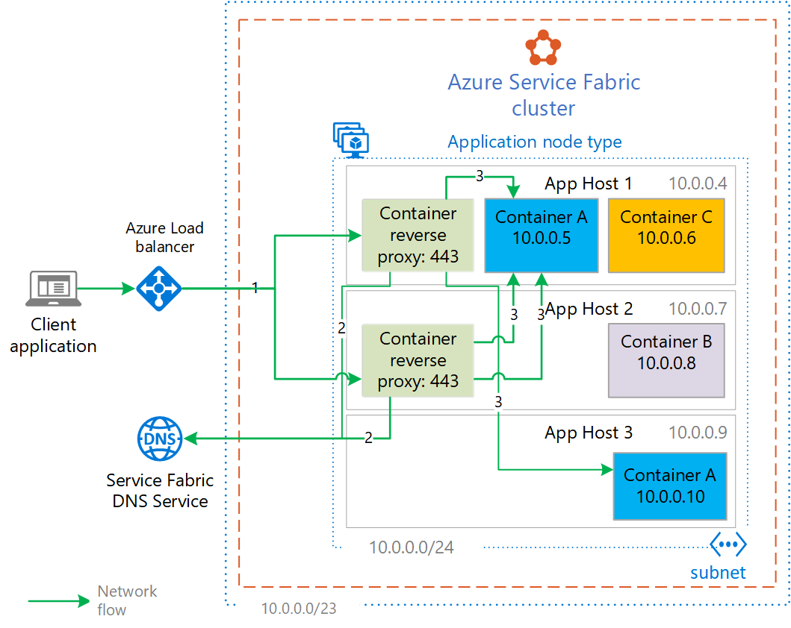
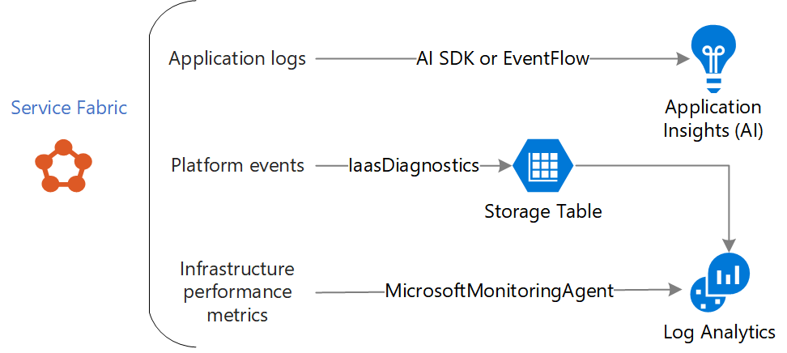
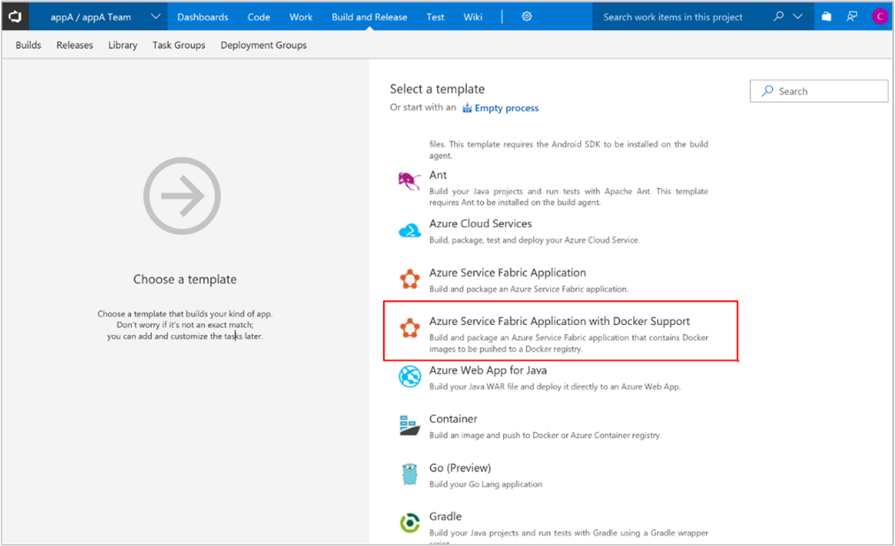
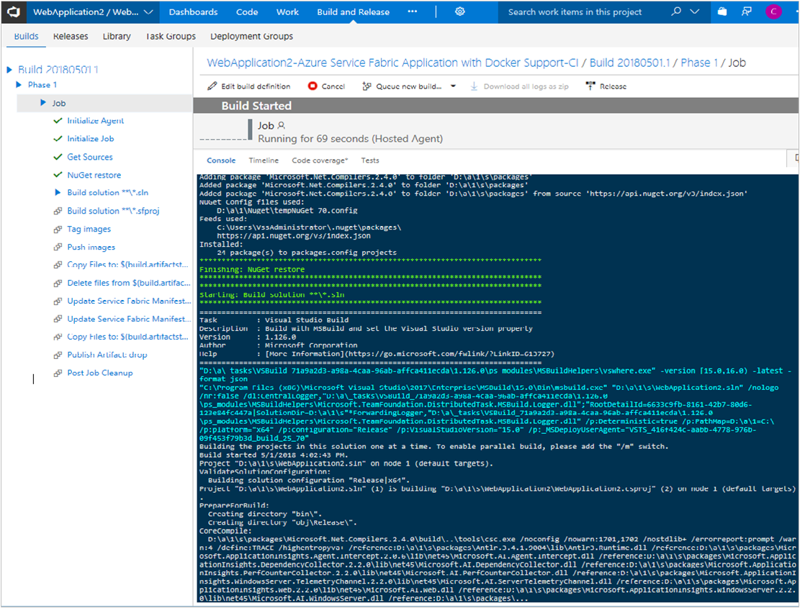

This article provides guidelines for moving Windows applications to an Azure compute platform without rewriting. This migration uses container support in Azure Service Fabric.

A typical approach for migrating existing workloads to the cloud is the lift-and-shift strategy. In IaaS virtual machine (VM) migrations, you provision VMs with network and storage components and deploy the existing applications onto those VMs. Unfortunately, lift-and-shift often results in overprovisioning and overpaying for compute resources. Another approach is to move to PaaS platforms or refactor code into microservices and run in newer serverless platforms. But those options typically involve changing existing code.

Containers and container orchestration offer improvements. Containerizing an existing application enables it to run on a cluster with other applications. It provides tight control over resources, scaling, and shared monitoring and DevOps.

Optimizing and provisioning the right amount of compute resources for containerization isn't trivial. Service Fabric's orchestration allows an organization to migrate Windows and Linux applications to a runtime platform without changing code and to scale the needs of the application without overprovisioning VMs. The result is better density, better hardware use, simplified operations, and overall lower cloud-compute costs.

An enterprise can use Service Fabric as a platform to run a large set of existing Windows-based web applications with improved density, monitoring, consistency, and DevOps, all within a secure extended private network in the cloud. The principle is to use Docker and Service Fabric's containerization support that packages and hosts existing web applications on a shared cluster with shared monitoring and operations, in order to maximize cloud compute resources for the ideal performance-to-cost ratio.

This article describes the processes, capabilities, and Service Fabric features that enable containerizing in an optimal environment for a large enterprise. The guidance is scoped to web applications and Windows containers. Before reading this article, get familiar with core Windows container and Service Fabric concepts. For more information, see:

- [Create your first Service Fabric container application on Windows](/azure/service-fabric/service-fabric-get-started-containers)
- [Service Fabric terminology overview](/azure/service-fabric/service-fabric-technical-overview)
- [Service Fabric best practices overview](/azure/service-fabric/service-fabric-best-practices-overview)

## Resources

 [Sample: Modernization templates and scripts](https://github.com/Azure-Samples/Service-fabric-dotnet-modernization).

The repo has these resources:

- An example Azure Resource Manager template to bring up an Azure Service Fabric cluster.
- A reverse-proxy solution for brokering web requests into the Service Fabric cluster to the destination containers.
- Sample Service Fabric application configuration and scripts that show the use of placement, resource constraints, and autoscaling.
- Sample scripts and Docker files that build and package an existing web application.

Customize the templates in this repo for your cluster. The templates implement the best practices described in this article.

## Evaluate requirements

Before containerizing existing applications, evaluate requirements. Select applications that are right for migration, choose the right developer workstation, and determine network requirements.

### Application selection

First, determine the type of applications that are best suited for a containerized platform, full virtual machines, and pure PaaS environment. The application could be a shared application that is built with Service Fabric to share Windows Server hosts across various containerized applications. Each Service Fabric host can run multiple different applications running in isolated Windows containers.

Consider creating a set of criteria to determine such applications. Here are some example criteria of containerized Windows applications in Service Fabric.

- HTTP/HTTPS web and application tiers without database dependency.
- Stateless web applications.
- Built with .NET Framework versions 3.5 and later.
- Do not have hardware dependency or access device drivers.
- Applications can run on Windows Server 2016 and later versions.
- All dependencies can be containerized, such as are most .NET assemblies, WCF, COM+.
  > [!NOTE]
  > Dependencies that cannot be containerized include MSMQ (Currently supported in preview releases of Windows Server Core post 1709).
- Applications can compile and build in Visual Studio.

For the web applications, databases, and other required servers (such as Active Directory) exist outside the Service Fabric cluster in IaaS VMs, PaaS, or on-premises.

### Developer workstation requirements

From an application development perspective, determine the workstation requirements.

- [Docker for Windows](https://www.docker.com/docker-windows) is required for developers to containerize and test their applications prior to deployment.
- Visual Studio Docker support is required. Standardize on the latest version of [Visual Studio](https://visualstudio.microsoft.com/) for the best Docker compatibility.
- If workstations don't have enough hardware resources to oversee those requirements, use Azure compute resources for speed and productivity gains. An option is the Azure DevTest Labs Service. Docker for Windows, and Visual Studio 2019 require a minimum of 8 GB of memory.

### Networking requirements

Service Fabric orchestration provides a platform for hosting, deploying, scaling, and operating applications at enterprise scale. Most large enterprises that use Azure:

- Extend their corporate network with a private address space to an Azure subscription. Use either [ExpressRoute](https://azure.microsoft.com/services/expressroute/) or a [Site-to-Site VPN](/azure/vpn-gateway/vpn-gateway-howto-site-to-site-resource-manager-portal) to provide secure on-premises connectivity.
- Want to control inbound and outbound network traffic through third-party firewall appliances and/or [Azure Network Security Group rules](/azure/virtual-network/security-overview).
- Want tight control over the address space requirements and subnets.

Service Fabric is suitable as a containerization platform. It plugs into an existing cloud infrastructure and doesn't require open public ingress endpoints. You just need to carve out the necessary address space for Service Fabric's IP address requirements. For details, see the [Service Fabric Networking](#service-fabric-networking) section in this article.

## Containerize existing Windows applications

After you've determined the applications that meet the selection criteria, containerize them into Docker images. The result is containerized .NET web application running in IIS where all tiers run in one container.

> [!NOTE]
> You can use multiple containers; one per tier.

Here are the basic steps for containerizing an application.

1. Open the project in Visual Studio.
1. Make sure the project compiles and runs locally on the developer workstation.
1. Add a Dockerfile to the project. This Dockerfile example shows a basic .NET MVC application.

   ```dockerfile
   FROM mcr.microsoft.com/dotnet/framework/aspnet:4.8
   ADD PublishOutput/ /inetpub/wwwroot

   # add a certificate and configure SSL
   SHELL ["powershell","-command"]
   RUN New-Item -ItemType Directory C:\install
   ADD installwebsite.ps1 c:\install\
   ADD wildcard.pfx c:\install\
   # Powershell script to configure SSL on the website
   RUN c:\install\configurewebsite

   # plugin into SF healthcheck ensuring the container website is running
   HEALTHCHECK --interval=30s --timeout=30s --start-period=60s --retries=3 CMD curl -f http://localhost/ || exit 1
   ```

1. Test locally by using Docker For Windows. The application must successfully run in a Docker container by using the Visual Studio debug experience. For more information, see [Deploy a .NET app using Docker Compose](/azure/service-fabric/service-fabric-host-app-in-a-container).
1. Build (if needed), tag, and push the tested image to a container registry, like the [Azure Container Registry](/azure/container-registry/) service. This example uses an existing Azure Container Registry named MyAcr and Docker build/tag/push to build/deploy appA to the registry.

   ```bash
   docker login myacr.azurecr.io -u myacr -p <pwd>
   docker build -t appa .
   docker tag appa myacr.azurecr.io/appa:1.0
   docker push myacr.azurecr.io/appa:1.0
   ```

The image is tagged with a version number that Service Fabric references when it deploys and versions the container. Azure DevOps encapsulates and executes the manual Docker build/tag/push process. DevOps details are described in the [DevOps and CI/CD](#devops-and-cicd) section.

> [!NOTE]
> In the preceding example, the base image is "mcr.microsoft.com/dotnet/framework/aspnet:4.8" from the Microsoft Container Registry.

Here are some considerations about the base images:

- The base image could be a locked-down custom enterprise image that enforces enterprise requirements. For a shared application, isolation boundaries can be created through credentials or by using separate registry. It's recommended that enterprise-supported docker images be kept separately and stored in an isolated container registry.
- Avoid storing the registry login credentials in configuration files. Instead, use role-based access control (RBAC) and [Azure Active Directory service principals](/azure/active-directory/develop/app-objects-and-service-principals) with Azure Container Registry. Provide read-only access to registries depending on your enterprise requirements.

For information about running an IIS ASP.NET MVC application in a Windows container, see [Migrating ASP.NET MVC Applications to Windows Containers](/aspnet/mvc/overview/deployment/docker-aspnetmvc).

## Service Fabric cluster configuration for enterprise deployments

To deploy a Service Fabric cluster, start with the sample Azure Resource Manager template in this [GitHub Repo](https://github.com/Azure-Samples/Service-fabric-dotnet-modernization) and customize it to fit your requirements. You also deploy a cluster through the Azure portal, but that option should be used for development/test provisioning.

### Service Fabric node types

A Service Fabric cluster contains one or more [node types](/azure/service-fabric/service-fabric-cluster-nodetypes). A node type typically maps to an [Azure virtual machine scale set](/azure/virtual-machine-scale-sets/) which is a set of one or more VM instances with same properties. The cluster must have at least one node type-primary node type, which runs the Service Fabric system services. Do not run your application container on the primary node type because the container can compete with the system services for resources. Consider, designing a cluster with two or more node types depending on the types of applications. For example, if you have two node types, run HTTP web and application tier containers on a non-primary node type.

This example infrastructure uses two Service Fabric node types: application and primary. You can scale in or scale out the scale set individually. It doesn't require extensive planning and testing up front to determine the correct application node type size (scale set instance count), because the actual size can grow and reduce in real time driven by monitoring and metrics.



In the preceding image, the application node type has three nodes that run three containerized applications A, B, and C. The containers can scale on demand based on CPU and memory usage. The hosts can scale out as more applications are deployed to the cluster. Azure Load Balancer has a public IP. The primary nodes are in an internal subnet. It has a load balancer that isn't publicly exposed.

### Placement constraints

Use placement constraints that target the non-primary node type to reserve the primary node type for system services.

This approach enables you to configure each scale set with a separate virtual network subnet. A unique subnet for each node type uses network security group rules for inbound/outbound access to and from the subnet and controls network flow. You can configure the primary node type with a private load balancer so that external traffic can't access Service Fabric management and application deployment. If the application node type wants to expose application endpoints publicly, configure it with a separate load balancer with security configuration. For an example template that uses Windows Service with NSG rule and multiple node types, see [7 Node, 3 node type secure Windows Service Fabric Cluster with NSG](https://github.com/Azure-Samples/service-fabric-cluster-templates/tree/master/7-VM-Windows-3-NodeTypes-Secure-NSG).

A scale set associated with a node type can reliably scale out to 100 VM instances by using a single placement group as applications are added to the cluster. The primary node type often doesn't need as many instances and can run with 5-7 nodes, depending on durability and reliability requirements.

### Service Fabric networking

Service Fabric supports with two networking modes for containerized applications; nat and Open. For large enterprise clusters that host multiple applications, use the Open mode. For more information, see [Container Networking and Constraints](#container-networking-and-constraints).

- **NAT**

  By default, the cluster brings up containers by using a NAT-bridge mode to the host VM. The NAT bridge routes requests over a defined port to the container. With this mode, only one IP address is needed per host VM for the host's primary NIC.

  To route traffic to each application container, a unique port is exposed through the load balancer. However, that port is exposed to end users. If you don't want the port exposed, provide a URL rewrite mechanism. Rewrite the application domain name with a unique application port. Traffic is routed to the load balancer that front ends the cluster. One option for the rewrite mechanism is [Azure Application Gateway](/azure/application-gateway/).

  Another benefit of this approach is simplistic load balancing with Azure Load Balancer. The load balancer's probe mechanism balance traffic across the VM instances that are running the application's containers.

- **Open**

  The **Open** mode assigns an IP address to each running container on the host VM from the cluster's virtual network subnet. Each host is pre-allocated with a set of IP addresses. Each container on the host is assigned an IP from the virtual network range. You can configure this mode in the cluster Azure Resource Manager template during cluster creation. The example infrastructure demonstrates the **Open** mode.

  Benefits of the Open mode:

  - Makes connecting to application containers simple.
  - Provides application traceability that is, the assigned enterprise-friendly IP is constant for the life of the container.
  - Is efficient with Windows containers.

There are downsides:

- The number of IP addresses must be set aside during cluster creation and that number is fixed. For example, if 10 IP addresses are assigned to each host, the host supports up to 9 application containers; one IP is reserved for the host VM's primary NIC, the remaining addresses for each container. The number of IP addresses to configure for each host is determined based on the hardware size for the node type, and the maximum number of containers on each host. Both factors depend on application size and needs. If you need more containers in the cluster, add more application node type VM instances. That is because you can't change the IP number per instance without rebuilding the cluster.
- You need a reverse proxy to route traffic to the correct destination container. The Service Fabric DNS Service can be used by the reverse proxy to look up the application container and rewrite the HTTP request to this container. That solution is more complex to implement than the **nat** mode.

For more information, see [Service Fabric container networking modes](/azure/service-fabric/service-fabric-networking-modes).

### Service Fabric runtime and Windows versions

Choose the version of Windows Server you want to run as the infrastructure host OS. The choice depends on the testing and readiness at the time of first deployment. Supported versions are Windows Server with Containers 1607, 1709, 1803.

Also choose a version of the Service Fabric runtime to start the cluster. For a new containerization initiative, use the latest version (Service Fabric 6.4 or later).

Other considerations:

- The host OS running Service Fabric can be built by using locked down enterprise images with antivirus and malware enforcement.
- The host OS for all the Service Fabric cluster VMs can be domain joined. Domain joining isn't a requirement and can add complexity to any Azure virtual machine. However, there are benefits. For example, if an application requires Windows-integrated security to connect to domain-joined resources, then the domain service account is typically used at the process level. The account is used to execute the application instead of connection string credentials and secrets. Windows containers do not currently support direct domain joining but can be configured to use [Group Managed Storage Accounts (gMSA)](/azure/service-fabric/service-fabric-run-service-as-gmsa). The gMSA capability is supported by Service Fabric for Windows-integrated security requirements. Each containerized application in the cluster can have its own gMSA. gMSA requires the Service Fabric host VMs that run containers to be Active Directory domain joined.

### DNS service

Service Fabric has an internal [DNS service](/azure/service-fabric/service-fabric-dnsservice) that maps a containerized application name to its location in the cluster. For the [**Open**](#service-fabric-networking) mode, the application's IP address is used instead. This service is enabled on the cluster. If you name each service with a DNS name, traffic is routed to the application by using a reverse proxy. For information about reverse proxy, see the [Reverse proxy for inbound traffic](#reverse-proxy-for-inbound-traffic) section.

### Monitoring and diagnostics

The Service Fabric Log Analytics workspace and Service Fabric solution provide detailed information about cluster events. For information about setting it up, see [Configure Azure Monitor logs to collect cluster events](/azure/service-fabric/service-fabric-diagnostics-oms-setup).

- Install the [monitoring agent] for Azure Log Analytics in the Service Fabric cluster. You can then use the [container monitoring solution](/azure/log-analytics/log-analytics-containers) and view the running containers in the cluster.
- Use Docker performance statistics to monitor memory and CPU use for each container.
- Install the Azure Diagnostics extension that collects diagnostic data on a deployed application. For more information, see [What is Azure Diagnostics extension](/azure/azure-monitor/platform/diagnostics-extension-overview).

### Unused container images

Container images are downloaded to each Service Fabric host and can consume space on the host disk. To free up disk space, consider [image pruning](/azure/service-fabric/service-fabric-get-started-containers#configure-the-runtime-to-remove-unused-container-images) to remove images that are no longer referenced and used by running containers. Configure this option in the Host section of the cluster manifest.

### Secrets and certificates management with Key Vault

Avoid hardcoded secrets in the template. Modify the Azure Resource Manager template to add certificates (cluster certificate) and secrets (host OS admin password) from Azure Key Vault during cluster deployment. To safely store and retrieve secrets:

1. Create a Key Vault in a separate resource group in the same region as the cluster.
2. Protect the Key Vault with RBAC.
3. Load the cluster certificate and cluster password in Key Vault.
4. Reference this external Key Vault from the Azure Resource Manager template.

### Cluster capacity planning

For an enterprise production cluster, start with 5-7 primary nodes, depending on the intended size of the overall cluster. For more information, see [Service Fabric cluster capacity planning considerations](/azure/service-fabric/service-fabric-cluster-capacity).

For a large cluster that hosts stateless web applications, the typical hardware size for the primary node type can be Standard_D2s_v3. For the primary node type, a 5-node cluster with the Silver durability tier should scale to containers across 50 application VM instances. Consider doing simulation tests and add more node types as partitioning needs become apparent. Also perform tests to determine the VM size for application node type and the number of running containers on each VM instance. Typically, 10 or more containers run on each VM, but that number is dependent on these factors:

- Resource needs, such as CPU and memory use, of the containerized applications. Web applications tend to be more CPU intensive than memory intensive.
- The compute size and available resources of the chosen node VM for the application node type.
- The number of IP addresses configured per node. Each container requires an IP with Open mode. Given 15 containers on a VM, 16 IP addresses must be allocated for each VM in the application node type.
- Resource needs of the underline OS. The recommendation is to leave 25% of the resources on the VM for OS system processes.

Here are some recommendations: Choose recent Windows Server builds because older builds of Windows Server (1607) use larger container image sizes compared to newer versions (1709 and later).

Select the most appropriate VM compute size and initial application node type VM count. Standard_D8s_v3, Standard_D16s_v3, and Standard_DSv32_v3 are example compute sizes that are known to work well for this tier for running containerized web applications.

Use premium storage for the production cluster because container images must be read quickly from disk. Attach one data disk to each VM and move the Docker EE installation to that disk. That way there is enough log space for each running container. A standard VM with the default 127-GB OS disk fills up because of container logs. A 500 GB to 1 TB data disk is recommended per VM for the application node type scale set.

### Availability and resiliency planning

Service Fabric spreads VM instances across fault and update domains to ensure maximum availability and resilience. For an enterprise-scale production cluster, as a minimum target the Silver tier (5-node cluster) for reliability and durability when hosting containerized stateless web applications.

### Scale planning

There are two aspects to consider:

- Scale in or scale out the scale set associated with the application node type by adding or removing VM instances. VMs can be added and removed automatically through autoscaling or manually through scripts. For an enterprise cluster, do not add or remove nodes frequently. It is important that you disable nodes in Service Fabric before deleting them. Do not delete seed nodes from your cluster. Monitor the cluster VMs with alerts to trigger when VM resources exceed threshold values.
- Scale the application's container count across the scale set instances in the application node type.

For the application node type, start with the minimal required nodes to support the containerized applications and ensure high availability. Have extra nodes in the cluster. A node can be removed from the cluster for maintenance and its running containers can be temporarily moved to other nodes. The cluster can grow statically using the **Add-AzureRmServiceFabricNode** cmdlet, or dynamically by using scale set autoscale capability.

Starting with Service Fabric 6.2, application containers can autoscale individually through configuration. The configuration is based on Docker statistics for CPU and memory use on the host. Together, those capabilities can optimize the compute cost.

- Rather than overprovisioning a VM to run an application, deploy a container to the cluster, monitor it, and then scale out with additional containers, as necessary. Choosing the right size is easier because Docker statistics are used to determine the number of containers.

In the [example infrastructure](#service-fabric-node-types), application A has two containers deployed across the cluster that divide load. This approach allows the application and container combination to be adjusted later for optimization.

> [!NOTE]
> Docker statistics showing individual container resource utilization is sent to Log Analytics and can be analyzed in Azure Monitor.

- Service Fabric offers constant monitoring and [heath checks](/azure/service-fabric/service-fabric-health-introduction) across the cluster. If a node is unhealthy, applications on that node automatically move to a healthy node and the bad node stops receiving requests. Regardless of the number of containers hosting an application, Service Fabric ensures that the application is healthy and running.

For an application that is infrequently used and can be offline, run it in the cluster with just one container instance (such as application B and C). Service Fabric makes sure that the application is up and healthy during upgrades or when the container needs to move to a new VM. Heath checking can reduce cost compared to hosting that application on two redundant and overprovisioned VMs in the traditional IaaS model.

## Container networking and constraints

Use the [**Open**](#service-fabric-networking) mode for hosting containerized web applications in the cluster. After deployment, the application is immediately discoverable through the Service Fabric DNS service. The DNS service is a name-value lookup between a configured service name and the resultant IP address of a container hosting the application.

To route web requests to an application, use an ingress reverse proxy. If application containers listen on different ports (AppA port 8080, AppB on 8081), the default host NAT bridge works without issues. Azure Load Balancer probes route the traffic appropriately. However, if you want incoming traffic over SSL/443 routed to one port for all applications, use a reverse proxy to route traffic appropriately.

### Reverse proxy for inbound traffic

Service Fabric has a built-in reverse proxy but is limited in its feature set. Therefore, deploy a different reverse proxy. An option is the IIS Application Request Routing (ARR) extension for IIS hosted web applications. The ARR can be deployed to a container and configured to take inbound requests and route them to the appropriate application container. In this example, the ARR uses a NAT bridge over port 80/443, accepts all inbound web traffic, inspects the traffic, looks up the destination container using Service Fabric DNS service, and rewrites the request to the destination container. The traffic can be secured with SSL to the destination container. Follow the [IIS Application Request Routing sample](https://github.com/MicrosoftDocs/Virtualization-Documentation/tree/master/windows-container-samples/iis-arr) for building an ARR reverse proxy. For information, see [Using the Application Request Routing Module](/iis/extensions/planning-for-arr/using-the-application-request-routing-module).

Here is the network flow for the example infrastructure.

 The key aspect of the ingress reverse proxy is inspecting inbound traffic and rewriting that traffic to the destination container.

For example, application A is registered with the Service Fabric DNS service with the domain name: appA.container.myorg.com. External users access the application with `https://appA.myorg.com`. Use public or organizational DNS and register appA.myorg.com to point to the public IP for the application node type.

1. Requests for appA.myorg.com are routed to the Service Fabric cluster and handed off to the ARR container listening on port 443. Service Fabric and Azure Load Balancer set that configuration value when the ARR container is deployed.
2. When ARR gets the request, it has a condition to look for any request with the pattern='*.*.*', and its action rewrites the request to `https://{C:1}.container.{C:2}.{C:3}/{REQUEST_URI}`. Because the ARR is running in the cluster, the Service Fabric DNS service is invoked. The service returns the destination container IP address.
3. The request is routed to the destination container. Certificates can be used for the initial request to ARR and the rewrite to the destination container.

Here is an example ApplicationManifest.xml for Container A in the example infrastructure.

```xml
<?xml version="1.0" encoding="utf-8"?>
<ApplicationManifest ApplicationTypeName="sfapp02Type"
                     ApplicationTypeVersion="1.0.0"
                     xmlns="http://schemas.microsoft.com/2011/01/fabric"
                     xmlns:xsd="http://www.w3.org/2001/XMLSchema"
                     xmlns:xsi="http://www.w3.org/2001/XMLSchema-instance">
  <Parameters>
    <Parameter Name="appAsvc_InstanceCount" DefaultValue="2" />
  </Parameters>
  <ServiceManifestImport>
    <ServiceManifestRef ServiceManifestName="appAsvcPkg" ServiceManifestVersion="1.0.0" />
    <ConfigOverrides />
    <Policies>
      <ContainerHostPolicies CodePackageRef="Code" Isolation="default">
        <!--SecurityOption Value="credentialspec=file://container_gmsa1.json"/-->
        <RepositoryCredentials AccountName="myacr" Password=" " PasswordEncrypted="false"/>
        <NetworkConfig NetworkType="Open"/>
      </ContainerHostPolicies>
      <ServicePackageResourceGovernancePolicy CpuCores="1" MemoryInMB="1024" />
    </Policies>
  </ServiceManifestImport>
  <DefaultServices>
    <Service Name="appAsvc" ServicePackageActivationMode="ExclusiveProcess" ServiceDnsName="appA.container.myorg.com">
      <StatelessService ServiceTypeName="appAsvcType" InstanceCount="[appAsvc_InstanceCount]">
        <SingletonPartition />
        <PlacementConstraints>(NodeTypeName==applicationNT)</PlacementConstraints>
      </StatelessService>
    </Service>
  </DefaultServices>
</ApplicationManifest>
```

- Uses the **Open** mode for the containers.
- Registers the application domain name **appA.container.myorg.com** with the [Azure DNS service](/azure/dns/).
- Optionally configures the container to use an [Active Directory gMSA](/virtualization/windowscontainers/manage-containers/manage-serviceaccounts) (commented).
- Uses placement constraints to deploy the container to the application node type, named applicationNT. It instructs Service Fabric to run the container in the correct node type in the secured network subnet.
- Optionally applies [resource constraints](/azure/service-fabric/service-fabric-resource-governance). Each container is resource governed to use 1 vCPU and 1 GB of memory on the VM host. Setting a resource governance policy is recommended because Service Fabric uses the policy to distribute containers across the cluster, as opposed to the default even distribution of containers across the cluster.

Here is the example ServiceManifest.xml for the containerized application appA.

```xml
<?xml version="1.0" encoding="utf-8"?>
<ServiceManifest Name="appAsvcPkg"
                 Version="1.0.0"
                 xmlns="http://schemas.microsoft.com/2011/01/fabric"
                 xmlns:xsd="http://www.w3.org/2001/XMLSchema"
                 xmlns:xsi="http://www.w3.org/2001/XMLSchema-instance">
  <ServiceTypes>
    <StatelessServiceType ServiceTypeName="appAsvcType" UseImplicitHost="true" />
  </ServiceTypes>
  <CodePackage Name="Code" Version="1.0.0">
    <EntryPoint>
      <ContainerHost>
        <ImageName>myacr.azurecr.io/appa:1.0</ImageName>
      </ContainerHost>
    </EntryPoint>
  </CodePackage>
  <ConfigPackage Name="Config" Version="1.0.0" />
  <Resources>
    <Endpoints>
      <Endpoint Name="appAsvcTypeEndpoint1" UriScheme="http" Port="80" Protocol="http" CodePackageRef="Code"/>
      <Endpoint Name="appAsvcTypeEndpoint2" UriScheme="https" Port="443" Protocol="http" CodePackageRef="Code"/>
    </Endpoints>
  </Resources>
</ServiceManifest>
```

- The application is configured to listen on ports 80 and 443. By using the **Open** mode and reverse proxy, all applications can share the same ports.
- The application is containerized to an image named: myacr.azurecr.io/appa:1.0. Service Fabric invokes the Docker daemon to pull down the image when the application is deployed. Service Fabric handles all interactions with Docker.

The reverse proxy container uses similar manifests but isn't configured to use the **Open** mode. You can update containers by versioning the Docker image, then redeploying the versioned Service Fabric package with the **Start-ServiceFabricApplicationUpgrade** cmdlet.

For information about manifests, see [Service Fabric application and service manifests](/azure/service-fabric/service-fabric-application-and-service-manifests).

### Environmental configuration

Do not hardcode configuration values in the container image by using [environment variables](/azure/service-fabric/service-fabric-how-to-specify-environment-variables) to pass values to a container. A DevOps pipeline can build a container image, test in a test environment, promote to staging (or pre-production), and promote to production. Do not rebuild an image for each environment.

Docker can pass environment variables directly to a container when starting one. In this example, Docker passes the eShopTitle variable to the eshopweb container:

```bash
docker run -p 80:80 -d --name eshoptest -e eShopTitle=SomeName eshopweb:1.0
```

In a Service Fabric cluster, Service Fabric controls Docker execution and lists environment variables in the ServiceManifest. Those variables are passed automatically when Service Fabric runs the container. You can override the variables in ApplicationManifest.xml by using the _EnvironmentOverrides_ element, which can be parameterized and built from Visual Studio publish profiles for each environment.

For information about specifying environment variables in, see [How to specify environment variables for services in Service Fabric](/azure/service-fabric/service-fabric-how-to-specify-environment-variables).

## Security considerations

Here are some articles about container security:

[Azure Service Fabric security](/azure/service-fabric/service-fabric-best-practices-security)

[Service Fabric application and service security](/azure/service-fabric/service-fabric-application-and-service-security)

[Set up an encryption certificate and encrypt secrets on Windows clusters](/azure/service-fabric/service-fabric-application-secret-management-windows)

## Logging and monitoring

Monitoring and logging are critical to operational success and is achieved through integration with [Azure Monitor](/azure/azure-monitor/overview) and [Log Analytics](/azure/azure-monitor/log-query/get-started-portal).

Monitor the Service Fabric cluster and each executing containers by using the scale set extension agent for Log Analytics and its associated Container Monitoring Solution. Make sure that you configure and install the extension agent and solution during cluster creation. Docker statistics for container CPU and memory utilization are sent to Log Analytics and can be queried for proactive monitoring and alerting. Set up proactive alerts through Azure Monitor. Here are metrics that you should monitor.

- High CPU and memory utilization of a container.
- Container count hitting a per VM threshold.
- HTTP error codes and count.
- Docker Enterprise Edition (Docker EE) up or down on the host VM.
- Response time of a service.
- Host VM-based alerts on CPU, memory, disk, file consumption.

These Service Fabric virtual machine scale set extensions are installed on a typical node that results in logging.



- ServiceFabricNode. Links the node to a storage account (support log) for tracing support. This log is used when a ticket is opened.
- IaaSDiagnostics. Collects platform events, such as ServiceFabricSystemEventTable, and stores that data in a blob storage account (app log). The account is consumed in Log Analytics.
- MicrosoftMonitoringAgent. Contains all the performance data such as Docker statistics. The data (such as ContainerInventory and ContainerLog) is sent to Log Analytics.

### Application log

If your containerized application runs in a shared cluster, you can get logs such as IIS and custom logs from the container into Log Analytics. This option is recommended because of speed, scalability, and the ability to handle large amounts of unstructured data.

Set up log rotation through Docker to keep the logs size manageable. For more information, see [Rotating Docker Logs - Keeping your overlay folder small](https://medium.com/@Quigley_Ja/rotating-docker-logs-keeping-your-overlay-folder-small-40cfa2155412).

Here are two approaches for getting application logs into Log Analytics.

- Use the existing Container Monitoring Solution installed in Log Analytics. The solution automatically sends data from the container log directories on the VM (C:\ProgramData\docker\windowsfilter\*) to the configured Log Analytics workspace. Each container creates a directory underneath the \WindowsFilter path, and the contents are streamed to Log Analytics from MicrosoftMonitoringAgent on the VM. This way you can send application logs to a shared directory(s) in the container and relay the logs by using Docker Logs to the monitored container log folders.

  1. Write a process script that runs in the container periodically and analyzes log files.
  2. Monitor the log file changes in the shared folder and write the log changes to the command window where Docker Logs can capture the information outside the container.

  Each container records any output sent to the command line of a container. Access the output outside the container, which is automatically executed by Container Monitoring Solution.

  ```bash
  docker logs <ContainerID>
  ```

  Move Docker to an attached VM data disk with enough storage to make sure the OS drive doesn't fill up with container logs.

  The automatic Container Monitoring Solution sends all logs to a single Log Analytics workspace. Different containerized applications running on the same host send application logs to that shared workspace. If you need to isolate logs such that each containerized application sends the log to a separate workspace, supply a custom solution. That content is outside the scope of this article.

- Mount external storage to each running container by using a file management service such as [Azure Files](/azure/storage/files/storage-files-introduction). The container logs are sent to the external storage location and don't take up disk space on the host VM.

  - You don't need, a data disk attached to each VM to hold Docker logs; move Docker Enterprise to the data disk.
  - Create a job to monitor the Azure Files location and send logs to the appropriate Log Analytics workspace for each installed application. The job doesn't need to run in the container. It just observes the Azure Files location.

## DevOps and CI/CD

Application containerization ensures consistency. It makes sure all Service Fabric-hosted applications use the latest approved corporate image and provides an automatable image updating process that is consistent through DevOps. Azure Pipelines provides the automation process. For more information, see [Tutorial: Deploy an application with CI/CD to a Service Fabric cluster](/azure/service-fabric/service-fabric-tutorial-deploy-app-with-cicd-vsts).


- An enterprise may want to control the base container images in a centralized registry. The preceding workflow shows one image registry. There could be multiple registries that are used to share central IT-built enterprise images with application teams. One way to centralize control is for the central IT registry to allow application teams with read-only access to the enterprise base image repository. Application teams each have their own container registry with their Docker files and build off the central IT base image repository.
- There are various third-party image scanning tools that can plug into this process on push/pulls from the Azure Container Registry. Those solutions are available in Azure Marketplace and referenced in the Azure portal Container Registry blade. For example, Aqua and Prisma Cloud.

- After the source code is pushed to a git-based repository, set up CI/CD by creating an Azure DevOps build definition, selecting the source repository, and choosing the **Azure Service Fabric Application and Docker Support** template.



The template sets up the build process and tasks for CI/CD by building and containerizing the application, pushing the container image to a container registry (Azure Container Registry is the default), and deploying the Service Fabric application with the containerized services to the cluster. Each application code change creates a version of the code and an updated containerized image. Service Fabric's rolling upgrade feature deploys service upgrades gracefully.


Here is an example of a build starting the full DevOps process on an Azure-provided hosted build agent. Some enterprises may require the build agents to run internally within their private Azure virtual network corporate network. Set up a Windows build agent VM and instruct Azure DevOps to use the private VM for building and deploying code. For information about using custom build agents, see Self-hosted Windows agents.



## Conclusion

Here is the summary of best practices:

- Before containerizing existing applications, selecting applications that are suitable for this migration, choose the right developer workstation, and determine network requirements.
- Do not run your application container on the primary node type. Instead, configure the cluster with two or more node types and run the application tier containers on a non-primary node type. Use placement constraints that target the non-primary node type to reserve the primary node type for system services.
- Use the **Open** networking mode.
- Use an ingress reverse proxy, such as the IIS Application Request Routing. The reverse proxy inspects inbound traffic and rewrites the traffic to the destination container.
- Do not hardcode configuration values in the container image and use environment variables to pass values to a container.
- Monitor the application, platform events, and infrastructure metrics by using IaasDiagnostics and MicrosoftMonitoringAgent extensions. View the logs in Application Insights and Log Analytics.
- Use the latest approved corporate image and provide an automatable image updating process that is consistent through DevOps.

## Next steps

Get the latest version of the tools you need for containerizing, such as [Visual Studio](https://visualstudio.microsoft.com) and [Docker for Windows](https://www.docker.com/docker-windows).

Customize these templates to meet your requirements. [Sample: Modernization templates and scripts](https://github.com/Azure-Samples/Service-fabric-dotnet-modernization).

## Related resources

- [Migration architecture design](../guide/migration/migration-start-here.md)
- [Build migration plan with Azure Migrate](/azure/migrate/concepts-migration-planning)
- [Modernize .NET applications](../solution-ideas/articles/net-app-modernization.yml)
