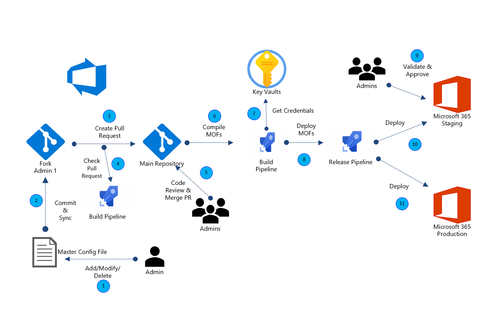

[!INCLUDE [header_file](../../../includes/sol-idea-header.md)]

This example scenario can be used to automate changes to Microsoft 365 tenant configurations using [Azure DevOps](https://docs.microsoft.com/en-us/azure/devops/user-guide/what-is-azure-devops) and [Microsoft365DSC](https://microsoft365dsc.com). Microsoft365DSC is a [PowerShell Desired State Configuration (DSC)](https://docs.microsoft.com/en-us/powershell/scripting/dsc/overview/overview) module, which is able to configure and manage Microsoft 365 tenants in a true DevOps style: Configuration as Code. This solution can be used to track changes made by service administrators and put approval process around deployments to Microsoft 365 tenants. This helps prevent untracked changes into Microsoft 365 tenants and assists in preventing configuration drift between multiple Microsoft 365 tenants.

## Potential use cases

Managing Microsoft 365 tenant configuration in a controlled and automated manner, using DevOps tools and practices, across:

- Development, test, acceptance and production environments
- Multiple customer tenants, like in a managed service provider scenario

## Architecture

*Download an [SVG](../media/Manage-Microsoft365-tenant-configuration-with-Microsoft365DSC-and-Azure-DevOps-content.svg) of this architecture.*

1. Admin 1 adds/updates/deletes entry in his fork of M365 Config file
2. Admin 1 commits and syncs changes to his forked repro
3. Admin 1 creates pull request back to main repository
4. Build pipeline runs on pull request
5. Admins review code and perform merge on PR
6. Merged PR triggers build pipeline to compile MOFs
7. Azure Key Vault called in build pipeline to get credentials
8. MOF files are deployed via Release pipeline
9. Admins validate changes in staging M365 tenant
10. Admins approve changes for production M365 tenant

### Components

The following assets and components where used to build the Microsoft365DSC DevOps solution.

- [Azure Pipeline](https://docs.microsoft.com/azure/devops/pipelines/) allows continuous integration (CI) and continuous delivery (CD) to test and build your code and ship it to any target
- [Microsoft365DSC](https://microsoft365dsc.com) allows organizations to automate the deployment, configuration, and monitoring of Microsoft 365 Tenants via PowerShell Desired State Configuration
- [Azure KeyVault](https://docs.microsoft.com/azure/key-vault/) lets you securely store and tightly control access to tokens, passwords, certificates, API keys, and other secrets
- [Windows Desired State Configuration](https://docs.microsoft.com/powershell/scripting/dsc/overview/overview) is a management platform in PowerShell for development infrastructure with configuration as code

### Alternatives

As a next step, you can use Desired State Configuration in [Azure Automation](https://docs.microsoft.com/en-us/azure/automation/automation-dsc-overview) to store configurations in a central location and add reporting of compliance with the desired state.

We chose to use Azure KeyVault to store secrets, since that offers scalability. When only using one or two of secrets, you can also consider using pipeline variables to reduce the complexity of the solution.

## Considerations

Most people starting out with PowerShell Desired State Configuration experience a steep learning curve. To smoothen this learning curve, make sure you have a solid understanding of PowerShell and have experience with creating scripts.

When talking to Operations teams, they usually consider Azure DevOps "a tool that developers use" and which is not for Operations. However those teams can greatly benefit from using Azure DevOps by storing their scripts in a repository (and adding source control/versioning), automated deployments of those scripts and using boards to track tasks, projects, etc. Please invest some time in investigating what Azure DevOps can offer Operations teams.

### Operations

Using "Configuration as Code" isn't a one time deal, it is a shift in the way of working. This means the way Operations teams work is changing fundamentally and all have to be on board. Changes are no longer performed manually, but everything is implemented in scripts and deployed automatically. This requires that all team members have the skills to change to this new way of working.

### Scalability

This solution is very suitable when working with multiple environments, multiple workloads and/or multiple teams. The validation process can be configured in such a way approval has to be given by experts from each workload. The solution is also able to be extended to deploy to multiple tenants, both for a Dev, Test, Acceptance, Production use and/or for multiple organizations.

To increase scalability even further, an aggregated configuration data solution like [Datum](https://github.com/gaelcolas/datum/) can be considered. This is outside the scope of this scenario.

### Security

Most Microsoft365DSC resources support authentication via username/password, but since Microsoft best practices state that Multi Factor Authentication (MFA) is recommended using this type of authentication is not recommended. Instead using application credentials is the way to go, where supported by the workload.

### DevOps

This solution can run in Azure DevOps server and a similar solution can be created in GitHub using Github actions.  

## Deploy this scenario

[Blog Post here]()

## Next steps

- [Microsoft365DSC source code](https://github.com/microsoft/Microsoft365DSC)
- [Microsoft365DSC and Azure DevOps Whitepaper](https://microsoft365dsc.com/Pages/Resources/Whitepapers/Managing%20Microsoft%20365%20with%20Microsoft365Dsc%20and%20Azure%20DevOps.pdf)

## Related resources

- [Microsoft365DSC Resources](https://microsoft365dsc.com/Pages/Resources/Default.aspx)
- [Microsoft365DSC Youtube](https://www.youtube.com/channel/UCveScabVT6pxzqYgGRu17iw)
- [Microsoft365DSC site](https://microsoft365dsc.com/)
- [Microsoft365DSC export generator tool](https://export.microsoft365dsc.com/)

[calculator]: https://azure.com/e/