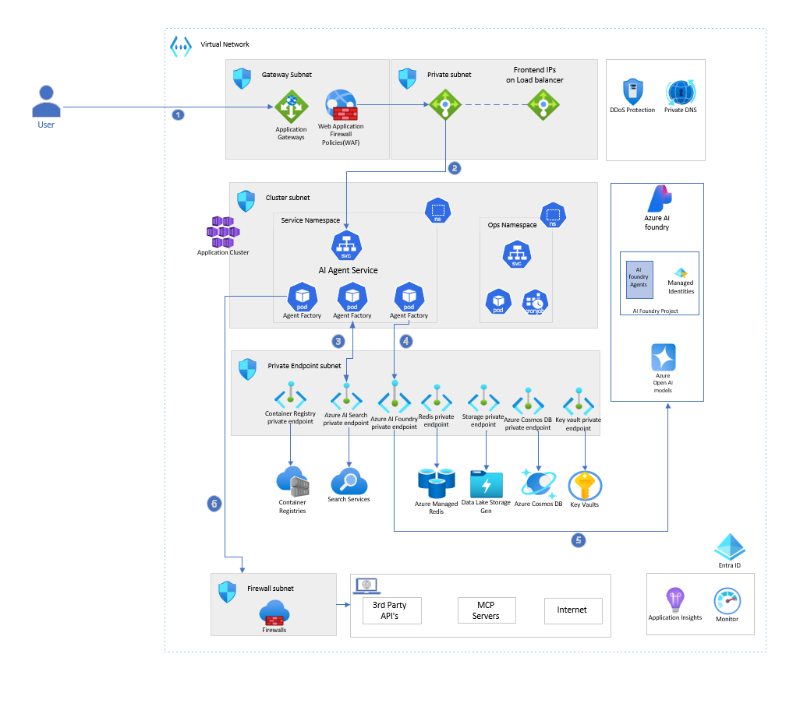
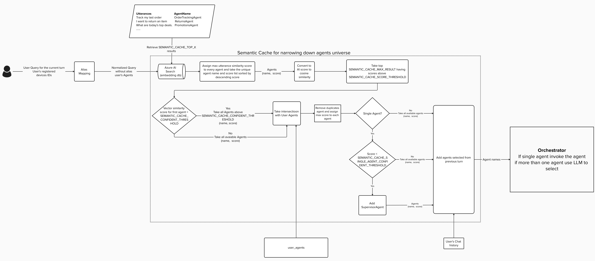
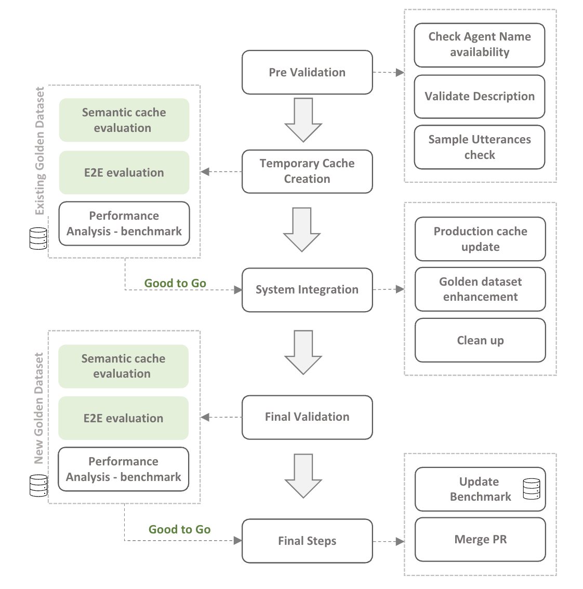

[!INCLUDE [header_file](../../../includes/sol-idea-header.md)]

This solution enables dynamic selection of relevant agents from a large pool of agents during a conversation. It addresses the main challenges of building a system that can flexibly include agents, explores orchestration strategies, and discusses considerations for scaling to hundreds of agents.

The solution uses Azure AI Foundry, Azure AI Search, Azure OpenAI within Foundry models, and other Azure services to support scalable agent-based interactions.

This approach suits scenarios that involve numerous agents participating in open-ended client conversations, where the conversation domain isn't predetermined.

## Architecture

The following diagram shows the high-level architecture for the dynamic AI agents at scale solution. User queries enter through the orchestration layer, which coordinates agent selection using a semantic cache backed by Azure AI Search. The selected agents execute their tasks using Azure OpenAI models hosted in Azure AI Foundry, with supporting services for memory, observability, and evaluation.

*Download a [Visio file](https://arch-center.azureedge.net/<file-name>.vsdx) of this architecture.*

## Workflow

The following workflow corresponds to the architecture diagram. Each step maps to a component described in detail in the [Components](#components) section.

1. A user submits a query through the client application.
2. The **AI Agent Service** receives the request and passes it to the **Orchestrator**, which delegates to the **Agent Selector** component to identify the most relevant agents to invoke.
3. The **Agent Selector** queries the **Semantic Cache** (Azure AI Search) to find candidate agents by comparing the query against stored sample utterances using vector similarity. It scores and filters the results. If one agent exceeds the confidence threshold, it's invoked directly. Otherwise, an LLM chooses from the shortlisted candidates.
4. The **Agent Factory** instantiates the selected agent based on its registered implementation (code module, YAML template, or other representation), returning a ready-to-use agent instance.
5. The selected **Agent** processes the request using **Azure OpenAI** models hosted in **Azure AI Foundry** or external tools, and the response flows back through the orchestration layer to the user.
6. The agents, if required, call third-party APIs or MCP servers via the NAT gateway when a public endpoint is needed.

## Components

- [Microsoft Foundry](/azure/foundry/what-is-foundry) is an end-to-end platform for building, deploying, and managing AI applications. In this solution, it hosts Azure OpenAI models and provides a unified environment for agent development, model orchestration, and evaluation.

- [Azure AI Search](/azure/search/search-what-is-azure-search) is a cloud search service with built-in AI capabilities for vector search and semantic ranking. In this solution, it acts as the semantic cache that stores sample agent utterances and uses vector similarity to identify candidate agents for user queries.

- [Azure OpenAI Service](/azure/ai-services/openai/overview) provides REST API access to OpenAI's language models including GPT-4, GPT-3.5-Turbo, and embeddings. In this solution, agents use these models to process requests, generate responses, and select appropriate agents from shortlisted candidates.

- [Azure Cache for Redis](/azure/azure-cache-for-redis/cache-overview) is a fully managed, in-memory cache that enables high-throughput and low-latency data access. In this solution, it stores conversation context and chat history to support multi-turn interactions with minimal latency.

- [Azure Application Insights](/azure/azure-monitor/app/app-insights-overview) is an application performance management service that provides monitoring and diagnostics for cloud applications. In this solution, it collects telemetry from all components via OpenTelemetry, enabling end-to-end observability of agent interactions, performance metrics, and system health.

- [Azure Monitor](/azure/azure-monitor/overview) is a comprehensive monitoring solution that collects, analyzes, and responds to telemetry from cloud and on-premises environments. In this solution, it provides dashboards, alerting, and log analytics for tracking system performance and detecting anomalies.

- [Azure Log Analytics](/azure/azure-monitor/logs/log-analytics-overview) is a tool for editing and running log queries against data in Azure Monitor Logs. In this solution, it stores execution logs and enables KQL queries to correlate agent behavior and identify conversation-level anomalies.

- [Azure NAT Gateway](/azure/nat-gateway/nat-overview) is a fully managed network address translation service that provides outbound internet connectivity for virtual networks. In this solution, it provides a static outbound IP for agents that call third-party APIs or MCP servers that require a public endpoint.

## Scenario details

This solution addresses the complexities of building and scaling multi-agent AI systems where the number of agents can grow to hundreds. It provides a flexible orchestration framework that dynamically selects the right agents for each conversation without requiring predefined workflows.

### Who is this for

This solution is tailored for agentic AI ecosystems that demand dynamic planning and agent orchestration, enabling numerous (10+) agents to collaborate within a shared environment. These agents often have diverse functions, might not be aware of each other, and aren't expected to collaborate directly. As the ecosystem evolves, the number of agents is expected to grow significantly.

To support this dynamic environment, orchestration must be flexible. Determining which agent is needed can't always be predefined. Instead, the required agents should be available on demand to ensure conversations continue without interruption.

As the number of agents scales, costs must remain predictable and stable; otherwise, sustaining growth at this magnitude becomes challenging for the organization. Organizations need a scalable, cost-efficient, and reliable solution to manage conversations at scale with an ever-expanding set of agents.

### Potential use cases

- **Virtual smart assistant ecosystems**: These ecosystems evolve rapidly, adding more agents to assist users across various operations. As capabilities expand to automate devices and workflows, a structured mechanism is essential to build and manage a large network of agents while keeping costs under control.

### When not to use

This solution might not be suitable in the following scenarios:

1. **Limited number of agents:** If the system involves fewer than five agents, the complexity of dynamic orchestration may not justify the overhead.
2. **Deterministic orchestration:** When the orchestration follows a predefined workflow or handoff process, dynamic agent selection is unnecessary.
3. **Distinct agent roles:** If the agents have clearly distinct roles with no overlap, and the orchestration ensures that only specific agents are available for selection (for example, principal agents with predefined child or connected agents), the need for dynamic selection by an LLM is minimal.

### Key challenges

#### Preparing semantic cache data

Accurate functionality of this solution depends on a well-constructed semantic cache containing sample agent utterances. Represent each agent's capabilities with diverse sample utterances to ensure comprehensive coverage. For reliable agent invocation, include a minimum of five distinct utterances for every capability. This requirement is a prerequisite for onboarding any agent into the system.

#### Dynamic inclusion of agents

Imagine your organization has several domain-specific agents and you want to create a unified conversational AI that enables clients to interact with any of these agents, without needing to know which agent is handling which task. In some cases, multiple agents may be involved in a single conversation to address multi-intent requests. For example: "Help me book a conference room on the Yosemite floor, and notify parking services that I'll need five spots for a customer meeting on the 26th." This scenario would engage both the ConferenceBookingAgent and the ParkingServiceAgent. Managing agent selection is straightforward when the number of agents or tools is small (fewer than 20), and a [function calling](/semantic-kernel/concepts/ai-services/chat-completion/function-calling/) pattern is typically effective. However, as the number of agents increases, determining which agent or function to invoke in a conversation becomes a significant challenge.

### Cost optimization

Function calling has these limitations:

1. Doesn't scale well with a larger number of functions. The maximum limit is 19.
2. Token count increases as the number of functions increases.
3. As token count rises, both cost and latency increase.

Return on investment is a concern for all agentic systems. Token count is a significant factor in agentic system costs. As the number of agents in the system grows, the context window increases to retain more knowledge about all the agents and functions, and the cost keeps growing.

### Orchestration patterns

There are multiple ways to orchestrate multi-agent conversations. The primary challenge lies in identifying which orchestration pattern is most suitable for your specific business needs. Some agents may be configured to interact or complete tasks sequentially, while others have distinct roles and may need to collaborate concurrently to address client requests. This solution provides guidance on choosing orchestration patterns for dynamic environments, where the precise business context and agent relationships may not always be well-defined.

### Evaluating as system evolves

Regular evaluation at multiple levels is essential in agent-based solutions. Assess performance at the individual agent level, within the orchestration layer, and across the overall system. At a system or multi-agent level, each introduction or update of an agent is evaluated for its impact on agent selection, orchestration, and the behavior of other agents. Ongoing evaluation ensures that new agents don't degrade existing agent performance. For more information, see [Evaluation framework](#evaluation-framework).

### Agent selection

The Agent Selector identifies and chooses the most appropriate agents for user inquiries from a large pool of candidates. It uses Azure AI Search with vector similarity as a semantic cache to narrow the list of agents, then applies a large language model (LLM) to select from this refined group. This approach ensures context-aware agent selection and produces responses or actions aligned with the user's query.

The following diagram illustrates the structure of the Agent Selector system:

#### Agent selection workflow

User Query → Alias Mapping → Semantic Search (Azure AI Search) → Agent Scoring & Filtering → Orchestrator (Select & Invoke Agent)

1. User submits a query along with registered agent IDs.
2. Query goes through alias mapping to get a normalized query.
3. Normalized query is sent to Azure AI Search (semantic cache) to find top matching agent utterances.
4. Each agent is assigned the highest similarity score based on vector similarity scores of the normalized query with utterances in the semantic cache.
5. Agents with scores above predefined thresholds are shortlisted.
6. Candidate agents are intersected with the user's registered agents.
7. Remove duplicate agents by retaining only the highest similarity score for each agent based on matched utterances.
8. If a single agent remains and its score exceeds the confidence threshold, select that agent. If not, include the SupervisorAgent for further evaluation.
9. Incorporate agents from the previous conversation turn using chat history.
10. Final agent list is sent to the Orchestrator.
11. Orchestrator invokes the single agent directly, or uses an LLM to select if multiple agents are available.

### Multi-agent orchestration

A well-designed orchestration layer is essential for coordinating interactions among multiple AI agents. As both the number of agents and the complexity of user scenarios grow, the orchestration system must enable agents to work together effectively, complete tasks accurately, and preserve conversational context. The choice of orchestration pattern depends on various factors such as the nature of user queries, the degree of agent collaboration required, and the overall system goals.

You can choose from various orchestration patterns to address specific solution needs. For detailed guidance on selecting and implementing these patterns, see [AI agent orchestration patterns](/azure/architecture/ai-ml/guide/ai-agent-design-patterns).

For scenarios that require a minimal degree of collaboration or conversation between agents, consider using the Agents as Tools pattern. In this approach, a principal agent acts as the main coordinator, invoking other agents as "tools" to fulfill specific tasks. The principal agent interprets user intent and determines which agents to call using the function calling capabilities of large language models.

**Recommended scenarios for the Agents as Tools pattern:**

1. The user's request is straightforward and doesn't require extensive collaboration or reasoning among agents.
2. The solution involves a limited set of agents, usually two or three, to fulfill the task.
3. Each agent operates within a well-defined scope, with responsibilities that don't overlap.

#### Multi-turn scenarios

Multi-turn interactions require the orchestration layer to maintain continuity by providing relevant context from previous requests to the participating agents. The orchestration system should determine when to summarize, prune, or persist the conversation state to optimize performance and relevance.

A basic approach to augment the request with prior context is to store the relevant conversation history in a low-latency cache, such as Azure Cache for Redis, indexed by conversation ID along with a configurable time-to-live (TTL) value to control retention. You can adjust the TTL based on business needs, such as using a rolling TTL for ongoing conversations.

For more advanced agent memory strategies, see [Agent Memory](/agent-framework/user-guide/agents/agent-memory).

#### Adaptive orchestration: direct agent invocation vs. orchestrator path

While the orchestration module is central to coordinating agent interactions, some scenarios don't require its involvement. If the agent selection process (using semantic cache and vector similarity) yields a single agent with a confidence score exceeding a defined threshold (such as 85%), the system can invoke that agent directly. This approach eliminates unnecessary orchestration overhead, minimizes additional agent selection steps, and reduces both latency and token consumption associated with additional LLM calls.

Direct invocation is most suitable for unambiguous, single-intent queries where the probability of successful agent resolution is high. For queries exhibiting multi-intent or ambiguity, the orchestrator layer remains essential for advanced agent coordination and reasoning.

This adaptive orchestration strategy balances performance optimization with functional flexibility. It ensures rapid response for straightforward tasks and robust coordination for complex scenarios.

### Agent implementation approaches

When you design a dynamic large-scale multi-agent system, there are different implementation approaches, each offering distinct benefits depending on the scenario.

#### In-code

Agents are defined programmatically in the application code with the help of frameworks like [Microsoft Agent Framework](/agent-framework/overview/agent-framework-overview) and [LangChain](https://www.langchain.com/).

**Advantages:**

- Maximum control over agent logic and behavior.
- Direct integration with existing application infrastructure.
- Efficient runtime performance through direct code execution.
- Rich debugging and testing capabilities.

**Considerations:**

- Requires proficiency in the respective programming language and framework used for agent implementation.
- Updating or onboarding new agents requires code changes and redeployment.
- Higher maintenance overhead as the system scales.

#### Declarative

Declarative agent definitions allow you to declare agent capabilities, prompts, and workflows in configuration files like [YAML](https://yaml.org/). This approach separates agent logic from application code, enabling non-developers to modify agent behavior without code changes.

**Advantages:**

- Easier to introduce new agents into the system without requiring code changes or redeployment.
- Non-technical team members can also contribute to defining agent behavior.
- Faster iteration cycles for agent updates.
- Clear separation of concerns between infrastructure and agent logic.

**Considerations:**

- Agent behavior and capabilities are restricted to what gets defined as part of the YAML schema. Extending functionality beyond these predefined patterns might require significant changes or custom development.
- Validation and testing processes need to be established for YAML changes.

**Selection criteria:**
When selecting an implementation approach, consider the following parameters:

- **Extensibility**: Determine how readily the approach supports adding new agents and capabilities in the system.
- **Maintainability**: Consider the effort required to update, debug, and monitor agents as requirements evolve.
- **Performance requirements**: Consider latency, throughput, and scalability needs based on expected usage patterns.
- **Scalability**: Assess how well the approach supports increasing numbers of agents and higher workloads.
- **Community support**: Assess the availability of documentation, community resources, and official support for the chosen approach.

Additionally, the solution should support multiple implementation approaches simultaneously, allowing you to choose the most appropriate option for each agent based on its specific requirements and constraints.

### Agent Factory

The Factory Design Pattern is a well-established approach for creating objects where the system needs to manage and instantiate a variety of objects dynamically.
When building a scalable multi-agent system, consider adding an Agent Factory to centralize how agents are created and to decouple creation logic from runtime use. Given an agent name, the factory returns a ready-to-use agent instance regardless of its implementation (code, YAML template, etc.). This lets you add new agent types without changing orchestration logic.

#### Key design considerations

- The factory inspects available representations (code module, YAML, other) and instantiates the appropriate implementation.  
- Allow configurable priority (for example, prefer YAML template over code) so you can control which implementation is used when multiples exist.  
- Include validation, lightweight instantiation checks, and caching to avoid repeated heavy construction.  

The Agent Factory pattern streamlines onboarding, testing, and evolution of an agent catalogue, and preserves modularity and scalability by isolating agent changes from other system components.

### Agent onboarding process

The idea behind this process is to maintain a high-quality, conflict-free multi-agent system where every agent addition, update, or removal is deliberate and validated. Agents are the building blocks of intelligent orchestration, so introducing or modifying one without checks can lead to degraded performance, overlapping responsibilities, or broken user experiences. To prevent this, the lifecycle emphasizes evaluation-driven governance at every stage. The following diagram shows the onboarding process flow.

The process starts with onboarding a new agent, which involves verifying the uniqueness of its name, description, and sample utterances. After validation, a temporary semantic cache is created, and the system runs semantic and response evaluations to ensure the new agent doesn't negatively affect existing ones. If results meet benchmarks, the agent is promoted to production, and the golden dataset (the ground truth for evaluations) is updated to reflect the new capabilities. Similarly, when you update an agent, the same validation and regression checks apply to avoid selection drift. Updating the golden dataset is critical for keeping evaluations aligned with real-world usage, while deleting an agent requires careful decommissioning steps to remove dependencies and maintain system integrity. This structured approach ensures scalability without sacrificing accuracy or reliability.

### Evaluation framework

#### Agentic system evaluation framework using Azure AI Foundry

This framework evaluates agentic systems by using Azure AI Foundry. It focuses on the inner mechanics of agent-based systems, such as tool invocation, agent selection, and final responses, using both built-in and custom evaluation metrics. The framework also includes benchmark visualization and detailed analysis through the AI Foundry Evaluation dashboard.

The framework uses the AI Foundry evaluation SDK to simplify experimentation and evaluation. A config-driven approach combined with a pipeline-based architecture provides flexibility to add any module as part of the pipeline. The SDK provides options to use Azure AI Foundry built-in evaluators for standardized scoring and custom evaluator metrics for measuring agent performance. The flow is organized into modular stages (data_loading, data_preprocessing, evaluation, reporting) with swappable datasets, inference models, or evaluators. Inputs and outputs use JSONL/golden dataset formats. Results can be uploaded to blob storage and visualized through the AI Foundry Evaluation dashboard for comparison across runs.

The code for the evaluation framework can be referenced from [Evaluation Framework repo](https://github.com/Azure-Samples/Agentic-Evaluations).

##### Features

- **AI Foundry SDK**: Framework integrated with [Azure AI Evaluation SDK](https://pypi.org/project/azure-ai-evaluation/).
- **Built-in and custom evaluators**: Utilizes both built-in evaluators from AI Foundry ([see full list](/azure/ai-foundry/concepts/evaluation-evaluators/general-purpose-evaluators)) and custom evaluators.
- **Config-driven architecture**: YAML config to customize pipelines, add evaluators, and more.
- **Customizable pipelines**: Beyond evaluations, the framework enables adding your own modules for data preprocessing, model inferencing, and reporting.

##### Evaluation pipeline diagram

##### Pipeline flow

1. **Load evaluation data from Data store**: Load version controlled golden dataset to be evaluated. 
1. **Data Transformation**: Prepare the datasets for agentic system inference 
1. **Agent Response**: Get the response from agent for the golden dataset.
1. **Data prep for Evaluation**: combine the dataset with ground truth and prepare for evaluation. 
1. **Evaluator (metrics)**: identify the right metrics to be used for the evaluating the agentic system. 
1. **Evaluation Results**: Run the evaluations and get the evaluation output (metrics). 
1. **Reporting**: Push the evaluation report to AI Foundry and analyze it in the Foundry Dashboard. 

##### Experimentation and evaluation of agentic systems

A step-by-step workflow for evaluating agentic systems and their components:

1. **Agent Development**  
    Developers create or fine-tune new agents, define evaluation metrics, and prepare sample utterances or golden datasets.

2. **Component-Level Evaluation**  
    Evaluate each agent or component individually to ensure its responses meet defined expectations and quality standards.

3. **System-Level Evaluation**  
    After integration, perform system-level evaluations, including semantic cache checks and end-to-end (E2E) assessments, to validate overall system behavior.

4. **Iterative Improvement**                              
    Continuously refine agents and the system, ensuring high performance is maintained and that changes do not negatively impact the overall solution.

This structured approach enables robust validation, benchmarking, and integration of agents, supporting scalable and reliable deployment of agentic systems.

#### Evaluation metrics for agentic selection

| Metric                               | Description                                                      |
|--------------------------------------|------------------------------------------------------------------|
| Agent invoke accuracy, recall        | Evaluates whether the right agent handled the message or task.   |
| Agent selection recall, precision    | Measures if the list of agents suggested by cache matches expected results. |

#### Evaluation of agent response (Azure AI Foundry)
| Metric                               | Description                                                      |
|--------------------------------------|------------------------------------------------------------------|
| BLEU score      | Evaluates if the response from the agent matches the ground truth.                    |
| Similarity      | Measures how similar the agent response is compared to the ground truth response.     |
| Relevance       | Measures the relevance of the agent response for a query.                             |

For the full list of evaluators, refer to the [Microsoft Foundry Evaluator Reference](/azure/foundry/concepts/built-in-evaluators).

### Observability

When you build AI solutions, especially those powered by **multi-agent architectures**, reliability, maintainability, and performance are essential.
However, as these systems expand in scale and complexity, maintaining visibility into their behavior becomes increasingly difficult.

Unlike traditional applications, agentic systems involve multiple intelligent components that collaborate dynamically: language models, orchestration layers, caching mechanisms, retrieval engines, and external APIs.  
Each component contributes to the outcome, which makes **monitoring, debugging, and optimization** far more intricate.

Observability is the foundation for understanding emergent AI behavior in these systems.

#### Why observability matters in AI systems

Observability provides insight into what your application is doing, not just whether the underlying infrastructure is running. You need to distinguish between **system observability** (infrastructure metrics like CPU, memory, and network) and **application observability** (orchestration logic, agent behavior, prompt flows, and model inference).

In multi-agent environments, application observability answers questions such as:

- Why did one agent take longer to respond than others?  
- What sequence of calls led to a poor or inconsistent result?  
- Which model parameters or prompts were in play during a failure?  

By combining signals from infrastructure, orchestration, and model behavior, observability bridges the gap between **system performance** and **model intelligence**.

#### Observability framework

This observability framework is built on **OpenTelemetry** for instrumentation and **Azure Application Insights** as the telemetry backend.  

- **OpenTelemetry** standardizes how traces, metrics, and logs are captured across agents and services. It ensures interoperability across frameworks and programming languages.  
- **Application Insights** aggregates and visualizes this telemetry, offering dashboards, alerts, and the ability to explore correlations between infrastructure metrics, application traces, and LLM inference data.

For agents built with **Semantic Kernel**, observability is integrated through OpenTelemetry's standardized instrumentation. Semantic Kernel automatically emits traces, logs, and metrics for kernel operations such as function invocations, prompt executions, and plugin calls when you configure OpenTelemetry.

#### The three dimensions of agentic observability

Traditional observability stops at *logs, metrics, and traces*.  
In AI systems, those pillars extend to include **semantic and behavioral observability**, covering how agents reason, collaborate, and evolve during execution.

##### 1. Execution logs  
Beyond infrastructure logging, capture **semantic events**: prompts, responses, and intermediate reasoning steps between agents.  
All log data is streamed via **OpenTelemetry exporters** to **Azure Log Analytics**, where you use **KQL** to correlate across agents and identify anomalies at the conversation level.

##### 2. System and model metrics  
Metrics provide quantitative signals about both system and model performance.  
Track latency, throughput, and cost, along with **AI-specific metrics** such as token usage and time to first token (TTFT). 

##### 3. Distributed traces with context  
Traces connect every service and agent involved in a single conversation.  
By using **trace IDs** and **span IDs**, you can view the full path of an inference request, from the orchestrator to downstream agents, caches, and external calls.

Each trace carries **semantic context**, such as conversation ID and agent name, enabling a unified view of model collaboration.  
This is particularly useful for diagnosing latency spikes, identifying network bottlenecks, or analyzing where agent coordination might fail.

#### Observability data flow for agentic systems

1. Emit telemetry via OTLP (Instrumentation): Orchestrator, agents, device control, and other services are instrumented using OpenTelemetry SDKs. They emit logs, traces, and metrics via OpenTelemetry Protocol (OTLP).
2. Collect, process & export (Ingestion): Telemetry is sent to the OpenTelemetry Collector, where it flows through receiver, processor, and exporter stages, then is exported to Azure Application Insights.
3. Route to stores (Storage & Query): Application Insights routes data into dedicated stores — Logs to Log Analytics for KQL querying, Traces for distributed tracing via Trace ID and Span ID, and Metrics to the metrics store for system and business monitoring.
4. Visualize & alert (Visualization & Alerting): Dashboards, alerts, and workbooks provide real-time visibility and trigger incident response workflows.

A single trace ID flows through the entire conversation lifecycle, from the initial request to the orchestrator, through agent invocations, function tool calls, and external API services. Each component creates child spans under the parent trace, allowing you to reconstruct the complete execution path and identify where latency or errors occurred across agents and auxiliary services.

#### Observability for LLM and agent systems

For LLM-driven architectures, observability must capture **the cognitive layer**: what the model or agent saw, decided, and produced.

Track not just infrastructure telemetry, but contextual data such as:

- **System prompts**: The instructions that guided behavior.
- **Model parameters**: Temperature, top-p, token limits.
- **User inputs and conversation history**: What context was passed to the model.
- **Outputs**: The actual text, decisions, or structured responses.

Capturing this metadata enables **reproducibility** of inference runs, helping data scientists analyze why an output differed, whether drift occurred, or if bias emerged.

#### Key metrics categories

Track **system performance** metrics (latency, throughput, resource utilization, reliability) and **LLM inference performance** metrics (TTFT, token usage, error rates, content safety triggers). Additionally, monitor **usage and engagement** patterns (active conversations, conversation depth, repeated queries) and **quality and model accuracy** indicators (intent selection accuracy, sentiment trends, instruction adherence, bias and groundedness).

#### Best practices

- **Uniform instrumentation**: Apply OpenTelemetry consistently across all microservices and agents.
- **Correlation IDs**: Include trace and span IDs in every log and metric.
- **Sampling and retention**: Balance data richness with cost efficiency using intelligent sampling.
- **Dashboards and alerts**: Define SLIs/SLOs and automate alerting for anomalies.
- **Secure data handling**: Mask or omit sensitive information from logs and traces.
- **Cross-functional collaboration**: Engineers, data scientists, and product teams should share a unified observability view.

## Contributors

*This article is maintained by Microsoft. It was originally written by the following contributors.*

Principal author:

- [Munish Malhotra](https://www.linkedin.com/in/munish-malhotra) | Senior Software Engineer
- [Brijraj Singh](https://www.linkedin.com/in/brijraajsingh/) | Principal Software Engineering Manager
- [Kshitij Sharma](https://www.linkedin.com/in/ikshitijsharma/) | Senior Software Engineer
- [Vidhya Shankar Venkatesan](https://www.linkedin.com/in/vikesh-singh-baghel-28601322/) | Principal Software Engineer
- [Sushant Bhalla](https://www.linkedin.com/in/sushaanttb/) | Senior Software Engineer
- [Vikesh Bagel](https://www.linkedin.com/in/vikesh-singh-baghel-28601322/) | Principal Data Scientist

*To see non-public LinkedIn profiles, sign in to LinkedIn.*

## Next steps

- [What is Microsoft Foundry?](/azure/foundry/what-is-foundry)
- [What is Azure AI Search?](/azure/search/search-what-is-azure-search)
- [What is Azure OpenAI Service?](/azure/ai-services/openai/overview)
- [AI agent orchestration patterns](/azure/architecture/ai-ml/guide/ai-agent-design-patterns)
- [Microsoft Agent Framework overview](/agent-framework/overview/agent-framework-overview)
- [Azure AI Foundry evaluation SDK](https://pypi.org/project/azure-ai-evaluation/)
- [Agentic Evaluations framework](https://github.com/Azure-Samples/Agentic-Evaluations)

## Related resources

- [Baseline Microsoft Foundry chat reference architecture](../../ai-ml/architecture/baseline-microsoft-foundry-chat.yml)
- [Azure OpenAI chat baseline architecture in an Azure landing zone](../../ai-ml/architecture/baseline-microsoft-foundry-landing-zone.yml)
- [AI agent orchestration patterns](../../ai-ml/guide/ai-agent-design-patterns.md)
- [Build a multiple-agent workflow automation solution by using Microsoft Agent Framework](../../ai-ml/idea/multiple-agent-workflow-automation.yml)

