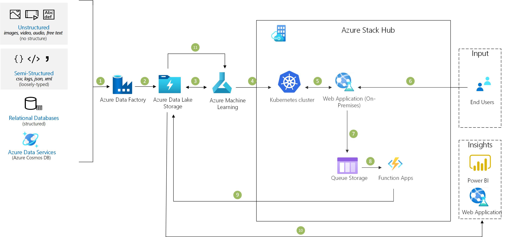

[!INCLUDE [header_file](../../../includes/sol-idea-header.md)]

With the Azure AI tools, edge and cloud platform, it enables edge intelligence possible. The next generation of AI-enabled hybrid applications can run where your data lives. With Azure Stack Hub, bring a trained AI model to the edge, integrate it with your applications for low-latency intelligence, and continuously feedback into a refined AI model with improved accuracy from time to time, with no tool or process changes for local applications.

## Architecture

*Download an [SVG](../media/ai-at-the-edge.svg) of this architecture.*

## Data Flow

1. Data scientists train a model using Azure Machine Learning workbench and an HDInsight cluster. The model is containerized and put into an Azure Container Registry.
1. The model is deployed to a Kubernetes cluster on Azure Stack Hub.
1. End users provide data that's scored against the model. 
1. Insights and anomalies from scoring are placed into a queue.
1. A function sends compliant data and anomalies to Azure Storage.
1. Globally relevant and compliant insights are available in the global app.
1. Data from edge scoring is used to improve the model. 
1. (feedback loop) The model re-training can be triggered by schedule. The data scientists works on the optimization. The improved model is deployed and containerized as an update to the container registry.

## Components

Key technologies used to implement this architecture:
* [Azure Machine Learning](https://azure.microsoft.com/services/machine-learning): Build, deploy, and manage predictive analytics solutions
* [HDInsight](https://azure.microsoft.com/services/hdinsight): Provision cloud Hadoop, Spark, R Server, HBase, and Storm clusters
* [Container Registry](https://azure.microsoft.com/services/container-registry): Store and manage container images across all types of Azure deployments
* [Azure Kubernetes Service (AKS)](https://azure.microsoft.com/services/kubernetes-service): Simplify the deployment, management, and operations of Kubernetes
* [Storage](https://azure.microsoft.com/services/storage): Durable, highly available, and massively scalable cloud storage
* [Azure Stack Hub](https://azure.microsoft.com/overview/azure-stack): Build and run innovative hybrid applications across cloud boundaries
* [Azure Functions](https://azure.microsoft.com/en-au/services/functions/): Event-driven serverless compute unit for on-demand tasks running without the needs of maintaining the computing server. 
* [App Service](https://docs.microsoft.com/en-us/azure/app-service/overview): Path that capture end user feedback data to enable model optimization

## Next steps

* [Azure Machine Learning documentation](/azure/machine-learning/service)
* [HDInsight documentation](/azure/hdinsight)
* [Container Registry documentation](/azure/container-registry)
* [Azure Kubernetes Service (AKS) documentation](/azure/aks)
* [Storage documentation](/azure/storage)
* [Azure Stack Hub documentation](/azure/azure-stack/user/azure-stack-solution-machine-learning)
* [Azure Stack Hub Deployment Options](/azure/azure-stack/operator/azure-stack-overview)
* [App Service documentation](/azure/app-service/)

## Additional Resources

* [AKS Engine on Azure Stack Hub](https://github.com/Azure/aks-engine/blob/master/docs/topics/azure-stack.md)
* [Azure Samples - Edge Intelligence on Azure Stack Hub](https://github.com/Azure-Samples/azure-intelligent-edge-patterns/tree/master/factory-ai-vision)
* [Azure Samples -Azure Stack Hub Foundation](https://github.com/Azure-Samples/Azure-Stack-Hub-Foundation-Core)

## Related Resources

* Want to learn more? Check out the related Learn pathway: [Microsoft Learn Azure Stack Module](https://docs.microsoft.com/en-us/learn/modules/intro-to-azure-stack/)
* Get Microsoft Certified for Azure Stack Hub with the [Azure Stack Hub Operator Associate (currently in beta)](https://docs.microsoft.com/en-us/learn/certifications/azure-stack-hub-operator/?WT.mc_id=Azure_blog-wwl) certification
* How to [install the AKS Engine on Linux in Azure Stack Hub](https://docs.microsoft.com/en-us/azure-stack/user/azure-stack-kubernetes-aks-engine-deploy-linux?view=azs-2008)
* How to [install the AKS Engine on Windows in Azure Stack Hub](https://docs.microsoft.com/en-us/azure-stack/user/azure-stack-kubernetes-aks-engine-deploy-windows?view=azs-2008)
* Deploy your ML models to an Edge device with [Azure Stack Edge Devices](https://azure.microsoft.com/en-us/products/azure-stack/edge/#devices)
* Innovate further and deploy [Azure Cognitive Services (Speech, Language, Decision, Vision) containers to Azure Stack Hub](https://docs.microsoft.com/en-us/azure-stack/user/azure-stack-solution-template-cognitive-services?view=azs-2008#:~:text=%20Deploy%20Azure%20Cognitive%20Services%20to%20Azure%20Stack,to%20preview%20the%20Face%2C%20Language%20Understanding...%20More%20)