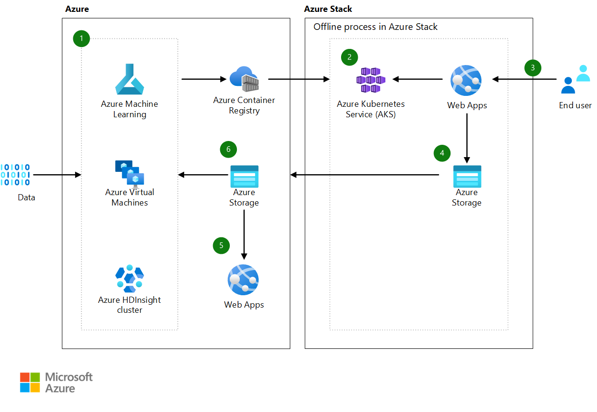

[!INCLUDE [header_file](../../../includes/sol-idea-header.md)]

With the Azure AI tools, edge, and cloud platform, edge intelligence is possible. AI-enabled hybrid applications can run where your data lives, on-premises. With [Azure Stack Hub](/azure-stack/operator/azure-stack-overview), bring a trained AI model to the edge and integrate it with your applications for low-latency intelligence, with no tool or process changes for local applications. With Azure Stack Hub, you can ensure that your cloud solutions work even when disconnected from the internet.

## Potential use cases

This solution idea shows a disconnected Stack Hub scenario. Issues of latency, intermittent connectivity, or regulations may not always allow for connectivity to Azure. In the disconnected scenario, data is processed locally and later aggregated in Azure for further analytics. For the connected version of this scenario, see the article [AI at the edge](./ai-at-the-edge.yml).

## Architecture

*Download an [SVG](../media/ai-at-the-edge-disconnected.svg) of this architecture.*

### Dataflow

1. Data scientists train a model using Azure Machine Learning and an HDInsight cluster. The model is containerized and put into an Azure Container Registry.
1. The model is deployed to a Kubernetes cluster on Azure Stack Hub.
1. End users provide data that's scored against the model.
1. Insights and anomalies from scoring are placed into storage for later upload.
1. Globally relevant and compliant insights are available in the global app.
1. Data scientists use scoring from the edge to improve the model.

### Components

Key technologies used to implement this architecture:

* [Azure Machine Learning](https://azure.microsoft.com/services/machine-learning): Build, deploy, and manage predictive analytics solutions
* [HDInsight](https://azure.microsoft.com/services/hdinsight): Provision cloud Hadoop, Spark, HBase, and Storm clusters
* [Container Registry](https://azure.microsoft.com/services/container-registry): Store and manage container images across all types of Azure deployments
* [Azure Kubernetes Service (AKS)](https://azure.microsoft.com/services/kubernetes-service): Simplify the deployment, management, and operations of Kubernetes
* [Virtual Machines](https://azure.microsoft.com/services/virtual-machines): Provision Windows and Linux virtual machines in seconds
* [Storage](https://azure.microsoft.com/services/storage): Durable, highly available, and massively scalable cloud storage
* [Azure Stack Hub](https://azure.microsoft.com/overview/azure-stack): Build and run innovative hybrid applications across cloud boundaries

## Next steps

* Want to learn more? Check out the related Learn pathway: [Microsoft Learn Azure Stack Module](/learn/modules/intro-to-azure-stack)
* Get Microsoft Certified for Azure Stack Hub with the [Azure Stack Hub Operator Associate](/learn/certifications/azure-stack-hub-operator) certification
* How to [install the AKS Engine on Linux in Azure Stack Hub](/azure-stack/user/azure-stack-kubernetes-aks-engine-deploy-linux)
* How to [install the AKS Engine on Windows in Azure Stack Hub](/azure-stack/user/azure-stack-kubernetes-aks-engine-deploy-windows)
* Deploy your ML models to an edge device with [Azure Stack Edge devices](https://azure.microsoft.com/products/azure-stack/edge/#devices)
* Innovate further and deploy [Azure Cognitive Services (Speech, Language, Decision, Vision) containers to Azure Stack Hub](/azure-stack/user/azure-stack-solution-template-cognitive-services)

## Related resources

* [App Service documentation](/azure/app-service)
* [Azure Kubernetes Service (AKS) documentation](/azure/aks)
* [Azure Machine Learning documentation](/azure/machine-learning/service)
* [Azure Stack Hub documentation](/azure/azure-stack/user/azure-stack-solution-machine-learning)
* [Azure Stack Hub Deployment Options](/azure-stack/operator/azure-stack-overview#deployment-options)
* [Container Registry documentation](/azure/container-registry)
* [HDInsight documentation](/azure/hdinsight)
* [Storage documentation](/azure/storage)
* [AKS Engine on Azure Stack Hub (on GitHub)](https://github.com/Azure/aks-engine/blob/master/docs/topics/azure-stack.md)
* [Azure Samples - Edge Intelligence on Azure Stack Hub (on GitHub)](https://github.com/Azure-Samples/azure-intelligent-edge-patterns/tree/master/factory-ai-vision)
* [Azure Samples -Azure Stack Hub Foundation (on GitHub)](https://github.com/Azure-Samples/Azure-Stack-Hub-Foundation-Core)
* [Virtual Machines documentation](/azure/virtual-machines/workloads/sap/get-started?toc=%2fazure%2fvirtual-machines%2fwindows%2fclassic%2ftoc.json)
* [Azure hybrid and multicloud patterns and solutions documentation](/hybrid/app-solutions)
