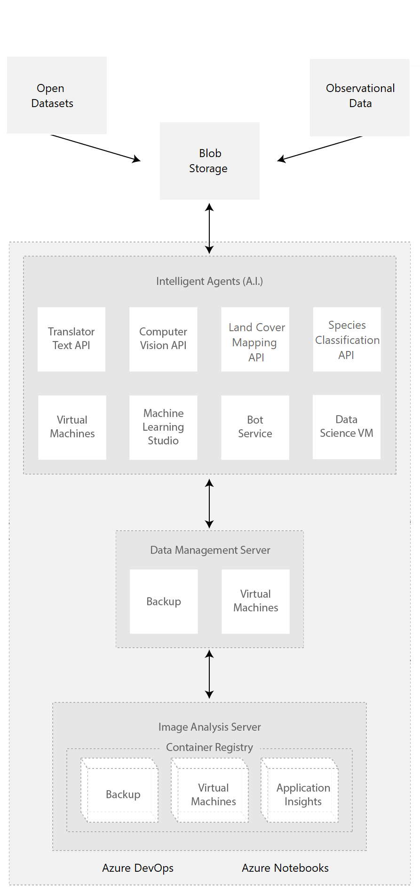

# AI for Earth

This article showcases the public Microsoft [AI for Earth APIs](https://www.microsoft.com/ai/ai-for-earth-tech-resources), and how they can work with Azure services and resources to help our planet.

The Earth currently faces accelerating environmental challenges like climate change, biodiversity and habitat loss, pollution, overpopulation, and food and fresh water shortages. These problems need quick and comprehensive mitigation, but can seem so overwhelming that philosopher Timothy Morton calls them *hyperobjects*, entities that are too vast and distributed to fully define or comprehend.

While technology has contributed to many of these issues, we need technology to be able to conceptualize as well as solve them. Artificial intelligence (AI) is one tool that can help to both understand and potentially mitigate global environmental issues.

AI approaches to environmental challenges require substantial amounts of data, computing power, specialized tools, and expertise. The Microsoft [AI for Earth](https://www.microsoft.com/ai/ai-for-earth) initiative provides people and organizations with AI and cloud tools like open data sets, cloud compute grants, open-source APIs, and education to help them address global environmental challenges.

## Use cases

AI for Earth [projects](https://www.microsoft.com/ai/ai-for-earth-projects?activetab=pivot1%3aprimaryr2) are making an impact on the environment today. For example:

- [Basemap](https://www.silviaterra.com/basemap) combines forestry expertise with open datasets, Azure storage and compute, and machine learning to plot tree coverage, tree species and size, tree value, carbon sequestration, and habitat suitability for every forested acre in the continental US. AI for Earth awarded a [grant](https://ai4edatasetspublicassets.blob.core.windows.net/grantee-profiles/SilviaTerra_US_Ag_AI4E%20Grantee%20Profile.pdf) and then worked with [SilviaTerra](https://www.silviaterra.com/) to develop this high-resolution national forest inventory and scale its computing processes from thousands of acres to hundreds of millions of acres through the Azure cloud.
  
  Basemap data delivers insight to forest stakeholders ranging from governments and conservation groups to large and small landowners. With better inventories, it's easier for conservationists to target their efforts, and frequent updates make short-term conservation projects and commitments feasible.

- [Wild Me](https://www.microsoft.com/ai/ai-for-earth-Wild-Me) uses Azure, computer vision, and deep learning to create a system that scans imagery from citizen scientists to identify individual animals. Fighting extinction from poaching, habitat loss, and climate change requires a tremendous amount of data, including population counts, location, birth rates, and migration patterns. Gathering this data manually is time-consuming and expensive, making citizen engagement critical to data collection efforts.
  
  Wild Me used computer vision and deep learning algorithms to create a platform called [Wildbook](http://wildbook.org/doku.php), which scans millions of crowdsourced wildlife images to identify species as well as individual animals. AI for Earth worked with Wild Me to scale Wildbook to the Azure cloud, allowing them to handle the ever-increasing number of species they support. 
  
  The public can follow the movements of their favorite animals, and scientists use the aggregated data to help inform conservation decisions. Microsoft hosts Wildbook on Azure and makes Wild Me's open-source algorithms available as APIs.

[Video: Fighting extinction with Microsoft AI and citizen science](https://youtu.be/rQqao37u1wU)
[Wildbook open-source code projects](https://github.com/wildbookorg)

## Architecture

1. Environmental data comes from public sources, citizen scientists, and Open Datasets.
1. Raw or preprocessed data is imported, exported, and stored in [Azure Blob Storage]
1. Cognitive Service APIs like [Computer Vision](https://docs.microsoft.com/azure/cognitive-services/computer-vision/) and [Translator Text](https://www.microsoft.com/translator/business/translator-api/) extract and process structured data and text from unstructured sources.
1. AI for Earth APIs like Land Cover Mapping and Species Classification process images to provide land use and species identification data.
1. High-performing Linux [virtual machines](https://azure.microsoft.com/services/virtual-machines/) (VMs) can scale out to process and analyze data as needed. [Data Science Virtual Machines](https://azure.microsoft.com/services/virtual-machines/data-science-virtual-machines/) come preconfigured with data science modeling and machine learning tools.
1. [Azure Backup](https://azure.microsoft.com/services/backup/) backs up VMs and protects critical data.
1. [Container Registry](https://azure.microsoft.com/services/container-registry/) stores containers for apps and data.
1. [Application Insights](https://docs.microsoft.com/azure/azure-monitor/app/app-insights-overview) monitors servers and services for performance and outages.
1. [Azure DevOps](https://azure.microsoft.com/services/devops/) monitors and manages operations during development.
1. Azure Notebooks run code in browsers for collaboration and demonstrations.

## Components

The [AI for Earth APIs](https://www.microsoft.com/ai/ai-for-earth-tech-resources) work with Azure components to provide these solutions.

### Land Cover Mapping API

[Land Cover Mapping](https://www.microsoft.com/research/project/land-cover-mapping/) 
Environmental scientists use satellite and aerial imagery to understand patterns of land use, in particular the impacts of climate change and human population expansion on natural resources. Understanding land use is critical to strategic conservation planning. However, distilling imagery into actionable data in the form of land cover maps requires extensive manual annotation. The public [Land Cover Mapping API](https://aiforearth.portal.azure-api.net/docs/services/ai-for-earth-land-cover-mapping-api-v2/operations/post-landcover-classify) uses computer vision and machine learning to classify imagery into natural or human-made terrain types, providing high-resolution land cover information for precision conservation planning.

The Land Cover Mapping API can take a supplied TIFF or JPEG 1-meter-resolution aerial or satellite image and return an image file showing land cover classifications. Version 2 can return the most recent image and land cover classifications for any specified latitude and longitude within the United States. Both API versions return a land cover classification image with areas classified into water, forest, field, or built coverage. The demo Notebook in this article uses Version 2. You can analyze and make decisions based on the land cover predicted in the image. The API also allows you to train your model by correcting the predictions and adding and training new classifications.

[Land Cover training demo](http://landcoverdemo.eastus.cloudapp.azure.com:4040/)
[Land Cover Mapping video](https://www.youtube.com/watch?v=9aFUzUlHQVc)
[Land Cover Mapping source code](https://github.com/Microsoft/landcover)

### Species Classification API

Wildlife conservation depends on accurate, up-to-date wildlife population estimates, but population surveys often depend on humans to annotate millions of images. The public [Species Classification API](https://aiforearth.portal.azure-api.net/docs/services/species-classification-v2/operations/predict) can help automate observations from citizen-scientists by identifying plants and animals in images from over 5000 species. The API has a single endpoint that takes an image as input and returns a predicted species and the confidence of the prediction.

The Species Classification API enables developers to leverage deep learning models for recognizing plants and animals.

[Species Classification API demo](https://speciesclassification.westus2.cloudapp.azure.com/).
[Species Classification source code](https://github.com/Microsoft/speciesclassification)

### Azure Open Datasets

[Azure Open Datasets](https://azure.microsoft.com/services/open-datasets/) are free, curated public datasets that help you train machine learning models and enrich predictive solutions. The datasets cover public-domain weather, census, holidays, public safety, and location data. You can share or request other public datasets through Azure Open Datasets. 

Azure Open Datasets preprocesses data to save you time. At regular intervals, Open Datasets pulls data from the sources, such as by an FTP connection to the National Oceanic and Atmospheric Administration (NOAA). After parsing the data into a structured format, Open Datasets enriches it as appropriate with features such as ZIP Code or location of the nearest weather station.

With an Azure account, you can access Open Datasets through the Azure portal or through APIs. Cohosting with Azure compute and other services makes access and manipulation easier. You can access Open Datasets are available through the Azure Machine Learning UI and SDK. Open Datasets also provides Azure Notebooks and Azure Databricks notebooks you can use to connect data to Azure Machine Learning and Azure Databricks. Datasets can also be accessed through a Python SDK.

However, you don't need an Azure account. You can access Open Datasets from any Python environment, with or without Spark. 

using code or through the Azure service interface. The data is colocated with Azure cloud compute resources for use in your machine learning solution.

are integrated into Azure Machine Learning, or you can access the datasets through APIs. 

Azure Open Datasets are that are easy to access from Azure services and ready to use to improve the accuracy of your machine learning models.

[Full catalog](https://azure.microsoft.com/services/open-datasets/catalog/)

(https://docs.microsoft.com/azure/open-datasets/overview-what-are-open-datasets)
Azure Open Datasets are curated public datasets 

Datasets are cohosted with 

### Azure Notebooks

Azure Notebooks is a free service for anyone to develop and run code in their browser using Jupyter. [Jupyter](https://jupyter.org/) is an open-source project that enables combing markdown prose, executable code, and graphics onto a single canvas called a notebook. Notebooks are an excellent way for data scientists and AI engineers to share and collaborate in the cloud. The hands-on demo Notebooks in this article showcase the AI for Earth **Land Cover Mapping** and **Species Classification** APIs.

## Issues and considerations

- Azure Open Datasets can consume hundreds of terabytes of resources, so it's best to perform large-scale processing in the same Azure datacenter where the data is stored. If you're using Open Datasets for environmental science applications, consider applying for an [AI for Earth grant](https://www.microsoft.com/ai/ai-for-earth-grants) to support your compute requirements.
- Azure Notebooks is currently in public preview. The preview version is provided without a service level agreement, and it's not recommended for production workloads. Certain features might not be supported, or might have constrained capabilities.
- Not all US addresses may work in the Land Cover Mapping Notebook. If the address you supply doesn't work, try another address.
- Some species may be misidentified by the Species Classification API version used by the Species Classification Notebook. The current version of the API is 2.0.

## Deployment

The hands-on demo Azure Notebooks showcase the AI for Earth **Land Cover Mapping** and **Species Classification** APIs.

### Prerequisites

- Get keys for the Land Cover Mapping and Species Classification APIs by emailing [aiforearthapi@microsoft.com](mailto:aiforearthapi@microsoft.com)
- Have a Microsoft or Azure DevOps organizational account

To run the demo Notebooks:

1. Open the [Land Cover Mapping](https://notebooks.azure.com/operations-manager/projects/ai-for-earth) or [Species Classification](https://notebooks.azure.com/operations-manager/projects/ai-for-earth-apis) project.
1. Select **Sign in** at upper right, and after signing in select **Clone**.
1. On the popup screen, select **I trust the contents of this project**, and then select **Clone** again.
1. Once the project is cloned, select **Run on Free Compute**.
1. On the next screen, select the *.ipynb* file. 
1. In the Notebook, paste the API Key you received into the appropriate placeholder.
1. Select each cell in turn, and then select **Run** to run the cell. You can ignore any `pip` warnings that appear when installing packages.
1. Follow the prompts to enter different addresses for the Land Cover Mapping demo, or different species for the Species Classification demo, and see the API in action.
   
## Alternatives

- Microsoft has awarded over 200 AI for Earth grants for projects in 57 countries. There are four areas of focus for AI for Earth grants: agriculture, biodiversity, climate change, and water. Grants available for data labeling services, an important prerequisite for most AI projects, or for Azure compute credits. Grantees can also access additional resources like technical advice and support, online Azure training materials, and networking and educational opportunities. For more information, see [AI for Earth's grant process and details](https://www.microsoft.com/ai/ai-for-earth-grants). 

## Next steps

AI for Earth is one of the initiatives in [Microsoft AI for Good](https://www.microsoft.com/ai/ai-for-good), providing technology, resources, and expertise to help solve humanitarian issues and create a more sustainable and accessible world.

Here are some of the ways AI for Earth is helping people solve and analyze environmental problems:
- [AI for Earth grants](https://www.microsoft.com/ai/ai-for-earth-grants) for Azure compute credits and data labeling services
- [AI for Earth APIs](https://www.microsoft.com/ai/ai-for-earth-apis) for global needs like land cover classification and species recognition
- [AI for Earth tools and projects](https://github.com/search?l=&q=user%3Amicrosoft+topic%3Aaiforearth&type=Repositories) Open-source infrastructure, models, APIs, and code examples
