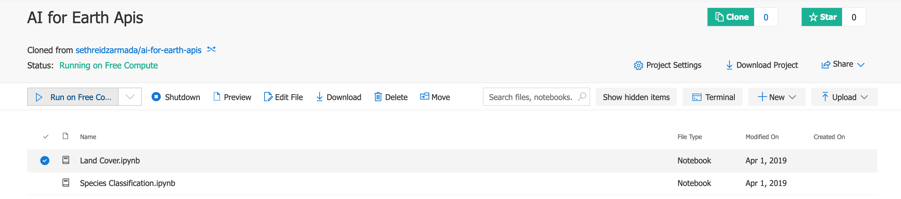
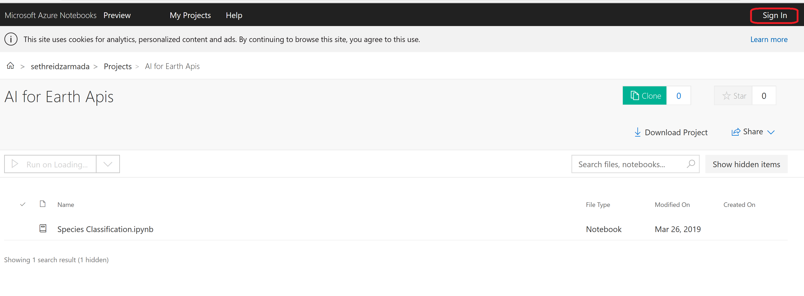
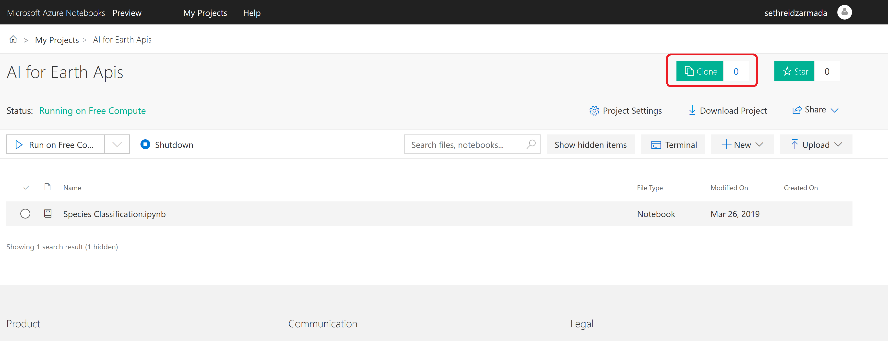
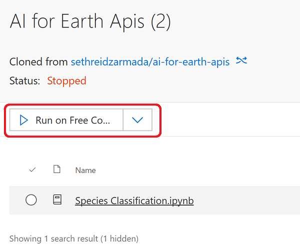
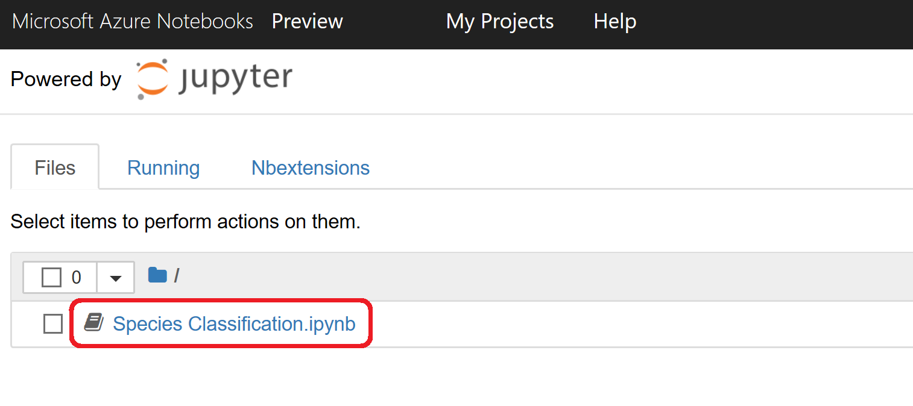

# AI for Earth

In this article, you will get an introduction to what AI for Earth is at a high level, some of the projects that are already underway, and an overview of the public AI for Earth APIs.

The world is currently facing environmental challenges so huge that the scale is almost impossible to comprehend. Climate change, biodiversity and habitat loss, pollution, population growth, and food and fresh water shortages are all speeding up, and science tells us that these problems will quickly grow worse without comprehensive mitigation. The problems are so significant that philosopher Timothy Morton has dubbed them *hyperobjects*: things that are all too real but impossible to truly comprehend.

AI is one tool that can help—both to understand these issues and to mitigate them.

While it's true that technology has contributed to many of these problems, it is increasingly clear that technology will be required to help solve them. AI for Earth is a Microsoft initiative that puts AI and cloud tools into the hands of those who are addressing these global challenges.

This article is designed to give you an introduction to AI for Earth, show you how to use the AI for Earth APIs, and inspire people—no matter who you are or what you do—to use these tools to help our planet.

## What is AI for Earth?

AI for Earth is a Microsoft initiative that helps people and organizations create AI solutions for environmental problems. AI approaches to global challenges require substantial amounts of data, computing power, specialized tools, and expertise; AI for Earth provides these with open data sets, cloud compute grants, open-source APIs, and education. This five-year, USD 50 million program supports environmental scientists working to monitor, model, and ultimately manage Earth's natural systems for a more sustainable future.

> "We have the cloud, we have Azure, and we have the services that run on there, so what AI for Earth is all about is providing that next level of services which then empower anybody to take those building blocks and contextualize them to their local problems." - **Lucas Joppa, Microsoft's Chief Environmental Officer**

Here are some of the ways AI for Earth is helping people solve and analyze environmental problems:

- [**AI for Earth Grants**](https://www.microsoft.com/ai/ai-for-earth-grants)—In the form of Azure compute credits and/or data labeling services
- [**AI for Earth APIs**](https://www.microsoft.com/ai/ai-for-earth-apis)—Dedicated APIs that cater to global needs such as land cover classification and species recognition
- [**Tools and projects**](https://github.com/search?l=&q=user%3Amicrosoft+topic%3Aaiforearth&type=Repositories)—Open-source infrastructure, models, APIs, and code examples
- [**Data**](http://lila.science/)—Open data to drive innovation, for example, the [LILA BC repository](http://lila.science/datasets) for data sets related to conservation

## AI for Earth Grants

There are four areas of focus for AI for Earth grants: agriculture, biodiversity, climate change, and water. There are two types of grants available, and applicants can apply for one or both depending on their needs. See [AI for Earth's grant process and details](https://www.microsoft.com/ai/ai-for-earth-grants). To date, Microsoft has awarded over 200 grants to projects with an impact in 57 countries.

The first grant type is for data labeling services, an important prerequisite for most AI projects. Microsoft provides the required resources, and the labeled datasets are then made publicly available, hosted on Azure.

The second grant type is for Azure compute credits. It gives recipients free use of Azure cloud services and tools such as virtual machines and machine learning services. This grant ranges from USD $5,000-$15,000. Members of the AI for Earth grantee community also have access to additional resources, including technical advice and support, online Azure training materials, and invitations to the AI for Earth Summit for networking and education opportunities.

In December 2019, Microsoft [partnered with the National Geographic Society](https://www.nationalgeographic.org/newsroom/eleven-changemakers-chosen-as-recipients-of-microsoft-and-national-geographic-ai-for-earth-innovation-grants/) to award special grants totaling over USD $1.2 million to 11 recipients, with each receiving between USD $45,000 and $200,000 to support their initiatives.

## AI for Earth APIs

Besides directly supporting initiatives through grants, Microsoft endeavors to make solutions available through public APIs where possible. So far this includes:

- **Land Cover Mapping** - This API allows for classification of pixels in aerial imagery into natural or human-made terrain types. Later in this article, we have a tutorial on consuming the Land Cover Mapping API.
- **Species Classification** - Predicts the species of animals and plants in images. This article includes a tutorial on using the Species Classification API.

## AI for Earth projects

AI for Earth already has already produced several exciting projects that are making an impact on the environment today. There is a full list of AI for Earth projects on the [AI for Earth projects page](https://www.microsoft.com/ai/ai-for-earth-projects?activetab=pivot1%3aprimaryr2), but this section will highlight a few to inspire readers by showing what AI for Earth can help achieve.

### SilviaTerra

For over seven years, [SilviaTerra](https://silviaterra.com/bark/about.html) has been improving how conservationists inventory forests. By combining expertise in forestry with Azure, satellite imagery, and machine learning, SilviaTerra allows conservationists to track and inventory forests for a fraction of the time and cost of traditional methods. With better inventories, it's much easier for conservationists to make effective decisions about where to target their efforts for maximum efficacy. AI for Earth worked with SilviaTerra to scale their work to the Azure cloud.

### Wild Me

By leveraging Azure, computer vision, deep learning, and citizen scientists, Wild Me has created a system to scan imagery and identify individual animals. This gives them information that can be used to help protect endangered species such as population counts, migratory patterns, and birth rates.

The Wild Me project has facilitated many different "Wildbook" projects, where researchers, volunteers, and citizen scientists to work together to identify and catalog different species of interest. For example, the [Wildbook for Whale Sharks](https://www.whaleshark.org/) has involved over 150 researchers and nearly 8000 citizen scientists, and as of March 2019 they have identified over 10,000 whale sharks through nearly 60,000 sightings.

AI for Earth worked with Wild Me to scale Wildbook to the Azure cloud, allowing their infrastructure to handle the ever-increasing number of species that their algorithms support.

> "Wildbook for Whale Sharks has pioneered the way for a new generation of global scale, collaborative wildlife projects that blend citizen science and computer vision to help researchers get bigger and more detailed pictures of some of the world's most mysterious species." - **Jason Holmberg, Information Architect at Wild Me**

### Land Cover Mapping

Microsoft partnered with the Chesapeake Conservancy to build a system for generating one-meter-resolution land cover data anywhere in the United States. Before this, land cover data was only available at a resolution of 30 meters, and the data was 7 years out of date. Starting with the Chesapeake Bay area, Microsoft and the Chesapeake Conservancy have used their data science and cloud computing resources to create and update a higher-resolution solution that can be used for precision conservation planning.

This project was the basis for the now-public Land CoverMapping  API that is covered in a hands-on tutorial later in this article.

Now you know what AI for Earth is. We've covered the grants, APIs, and projects taking place around this initiative. The next step is to see how you can help by working with some of these public APIs available today.

## Land Cover Mapping API Tutorial

This step serves as an introduction to the Land Cover Mapping APIs, its capabilities, and a hands-on experience using Azure Notebooks.

Understanding land use is critical to strategic conservation planning. As discussed in the introduction, Microsoft partnered with the Chesapeake Conservancy to build a system for generating one-meter-resolution land cover data anywhere in the United States. This is now a publicly available API that anyone can use to get detailed land cover data from aerial images.

## What is the AI for Earth Land Cover Mapping API?

The Land Cover API comes in two versions, which are slightly different in scope. One can take a supplied aerial image (in tiff or jpeg format at 1m resolution) and return an image file that corresponds to the land cover of the provided image. The second takes a latitude and longitude within the United States and returns the land cover data from the most recent aerial image available.

Both of the APsI return an image containing land cover classifications with corresponding colors representing the different types of land cover:

- No Data - black (0, 0 ,0)
- Water - blue (0, 0, 255)
- Trees - dark green (0, 128, 0)
- Herbaceous - light green (128, 255, 128)
- Barren/Impervious - brown (128, 96, 96)

Using this image, you can then analyze and make decisions based on the land cover predicted in the image. [Click here to see a live example of the United States land cover data](https://aka.ms/landcovermapping).

## Hands-on with an Azure Notebook

Notebooks are quickly becoming the default way for data scientists and AI engineers to share and collaborate in the cloud. We have created a hands-on demo to showcase Land Cover Mapping API.

### Prerequisites

To run the notebook, you will need to get a key for the Land Cover Mapping API by emailing [aiforearthapi@microsoft.com](mailto:aiforearthapi@microsoft.com).

### Getting Started with the notebook

> **Note:** you will need to have a Microsoft or Organizational account to complete the following steps.

1. [Open the notebook by clicking here](https://notebooks.azure.com/operations-manager/projects/ai-for-earth).
1. Click *Sign In* in the top-right corner.
    
1. Follow the prompts to sign in with your Microsoft or Organizational account.
1. Click *Clone* to clone the library.
    
1. Click *I trust the contents of this project* and click *Clone* again to clone the project.
    
1. Click *Run on Free Compute*.
    
1. Click on the *Land Cover.ipynb* notebook.

    

Once you have completed these steps, follow the instructions in the notebook to complete see the API in action.

> [!NOTE] The `pip` warnings issued when executing notebook are safe to ignore.  Not all US addresses work in the "Input target location"  If the one you entered doesn't work, try a different one.

Now you know how to use the Land Cover Mapping API. Next, you will learn how to use the other AI for Earth API, the Species Classification API.

## Species Classification API Tutorial

This step is an introduction to the capabilities of the Species Classification API and a hands-on experience using it in Azure Notebooks.

Wildlife conservation depends on accurate, up-to-date wildlife population estimates, but population surveys often depend on humans to annotate millions of images.  The [AI for Earth Species Classification API](https://www.microsoft.com/ai/ai-for-earth-apis?activetab=pivot1:primaryr4) can help automate the observation of animals and plants from citizen-science photographs by making predictions about what species are contained in an image.

### What is the Species Classification API?

Microsoft has created a public API that can take an image containing an animal or plant and identify it; the API supports over 5000 species. The API contains a single endpoint that takes an image as input and returns a predicted species and the confidence of the prediction.

You can experience the API without writing any code, using the [Species Classification API demo](https://speciesclassification.westus2.cloudapp.azure.com/).

### Hands-on with an Azure Notebook

Notebooks are quickly becoming the default way for data scientists and AI engineers to share and collaborate in the cloud. We have created a hands-on demo to showcase the Species Classification API.

### Prerequisites

To run the notebook, you will need to get a key for the Species Classification API by emailing [aiforearthapi@microsoft.com](mailto:aiforearthapi@microsoft.com).

### Getting Started with the notebook

> **Note:** you will need to have a Microsoft or Organizational account to complete the following steps.

1. [Open the notebook by clicking here](https://notebooks.azure.com/operations-manager/projects/ai-for-earth-apis).
1. Click **Sign In** on the top-right corner.
    
1. Follow the prompts to sign in with your Microsoft or Organizational account.
1. Click **Clone** to clone the library.
    
1. Click *I trust the contents of this project* and click *Clone* again to clone the project.
    
1. Click **Run on Free Compute**.
    
1. Click on the Species Classification notebook.
    

Once you have completed these steps, follow the instructions in the notebook to complete see the API in action.

> [!NOTE] The `pip` warnings issued when executing notebook are safe to ignore.

Now you know how to use the Species Classification API. Next, we'll recap what this article has covered.

## Summary

In this step, we will summarize what you have learned and give you some ideas on how you could contribute to the AI for Earth project.

Well done! By exploring these AI for Earth APIs, you've begun to learn how anyone can pitch in and use AI as a tool to measure and mitigate environmental impacts.

The environmental challenges facing the world are huge and complex, but that doesn't mean that they're insurmountable.  In fact, sustainable technology is one of the fastest-growing areas in the tech world today, and putting these tools in the hands of environmental scientists can provide critical information for both researchers and policy-makers.  With AI for Earth, Microsoft is committed to empowering people like you to make a positive difference in this area.
