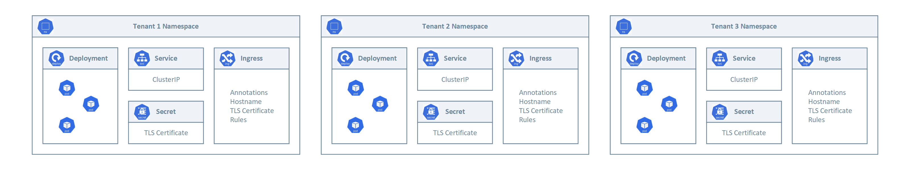

[!INCLUDE [header_file](../../../includes/sol-idea-header.md)]

This architecture shows proven practices to deploy a public or private [Azure Kubernetes Cluster (AKS) cluster](https://docs.microsoft.com/en-us/azure/aks/intro-kubernetes) with an [Azure Application Gateway](https://docs.microsoft.com/en-us/azure/application-gateway/overview) and  [Application Gateway Ingress Controller](https://docs.microsoft.com/en-us/azure/application-gateway/ingress-controller-overview) add-on.

## Architecture ##


*Download an [SVG](../media/aks-agic.svg)*

The companion ARM template deploys:

- A new virtual network with 4 subnets:
  - AksSubnet: hosts the AKS cluster
  - VmSubnet: hosts the jumpbox virtual machine and private endpoints
  - AppGatewaySubnet: hosts Application Gateway WAF2
  - AzureBastionSubnet: Azure Bastion
- The AKS cluster uses a user-defined managed identity to create additional resources like load balancers and managed disks in Azure.
- The template allows to deploy a rich set of AKS features such as:

- [AKS-managed AAD integration](https://docs.microsoft.com/en-us/azure/aks/managed-aad)
- [Azure RBAC for Kubernetes Authorization](https://docs.microsoft.com/en-us/azure/aks/manage-azure-rbac)
- [Managed identity in place of a service principal](https://docs.microsoft.com/en-us/azure/aks/use-managed-identity)
- [Azure Active Directory pod-managed identities](https://docs.microsoft.com/en-us/azure/aks/use-azure-ad-pod-identity)
- [Azure Network Policies](https://docs.microsoft.com/en-us/azure/aks/use-network-policies)
- [Azure Monitor for containers add-on](https://docs.microsoft.com/en-us/azure/azure-monitor/containers/container-insights-enable-new-cluster)
- [Application Gateway Ingress Controller add-on](https://azure.github.io/application-gateway-kubernetes-ingress/)

- The AKS cluster is composed of a:
  - System node pool hosting only critical system pods and services. The worker nodes have node taint which prevents application pods from beings scheduled on this node pool.
  - User node pool hosting user workloads and artifacts.
- An Azure Bastion resource that provides secure and seamless SSH connectivity to the jumpbox virtual machine directly in the Azure portal over SSL
- An Azure Container Registry (ACR) to build, store, and manage container images and artifacts in a private registry for all types of container deployments.
- a Storage Account for the boot diagnostic logs of the jumpbox virtual machine
- An Application Gateway used by the Application Gateway Ingress Controller
- A Web Access Firewall (WAF) Policy associated to the Application Gateway as the root level and HTTP listener level. The Policy is configured in Prevention mode and uses the OWASP 3.1 rule set and a couple of custom rules that demostrate how to block requests when the query string or a header contain a specific string. You can create more sophisticated custom rules to whitelist or blacklist the incoming traffic to the Application Gateway Ingres Controller.
- A Key Vault that can be used by workloads running on AKS to retrieve keys, certificates, and secrets
- A private endpoint to the Blob Storage Account
- A private endpoint to to Azure Container Registry (ACR)
- A private endpoint to Key Vault
- When you opt for a private AKS cluster, a private endpoint to the control plane / API server hosted by an AKS-managed Azure subscription. In this case, the cluster can communicate with the API server exposed via a Private Link Service using a private endpoint.
- When you choose Premium as SKU for ACR, a Private Endpoint is created to allow the private AKS cluster to access ACR via a private IP address. For more information, see [Connect privately to an Azure container registry using Azure Private Link](https://docs.microsoft.com/en-us/azure/container-registry/container-registry-private-link).
- A Private DNS Zone for the name resolution of the private endpoint to the Azure Blob Storage Account
- A Private DNS Zone for the name resolution of the private endpoint to Azure Container Registry (ACR)
- A Private DNS Zone for the name resolution of the private endpoint to Azure Key Vault
- When you deploy the cluster as private, a Private DNS Zone for the name resolution of the private endpoint to the Kubernetes Server API
- A Virtual Network Link between the virtual network hosting the AKS cluster and the above Private DNS Zones
- A jumpbox virtual machine to manage the AKS cluster in case you decide to deploy a private AKS cluster.
- A Log Analytics workspace to collect the diagnostics logs and metrics from:
  - Azure Kubernetes Service cluster
  - Jumpbox virtual machine
  - Azure Application Gateway
  - Azure Key Vault
  - Azure Network Security Groups

## Scenario ##

A multi-tenant Kubernetes cluster is shared by multiple users and/or workloads which are commonly referred to as "tenants". This includes clusters shared by different teams or division within a single organization, as well as Kubernetes clusters that are shared by per-customer instances of a software as a service (SaaS) application. Cluster multi-tenancy is an alternative to managing many single-tenant dedicated clusters. The operators of multi-tenant Kubernetes clusters must isolate tenants from each other to minimize the damage that a compromised or malicious tenant can do to the cluster and other tenants. When several users or teams share the same cluster with a fixed number of nodes, there is a concern that one team could use more than its fair share of resources. [Resource Quotas](https://kubernetes.io/docs/concepts/policy/resource-quotas/) are a tool for administrators to address this concern.

When you plan bulding a multi-tenant AKS cluster you should consider the layers of resource isolation provided by Kubernetes: cluster, namespace, node, pod, and container. You should also consider the security implications of sharing different types of resources among tenants. For example, scheduling pods from different tenants on the same node could reduce the number of machines needed in the cluster. On the other hand, you might need to prevent certain workloads from being colocated. For example, you might not allow untrusted code from outside of your organization to run on the same node as containers that process sensitive information.

Although Kubernetes cannot guarantee perfectly secure isolation between tenants, it does offer features that may be sufficient for specific use cases. As a best practice, you should separate each tenant and their Kubernetes resources into their own namespaces. You can then use [Kubernetes RBAC](https://kubernetes.io/docs/reference/access-authn-authz/rbac/) and [Network Policies](https://kubernetes.io/docs/concepts/services-networking/network-policies/) to enforce tenant isolation. For example, the following picture shows the typical SaaS Provider Model that hosts multiple instances of the same application on the same cluster, one for each tenant. Each application lives in a separate namespace.



Typically, every tenant initiates the deployment of a dedicated instance of the application through a SaaS provider management portal or API.
At this point, the SaaS provider runtime creates a dedicated namespace for the tenant and creates all the necessary entities (deployments, services, secrets, ingress, etc.). This process is fully transparent to the tenant that does not directly deploy the application to the shared cluster. If the application makes use of an ingress controller to expose its services, a subdomain may be created for the new tenant along with a certificate for TLS termination and an A record in the DNS server to associate the new subdomain to the public IP address used by the ingress controller. When tenants need a higher level of physical isolation and guaranteed performance, their workloads can be deployed to a dedicated set of nodes, dedicated pool, or even a dedicated cluster.

## Solution Deployment ##

This architecture includes an Azure App Service plan and an empty application, Azure SQL Database, Azure Key Vault for storing the database connection string, and Azure Monitor for logging, monitoring, and alerting.

### [Azure CLI](#tab/cli) ###

Use the following command to create a resource group for the deployment. Click the **Try it** button to use an embedded shell.

```azurecli-interactive
az group create --name aks-agic-rg --location eastus
```

Run the following command to deploy the web application and supporting infrastructure. When prompted, enter a user name and password. These values are used for accessing the Azure SQL Database instance.

```azurecli-interactive
az deployment group create --resource-group aks-agic-rg  \
    --template-uri https://raw.githubusercontent.com/azure/azure-quickstart-templates/301-aks-application-gateway-ingress-controller/master/templates/azuredeploy.json
```

### [PowerShell](#tab/powershell) ###

Use the following command to create a resource group for the deployment. Click the **Try it** button to use an embedded shell.

```azurepowershell-interactive
New-AzResourceGroup -Name aks-agic-rg -Location eastus
```

Run the following command to deploy the web application and supporting infrastructure. When prompted, enter a user name and password. These values are used for accessing the Azure SQL Database instance.

```azurepowershell-interactive
New-AzResourceGroupDeployment -ResourceGroupName aks-agic-rg `
    -TemplateUri https://raw.githubusercontent.com/azure/azure-quickstart-templates/301-aks-application-gateway-ingress-controller/master/templates/azuredeploy.json
```

### [Azure portal](#tab/portal) ###

Use the following button to deploy the reference using the Azure portal.

[](https://portal.azure.com/#create/Microsoft.Template/uri/https%3A%2F%2Fraw.githubusercontent.com%2FAzure%2Fazure-quickstart-templates%2Fmaster%2F301-aks-application-gateway-ingress-controller%2Fazuredeploy.json)

---

For detailed information and additional deployment options, see the ARM Templates used to deploy this solution.

> [!div class="nextstepaction"]
> [ARM Template](https://raw.githubusercontent.com/azure/azure-quickstart-templates/301-aks-application-gateway-ingress-controller/master/templates/azuredeploy.json)

**NOTE**: make sure to properly install the necessary AKS preview features before deploying the solution.

## Components ##

- [Azure Container Registry](/azure/container-registry/container-registry-intro) is a managed, private Docker registry service based on the open-source Docker Registry 2.0. You can use Azure container registries with your existing container development and deployment pipelines, or use Azure Container Registry Tasks to build container images in Azure. Build on demand, or fully automate builds with triggers such as source code commits and base image updates.

- [Azure Kubernetes Services](/azure/aks/) simplifies deploying a managed Kubernetes cluster in Azure by offloading the operational overhead to Azure. As a hosted Kubernetes service, Azure handles critical tasks, like health monitoring and maintenance. Since Kubernetes masters are managed by Azure, you only manage and maintain the agent nodes.

- [Azure Key Vault](/azure/key-vault/general/overview/) securely stores and controls access to secrets like API keys, passwords, certificates, and cryptographic keys. Azure Key Vault also lets you easily provision, manage, and deploy public and private Transport Layer Security/Secure Sockets Layer (TLS/SSL) certificates for use with Azure and your internal connected resources.

- [Azure Application Gateway](/azure/application-gateway/overview) Azure Application Gateway is a web traffic load balancer that enables you to manage the inbound traffic to multiple downstream web applications and REST APIs. Traditional load balancers operate at the transport layer (OSI layer 4 - TCP and UDP) and route traffic based on source IP address and port, to a destination IP address and port. The Application Gateway instead is an application layer (OSI layer 7) load balancer.

- [Web Application Firewall](/azure/application-gateway/waf-overview) or WAF is a service that provides centralized protection of web applications from common exploits and vulnerabilities. WAF is based on rules from the [OWASP (Open Web Application Security Project) core rule sets](https://owasp.org/www-project-modsecurity-core-rule-set/). WAF also provide the ability to create custom rules that are evaluated for each request that passes through the WAF. These rules hold a higher priority than the rest of the rules in the managed rule sets. The custom rules contain a rule name, rule priority, and an array of matching conditions. If these conditions are met, an action is taken (to allow or block).
  
- [Azure Bastion](/azure/bastion/bastion-overview) is a fully managed platform as a service (PaaS) that you provision inside your virtual network. Azure Bastion provides secure and seamless Remote Desktop Protocol (RDP) and secure shell (SSH) connectivity to the VMs in your virtual network directly from the Azure portal over TLS.

- [Azure Virtual Machines](https://azure.microsoft.com/services/virtual-machines/) provides on-demand, scalable computing resources that give you the flexibility of virtualization without having to buy and maintain physical hardware.
  
- [Azure Virtual Network](/azure/virtual-network/virtual-networks-overview) is the fundamental building block for Azure private networks. With Virtual Network, Azure resources like VMs can securely communicate with each other, the internet, and on-premises networks. An Azure Virtual Network is similar to a traditional network on premises, but with Azure infrastructure benefits like scalability, availability, and isolation.
  
- [Virtual Network Interfaces](/azure/virtual-network/virtual-network-network-interface) let Azure virtual machines communicate with internet, Azure, and on-premises resources. You can add several network interface cards to one Azure VM, so child VMs can have their own dedicated network interface devices and IP addresses.
  
- [Azure Managed Disks](/azure/virtual-machines/windows/managed-disks-overview) provides block-level storage volumes that Azure manages on Azure VMs. The available types of disks are Ultra disks, Premium solid-state drives (SSDs), Standard SSDs, and Standard hard disk drives (HDDs).
  
- [Azure Blob Storage](/azure/storage/blobs/storage-blobs-introduction) is Microsoft's object storage solution for the cloud. Blob storage is optimized for storing massive amounts of unstructured data. Unstructured data is data that doesn't adhere to a particular data model or definition, such as text or binary data.

- [Azure Private Link](/azure/private-link/private-link-overview) enables you to access Azure PaaS Services (for example, Azure Blob Storage and Key Vault) and Azure hosted customer-owned/partner services over a private endpoint in your virtual network.

## Alternatives ##

In this architecture, the [Application Gateway Ingress Controller](https://azure.github.io/application-gateway-kubernetes-ingress/) was installed using the [AGIC add-on for AKS](https://docs.microsoft.com/en-us/azure/application-gateway/tutorial-ingress-controller-add-on-new). You can also [install the Application Gateway Ingress Controller via a Helm chart](https://docs.microsoft.com/en-us/azure/application-gateway/ingress-controller-install-existing#multi-cluster--shared-application-gateway). For a new setup, you can deploy a new Application Gateway and a new AKS cluster with AGIC enabled as an add-on in one line in Azure CLI. The add-on is also a fully managed service, which provides added benefits such as automatic updates and increased support. Both ways of deploying AGIC (Helm and AKS add-on) are fully supported by Microsoft. Additionally, the add-on allows for better integration with AKS as a first class add-on.

The AGIC add-on is still deployed as a pod in your AKS cluster, however, there are a few differences between the Helm deployment version and the add-on version of AGIC. Below is a list of differences between the two versions:

- Helm deployment values cannot be modified on the AKS add-on:

  - `verbosityLevel` will be set to 5 by default
  - `usePrivateIp` will be set to be false by default; this can be overwritten by the use-private-ip annotation
  - `shared` is not supported on add-on
  - `reconcilePeriodSeconds` is not supported on add-on
  - `armAuth.type` is not supported on add-on

- AGIC deployed via Helm supports `ProhibitedTargets`, which means AGIC can configure the Application Gateway specifically for AKS clusters without affecting other existing backends. AGIC add-on doesn't currently support this.
- Since AGIC add-on is a managed service, it will automatically be updated to the latest version of AGIC add-on, unlike AGIC deployed through Helm where you must manually update AGIC.
- You can only deploy one AGIC add-on per AKS cluster, and each AGIC add-on currently can only target one Application Gateway. For deployments that require more than one AGIC per cluster or multiple AGICs targeting one Application Gateway, please continue to use AGIC deployed through Helm.

As documented at [Enable multiple Namespace support in an AKS cluster with Application Gateway Ingress Controller](https://docs.microsoft.com/en-us/azure/application-gateway/ingress-controller-multiple-namespace-support), a single instance of the Azure Application Gateway Kubernetes Ingress Controller (AGIC) can ingest events from and observe multiple namespaces. Should the AKS administrator decide to use App Gateway as an ingress, all namespaces will use the same instance of Application Gateway. A single installation of Ingress Controller will monitor accessible namespaces and will configure the Application Gateway it is associated with.

To enable multiple namespace support:

- modify the helm-config.yaml file in one of the following ways:

  - delete the `watchNamespace` key entirely from helm-config.yaml - AGIC will observe all namespaces
  - set `watchNamespace` to an empty string - AGIC will observe all namespaces
  - add multiple namespaces separated by a comma (`watchNamespace: default,secondNamespace`) - AGIC will observe these namespaces exclusively
- apply Helm template changes with: `helm install -f helm-config.yaml application-gateway-kubernetes-ingress/ingress-azure`

Once deployed with the ability to observe multiple namespaces, AGIC will:

- list ingress resources from all accessible namespaces
- filter to ingress resources annotated with kubernetes.io/ingress.class: azure/application-gateway
- compose combined [Application Gateway config](https://github.com/Azure/azure-sdk-for-go/blob/37f3f4162dfce955ef5225ead57216cf8c1b2c70/services/network/mgmt/2016-06-01/network/models.go#L1710-L1744)
- apply the config to the associated Application Gateway via [ARM](https://docs.microsoft.com/en-us/azure/azure-resource-manager/management/overview)

## Next Steps ##

Azure Kubernetes Service:

- [Create a private Azure Kubernetes Service cluster](https://github.com/paolosalvatori/private-aks-cluster)
- [Best practices for multi-tenancy and cluster isolation](https://docs.microsoft.com/en-us/azure/aks/operator-best-practices-cluster-isolation)
- [Best practices for basic scheduler features in Azure Kubernetes Service (AKS)](https://docs.microsoft.com/en-us/azure/aks/operator-best-practices-scheduler)
- [Best practices for advanced scheduler features](https://docs.microsoft.com/en-us/azure/aks/operator-best-practices-advanced-scheduler)
- [Best practices for authentication and authorization](https://docs.microsoft.com/en-us/azure/aks/operator-best-practices-advanced-scheduler)
- [Best practices for cluster security and upgrades in Azure Kubernetes Service (AKS)](https://docs.microsoft.com/en-us/azure/aks/operator-best-practices-cluster-security)
- [Best practices for container image management and security in Azure Kubernetes Service (AKS)](https://docs.microsoft.com/en-us/azure/aks/operator-best-practices-container-image-management)
- [Best practices for network connectivity and security in Azure Kubernetes Service (AKS)](https://docs.microsoft.com/en-us/azure/aks/operator-best-practices-network)
- [Best practices for storage and backups in Azure Kubernetes Service (AKS)](https://docs.microsoft.com/en-us/azure/aks/operator-best-practices-storage)
- [Best practices for business continuity and disaster recovery in Azure Kubernetes Service (AKS)](https://docs.microsoft.com/en-us/azure/aks/operator-best-practices-multi-region)
- [Azure Kubernetes Services (AKS) day-2 operations guide](https://docs.microsoft.com/en-us/azure/architecture/operator-guides/aks/day-2-operations-guide)

Azure Application Gateway:

- [Overview of WebSocket support in Application Gateway](https://docs.microsoft.com/en-us/azure/application-gateway/application-gateway-websocket#websocket-enabled-backend)
- [Configure end to end TLS by using Application Gateway with PowerShell](https://docs.microsoft.com/en-us/azure/application-gateway/application-gateway-end-to-end-ssl-powershell)
- [How an Application Gateway works](https://docs.microsoft.com/en-us/azure/application-gateway/how-application-gateway-works)

Azure Application Gateway Ingress Controller

- [What is Application Gateway Ingress Controller?](https://docs.microsoft.com/en-us/azure/application-gateway/ingress-controller-overview)
- [Documentation for Application Gateway Ingress Controller](https://azure.github.io/application-gateway-kubernetes-ingress/)
- [Annotations for Application Gateway Ingress Controller](https://docs.microsoft.com/en-us/azure/application-gateway/ingress-controller-annotations)
- [Certificate issuance with LetsEncrypt.org](https://azure.github.io/application-gateway-kubernetes-ingress/how-tos/lets-encrypt/)
- [Tutorial: Enable the Ingress Controller add-on (preview) for a new AKS cluster with a new Application Gateway instance](https://docs.microsoft.com/en-us/azure/application-gateway/tutorial-ingress-controller-add-on-new)
- [Tutorial: Enable Application Gateway Ingress Controller add-on for an existing AKS cluster with an existing Application Gateway through Azure CLI (Preview)](https://docs.microsoft.com/en-us/azure/application-gateway/tutorial-ingress-controller-add-on-existing)
- [Difference between Helm deployment and AKS Add-On](https://docs.microsoft.com/en-us/azure/application-gateway/ingress-controller-overview#difference-between-helm-deployment-and-aks-add-on)

Azure Application Gateway WAF

- [What is Azure Web Application Firewall on Azure Application Gateway?](https://docs.microsoft.com/en-us/azure/web-application-firewall/ag/ag-overview)
- [Web Application Firewall CRS rule groups and rules](https://docs.microsoft.com/en-us/azure/web-application-firewall/ag/application-gateway-crs-rulegroups-rules?tabs=owasp31)
- [Custom rules for Web Application Firewall v2 on Azure Application Gateway](https://docs.microsoft.com/en-us/azure/web-application-firewall/ag/custom-waf-rules-overview)
- [Quickstart: Create an Azure WAF v2 on Application Gateway using an ARM template](https://docs.microsoft.com/en-us/azure/web-application-firewall/ag/quick-create-template)
- [Microsoft.Network/ApplicationGatewayWebApplicationFirewallPolicies Resource Type](https://docs.microsoft.com/en-us/azure/templates/microsoft.network/applicationgatewaywebapplicationfirewallpolicies)
- [Create and use Web Application Firewall v2 custom rules on Application Gateway](https://docs.microsoft.com/en-us/azure/web-application-firewall/ag/create-custom-waf-rules)
- [az network application-gateway waf-policy Azure CLI commands](https://docs.microsoft.com/en-us/cli/azure/network/application-gateway/waf-policy?view=azure-cli-latest)
- [Enable Web Application Firewall using the Azure CLI](https://docs.microsoft.com/en-us/azure/web-application-firewall/ag/tutorial-restrict-web-traffic-cli)
- [Configure per-site WAF policies using Azure PowerShell](https://docs.microsoft.com/en-us/azure/web-application-firewall/ag/per-site-policies)
- [Create Web Application Firewall policies for Application Gateway](https://docs.microsoft.com/en-us/azure/web-application-firewall/ag/create-waf-policy-ag#migrate-to-waf-policy)
