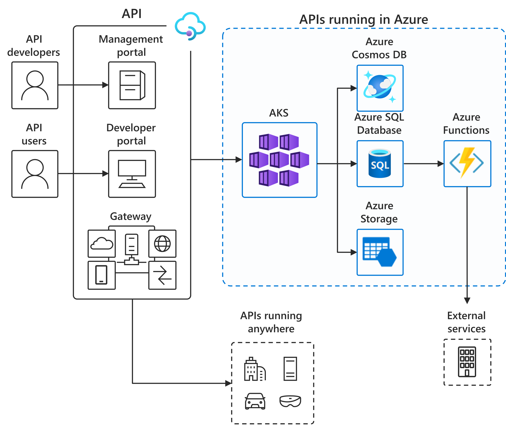

# API-first SaaS business model

## Overview

Adapt, evolve, and allow faster innovation to turn opportunities into strategic advantages.

- Create API gateway and developer portal in minutes and publish APIs easily for internal or external use
- Handle any data schema and adapt quickly to rapid changes
- Connect to back-end services anywhere and manage, secure, and optimize all APIs in one place

## Architecture

*Download an [SVG](../media/aks-api-first.svg)*

## Data Flow

The data flows through the solution as follows:

1. API is defined by API developers and published via the API Management portal
2. Application developers define the microservices and associated logic and deploy to Kubernetes
3. API users (internal and/or external) use the API developer portal to learn about the API and use them in their applications
4. Applications access APIs via the API Gateway
5. API Gateway, after ensuring the API request meets security and other policies e.g. throttling, forwards the request to service running in Kubernetes

## Components

The example scenario uses several Azure components:

- [Azure Kubernetes Service](https://azure.microsoft.com/services/kubernetes-service/): The fully managed Azure Kubernetes Service (AKS) makes deploying and managing containerized applications easy
- [Azure API Management](https://azure.microsoft.com/services/api-management/): Selectively expose data and services to the outside world and manage incoming API calls
- [Azure Cosmos DB](https://azure.microsoft.com/services/cosmos-db/): A fully managed database service with turnkey global distribution and transparent multi-primary replication.
- [Azure SQL Database](https://azure.microsoft.com/services/sql-database/): A fully managed relational database with built-in intelligence.
- [Azure Storage](https://azure.microsoft.com/services/storage/): Azure Storage offers a durable, highly available, massively scalable cloud storage solution and includes object, file, disk, queue, and table storage.
- [Azure Functions](https://azure.microsoft.com/services/functions/): An event-driven serverless compute platform that can also solve complex orchestration problems.

## Next Steps

- [What is Kubernetes?](https://azure.microsoft.com/topic/what-is-kubernetes/)
- [Learn about Kubernetes on Azure](https://azure.microsoft.com/overview/kubernetes-on-azure/)
- [Azure Kubernetes Service (AKS) documentation](/azure/aks)
- [Azure API management documentation](/azure/api-management/)
- [Azure Functions documentation](/azure/azure-functions/)
