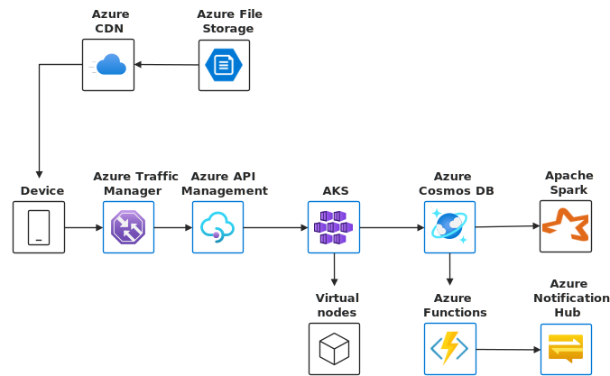

[!INCLUDE [header_file](../../../includes/sol-idea-header.md)]

This example shows how to achieve fast and reliable service quality during seasonal and other high-traffic demand periods.

## Potential use cases

This approach can be used to manage the following scenarios:

* Elastic scaling handles traffic and sales bursts without managing infrastructures.
* Low-latency data access is from anywhere in the world for fast, robust user experiences.
* High availability is achieved across multiple data centers.

## Architecture

*Download a [Visio file](https://arch-center.azureedge.net/aks-demand-spikes.vsdx) of this architecture.*

### Dataflow

The data flows through the solution as follows:

1. Azure Traffic Manager routes incoming requests to Azure API management Gateway.
2. API Gateway ensures requests meet security and other policies, and then routes them to service running in Azure Kubernetes Service.
3. Services uses Azure Cosmos DB, Azure CDN, and Azure Functions to achieve low-latency data access data as needed from anywhere in the world.
4. When demand spikes past current capacity, AKS uses virtual nodes to dynamically scale up the service.

### Components

This scenario is implemented several Azure components:

- [Azure Kubernetes Service](https://azure.microsoft.com/services/kubernetes-service): The fully managed Azure Kubernetes Service (AKS) makes deploying and managing containerized applications easy
- [Azure API Management](https://azure.microsoft.com/services/api-management): Selectively expose data and services to the outside world and manage incoming API calls
- [Azure Cosmos DB](https://azure.microsoft.com/services/cosmos-db): A fully managed database service with turnkey global distribution and transparent multi-primary replication.
- [Azure Functions](https://azure.microsoft.com/services/functions): An event-driven serverless compute platform that can also solve complex orchestration problems.
- [Azure Storage](https://azure.microsoft.com/services/storage): Azure Storage offers a durable, highly available, and massively scalable cloud storage solution and includes object, file, disk, queue, and table storage.
- [Azure Traffic Manager](https://azure.microsoft.com/services/traffic-manager/): A DNS-based traffic load balancer for distributing traffic optimally to services across global Azure regions
- [Azure CDN](https://azure.microsoft.com/services/cdn): A global CDN solution for delivering high-bandwidth content.
- [Azure Notification Hub](https://azure.microsoft.com/services/notification-hubs): Send push notifications to any platform from any back end.

## Contributors

*This article is maintained by Microsoft. It was originally written by the following contributors.* 

Principal author:

 - [Stella Lin](https://www.linkedin.com/in/fengxiaoyuelin/) | Principal Product Manager
 
*To see non-public LinkedIn profiles, sign in to LinkedIn.*

## Next steps

- [What is Kubernetes?](https://azure.microsoft.com/topic/what-is-kubernetes)
- [Learn about Kubernetes on Azure](https://azure.microsoft.com/overview/kubernetes-on-azure)
- [Azure Kubernetes Service (AKS) documentation](/azure/aks)
- [Create virtual nodes with AKS](/azure/aks/virtual-nodes-portal)
- [Azure API management documentation](/azure/api-management)
- [Azure Functions documentation](/azure/azure-functions)
- [Azure CDN documentation](/azure/cdn)
