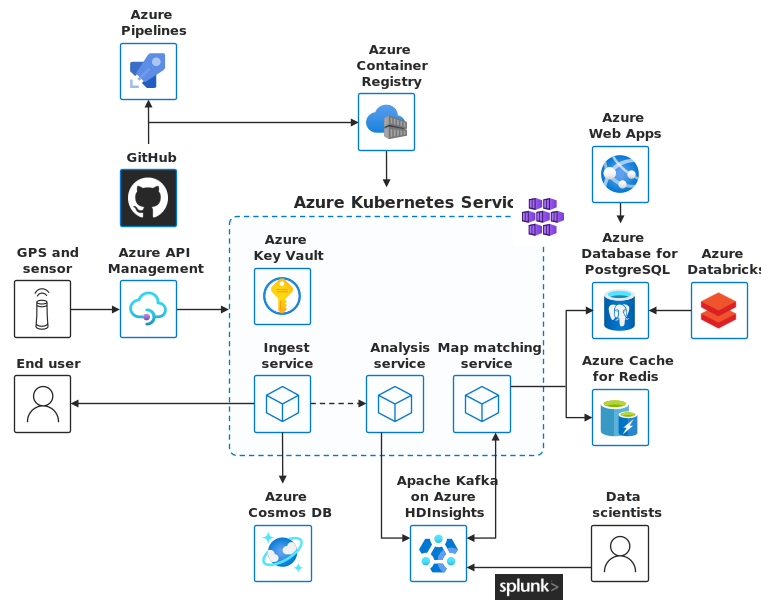

<!--cSpell:ignore HDInsights -->

[!INCLUDE [header_file](../../../includes/sol-idea-header.md)]

This solution demonstrates how to ingest and analyze high volumes of IoT data and generate real-time recommendations and insights.

## Potential use cases

This solution utilizes the following functionality:

* Real-time data ingestion and processing pipeline capable of detection and notification within seconds.
* A secure API gateway that connects to back-end services running anywhere.
* Elastic provisioning of compute capacity without the need to manage the infrastructure.

## Architecture

*Download a [Visio file](https://arch-center.azureedge.net/aks-iot-data-streaming.vsdx) of this architecture.*

### Dataflow

The data flows through the solution as follows:

1. Sensor data is generated and streamed to Azure API Management.
2. AKS cluster runs microservices that are deployed as containers behind a service mesh; containers are built using a DevOps process and stored in Azure Container Registry.
3. Ingest service stores data in an Azure Cosmos DB instance.
4. Asynchronously, the analysis service receives the data and streams it to Apache Kafka and Azure HDInsight.
5. Data scientists can analyze the big data for use in machine learning models using Splunk.
6. Data is processed by the processing service, which stores the result in Azure Database for PostgreSQL and caches the data in an Azure Cache for Redis.
7. A web app running in Azure App Service is used to visualize the results.

### Components

This example scenario uses several Azure components:

- [Azure Pipelines](https://azure.microsoft.com/services/devops/pipelines): Automate build and push images to container registry and deployment of containers to Kubernetes.
- [Azure API Management](https://azure.microsoft.com/services/api-management): Selectively expose data and services to the outside world and manage incoming API calls.
- [Azure Container Registry](https://azure.microsoft.com/services/container-registry): Build, store, secure, scan, replicate, and manage container images and artifacts.
- [Azure Kubernetes Service](https://azure.microsoft.com/services/kubernetes-service): The fully managed Azure Kubernetes Service (AKS) makes deploying and managing containerized applications easy.
- [Azure Key Vault](https://azure.microsoft.com/services/key-vault): Safeguard cryptographic keys and other secrets used by cloud apps and services.
- [Azure Cosmos DB](https://azure.microsoft.com/services/cosmos-db): A fully managed database service with turnkey global distribution and transparent multi-primary replication.
- [Azure HDInsight](https://azure.microsoft.com/services/hdinsight): A cost-effective, enterprise-grade service for open-source analytics.
- [Azure Web Apps](https://azure.microsoft.com/services/app-service/web): Build and host web apps, mobile back ends, and RESTful APIs without managing infrastructure.
- [Azure Database for PostgreSQL](https://azure.microsoft.com/services/postgresql): a fully managed relational database service based on the open-source Postgres database engine.
- [Azure Databricks](https://azure.microsoft.com/services/databricks): An Apache Spark-based analytics platform optimized for the Microsoft Azure cloud services platform.
- [Azure Cache for Redis](https://azure.microsoft.com/services/cache): A fully managed, open source–compatible in-memory data store to power fast, scalable applications.

## Contributors

*This article is maintained by Microsoft. It was originally written by the following contributors.* 

Principal author:

 - [Stella Lin](https://www.linkedin.com/in/fengxiaoyuelin/) | Principal Product Manager
 
*To see non-public LinkedIn profiles, sign in to LinkedIn.*

## Next steps

- [What is Kubernetes?](https://azure.microsoft.com/topic/what-is-kubernetes)
- [Learn about Kubernetes on Azure](https://azure.microsoft.com/overview/kubernetes-on-azure)
- [Azure Kubernetes Service (AKS) documentation](/azure/aks)
- [Container Registry documentation](/azure/container-registry)
- [Azure API management documentation](/azure/api-management)
- [HDInsight documentation](/azure/hdinsight)
