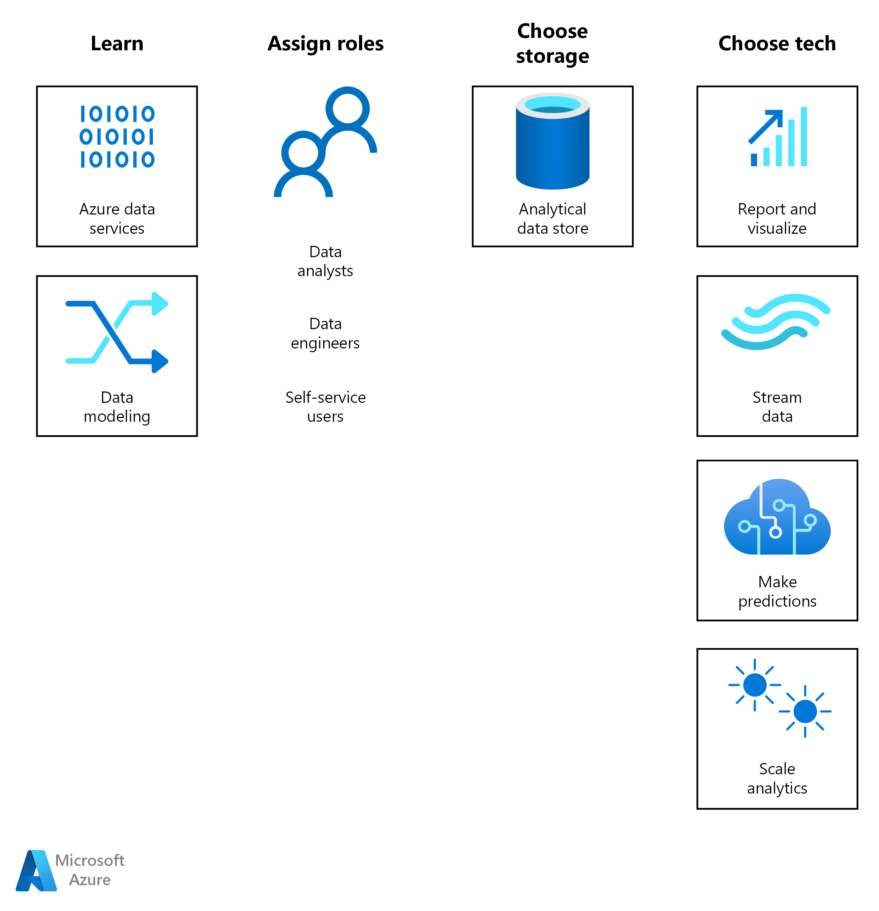

With the exponential growth in data, organizations rely on the limitless
compute, storage, and analytical power of Azure to scale, stream, predict, and
see their data. Analytics solutions turn volumes of data into useful business
intelligence (BI), such as reports and visualizations, and inventive artificial
intelligence (AI), such as forecasts based on machine learning.

Whether your organization is just starting to evaluate cloud-based analytics
tools or is looking to expand your current implementation, Azure provides many
options. The workflow starts with learning about common approaches and aligning
processes and roles around a cloud mindset.

Data can be processed in batches or in real-time, on-premises or in the cloud,
but the goal of any analytics solution is to make use of data at scale.
Increasingly, organizations want to create a single source of truth for all the
relational and nonrelational data being generated by people, machines, and the
Internet of Things (IoT). It’s common to use a [big data
architecture](/azure/architecture/guide/architecture-styles/big-data)
or an [IoT
architecture](/azure/architecture/guide/architecture-styles/big-data#iot-architecture)
to transform raw data into a structured form, then move it to an analytical data
store. This store becomes the single source of truth that can power a multitude
of insightful analytics solutions.

## Learn about analytics on Azure

If you're new to analytics on Azure, the best place to learn more is with
[Microsoft Learn](https://aka.ms/learn), a free, online training platform.
You’ll find videos, tutorials, and hands-on learning for specific products and
services, plus learning paths based on your job role, such as developer or data
analyst.

-   [Browse Azure data
    topics](/learn/browse/?products=azure&filter-products=data&terms=data)

-   [Explore Azure database and analytics
    services](/learn/modules/azure-database-fundamentals/)

## Organizational readiness 

If your organization is new to the cloud, the [Cloud Adoption
Framework](/azure/cloud-adoption-framework/) can
help you get started. This collection of documentation and best practices offers
proven guidance from Microsoft designed to accelerate your cloud adoption
journey. It also lists [innovation tools to democratize data in
Azure](/azure/cloud-adoption-framework/innovate/best-practices/data).

To help assure the quality of your analytics solution on Azure, we recommend
following the [Azure Well-Architected
Framework](/azure/architecture/framework/). It
provides prescriptive guidance for organizations seeking architectural
excellence and discusses how to design, provision, and monitor cost-optimized
Azure solutions.

## Path to production

Knowing how to [store your
data](/azure/architecture/data-guide/technology-choices/analytical-data-stores)
is one of the first decisions you need to make in your journey to analytics on
Azure. Then you can choose the best [data analytics
technology](/azure/architecture/data-guide/technology-choices/analysis-visualizations-reporting)
for your scenario.

To get started, consider the following example implementations:

-   [Analytics end-to-end with Azure
    Synapse](/azure/architecture/example-scenario/dataplate2e/data-platform-end-to-end)

-   [Automated enterprise
    BI](/azure/architecture/reference-architectures/data/enterprise-bi-adf)

-   [Data warehousing and
    analytics](/azure/architecture/example-scenario/data/data-warehouse)

-   [Geospatial data processing and
    analytics](/azure/architecture/example-scenario/data/geospatial-data-processing-analytics-azure)

-   [Stream processing with Azure
    Databricks](/azure/architecture/reference-architectures/data/stream-processing-databricks)

-   [Stream processing with Azure Stream
    Analytics](/azure/architecture/reference-architectures/data/stream-processing-stream-analytics)

## Best practices

High-quality analytics start with robust, trustworthy data. At the highest
level, [information
security](/azure/architecture/framework/security/overview)
practices help ensure that your data is protected in transit and at rest. Access
to that data must also be trusted. Trustworthy data implies a design that
implements:

-   [Governance
    policies](/azure/architecture/framework/security/design-governance).

-   [Identity and access
    management](/azure/architecture/framework/security/design-identity).

-   [Network security
    controls](/azure/architecture/framework/security/design-network).

-   [Data
    protection](/azure/architecture/framework/security/design-storage).

At the platform level, the following [big data best
practices](/azure/architecture/guide/architecture-styles/big-data#best-practices)
contribute to trustworthy analytics on Azure:

-   Orchestrate data ingestion using a data workflow or pipeline solution such
    as those supported by Azure Data Factory or Oozie.

-   Process data in place using a distributed data store, a big data approach
    that supports larger volumes of data and a greater variety of formats.

-   Scrub sensitive data early as part of the ingestion workflow to avoid
    storing it in your data lake.

-   Consider the total cost of the required Azure resources by balancing the
    per-unit cost of the compute nodes needed to the per-minute cost of using
    those nodes to complete a job.

-   Create a data lake that combines storage for files in multiple formats,
    whether structured, semi-structured, or unstructured. At Microsoft, we use
    Azure Data Lake Storage Gen2 as our single source of truth. For example, see
    [BI solution architecture in the Center of
    Excellence](/power-bi/guidance/center-of-excellence-business-intelligence-solution-architecture).

## Additional resources

Analytics is a broad category and covers a range of solutions. The following
resources can help you discover more about Azure.

### Hybrid

The vast majority of organizations need a hybrid approach to analytics because
their data is hosted both on-premises and in the cloud. Organizations often
[extend on-premises data solutions to the
cloud](/azure/architecture/data-guide/scenarios/hybrid-on-premises-and-cloud).
To connect environments, organizations must [choose a hybrid network
architecture](/azure/architecture/reference-architectures/hybrid-networking/).

A hybrid approach might include mainframe and midrange systems as a data source
for Azure solutions. For example, your organization may want to [modernize
mainframe and midrange
data](/azure/architecture/reference-architectures/migration/modernize-mainframe-data-to-azure)
or provide [mainframe access to Azure
databases](/azure/architecture/solution-ideas/articles/mainframe-access-azure-databases).

### Example solutions

Here are a few sample implementations of analytics on Azure to consider:

-   [Big data analytics with Azure Data
    Explorer](/azure/architecture/solution-ideas/articles/big-data-azure-data-explorer)

-   [IoT analytics with Azure Data
    Explorer](/azure/architecture/solution-ideas/articles/iot-azure-data-explorer)

-   [Real time analytics on big data
    architecture](/azure/architecture/solution-ideas/articles/real-time-analytics)

-   [Modern analytics architecture with Azure
    Databricks](/azure/architecture/solution-ideas/articles/azure-databricks-modern-analytics-architecture)

-   [Big data analytics with enterprise-grade security using Azure
    Synapse](/azure/architecture/solution-ideas/articles/big-data-analytics-enterprise-grade-security)

-   [Browse more analytics examples in the Azure Architecture
    Center](/azure/architecture/browse/?azure_categories=analytics)

## AWS or GCP professionals

These articles can help you ramp up quickly by comparing Azure analytics options
to other cloud services:

-   [Analytics and big
    data](/azure/architecture/aws-professional/databases#analytics-and-big-data)
    in [Database technologies on Azure and
    AWS](/azure/architecture/aws-professional/databases)

-   [Big data and
    analytics](/azure/architecture/gcp-professional/services#big-data-and-analytics)
    in [GCP to Azure services
    comparison](/azure/architecture/gcp-professional/services)
