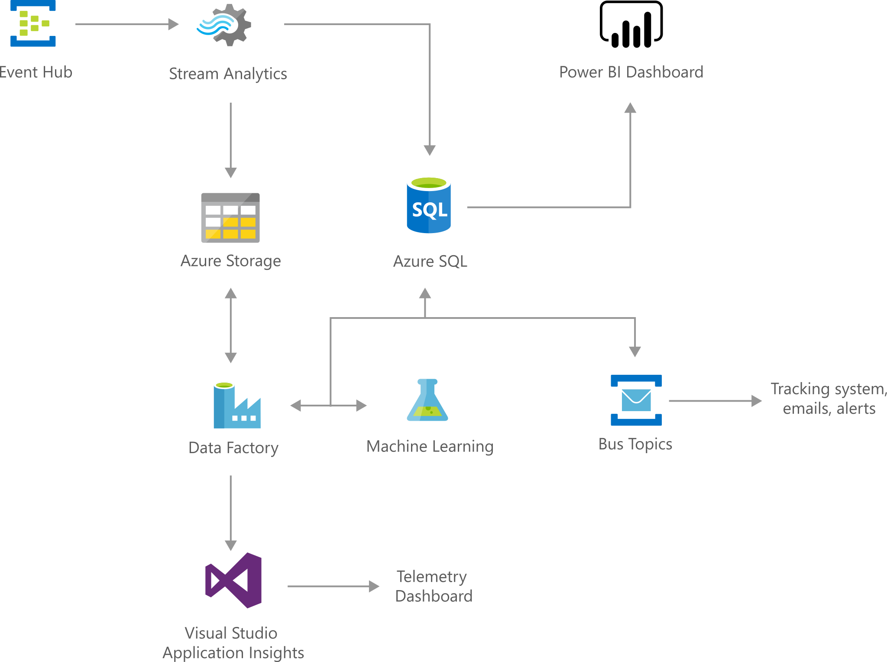

<!-- cSpell:ignore Empired -->

# Anomaly Detection in Real-time Data Streams

[!INCLUDE [header_file](../../../includes/sol-idea-header.md)]

Cortana Intelligence IT Anomaly Insights solution helps IT departments within large organizations quickly detect and fix issues based on underlying health metrics from IT infrastructure (CPU, Memory, etc.), services (Timeouts, SLA variations, Brownouts, etc.), and other key performance indicators (KPIs) (Order backlog, Login and Payment failures, etc.) in an automated and scalable manner. This solution also offers an easy to 'Try it Now' experience that can be tried with customized data to realize the value offered by the solution. The 'Deploy' experience allows you to quickly get started with the solution on Azure by deploying the end to end solution components into your Azure subscription and providing full control for customization as needed.

## Architecture

*Download an [SVG](../media/anomaly-detection-in-real-time-data-streams.svg) of this architecture.*

## Description

Connect with one of our Advanced Analytics partners to arrange a proof of concept in your environment: [Neal Analytics](https://www.microsoftevents.com/profile/form/index.cfm?PKformID=0x68956827e3), [Empired](https://www.microsoftevents.com/profile/form/index.cfm?PKformID=0x719759ea7f)

Today, modern services generate large volumes of telemetry data to track various aspects of operational health, system performance, usage insights, business metrics, alerting, and many others. However, monitoring and gathering insights from this large volume of data for IT departments is often not fully automated and error prone (generally using rules or threshold-based alerts), making it hard to effectively and accurately determine the health of the system at any given point in time.

Cortana Intelligence IT Anomaly Insights solves this customer pain by providing a solution with a low barrier of entry that is based on Cortana Intelligence Solutions (for easy deployment of Azure services) and Azure Machine Learning [Anomaly Detection API](https://gallery.cortanaintelligence.com/MachineLearningAPI/Anomaly-Detection-2) (for fully automated tracking of historical and real-time data), making it easy for a business decision maker to evaluate and realize value within minutes, also allowing customers to bring their own data, customize and extend the solution in order to adapt it to their particular scenarios via quick proof of concepts. With this solution, organizations will be able to:

* Use state-of-the-art Azure Machine Learning Anomaly Detection API to learn and react to anomalies from both historical and real-time data. This approach eliminates human-in-the-loop, otherwise needed for recalibrating thresholds for detect missing anomalies and minimize false positives.
* Quickly realize the potential of the solution by trying it out with their own data without any upfront investment. The 'Try it Now' experience also provides users the ability to determine the right set of sensitivity parameters for the use case in hand.
* Deploy an end-to-end pipeline into their subscription to ingest data from on-premises and cloud data sources and report anomalous events to downstream monitoring and ticketing systems in a plug-and-play manner within a matter of minutes.

## Try It experience with Power BI

## Solution Diagram

See solution architecture and detailed instructions on [GitHub](https://github.com/Azure/itanomalyinsights-cortana-intelligence-preconfigured-solution).

As described in the solution diagram below, real-time metric streams originating from both on-premises based or cloud based systems can be pumped into Azure Event Hub queue. These events (or time series data points) are processed by Azure Stream Analytics where they are aggregated at five-minute intervals. Each time series is sent to Azure Anomaly Detection API for evaluation at a 15-minute cadence. The results from the API along with their dimensions provided during input are then stored in Azure SQL DB. The detected anomalies are also published in Azure Service Bus so that they can be consumed by the downstream ticketing systems. The solution also provides directions to setup Power BI dashboard is also provided so that the anomalies can be visualized quickly for root cause analysis.

## Anomaly Detection API

The [Anomaly Detection API](https://gallery.cortanaintelligence.com/MachineLearningAPI/Anomaly-Detection-2) is used in the 'Try It Now' experience and the deployed solution. It helps detect different types of anomalous patterns in your time series data. It assigns an anomaly score to each data point in the time series, which can be used for generating alerts, monitoring through dashboards or connecting with your ticketing systems. The anomaly detection API can detect the following types of anomalies on time series data:

* Spikes and Dips: For example, when monitoring the number of login failures to a service or number of checkouts in an e-commerce site, unusual spikes or dips could indicate security attacks or service disruptions.
* Positive and negative trends: When monitoring memory usage in computing, for instance, shrinking free memory size is indicative of a potential memory leak; when monitoring service queue length, a persistent upward trend may indicate an underlying software issue.
* Level changes and changes in dynamic range of values: For example, level changes in latencies of a service after a service upgrade or lower levels of exceptions after upgrade can be interesting to monitor.
