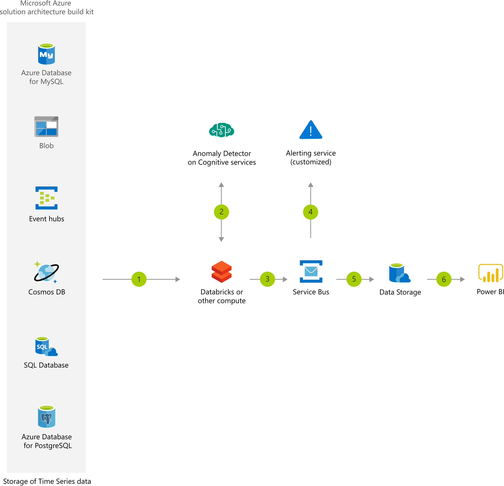

[!INCLUDE [header_file](../../../includes/sol-idea-header.md)]

## Architecture

*Download an [SVG](../media/anomaly-detector-process.svg) of this architecture.*

## Data Flow

1. Ingests data from the various stores that contain raw data to be monitored by Anomaly Detector.
2. Aggregates, samples, and computes the raw data to generate the time series, or calls the Anomaly Detector API directly if the time series are already prepared and gets a response with the detection results.
3. Queues the anomaly related meta data.
4. Based on the anomaly related meta data, serverless app pick the message from message queue and send the alert about the anomaly.
5. Stores the anomaly detection meta data.
6. Visualizes the results of the time series anomaly detection.

## Components

* [Service Bus](https://azure.microsoft.com/services/service-bus): Reliable cloud messaging as a service (MaaS) and simple hybrid integration
* [Azure Databricks](https://azure.microsoft.com/services/databricks): Fast, easy, and collaborative Apache Spark–based analytics service
* [Power BI](https://powerbi.microsoft.com): Interactive data visualization BI tools
* [Storage Accounts](https://azure.microsoft.com/services/storage): Durable, highly available, and massively scalable cloud storage
* [Cognitive Services](/azure/cognitive-services): cloud-based services with REST APIs and client library SDKs available to help you build cognitive intelligence into your applications
* [Logic Apps][logic-apps]: Serverless platform for building enterprise workflows that integrate applications, data, and services. In this architecture, the logic apps are triggered by HTTP requests.

## Alternatives

* [Event Hubs with Kafka][event-hubs]: An alternative to running your own Kafka cluster. This Event Hubs feature provides an endpoint that is compatible with Kafka APIs.
* [Azure Synapse Analytics][synapse-analytics]: Analytics service that brings together enterprise data warehousing and Big Data analytics
* [Azure Machine Learning](/azure/machine-learning/): lets you build, train, deploy, and manage custom machine learning / anomaly detection models in a cloud-based environment.

## Considerations

### Scalability

The majority of the components used in this example scenario are managed services that will automatically scale.

For general guidance on designing scalable solutions, see the [performance efficiency checklist][scalability] in the Azure Architecture Center.

### Security

[Managed identities for Azure resources][msi] are used to provide access to other resources internal to your account and then assigned to your Azure Functions. Only allow access to the requisite resources in those identities to ensure that nothing extra is exposed to your functions (and potentially to your customers).

For general guidance on designing secure solutions, see the [Azure Security Documentation][security].

### Resiliency

All of the components in this scenario are managed, so at a regional level they are all resilient automatically.

For general guidance on designing resilient solutions, see [Designing resilient applications for Azure][resiliency].

## Pricing

To explore the cost of running this scenario, see prefiled calculator with all of the services. To see how the pricing would change for your particular use case, change the appropriate variables to match your expected traffic / data volumes.

We have provided three sample cost profiles based on amount of traffic (we assume all images are 100 kb in size):

- [Example calculator][example-pricing]: this pricing example is calculator with all services in this architecture, except Power BI and custom alerting solution.

## Next steps

* [Identify anomalies by routing data via IoT Hub to a built-in ML model in Azure Stream Analytics](/learn/modules/data-anomaly-detection-using-azure-iot-hub/)
* [Recipe: Predictive maintenance with the Cognitive Services for Big Data](azure/cognitive-services/big-data/recipes/anomaly-detection)
* [Service Bus Documentation](/azure/service-bus)
* [Azure Databricks Documentation](/azure/azure-databricks)
* [Power BI Documentation](/power-bi)
* [Storage Documentation](/azure/storage)

<!-- Links -->
[Event Grid]: https://azure.microsoft.com/services/event-grid/
[synapse-analytics]: /azure/sql-data-warehouse/
[event-hubs]: /azure/event-hubs/event-hubs-for-kafka-ecosystem-overview
[architecture]: ./media/architecture-intelligent-apps-image-processing.png
[example-pricing]: https://azure.com/e/48cc24e76c914ecf8fafec1fed0e0e14
[serverless]: https://docs.microsoft.com/en-us/learn/paths/create-serverless-applications/
[cv-categories]: /azure/cognitive-services/computer-vision/category-taxonomy
[resiliency]: ../../framework/resiliency/overview.md
[security]: /azure/security
[scalability]: ../../framework/scalability/performance-efficiency.md
[functions-best-practices]: /azure/azure-functions/functions-best-practices
[msi]: /azure/app-service/app-service-managed-service-identity
[logic-apps]: /azure/logic-apps/logic-apps-overview
[logic-apps-connectors]: /azure/connectors/apis-list