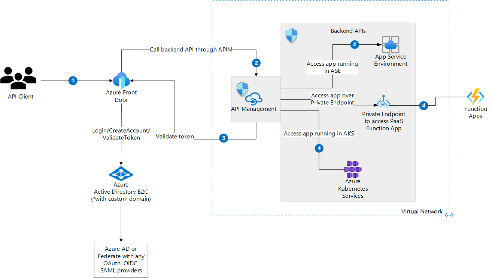

[!INCLUDE [header_file](../../../includes/sol-idea-header.md)]

As client applications and end users interact with backend APIs there is a greater need to protect these backend APIs against malicious users, or against users without the appropriate permissions to access specific APIs. Azure API Management Gateway (APIM) sits between the clients and backend APIs, and acts as a layer of protection for the backend APIs. It provides features such as token validation, claims based authorization, SSL certificate validation, IP restrictions, throttling, rate limiting, request/response validation and many others. Clients can authenticate using any Identity Provider (Microsoft or third party) and use the [validate-jwt](https://docs.microsoft.com/en-us/azure/api-management/api-management-access-restriction-policies#ValidateJWT) policy within API Management to validate the ID token before accessing the backend APIs. The validate-jwt policy uses the OpenID Configuration metadata from the discovery endpoint (/.well-known/) published by the OpenID server.

This article talks about a solution to protect backend APIs using Azure API Management, Azure Active Directory B2C (Azure AD B2C), and Azure Front Door. Although Azure AD B2C is used here, any other Identity Provider that supports OpenID Connect can be used as well. In cases where authentication is managed through other Identity protocols such as SAML, Azure AD B2C can be used to setup Federation with SAML 2.0 Identity Providers. Although this article shows backend APIs as running in App Service Environment, Azure Kubernetes Services and Function Apps, APIs running On-Premises and Hybrid Cloud environments can be integrated with API Management as well as long as network connectivity is established between API Management and the respective backend APIs.

## Potential use cases

- Prevent unauthenticated, unauthorized users from accessing backend APIs
- Use Azure AD B2C for Federated Authentication with any OpenID Connect and SAML providers including 3rd parties such as Ping Identity, CA Siteminder etc
- Prevent unintended load on APIs by making use of API Management features such as Throttling, Rate-Limiting, Ip-Filtering
- Implement end user authentication using Azure Active Directory B2C

## Architecture

Download an [SVG](../media/api-protection-apim-b2c.svg) of this architecture.

### Workflow

1. End User (API Client) authenticates into an application by providing their credentials such as username and password. The user identity in this case is expected to be either in Azure AD B2C or in a third party Identity Provider.
    1. The authentication request goes to Azure AD B2C via Azure Front Door where Azure AD B2C is configured with a custom domain for sign-in. Azure AD B2C authenticates the user and returns a bearer token (JWT) back to the user.
    2. Optionally, if the user credentials are stored in a third party Identity Provider, Azure AD B2C federates with the respective downstream Identity Provider and returns a bearer token back to the user.
2. User triggers an event that accesses a backend API. This event could be a click of a button on a web application, mobile device, or a direct call to the backend API's endpoint.
3. Request goes through Azure Front Door whose backend is mapped to the public endpoint of Azure API Management. Azure API Management intercepts the request, and validates the bearer token against Azure Active Directory B2C. This can be implemented on Azure API Management using the the OpenID Configuration metadata endpoint (./well-known) that's configured as part of it's validate-jwt policy.
4. If the token is valid, Azure API Management forwards the request to the appropriate backend API. Otherwise, the request is rejected with a 401 response code.

### Components

- [Azure Virtual Network](https://azure.microsoft.com/services/virtual-network/) enables many types of Azure resources, such as Azure Virtual Machines (VMs), to securely communicate with each other, the internet, and on-premises networks.

- [Azure Front Door](https://azure.microsoft.com/en-us/services/frontdoor/) is an application delivery network that provides global load balancing and site acceleration service for web applications. It offers Layer 7 capabilities for your application like SSL offload, path-based routing, fast failover, caching, etc. to improve performance and high-availability of your applications.

- [Azure Application Gateway](https://azure.microsoft.com/services/application-gateway/) is a web traffic load balancer that manages traffic to web applications. Load balancers operate at the transport layer, OSI layer 4 TCP and UDP, and route traffic based on source IP address and port to a destination IP address and port.

- [Azure API Management](https://azure.microsoft.com/services/api-management/) is a hybrid, multi-cloud management platform for APIs across all environments. API Management creates consistent, modern API gateways for existing backend services.

- [Azure Active Directory B2C (Azure AD B2C)](https://azure.microsoft.com/en-us/services/active-directory/external-identities/b2c/) provides Identity as a Service for Business to Customer Scenarios. In this scenario, Azure AD B2C is the Identity store for end user identity and returns the bearer token (JWT) on successful authentication. API Management validates the token using Azure AD B2C's OpenID Configuration Metadata endpoint.

- [Azure App Service Environment](https://docs.microsoft.com/en-us/azure/app-service/environment/) enables hosting of applications in a fully isolated and dedicated environment for securely running App Service apps at high scale.

- [Azure Kubernetes Service](https://azure.microsoft.com/en-us/services/kubernetes-service/#features) is a Microsoft managed Kubernetes Environment that helps run containerized applications.

- [Azure Functions](https://azure.microsoft.com/en-us/services/functions/) is a serverless environment that provides all the continually updated infrastructure and resources needed to run your applications.

## Next steps

* [Protect APIs with Application Gateway and API Management](/azure/architecture/reference-architectures/apis/protect-apis)
* [Enable custom domains for Azure Active Directory B2C](/azure/active-directory-b2c/custom-domain?pivots=b2c-custom-policy)
* [Protect backend APIs using Azure AD B2C and API Management](https://docs.microsoft.com/en-us/azure/api-management/howto-protect-backend-frontend-azure-ad-b2c)

## Related resources
* [Configure a SAML App in Azure AD B2C](https://docs.microsoft.com/en-us/azure/active-directory-b2c/saml-service-provider?tabs=windows&pivots=b2c-user-flow)
* [Azure AD B2C Samples](https://github.com/azure-ad-b2c/samples)
* [Azure AD b2C Developer Best Practices](https://docs.microsoft.com/en-us/azure/active-directory/fundamentals/resilience-b2c-developer-best-practices?bc=/azure/active-directory-b2c/bread/toc.json&toc=/azure/active-directory-b2c/TOC.json)

Related architecture guides:

* [API Ops](/azure/architecture/example-scenario/devops/automated-api-deployments-apiops)
* [Protect APIs with Application Gateway and API Management](/azure/architecture/reference-architectures/apis/protect-apis)

