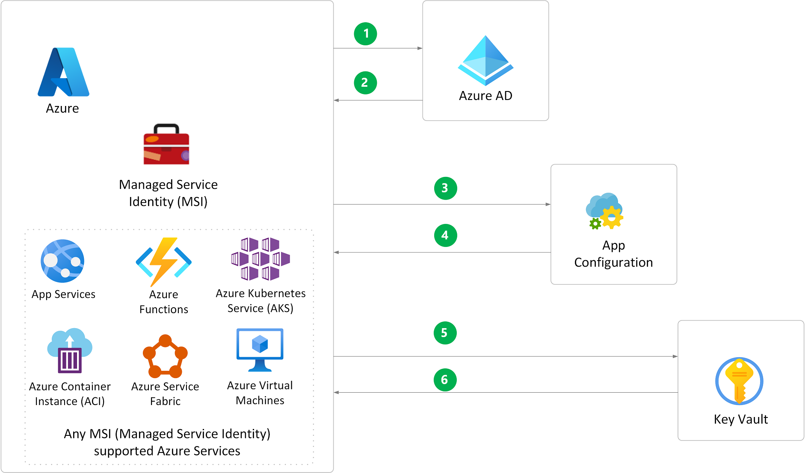

[!INCLUDE [header_file](../../../includes/sol-idea-header.md)]

Cloud-based applications often run on multiple virtual machines or containers in multiple regions, and use multiple external services. Creating a robust and scalable application in a distributed environment presents a significant challenge. [Azure App Configuration](/azure/azure-app-configuration/overview) lets you manage and store all your app's configuration settings and feature flags, and secure access settings, in one place.

App Configuration works seamlessly with [Azure Key Vault](https://azure.microsoft.com/services/key-vault/), which stores passwords, keys, and secrets for secure access. This article presents best practices for using App Configuration and Key Vault in development and Azure environments.

## Potential use cases

While any application can use Azure App Configuration, the following types of applications benefit most from it:

- Microservices based on Azure Kubernetes Service, Azure Service Fabric, or other containerized apps deployed in one or more geographies
- Serverless apps, which include Azure Functions or other event-driven stateless compute apps
- Apps that use a continuous deployment (CD) pipeline

## Architecture

The following diagrams show how Azure App Configuration and Azure Key Vault can work together to manage and secure apps in **Development** and **Azure** environments.

### Development environment

In the development environment, the app uses an identity via Visual Studio or Azure CLI 2.0 to sign in and send an authentication request to Azure Active Directory (Azure AD).

### Azure staging or production environment

The Azure staging and production environments use an [Azure Managed Service Identity (MSI)](/azure/active-directory/managed-identities-azure-resources/overview) for sign-in and authentication.

[Download a Visio file](https://arch-center.azureedge.net/AppConfig_Development.vsdx) of this architecture.

### Data flow

1. The application sends an authentication request during debugging in Visual Studio, or authenticates via the MSI in Azure.
1. Upon successful authentication, Azure AD returns an access token.
1. The App Configuration SDK sends a request with the access token to read the app's App Configuration KeyVault **secretURI** value for the app's key vault.
1. Upon successful authorization, App Configuration sends the configuration value.
1. Using the sign-in identity, the app sends a request to Azure Key Vault to retrieve the application secret for the **secretURI** that App Configuration sent.
1. Upon successful authorization, Key Vault returns the secret value.

### Considerations

- It's best to use a different key vault for each application in each environment: development, Azure pre-production, and Azure production. Using different vaults helps prevent sharing secrets across environments, and reduces the threat in case of a breach.

- To use these scenarios, the sign-in identity must have the **App Configuration Data Reader** role in the App Configuration resource, and have explicit **access policies** for retrieving the secrets in Azure Key Vault.

### Components

- [Azure Active Directory](https://azure.microsoft.com/services/active-directory): A universal platform to manage and secure identities.
- [Azure App Configuration](https://azure.microsoft.com/services/app-configuration): Store configurations for all your Azure apps in a universal, hosted location.
- [Azure Managed Service Identity](/azure/active-directory/managed-identities-azure-resources): Managed identities provide an identity for applications to use when connecting to resources that support Azure Active Directory (Azure AD) authentication.
- [Azure Key Vault](https://azure.microsoft.com/services/key-vault): Safeguard cryptographic keys and other secrets that are used by cloud apps and services.

## Next steps

Learn more about the component technologies:

- [Azure App Configuration](/azure/azure-app-configuration)
- [Azure Key Vault](/azure/key-vault/general/basic-concepts)
- [Use Key Vault references for App Service and Azure Functions](/azure/app-service/app-service-key-vault-references)
- [App Configuration and Managed Service Identity](/azure/azure-app-configuration/howto-integrate-azure-managed-service-identity?tabs=core2x)
- [Local development and security](/aspnet/core/security/app-secrets?tabs=windows&view=aspnetcore-3.1)
