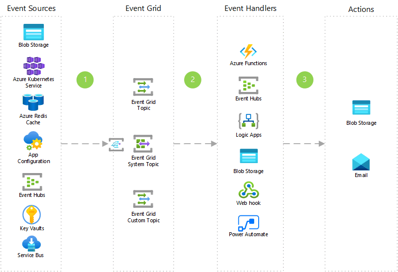

[!INCLUDE [header_file](../../../includes/sol-idea-header.md)]

Event Grid connects your app with other services. For example, create an application topic to send your app's event data to Event Grid and take advantage of its reliable delivery, advanced routing, and direct integration with Azure. Alternatively, you can use Event Grid with Logic Apps to process data anywhere, without writing code.

## Potential use cases

Organizations can use Event Grid to assist with:

* Serverless application architectures in the cloud.
* Ops automation.
* Application integration.

## Architecture

*Download an [SVG](../media/application-integration-using-event-grid.svg) of this architecture.*

### Dataflow

1. Configure different event sources (Blob Storage, Azure Cache for Redis, App Configuration, Event Hubs, Key Vault, Service Bus) to subscribe to an event grid topic.
1. Triggers event sources from various scenarios, including different actions performed on the event sources.
1. Use Event Grid to support the events coming from different Azure services.
1. Leverages different event handlers (Azure Functions, Event Hubs, Logic Apps, Blob Storage, Web Hook, Power Automate) to handle different use cases.
1. Use different types of actions to handle the result of the event handlers, like Blob Storage and email for alerts.

### Components

* [Azure Event Grid](https://azure.microsoft.com/services/event-grid): Get reliable event delivery at massive scale.
* [Azure Blob Storage](https://azure.microsoft.com/services/storage/blobs): A massively scalable object storage for any type of unstructured data, including images, videos, audio, documents, and more. It's easy and cost effective.
* [Azure Cache for Redis](https://azure.microsoft.com/services/cache): A fully managed, open source–compatible, in-memory data store to power fast, scalable applications.
* [Azure App Configuration](https://azure.microsoft.com/services/app-configuration): Store configurations for all your Azure apps in a universal, hosted location.
* [Azure Event Hubs](https://azure.microsoft.com/services/event-hubs): Stream millions of events per second from any source to build dynamic data pipelines and immediately respond to business challenges.
* [Azure Key Vault](https://azure.microsoft.com/services/key-vault): Safeguard cryptographic keys and other secrets that are used by cloud apps and services.
* [Azure Functions](https://azure.microsoft.com/services/functions): An event-driven, serverless compute platform that can also solve complex orchestration problems.
* [Azure Logic Apps](https://azure.microsoft.com/services/service-bus): Quickly build powerful integration solutions.
* [Web Hook](/azure/event-grid/handler-webhooks): Event handling.
* [Power Automate](https://flow.microsoft.com): Easily create automated workflows.
* [Email](/azure/connectors/connectors-create-api-office365-outlook): Create automated task and workflows with Azure Logic Apps and O365 Outlook Connector to send an email.

## Pricing

* [Customize and get pricing estimates](https://azure.com/e/e146fd5535974f1dae5e32a06efb424d)

## Next steps

* [Azure Event Grid documentation](/azure/event-grid)
* [Azure Blob Storage documentation](/azure/storage/blobs)
* [Azure Cache for Redis documentation](/azure/azure-cache-for-redis)
* [Azure App Configuration documentation](/azure/azure-app-configuration)
* [Azure Event Hubs documentation](/azure/event-hubs)
* [Azure Key Vault documentation](/azure/key-vault)
* [Azure Functions documentation](/azure/azure-functions)
* [Azure Logic Apps documentation](/azure/logic-apps)
* [Power Automate documentation](/power-automate)
