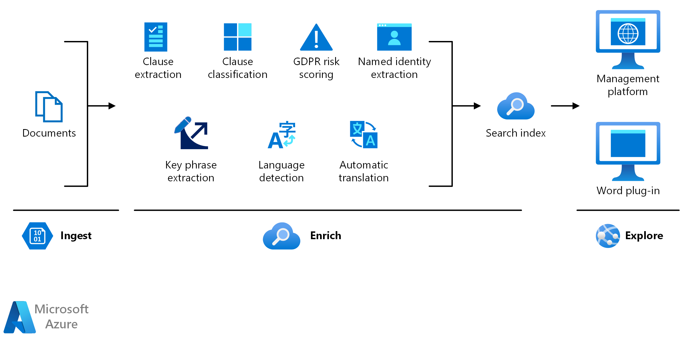

<!-- cSpell:ignore pracjain -->

[!INCLUDE [header_file](../../../includes/sol-idea-header.md)]

This architecture demonstrates how to use [knowledge mining](https://azure.microsoft.com/solutions/knowledge-mining/) in auditing, risk, and compliance management.

In the ever-changing world of regulations, organizations face the challenge of staying on top of audits and compliance. Mistakes in contracts and record-keeping can have serious financial ramifications. At the enterprise level, teams of lawyers might not be enough to catch everything when faced with thousands of pages of documentation. Knowledge mining can help organizations looking to stay compliant by enabling attorneys quickly find information from documents and flag important ideas.

## Architecture

There are three steps in knowledge mining: ingest, enrich, and explore.

### Data flow

There are three steps:

- **Ingest**

  The ingest step aggregates content from a range of sources, including structured and unstructured data. For auditing, risk, and compliance management, you can ingest different types of content including but not limited to: affidavits, meeting minutes, operating agreements, agreements, privacy policies, terms of use, memorandums of understanding, licensing agreements, letters of intent, power of attorney, deeds, discovery documentation, company bylaws, operating agreements, bank statements, legal agreements, balance sheets, income statements, cash flow statements, company disclosures, SEC documents, annual reports, and transcripts from shareholder meetings.

- **Enrich**

  The enrich step uses AI capabilities to extract information, find patterns, and deepen understanding. You can enrich content with key phrase extraction, language detection, language translation, and entity extraction (organizations and people). Use custom models to identify certain regulatory obligations and custom models to identify specific legal terms and clauses.

- **Explore**

  The explore step is exploring the data via search, bots, existing business applications, and data visualizations. For example, you can integrate the search index into an internal application or web application for financial risks.

### Components

Key technologies used to implement tools for technical content review and research

- [Azure Cognitive Search](/azure/search/)
- [Microsoft Text Analytics API](https://azure.microsoft.com/services/cognitive-services/text-analytics/)
- [Microsoft Translator Text API](https://azure.microsoft.com/services/cognitive-services/translator-text-api/)
- [Web API custom skill interface](/azure/search/cognitive-search-custom-skill-interface)

## Next steps

- Use the [knowledge mining solution accelerator](/samples/azure-samples/azure-search-knowledge-mining/azure-search-knowledge-mining/) to build an initial knowledge mining prototype with Azure Cognitive Search.

- Build an Azure Cognitive Search [custom skill](/azure/search/cognitive-search-custom-skill-interface).

- Explore the Microsoft Learning Path [knowledge mining with Azure Cognitive Search](/learn/paths/implement-knowledge-mining-azure-cognitive-search/).
