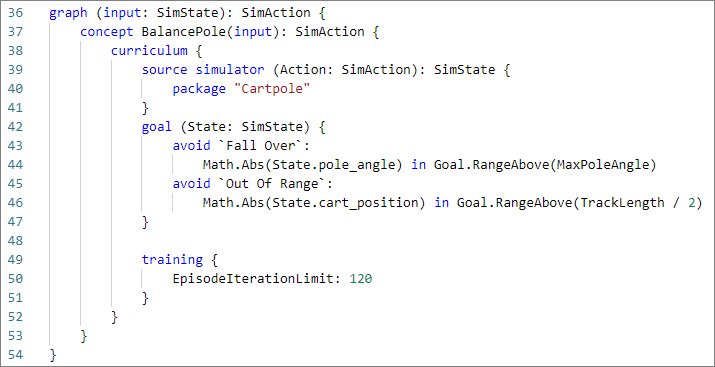
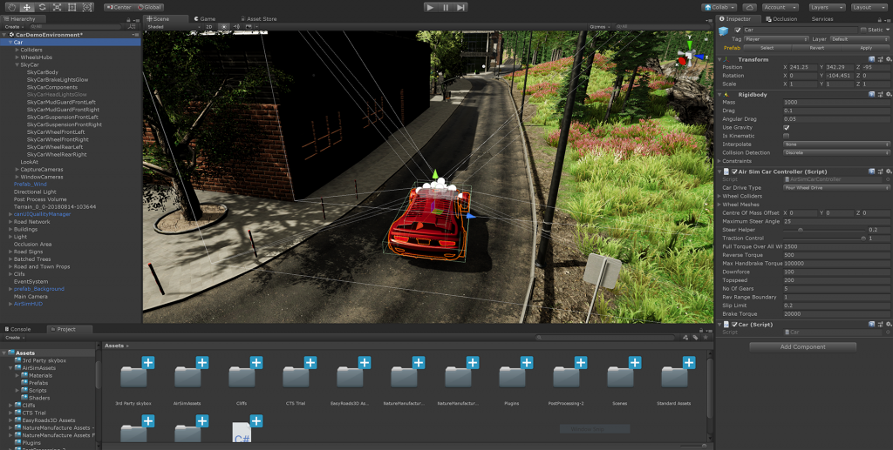

[!INCLUDE [header_file](../../../includes/sol-idea-header.md)]

Artificial intelligence (AI) and machine learning (ML) offer unique opportunities and challenges for automating complex industrial systems. _Machine teaching_ is a new paradigm for building ML systems that moves the focus away from algorithms and onto successful model generation and deployment.

Machine teaching infuses subject matter expertise into automated AI system training with _deep reinforcement learning (DRL)_ and _simulations_. Abstracting away AI complexity to focus on subject matter expertise and real-world conditions creates models that turn automated control systems into _autonomous systems_.

Autonomous systems:

* Combine human domain knowledge with AI and ML through machine teaching.
* Automate generation and management of DRL algorithms and models.
* Integrate simulations for model optimization and scalability during training.
* Deploy and scale for real-world use.

## Potential use cases

Project Bonsai speeds the creation of AI-powered automation to help improve product quality and efficiency while reducing downtime. Now available in preview. Use Project Bonsai to help automate systems when:

* Existing control systems are fragile when deployed.
* ML logic doesn't adequately cover all scenarios.
* Describing the desired system behavior requires subject matter experts who understand the problem domain.
* Generating sufficient real-world data to cover all scenarios is difficult or impossible.
* Traditional control systems are difficult to deploy and scale to the real world.

Machine teaching bridges AI science and software with traditional engineering and domain expertise. Example applications include motion control, machine calibration, smart buildings, industrial robotics, and process control.

## Architecture

Project Bonsai speeds the creation of AI-powered automation. Development and deployment has three phases: Build, Train, and Deploy.

### Dataflow

1. The Build phase consists of writing the machine teaching program and connecting to a domain-specific training simulator. Simulators generate sufficient training data for experiments and machine practice.
1. In the Train phase, the training engine automates DRL model generation and training by combining high-level domain models with appropriate DRL algorithms and neural networks.
1. The Deploy phase deploys the trained _brain_ to the target application in the cloud, on-premises, or embedded on site. Specific SDKs and deployment APIs deploy trained AI systems to various target applications, perform machine tuning, and control the physical systems.

Subject matter experts with no AI background can break down their expertise into steps and tasks, criteria, and desired outcomes. Engineers building autonomous systems create accurate, detailed models of systems and environments, and make them intelligent using methods like deep learning, imitation learning, and reinforcement learning.

Simulations help train the models across different kinds of environmental conditions and scenarios, much faster and safer than is feasible in the real world. Experts can supervise the agents as they work to solve problems in simulated environments, and provide feedback and guidance that lets the agents dynamically adapt within the simulation.

After training is complete, engineers deploy these trained agents to the real world, where they use their knowledge to power autonomous systems.

## Deploy this scenario

The following implementations are example deployments. You can follow the resources to understand how these solutions were designed. Use Project Bonsai to build and deploy your own solution.

### Machine teaching service

[Project Bonsai](https://azure.microsoft.com/services/project-bonsai) is the machine teaching service for the Microsoft autonomous systems. Bonsai simplifies machine teaching with deep reinforcement learning (DRL) to train and deploy smarter autonomous systems.

You can use Bonsai to:

* Teach adaptive brains with intuitive goals and learning objectives, real-time success assessments, and automatic versioning control.
* Integrate training simulations that implement real-world problems and provide realistic feedback.
* Export trained brains and deploy them on-premises, in the cloud, or to IoT Edge or embedded devices.

In Bonsai, managed Azure graphics processing unit (GPU) clusters run AI training on complex neural networks at scale, with built-in support for retraining and analyzing AI system versions. The deployment and runtime frameworks package and deploy the resulting AI system models at scale.

The Bonsai platform runs on Azure and charges resource costs to your Azure subscription.

* [Azure Container Registry](https://azure.microsoft.com/services/container-registry) (basic tier) for storing exported brains and uploaded simulators.
* [Azure Container Instances](https://azure.microsoft.com/services/container-instances) for running simulations.
* [Azure Storage](https://azure.microsoft.com/services/storage) for storing uploaded simulators as ZIP files.

#### Inkling

[Inkling](/bonsai/inkling) is a declarative, statically-typed programming language for training AI in Bonsai. Inkling abstracts away the dynamic AI algorithms that require expertise in machine learning, enabling more developers to program AI. An Inkling file defines _concepts_ necessary to teach the AI, and _curriculum_, or methods for teaching the concepts.

For more information about Inkling, see the [Inkling programming language reference](/bonsai/inkling).

#### Training engine

The training engine in Bonsai compiles machine teaching programs to automatically generate and train AI systems. The engine:

* Automates model generation, management, and tuning.
* Chooses neural network architecture such as number of layers and topology, selects the best DRL algorithm, and tunes hyper-parameters of the model.
* Connects to the simulator and orchestrates the training.

Broadly similar to how a software compiler hides the bare metal machine code from the high-level programmer, the training engine hides much of the complexity and details of the ML models and DRL algorithms. As the state of the art in AI evolves and new algorithms and network topologies are invented, the training engine can recompile the same machine teaching programs to exploit these technological advances.

#### Cartpole sample

Bonsai includes a couple of machine teaching samples, Cartpole and [Moab](https://microsoft.github.io/moab).

The Cartpole sample has a pole attached by an unactivated joint to a cart, which moves along a frictionless track. The available sensor information includes the cart position and velocity, and the pole angle and angular velocity. Applying a force to the cart controls the system. The supported agent actions are to push the cart to the left or the right.

The pole starts upright, and the goal is to keep it upright while keeping the cart on the track. Every time interval that the pole remains upright generates a reward. A training episode ends when the pole is over 15 degrees from vertical, or the cart moves more than a predefined number of units from the center.

The sample uses [Inkling](/bonsai/inkling) language to write the machine teaching program, and the provided Cartpole simulator to speed and improve the training.

The following Bonsai screenshot shows Cartpole training progress, with **Goal satisfaction** on the y-axis and **Training iterations** on the x-axis. The dashboard also shows the percentage of goal satisfaction and the total elapsed training time.

For more information about the cartpole example or to try it yourself, see:

* [Quickstart: Balance a pole with AI (Cartpole)](/bonsai/quickstart/cartpole)
* [Learn how you can teach an AI agent to balance a pole](https://blogs.microsoft.com/ai-for-business/cartpole-demo)

### Simulators

Simulations model a system in a virtual representation of its intended physical environment. Simulations are an alternative approach to creating learning policies by hand or collecting large amounts of real-world training data. Simulations allow training in hazardous environments, or in conditions difficult to reproduce in the real world.

Simulations are the ideal training source for DRL because they're:

* Flexible for creating custom environments.
* Safe and cost-effective for data generation.
* Parallelizable across training machines, allowing for faster training times.

Simulations are available across a broad range of industries and systems, including mechanical and electrical engineering, autonomous vehicles, security and networking, transportation and logistics, and robotics. Simulation tools include:

* [Simulink](https://www.mathworks.com/products/simulink.html), a graphical programming tool developed by MathWorks for modeling, simulating, and analyzing dynamic systems.
* [Gazebo](http://gazebosim.org/), a tool to allow accurate simulation of populations of robots in complex indoor and outdoor environments.
* [Microsoft AirSim](https://microsoft.github.io/AirSim), an open-source robotics simulation platform.

The Bonsai platform includes Simulink and AnyLogic simulators, and you can add other simulators.

#### AirSim

[Microsoft AirSim (Aerial Informatics and Robotics Simulation)](https://microsoft.github.io/AirSim) is an open-source robotics simulation platform designed to train autonomous systems. AirSim provides a realistic simulation tool for designers and developers to generate the large amounts of data they need for model training and debugging.

AirSim can capture data for models from ground vehicles, wheeled robotics, aerial drones, and even static IoT devices, without costly field operations.

AirSim works as a plug-in to Epic Games' [Unreal Engine](https://www.unrealengine.com) editor, providing control over building environments and simulating difficult-to-reproduce, real-world events to capture meaningful data. AirSim leverages current game engine rendering, physics, and perception computation to create an accurate, real-world simulation.

This realism, based on efficiently generated ground-truth data, enables the study and execution of complex missions that are time-consuming or risky in the real world. For example, AirSim provides realistic environments, vehicle dynamics, and multi-modal sensing for researchers building autonomous vehicles. Collisions in a simulator cost virtually nothing, yet provide actionable information to improve the design of the system.

You can use an [Azure Resource Manager (ARM) template](https://github.com/microsoft/AirSim/blob/master/azure/azure-env-creation/vm-arm-template.json) to automatically create a development environment, and code and debug a Python application connected to AirSim in Visual Studio Code. For more information, see [AirSim Development Environment on Azure](https://microsoft.github.io/AirSim/azure).

## Contributors

*This article is maintained by Microsoft. It was originally written by the following contributors.*

**Principal author:**

 * [Jose Contreras](https://www.linkedin.com/in/josedanielcontreras) | Principal Software Engineering Manager

## Next steps

* [Machine teaching](machine-teaching.yml)
* [Autonomous systems with Microsoft AI](https://www.microsoft.com/ai/autonomous-systems)
* [Autonomy for industrial control systems](https://www.microsoft.com/ai/autonomous-systems-solutions)
* [Innovation space: Autonomous systems (Video)](https://www.youtube.com/watch?v=3hSAFtWcui8&feature=youtu.be)
* [Microsoft The AI Blog](https://blogs.microsoft.com/ai)
* [Bonsai documentation](/bonsai)
* [Aerial Informatics and Robotics Platform (AirSim)](https://www.microsoft.com/research/project/aerial-informatics-robotics-platform)
