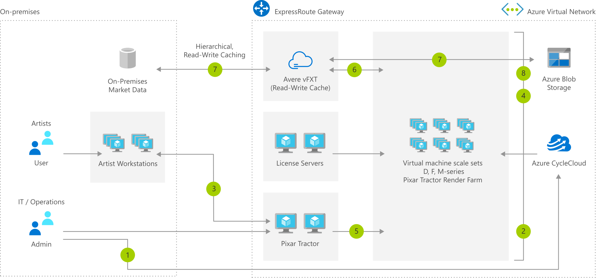

# Media Rendering – HPC Solution Architecture

[!INCLUDE [header_file](../header.md)]

This HPC media rendering solution architecture shows Azure CycleCloud monitoring a Pixar Tractor pipeline manager and orchestrating burst compute node capacity on-demand using Azure low-priority Virtual Machines Scale Sets. An Avere vFXT cache makes data from the existing on-premises filesystem and Azure Blob storage available to compute nodes in Azure.

## Architecture

*Download an [SVG](../media/azure-batch-rendering.svg) of this architecture.*

## Data Flow

1. Operations team uses Azure CycleCloud to configure and launch rendering pipeline cluster.
1. Azure CycleCloud orchestrates virtual machine (VM) creation and software configuration for head nodes, license servers, and Avere vFXT Cache.
1. Artist submits a render job to the Pixar Tractor pipeline manager.
1. Azure CycleCloud detects the change in job queue depth and autostarts render farm nodes in Virtual Machines Scale Sets with location, SKU, and configuration customized by job requirements.
1. Render pipeline manager (head nodes) executes render jobs on the new render farm VMs.
1. Render jobs pull artifacts from on-premises and Azure Blob storage as needed from NFS-mounted Avere vFXT.
1. As each job finishes rendering, resulting artifacts are written back to storage through the Avere vFXT.
1. As job queue empties, Azure CycleCloud auto-stops render farm VMs to reduce cost.

## Components

* [N-Series VMs](https://azure.microsoft.com/pricing/details/virtual-machines/linux): N-series virtual machines are ideal for compute and graphics-intensive workloads, helping customers to fuel innovation through scenarios like high-end remote visualization, deep learning, and predictive analytics.
* [H-Series VMs](https://azure.microsoft.com/pricing/details/virtual-machines/linux): The H-series is a new family specifically designed to handle high performance computing workloads such as financial risk modeling, seismic and reservoir simulation, molecular modeling, and genomic research.
* Effectively manage common workloads with ease while creating and optimizing HPC clusters with Microsoft [Azure CycleCloud](https://azure.microsoft.com/features/azure-cyclecloud).
* [Avere vFXT](https://azure.microsoft.com/services/storage/avere-vfxt): Faster, more accessible data storage for high-performance computing at the edge
* [Azure Batch](https://azure.microsoft.com/services/batch): Cloud-scale job scheduling and compute management

## Next steps

* [N-Series Virtual Machines Documentation](https://docs.microsoft.com/azure/virtual-machines/linux/sizes-gpu)
* [H-Series Virtual Machines Documentation](https://docs.microsoft.com/azure/virtual-machines/linux/sizes-hpc)
* [Azure CycleCloud Documentation](https://docs.microsoft.com/azure/cyclecloud)
* [Avere vFXT Documentation](https://docs.microsoft.com/azure/avere-vfxt)
* [Azure Batch Documentation](https://docs.microsoft.com/azure/batch)
