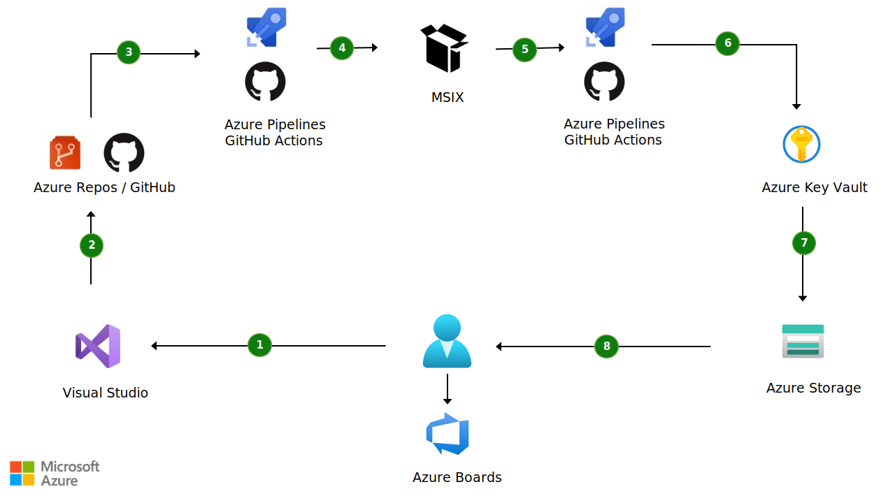

[!INCLUDE [header_file](../../../includes/sol-idea-header.md)]

This article describes how to use MSIX to enable continuous integration and continuous deployment (CI/CD) for building, deploying, and updating Windows desktop applications.

## Potential use cases

MSIX is a powerful packaging technology for deploying Windows applications. You can use it to distribute desktop applications that:

- Are easy to install, maintain, and automatically keep up to date.
- Are respectful of the operating system because they provide a clean install and uninstall.
- Consume fewer resources because they incorporate built-in network and disk space optimizations.

You can distribute applications that are packaged with MSIX in many ways:

- Via Microsoft Store.
- By using a website or an internal network share.
- By using enterprise tools like Microsoft Endpoint Manager.

MSIX is also the preferred technology for deploying applications in the cloud by using Azure Virtual Desktop.

Because it supports features like automatic updates, MSIX, together with Azure DevOps or GitHub, is a good fit for enabling CI/CD. With CI/CD, you can automatically push updates to your Windows desktop applications to all your customers.

## Architecture

*Download a [PowerPoint file](https://arch-center.azureedge.net/devops-windows-architecture.pptx) of this architecture.*

1. A developer changes the application code.
1. The code is committed to a source code repository, which can be hosted on Azure Repos or GitHub.
1. Continuous integration is triggered by a pipeline that runs tests, and it builds the solution. The pipeline can be hosted on Azure Pipelines or GitHub Actions.
1. The pipeline generates an unsigned MSIX package.
1. Continuous deployment is triggered by another stage of the pipeline. The MSIX package deploys on your distribution platform.
1. The MSIX package is signed with a trusted certificate, and the certificate is stored in Azure Key Vault. An MSIX package must be signed with a trusted certificate, otherwise Windows won't be able to install the application. Signing should be done during package deployment. Key Vault protects your code-signing certificate by helping to ensure malicious developers can't steal it and use it to sign other applications.
1. The signed MSIX package is deployed to a static website, hosted on Azure Storage, together with an App Installer file. This file describes the application and the update options.
1. Every time a developer commits new updates to the repository, a new MSIX package is generated and pushed to the same Azure Storage location. The App Installer technology ensures that this new deployment triggers the automatic update process, so your customers always have the latest version of your application.

### Components

- [MSIX](/windows/msix) is a powerful technology for packaging and deploying Windows desktop applications.
- [Windows Application Packaging Project](/windows/msix/desktop/desktop-to-uwp-packaging-dot-net) is a template that's available in Visual Studio. You can use it to package .NET desktop applications (Windows Forms, WPF, Windows Apps SDK) with MSIX. It's based on MSBuild, so you just need to build your solution with Visual Studio to generate an MSIX package. That makes it a great fit for CI/CD scenarios. Because you don't need to install any special dependencies on the build computer, you can easily use the existing Windows agents provided by Azure DevOps and GitHub.
- [Azure Pipelines](https://azure.microsoft.com/services/devops/pipelines) is the Azure DevOps platform for creating pipelines that enable CI/CD scenarios.
- [GitHub Actions](https://github.com/features/actions) is an alternative to Azure Pipelines. You can use it to manage your CI/CD flows.
- [MSIX Packaging Extension](/windows/msix/desktop/msix-packaging-extension?tabs=yaml) is a series of Azure DevOps extensions. They make it easier to integrate MSIX-related tasks, like packaging and signing, in your CI/CD pipelines.
- [Nerdbank.GitVersioning](https://github.com/dotnet/Nerdbank.GitVersioning) is an open-source tool that makes it easier to generate a version number every time a CI/CD pipeline runs. By using this tool, you can easily increment the version number of each MSIX package that your pipeline generates, ensuring that it's recognized as a valid update.
- [Azure Key Vault](https://azure.microsoft.com/services/key-vault) helps you safely store sensitive data, like passwords, connection strings, and certificates.
- [Azure Sign Tool](https://github.com/vcsjones/AzureSignTool) is an open-source tool. You can use it to sign any type of binary, including MSIX packages, with a certificate that's stored in Key Vault. Because it's a command-line tool, you can easily integrate it into a CI/CD pipeline.
- [Azure Storage](https://azure.microsoft.com/product-categories/storage) provides an easy way [to host static websites](/azure/storage/blobs/storage-blob-static-website). Azure Storage is an inexpensive way to host your MSIX packages.
- [App Installer](/windows/msix/app-installer/app-installer-root) enables automatic updates even when you're using an unmanaged deployment technology, like a website or a network share. When you use App Installer, your customers only have to install your application from the deployment location once. Every time the CD pipeline deploys an updated package in that location, Windows automatically downloads the update.

## Contributors

*This article is maintained by Microsoft. It was originally written by the following contributors.*

Principal author:

- [Matteo Pagani](https://www.linkedin.com/in/matteopagani) | Modern Work App Consult Tech Lead

## Next steps

- [MSIX and CI/CD pipeline overview](/windows/msix/desktop/cicd-overview)
- [MSIX Packaging Extension](/windows/msix/desktop/msix-packaging-extension?tabs=yaml)
- [Continuous integration and deployment for desktop apps with GitHub Actions](https://devblogs.microsoft.com/dotnet/continuous-integration-and-deployment-for-desktop-apps-with-github-actions)
- [Configure a CI/CD pipeline with YAML](/windows/msix/desktop/azure-dev-ops)
- [CI/CD Pipeline signing with Azure Key Vault](/windows/msix/desktop/cicd-keyvault)

## Related resources

- [Design a CI/CD pipeline by using Azure DevOps](/azure/architecture/example-scenario/apps/devops-dotnet-baseline)
- [DevOps checklist](/azure/architecture/checklist/dev-ops)
- [Advanced Azure Resource Manager template functionality](/azure/architecture/guide/azure-resource-manager/advanced-templates)
