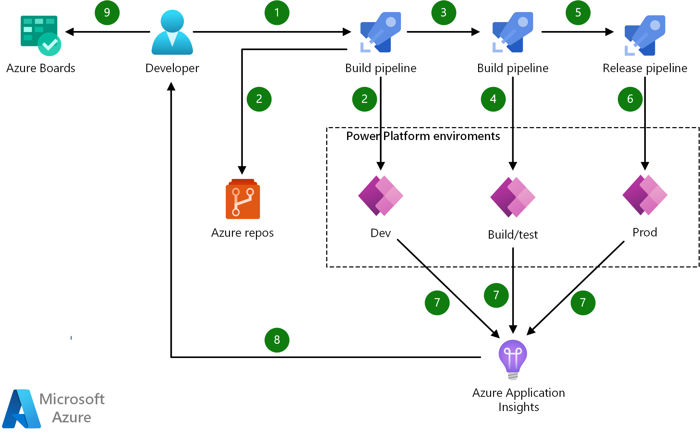

[!INCLUDE [header_file](../../../includes/sol-idea-header.md)]

Learn how to create a CI/CD pipeline to manage your PowerPlatform Application lifecycle using Azure DevOps.

## Architecture

*Download an [SVG](../media/azure-devops-continuous-integration-and-continuous-deployment-for-power-apps.png) of this architecture.*

### Data flow

1. Solution updated, trigger build pipeline
1. Continuous integration exports solution from development environment and commits files to Azure Repos   
1. Continuous integration builds a managed solution, runs tests, and creates a build artifact
1. Deployment to Build/Test environment
1. Continuous deployment runs tests and orchestrates the deployment of the managed solution to target environments
1. Deployment to production environment
1. Application Insights collects and analyses health, performance, and usage data
1. Review health, performance and usage information
1. Update backlog item(s) as required

### Components

* [Power Apps](https://powerapps.microsoft.com/): Microsoft Power Apps, low-code app building platform
* [Azure DevOps](https://azure.microsoft.com/services/devops/): Azure DevOps, build, test and deploy in any language, to any cloud or on-premises
* [Azure Repos](https://azure.microsoft.com/en-us/services/devops/repos/): Azure Repos, cloud hosted private Git repos

## Pricing

* [Customize and get pricing estimates](https://azure.com/e/b96a4a9dbf804edabc83d00b41ffb245)

## Next steps

* [Application lifecycle management with Microsoft Power Platform](https://docs.microsoft.com/power-platform/alm/) 
* [Microsoft Power Platform Build Tools for Azure DevOps](https://docs.microsoft.com/power-platform/alm/devops-build-tools)
* [Microsoft Power Platform Build Tools tasks](https://docs.microsoft.com/en-us/power-platform/alm/devops-build-tool-tasks)
* [Azure DevOps](https://azure.microsoft.com/services/devops/)
