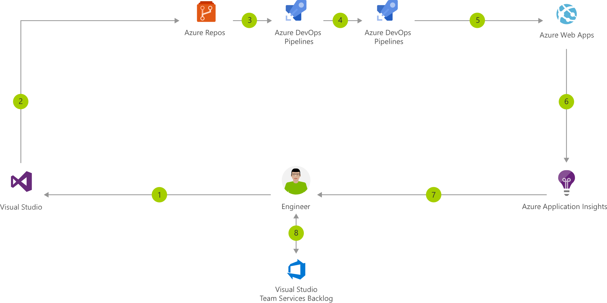

[!INCLUDE [header_file](../../../includes/sol-idea-header.md)]

Azure Web Apps is a fast and simple way to create web apps using ASP.NET, Java, Node.js, or PHP. Deliver value faster to your customers with a continuous integration and continuous deployment (CI/CD) pipeline that pushes each of your changes automatically to Web Apps.

## Potential use cases

* 

## Architecture

*Download an [SVG](../media/azure-devops-continuous-integration-and-continuous-deployment-for-azure-web-apps.svg) of this architecture.*

### Dataflow

1. Change application source code.
1. Commit application code and Web Apps web.config file.
1. Continuous integration triggers application build and unit tests.
1. Continuous deployment trigger orchestrates deployment of application artifacts with environment-specific parameters.
1. Deployment to Web Apps.
1. Azure Application Insights collects and analyzes health, performance, and usage data.
1. Review health, performance, and usage information.
1. Update backlog item.

### Components

* Application Insights: Detect, triage, and diagnose issues in your web apps and services.
* [Web Apps](https://azure.microsoft.com/services/app-service/web): Quickly create and deploy mission critical Web apps at scale.
* [Azure DevOps](https://azure.microsoft.com/services/devops): Services for teams to share code, track work, and ship software.
* [Visual Studio](https://www.visualstudio.com/vs/azure): A creative launch pad for viewing and editing code, then debugging, building, and publishing apps for Android, iOS, Windows, the web, and the cloud.

## Deployment

* [Deploy to Azure](https://ms.portal.azure.com/#create/Microsoft.AzureProject)

## Pricing

* [Customize and get pricing estimates](https://azure.com/e/b96a4a9dbf804edabc83d00b41ffb245)

## Next steps

* [Performance monitoring with Application Insights](/azure/application-insights/app-insights-detect-triage-diagnose)
* [Use Azure DevOps to deploy to an Azure Web App](/aspnet/core/host-and-deploy/azure-apps)
* [Git on Azure DevOps](/azure/devops/repos/git/gitquickstart)
* [Deploy to Azure Web Apps using Visual Studio and Azure DevOps](/azure/devops/pipelines/apps/cd/deploy-docker-webapp)
