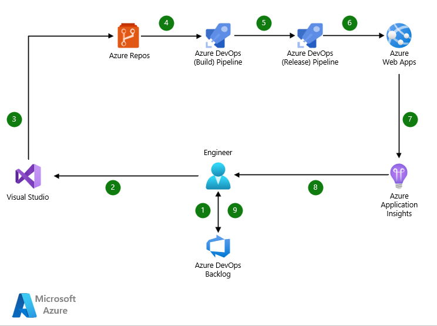

[!INCLUDE [header_file](../../../includes/sol-idea-header.md)]

Azure Web Apps is a fast and simple way to create web apps using ASP.NET, Java, Node.js, Python, and other languages and frameworks. Deliver value faster to your customers with a continuous integration and continuous deployment (CI/CD) pipeline that pushes each of your changes automatically to Azure Web Apps.

## Potential use cases

Azure Web Apps offer numerous benefits that include:

* Highly secure web apps development.
* Multilingual and versatile framework.
* Global scale with high availability.
* Quick analytics and actionable insights.
* Secure integration with other SaaS apps.

## Architecture

*Download a [Visio file](https://arch-center.azureedge.net/azure-devops-cicd-for-web-apps.vsdx) of this architecture.*

### Workflow

1. Identify the work item in the backlog.
1. Change application source code.
1. Commit application code and configuration to a code repository, linking the commit to the work item.
1. Changes to the repo trigger continuous integration for building and testing the application.
1. Build pipeline builds the application and runs tests.
1. Upon successful build pipeline execution, the continuous deployment trigger orchestrates deployment of application artifacts with environment-specific parameters.
1. Once the app is deployed, Azure Application Insights collects health, performance, and usage data.
1. Review health, performance, and usage information.
1. Create new issues or update backlog items with Application Insights data.

### Components

* [Azure Web Apps](https://azure.microsoft.com/services/app-service/web): Quickly create and deploy mission critical Web apps at scale. Azure Web Apps has many offerings including [Windows Web Apps](/azure/app-service/overview), [Linux Web Apps](/azure/app-service/overview#app-service-on-linux),  and [Web App for Containers](https://azure.microsoft.com/products/app-service/containers/#overview).
* Code repository:
  * [Azure DevOps](https://azure.microsoft.com/services/devops): Services for teams to share code, track work, and ship software - including Boards, Repos, and Pipelines.
  * GitHub: Azure Web Apps can be set to integrate with GitHub repositories and [configure deployment with GitHub Actions](/azure/app-service/deploy-github-actions) during the creation phase as well as post creation.
  * Other source code repositories: Azure Web Apps can also integrate with other source code repositories post app creation. [Configure continuous deployment to Azure App Service.](/azure/app-service/deploy-continuous-deployment)
* An editor from [the Visual Studio family](https://visualstudio.microsoft.com/) for [Azure development](https://visualstudio.microsoft.com/vs/azure), including:
  * [Visual Studio](https://visualstudio.microsoft.com/vs): A creative launch pad for viewing and editing code, then debugging, building, and publishing apps for Android, iOS, Windows, the web, and the cloud.
  * [Visual Studio for Mac](https://visualstudio.microsoft.com/vs/mac/): Develop apps and games for iOS, Android, and the web using .NET on a Mac.
  * [Visual Studio Code](https://code.visualstudio.com): A free, cross-platform, lightweight, extensible code editor, available as a [desktop application](https://code.visualstudio.com/Download) or [via the web](https://vscode.dev/). Extensions are available for languages and frameworks supported by Azure Web Apps, including C#, Java, Python, Node.js, PHP, and Ruby.
* [Azure Monitor](https://azure.microsoft.com/products/monitor/): Detect, triage, and diagnose issues in your web apps and services using [Application Insights](/azure/azure-monitor/app/app-insights-overview), an extension of Azure Monitor.

## Contributors

*This article is maintained by Microsoft.*

## Next steps

* [Get started with continuous deployment to Azure App Service](/azure/app-service/deploy-continuous-deployment)
* [Get started with Git in Azure Repos](/azure/devops/repos/git/gitquickstart)
* [Deploy to App Service using Azure Pipelines](/azure/app-service/deploy-azure-pipelines)
* [Deploy to Azure Web App for Containers](/azure/devops/pipelines/apps/cd/deploy-docker-webapp)
* [Configure continuous deployment with custom containers in Azure App Service](/azure/app-service/deploy-ci-cd-custom-container)

## Related resources

* [Learn about work item integration with Application Insights](/azure/azure-monitor/app/work-item-integration)
* [Link GitHub commits, pull requests, and issues to work items in Azure Boards](/azure/devops/boards/github/link-to-from-github)
