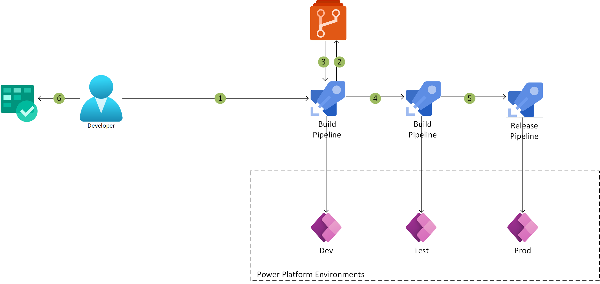

[!INCLUDE [header_file](../../../includes/sol-idea-header.md)]

Learn how to create a CI/CD pipeline to manage your Power Platform Application lifecycle using Azure DevOps.

## Architecture

*Download a [Visio file](https://arch-center.azureedge.net/devops-cicd-for-power-apps.vsdx) of this architecture.*

### Dataflow

1. The solution is updated, which triggers the build pipeline.
1. Continuous integration exports the solution from the development environment and commits files to Azure Repos.
1. Continuous integration builds a managed solution, runs tests, and creates a build artifact.
1. You deploy to your build/test environment.
1. Continuous deployment runs tests and orchestrates the deployment of the managed solution to the target environments.
1. You deploy to the production environment.
1. Application Insights collects and analyzes health, performance, and usage data.
1. You review the health, performance, and usage information.
1. You update your backlog item(s), as required.

### Components

* [Power Apps](https://powerapps.microsoft.com): Microsoft Power Apps is a low-code app-building platform.
* [Azure DevOps](https://azure.microsoft.com/services/devops): Azure DevOps can build, test, and deploy a solution in any language, to any cloud or on-premises.
* [Azure Repos](https://azure.microsoft.com/services/devops/repos): Azure Repos provides cloud-hosted private Git repos.
* [Azure Application Insights](/azure/azure-monitor/app/app-insights-overview): Application Insights is a feature of Azure Monitor, which you can use to monitor your live applications.

## Scenario details

This architecture enables you to use Azure DevOps, Azure Repos, and Azure Application Insights (via Azure Monitor) to build a CI/CD (continuous integration/continuous deployment) pipeline for Microsoft Power Platform (namely Power Apps).

### Potential use cases

* Applications that interact with other Microsoft 365 services.
* Employee onboarding application.
* Image processing tools.
* New user setup scenarios.
* Service request applications.
* Applications with complex entity relationships.

## Considerations

These considerations implement the pillars of the Azure Well-Architected Framework, which is a set of guiding tenets that can be used to improve the quality of a workload. For more information, see [Microsoft Azure Well-Architected Framework](/azure/architecture/framework).

### Cost optimization

Cost optimization is about looking at ways to reduce unnecessary expenses and improve operational efficiencies. For more information, see [Overview of the cost optimization pillar](/azure/architecture/framework/cost/overview).

* [Customize and get pricing estimates](https://azure.com/e/b96a4a9dbf804edabc83d00b41ffb245)

## Contributors

*This article is maintained by Microsoft. It was originally written by the following contributors.*

Principal author:

 * [Sarah Parkes](https://www.linkedin.com/in/sarah-p-a06370) | Cloud Solution Architect

## Next steps

* [Application lifecycle management with Microsoft Power Platform](/power-platform/alm)
* [Microsoft Power Platform Build Tools for Azure DevOps](/power-platform/alm/devops-build-tools)
* [Microsoft Power Platform Build Tools tasks](/power-platform/alm/devops-build-tool-tasks)
* [Azure DevOps](https://azure.microsoft.com/services/devops)

## Related resources

Additional Power Apps architectures:
* [Line of business extension](/azure/architecture/solution-ideas/articles/lob)
* [Web and mobile front ends](/azure/architecture/solution-ideas/articles/front-end)

Additional CI/CD architectures:
* [CI/CD for Azure VMs](/azure/architecture/solution-ideas/articles/cicd-for-azure-vms)
* [Immutable infrastructure CI/CD using Jenkins and Terraform on Azure virtual architecture](/azure/architecture/solution-ideas/articles/immutable-infrastructure-cicd-using-jenkins-and-terraform-on-azure-virtual-architecture-overview)
* [Gridwich CI/CD pipeline](/azure/architecture/reference-architectures/media-services/gridwich-cicd)
* [CI/CD pipeline for container-based workloads](/azure/architecture/guide/aks/aks-cicd-github-actions-and-gitops)
* [CI/CD for containers](/azure/architecture/solution-ideas/articles/cicd-for-containers)
* [Container CI/CD using Jenkins and Kubernetes on Azure Kubernetes Service (AKS)](/azure/architecture/solution-ideas/articles/container-cicd-using-jenkins-and-kubernetes-on-azure-container-service)
* [Design a CI/CD pipeline using Azure DevOps](/azure/architecture/example-scenario/apps/devops-dotnet-baseline)
* [CI/CD for Azure Web Apps](/azure/architecture/solution-ideas/articles/azure-devops-continuous-integration-and-continuous-deployment-for-azure-web-apps)
* [Java CI/CD using Jenkins and Azure Web Apps](/azure/architecture/solution-ideas/articles/java-cicd-using-jenkins-and-azure-web-apps)
* [Build a CI/CD pipeline for chatbots with ARM templates](/azure/architecture/example-scenario/apps/devops-cicd-chatbot)
* [End-to-end governance in Azure when using CI/CD](/azure/architecture/example-scenario/governance/end-to-end-governance-in-azure)
* [DevOps in a hybrid environment](/azure/architecture/solution-ideas/articles/devops-in-a-hybrid-environment)
* [DevSecOps in GitHub](/azure/architecture/solution-ideas/articles/devsecops-in-github)
