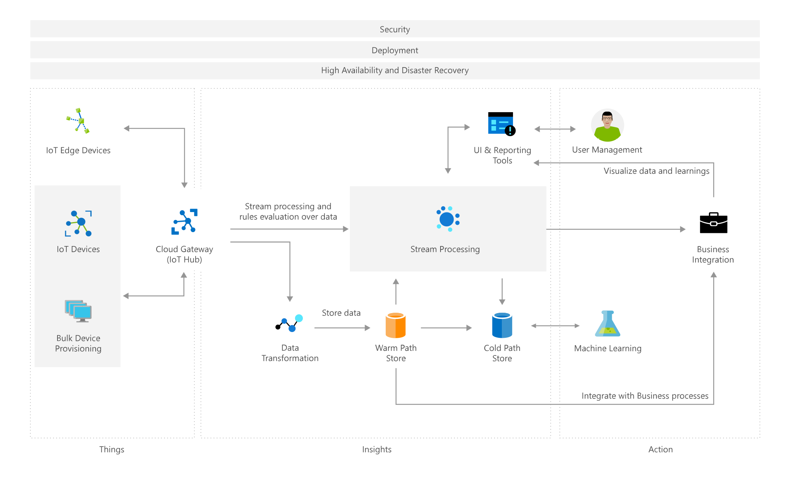

# IoT Architecture – Azure IoT Subsystems

[!INCLUDE [header_file](../../../includes/sol-idea-header.md)]

The links to the right provide documentation on deploying and managing the Azure products listed in the solution architecture above.

[Azure Active Directory application](https://azure.microsoft.com/services/active-directory)

[Virtual Machine (Standard D1 V2, 1 core, 3.5 GB memory)](https://azure.microsoft.com/services/virtual-machines)

[IoT Hub (S1—basic tier)](https://azure.microsoft.com/services/iot-hub)

[Cosmos DB account (Standard)](https://azure.microsoft.com/services/cosmos-db)

[Storage account (Standard-GRS)](https://azure.microsoft.com/services/storage)

[Web Application](https://azure.microsoft.com/services/app-service)

[Azure Machine Learning](https://azure.microsoft.com/services/machine-learning)

[Azure Stream Analytics](https://azure.microsoft.com/services/stream-analytics)

## Architecture

*Download an [SVG](../media/azure-iot-subsystems.svg) of this architecture.*

## Components

* [Azure IoT Hub](https://azure.microsoft.com/services/iot-hub): The cloud gateway for the system controls bidirectional, secure communication to and from devices.
* [Azure Cosmos DB](https://azure.microsoft.com/services/cosmos-db): Used for warm storage for device data.
* [Virtual Machines](https://azure.microsoft.com/services/virtual-machines): Hosts containers that contain microservices for processing data and hosting the UI.
* [Azure Stream Analytics](https://azure.microsoft.com/services/stream-analytics): Processes data coming into the system from devices.
* [Blob Storage](https://azure.microsoft.com/services/storage/blobs): Cold storage of device data.
* [Azure Active Directory](https://azure.microsoft.com/services/active-directory): Used for authentication and authorization of the system.

## Next steps

* [IoT Hub Documentation](https://docs.microsoft.com/azure/iot-hub)
* [Cosmos DB Documentation](https://docs.microsoft.com/azure/cosmos-db)
* [Azure Virtual Machines Documentation](https://docs.microsoft.com/azure/virtual-machines)
* [Azure Stream Analytics Documentation](https://docs.microsoft.com/azure/stream-analytics)
* [Azure Blob Storage Documentation](https://docs.microsoft.com/azure/storage)
* [Azure Active Directory application Documentation](https://docs.microsoft.com/azure/active-directory)
